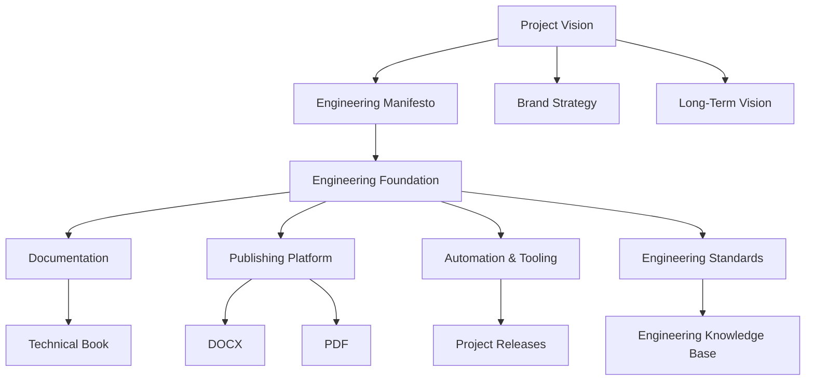

# AI-Assisted Professional Engineering with .NET

> Building Professional Engineering in Public.

AI-Assisted Professional Engineering with .NET is an open engineering project dedicated to documenting the complete engineering lifecycle of designing, building, documenting, publishing, and continuously improving professional software systems with the assistance of Artificial Intelligence.

The repository goes far beyond publishing a technical book. It openly captures the engineering knowledge, architectural decisions, tooling, automation, documentation practices, and publishing infrastructure developed throughout the project's evolution.

Rather than presenting only the final outcome, the project documents the entire journey—from the first architectural decision to the publication of every release. The engineering process itself is treated as a valuable product, allowing readers to understand not only what was built, but also why it was built, how decisions were made, and how the project continues to evolve over time.

The technical book is one important outcome of this work. Equally important are the publishing platform, engineering methodology, documentation standards, reusable tooling, and the long-term body of engineering knowledge created throughout the project.

Every release represents measurable engineering progress.

Every document contributes to a continuously growing knowledge base.

Every engineering decision is documented with the intention of helping future engineers build better software.

---

## Quick Links

| Resource | Description |
|----------|-------------|
| [English Table of Contents](./TOC.en.md) | Browse the English manuscript structure. |
| [Arabic Table of Contents](./TOC.ar.md) | Browse the Arabic manuscript structure. |
| [Documentation](./docs/) | Engineering documentation and project resources. |
| [Releases](../../releases) | Published releases and release notes. |
| [Contributing Guide](./CONTRIBUTING.md) | Contribution guidelines and development workflow. |
| [Community Guidelines](./COMMUNITY_GUIDELINES.md) | Community standards and participation guidelines. |
| [Security Policy](./SECURITY.md) | Security reporting process. |
| [Support](./SUPPORT.md) | Support channels and frequently asked questions. |

---

## Engineering Knowledge Series

The engineering journey behind this project is documented through a continuously growing series of articles.

| Status | #   | Title                                                              | Repository | LinkedIn | Medium |
|:------:| :-: | :----------------------------------------------------------------- |:----------:|:--------:|:------:|
| 🟢     | 001 | [From Writing a Technical Book to Building an Engineering Ecosystem](./docs/articles/v0.0.1/001-From-Writing-a-Technical-Book-to-Building-an-Engineering-Ecosystem/article.en.md) | ✔          | ✔       | ✔      |
| 🟡     | 002 | Why I Built My Own Markdown Publishing Platform Instead of Using Existing Tools |  |  |
| ⚪     | 003 | Why Markdown Became the Single Source of Truth |  |  |  |
| ⚪     | 004 | Building a Bilingual Technical Manuscript Without Losing Consistency |  |  |
| ⚪     | 005 | Engineering the Book Before Writing the Book |  |  |  |
| ⚪     | 006 | The Hidden Architecture Behind the Publishing Pipeline |  |  |  |
| ⚪     | 007 | Why I Chose to Build the Project in Public |  |  |  |
| ⚪     | 008 | How AI Changed My Engineering Workflow |  |  |  |
| ⚪     | 009 | What I Learned Before Finishing the First Chapter |  |  |  |
| ⚪     | 010 | What's Next: Beyond the First Release |  |  |  |

---

## What This Project Is

This repository combines several long-term engineering initiatives into a single cohesive project.

Its primary components include:

- A bilingual professional book covering AI-assisted software engineering with .NET.
- A production-grade Markdown publishing platform capable of generating high-quality DOCX and PDF documents.
- A collection of engineering documentation describing architecture, design decisions, and development practices.
- Automation tools that support authoring, validation, publishing, and repository maintenance.
- A continuously evolving engineering knowledge base built through real project experience.
- A transparent record of the project's technical evolution, published incrementally for the community.

The objective is not simply to publish documentation, but to demonstrate how professional engineering projects can be designed, implemented, documented, maintained, and continuously improved in a public environment.

---

## Project Architecture

---

## Why This Project Exists

Modern software engineering is changing rapidly through the adoption of Artificial Intelligence.

While AI significantly accelerates software development, professional engineering still depends on architecture, critical thinking, documentation, maintainability, testing, automation, and long-term decision making.

This project exists to demonstrate how these disciplines can be strengthened—not replaced—by AI.

Instead of focusing exclusively on generated code, the project documents the complete engineering process that transforms ideas into reliable, maintainable, and well-documented software.

By sharing this process openly, the repository becomes both a technical reference and a practical example of professional engineering in action.

---

## What Makes This Project Different

Many technical repositories publish code.

Many authors publish books.

Many projects provide automation tools.

This repository intentionally combines all three.

The engineering process is documented alongside the software.

The publishing platform evolves alongside the manuscript.

Engineering decisions are preserved alongside their implementations.

Documentation is treated as part of the product rather than supplementary material.

Every release captures real engineering progress instead of serving only as a distribution mechanism.

The project itself becomes an example of the engineering practices it promotes.

---

## What You'll Find

This repository includes:

- A continuously evolving bilingual technical manuscript.
- A professional Markdown publishing platform.
- Automated DOCX and PDF generation.
- Engineering documentation and architectural guidance.
- Development standards and repository conventions.
- Reusable tooling for technical publishing.
- Automation workflows supporting engineering activities.
- Public engineering journals documenting project evolution.

Together, these components form a living engineering ecosystem rather than a static publication.

---

## Current Status

The project is currently under active development.

Development follows an incremental engineering approach in which every completed milestone contributes measurable value to the repository. Rather than waiting for the entire manuscript to be finished, the project evolves through small, verifiable, and well-documented releases.

Each release may include improvements to the manuscript, publishing platform, engineering documentation, automation tooling, or repository infrastructure.

This approach allows readers to follow the project's evolution while ensuring that every published version remains stable, reviewable, and reproducible.

For the latest progress, visit the Releases page and the project roadmap.

---

## Reading the Book

The manuscript is published incrementally as it evolves.

Both English and Arabic editions are maintained within the same repository, allowing readers to follow development regardless of their preferred language.

Current manuscript resources include:

- English Table of Contents
- Arabic Table of Contents
- Published chapters and sections
- Release notes describing newly published material

As the project grows, every release expands the available content while maintaining consistency between both language editions.

---

## The Publishing Platform

One of the project's primary objectives is the development of a professional publishing platform built around Markdown.

The platform is designed to transform structured Markdown documents into high-quality publishing formats suitable for professional distribution.

Current capabilities include:

- Markdown preprocessing.
- Automated document validation.
- DOCX generation.
- PDF generation.
- Configurable publishing styles.
- Reusable export pipelines.
- Automated publishing workflows.

The publishing platform is intentionally developed as an independent engineering asset. Although it powers this manuscript, its architecture is designed to support future technical books, documentation projects, and professional publishing workflows.

---

## Engineering Philosophy

This project is guided by a simple principle:

Professional engineering deserves professional documentation.

Artificial Intelligence accelerates engineering work, but engineering excellence still depends on sound architecture, thoughtful design, careful documentation, reproducible processes, and continuous improvement.

Every significant engineering decision is expected to improve at least one of the following:

- Maintainability
- Clarity
- Reproducibility
- Automation
- Documentation
- Long-term sustainability

The project documents not only successful outcomes but also the reasoning behind important decisions, creating a knowledge base that remains valuable long after individual technologies evolve.

---

## Repository Documentation

Documentation is treated as a core product of the project.

Beyond the manuscript itself, the repository contains documentation describing architecture, engineering decisions, publishing workflows, repository conventions, project planning, and contribution guidelines.

Whenever practical, documentation explains not only *what* was implemented but also *why* a particular solution was chosen.

This philosophy allows contributors and future maintainers to understand the project's evolution without relying on historical context or undocumented assumptions.

---

## Community

The project welcomes engineers, technical writers, architects, educators, and curious learners who are interested in professional software engineering and AI-assisted development.

Whether your interest lies in software architecture, documentation, technical publishing, automation, or engineering practices, we hope this repository provides useful knowledge and practical examples.

Community participation may include:

- Reporting issues.
- Suggesting improvements.
- Improving documentation.
- Reviewing published material.
- Sharing engineering experiences.
- Contributing ideas for future development.

As the project matures, community collaboration will gradually expand while preserving the engineering standards that define the repository.

---

## Repository Structure

The repository is organized to separate engineering assets according to their responsibilities.

Major areas include:

- Manuscript sources.
- Publishing infrastructure.
- Documentation.
- Automation scripts.
- Engineering plans.
- Repository configuration.
- Tests and validation.

This structure is intended to support long-term maintainability while allowing the project to grow without sacrificing clarity or consistency.

---

## Project Principles

The project is built upon several enduring principles.

- Engineering before technology.
- Documentation as a first-class product.
- Transparency over unnecessary complexity.
- Incremental and verifiable progress.
- Automation that improves maintainability.
- Continuous learning through practical engineering.
- Sustainable long-term development.

These principles guide every architectural decision, every release, and every contribution made to the repository.

---

## Getting Started

If you are visiting the repository for the first time, the following order is recommended:

1. Read this README.
2. Review the Table of Contents.
3. Explore the published manuscript.
4. Browse the engineering documentation.
5. Examine the publishing platform.
6. Follow the project roadmap.
7. Review the latest release notes.

This sequence provides a gradual introduction to both the technical content and the engineering philosophy behind the project.

---

## Contributing

Contributions are welcome.

Before contributing, please review:

- [CONTRIBUTING.md](.\CONTRIBUTING.md)
- [CODE_OF_CONDUCT.md](.\CODE_OF_CONDUCT.md)
- [COMMUNITY_GUIDELINES.md](.\COMMUNITY_GUIDELINES.md)
- [SECURITY.md](.\SECURITY.md)
- [SUPPORT.md](.\SUPPORT.md)

Following these guidelines helps maintain consistency, quality, and long-term sustainability across the project.

---

## License

This repository is distributed under the terms of the MIT License.

See the [LICENSE](.\LICENSE) file for complete licensing information.

---

## Closing

AI-Assisted Professional Engineering with .NET is more than a repository.

It is an ongoing engineering initiative dedicated to documenting how professional software projects are designed, built, documented, published, and continuously improved in the age of Artificial Intelligence.

The manuscript will continue to grow.

The publishing platform will continue to evolve.

The engineering knowledge base will continue to expand.

Through every release, the project aims to leave behind reusable knowledge that helps engineers build better software, produce better documentation, and create more sustainable engineering practices.

Thank you for following the journey.