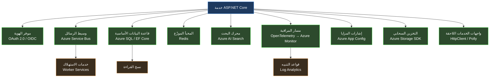
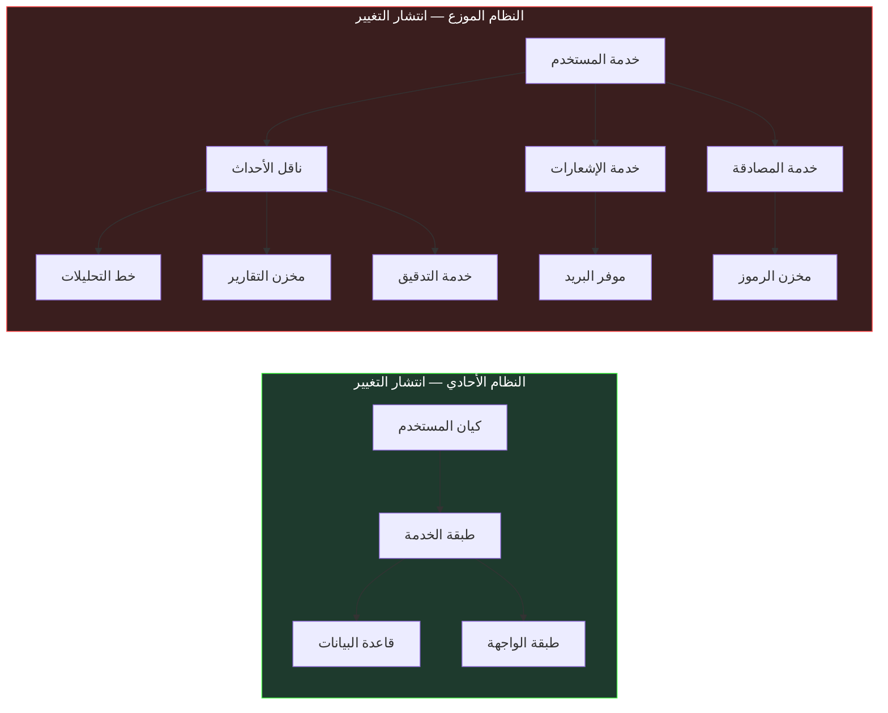
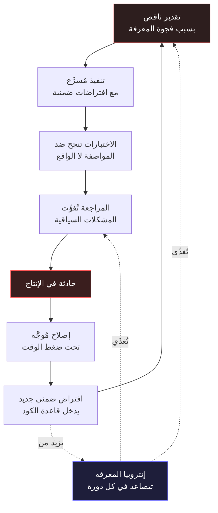
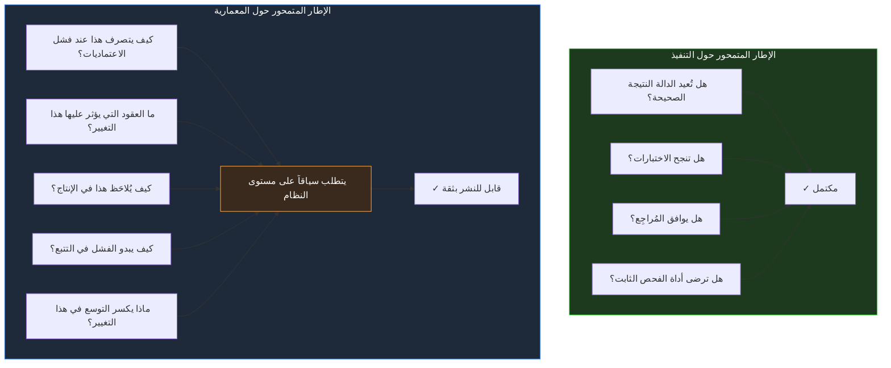
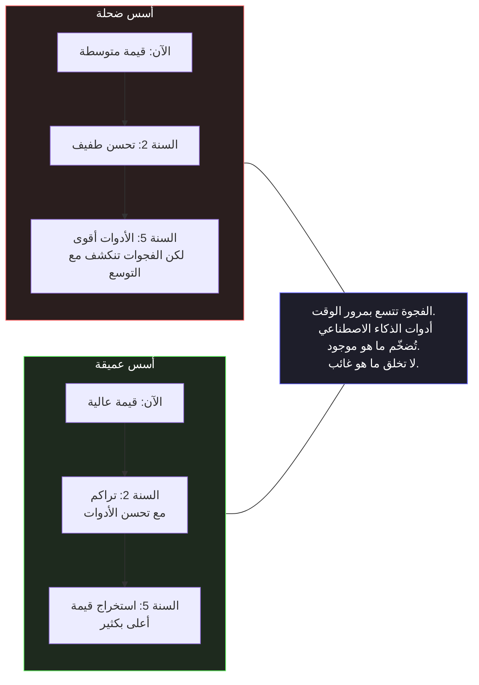

<div dir="rtl">

# القسم الأول — أزمة التعقيد في أنظمة البرمجيات الحديثة

## انهيار الخط الأساسي

ثمة نوع من البرمجيات كان بالإمكان استيعابه ذهنياً بالكامل. تطبيق Windows Forms متصل بقاعدة بيانات SQL Server، يعمل على خادم واحد، يستخدمه مئة موظف داخل شبكة مؤسسية مغلقة. كان بمقدور المطوّر استيعاب النظام بأكمله في ذهنه: المخطط يحتوي على خمسين جدولاً، المنطق التجاري يسكن في طبقة الخدمة، وواجهة المستخدم ليست سوى غلاف رفيع فوق تلك الطبقة. حين يتعطل شيء، كان نطاق الفشل محدوداً ومفهوماً. حين يتغير متطلب، كانت تداعيات التغيير قابلة للتنبؤ والقياس. حين ينضم مطوّر جديد إلى الفريق، كان أسبوعان من التعريف يُنتِجان فهماً عملياً وظيفياً للنظام بأكمله.

ذلك النموذج الذهني — المطوّر بوصفه حاملاً لمعرفة شاملة بالنظام — كان الأساس الذي بُنيت عليه معظم ممارسات هندسة البرمجيات. أغلب أنماط التصميم، وبنية المناهج الدراسية، والافتراضات الضمنية الكامنة خلف ممارسات مراجعة الكود، وفكرة «المطوّر الكبير» بوصفه من يعرف أكثر فحسب — كلها تقوم على فرضية أن مهندساً متمرساً بما يكفي يستطيع الحفاظ على فهم متماسك للنظام الذي يبنيه.

هذا النموذج انهار. ليس تدريجياً، وليس كاتجاه مجرد، بل كواقع تشغيلي ملموس يؤثر على العمل اليومي لكل مهندس يبني أنظمة الإنتاج اليوم. السؤال ليس ما إذا كانت الأنظمة الحديثة أكثر تعقيداً من سابقاتها — إنها كذلك بفارق ملموس في كل بُعد قابل للقياس. السؤال هو ما إذا كان هذا التعقيد كمياً فحسب — جداول أكثر، وخدمات أكثر، وسطور كود أكثر — أم أنه يمثل تحولاً نوعياً يتطلب ممارسة هندسية مختلفة جذرياً. والجواب، عند الفحص المتأني، لا لبس فيه. الأنظمة الموزعة الحديثة تجاوزت عتبة من التعقيد تجعل النموذج الذهني الفردي للمطوّر، مهما بلغ من التفصيل والعمق، غير كافٍ هيكلياً. ما يلي هو تحليل هندسي لكيفية تجاوز هذه العتبة، ولما يعنيه ذلك على تصميم البرمجيات، ولماذا يخلق هذا بالضبط الشروط التي تجعل التطوير بمساعدة الذكاء الاصطناعي ضرورة معمارية لا مجرد ميزة إضافية.

## أبعاد التعقيد الحديث

لفهم حجم هذا التحوّل، لا بد من الدقة في تعريف «التعقيد». الكلمة تُستخدم عادةً مرادفةً لـ «الكبير» أو «الصعب»، لكن التعقيد في أنظمة البرمجيات يمتلك أبعاداً متمايزة وقابلة للقياس، وكل بُعد يتصرف بطريقة مختلفة ويتفاعل مع الأبعاد الأخرى بأساليب تُضاعف تأثيره التراكمي.

**مساحة سطح التكامل - Integration Surface Area.** التطبيق المؤسسي الحديث بـ .NET لا يعمل في عزلة. يتكامل مع موفري الهوية عبر بروتوكولات OAuth 2.0 و OIDC، ووسطاء الرسائل كـ Azure Service Bus، وقواعد البيانات الأساسية عبر Entity Framework Core، والمخبأ الموزّع - Distributed Cache كـ Redis، ومحركات البحث كـ Azure AI Search، ومسارات بيانات المراقبة عبر OpenTelemetry، وأعلام الميزات البرمجية - Feature Flags، وأنظمة التخزين السحابي، فضلاً عن عشرات الواجهات البرمجية الخارجية. كل تكامل يُدخل اعتمادية لها عقد إصدار خاص بها، وأنماط فشل محددة، وخصائص كمون - Latency، وحدود معدل استخدام - Rate Limits، وآليات مصادقة مستقلة.

حين أطلقت Microsoft الإصدار الأول من ASP.NET Core، كان مشروع ويب قياسي يستدعي نحو ثمانين حزمة NuGet. اليوم، الخدمة المؤسسية الإنتاجية تستدعي بانتظام ما بين أربعمئة وستمئة حزمة، كل منها عقدة في مخطط موجّه لا دوري - DAG للاعتماديات قد يحتوي على تعارضات عبر حدود الإصدارات الرئيسية. أمر بسيط كـ `dotnet add package` ليس إضافة شيء واحد فحسب — إنه تعديل في مسألة حل اعتماديات معقدة قد لا يوجد لها حل مثالي في ضوء المتطلبات المتعارضة للاعتماديات المتعدية.

**التعقيد الزمني - Temporal Complexity.** الأنظمة الموزعة لا تنفّذ بالترتيب التسلسلي الحتمي الطبيعي في برنامج أحادي العملية. الأحداث تصل خارج الترتيب. العمليات تكتمل بشكل غير متزامن. الحالة مُنسوخة عبر عقد قد تختلف حول القيم الحالية أثناء انقطاعات الشبكة. طلب يستغرق مئتي ميلي ثانية في بيئة التطوير قد يستغرق ألفي ميلي ثانية في الإنتاج بسبب البدايات الباردة - Cold Starts، أو توقفات جامع النفايات - Garbage Collection Pauses، أو ضوضاء الجيران في البيئة السحابية المشتركة. نموذج async/await في C# جعل البرمجة غير المتزامنة أكثر قابلية للوصول، لكنه لم يُقلل من التعقيد المفاهيمي لإدارة الحالة المتزامنة — بل خفّض الحاجز أمام إدخال ذلك التعقيد في قواعد كود غير مُجهَّزة معمارياً له. نتيجة ذلك أن كثيراً من الأنظمة تحمل الآن ديناميكيات تزامن غير متوقعة خُبِّئت خلف واجهة برمجية تبدو بسيطة.

**التعقيد التشغيلي - Operational Complexity.** الأنظمة التي يبنيها المطوّرون اليوم يجب فهمها ليس فقط في وقت التطوير بل طوال دورة حياتها التشغيلية الكاملة. نشرات Kubernetes، ومخططات Helm، وإعدادات Terraform، وقوالب Azure Resource Manager — هذه ليست تفاصيل نشر يمكن تركها لفريق البنية التحتية. إنها جزء من مواصفة النظام، وسوء فهم كيفية تفاعلها مع كود التطبيق يُنتج أعطالاً إنتاجية لا يمكن تشخيصها من سجلات التطبيق وحدها. المطوّر الذي لا يفهم كيف تؤثر سياسات إعادة تشغيل الحاوية على حالة الاتصالات المفتوحة، أو كيف تتفاعل حدود الموارد مع أنماط الذاكرة في وقت التشغيل - Runtime، يكتب كوداً يعمل في الاختبار ويفشل في الإنتاج بطرق لا يمكن استنتاجها من الكود نفسه.

**التعقيد التنظيمي - Organizational Complexity.** أنظمة البرمجيات اليوم تبنيها فِرق، غالباً موزعة عبر مناطق زمنية وحدود تنظيمية. قاعدة الكود هي قطعة مشتركة تتراكم فيها قرارات عشرات أو مئات المساهمين على مدى سنوات. وعمليات مراجعة الكود، واستراتيجيات التفرّع، واتفاقيات الإصدار الدلالي - Semantic Versioning، وسجلات قرارات المعمارية - Architecture Decision Records ليست عبئاً بيروقراطياً — إنها الآليات التي يحافظ بها الفريق الموزع على فهم مشترك متماسك لنظام لا يستطيع أي فرد استيعابه بالكامل.



هذا المخطط يمثّل تقديراً محافظاً لسطح التكامل لخدمة .NET متوسطة الحجم. كل سهم ليس سطر كود — إنه عقد مع نظام بعيد يمتلك إصداراته الخاصة، وأنماط فشله الخاصة، ومتطلباته التشغيلية المستقلة، وحالاته الحدّية السلوكية التي تنكشف فقط تحت ظروف تحميل إنتاجية حقيقية. المطوّر الذي يحتفظ بهذه الخدمة يجب أن يفهم ليس كوده فحسب، بل الخصائص السلوكية لكل اعتمادية بما يكفي للتصميم المسبق لأجل فشلها المحتمل.

الأثر العملي لسطح التكامل هذا أن أغلب المعرفة ذات الصلة بالفشل حول النظام تعيش خارج قاعدة الكود التي يعدّلها المطوّر. سياسة إعادة المحاولة لواجهة برمجية لاحقة، ونافذة الاتساق النهائي - Eventual Consistency لوسيط الرسائل، وسياسة الإخراج - Eviction للمخبأ الموزّع، وحد معدل استخدام موفر الهوية — لا شيء من هذا يظهر في ملفات المصدر الخاصة بالخدمة نفسها، ومع ذلك يحدد كل واحد منها ما إذا كان تنفيذ يبدو صحيحاً سيتصرف بشكل صحيح في الإنتاج. لهذا فإن كثافة المخطط أهم من دقته: فهو يجعل التوزيع الحقيقي للمعرفة التي يجب أن يحتفظ بها المطوّر مرئياً، ويوضح لماذا لا يمكن اكتساب تلك المعرفة من قراءة كود الخدمة وحده. المعرفة في مكان آخر — في وثائق البائع، وفي ملفات الإعداد، وفي سجل الحوادث للخدمات ذات الصلة، وفي أدلة التشغيل لفريق المنصة — وربطها بالكود قيد التعديل مهمة معرفية منفصلة وغير معوّضة.

التعقيد هنا ليس أثراً جانبياً لقرارات هندسية رديئة. كل تكامل موجود لأنه يقدّم قدرة تتطلبها الأعمال. موفر الهوية يغني عن إدارة المصادقة الذاتية؛ ووسيط الرسائل يتيح المعالجة المفكوكة؛ والمخبأ الموزّع يجعل كمون الاستجابة مقبولاً. عكس هذه القرارات لتبسيط النظام يعني عكس القيمة التجارية التي تقدمها. المهندس إذاً لا يواجه خياراً بين التعقيد والبساطة، بل سؤالاً حول كيفية الحفاظ على فهم موثوق في نظامٍ يُعدّ تعقيده سمة دائمة للمشكلة التي يُحلّها.

## القصور الهندسي للنموذج الذهني الفردي

تطوّرت ممارسة هندسة البرمجيات تقريباً بالكامل حول قدرات وقيود العقل البشري الواحد. هذه حقيقة مؤسِّسة تستحق الوقوف عندها بدلاً من تجاوزها. كانت الأنماط الموثقة في قائمة Gang-of-Four استجاباتٍ للصعوبة المعرفية الناشئة عن إدارة علاقات الكائنات داخل برامج يستطيع المطوّر الواحد فهمها بالكامل. وأُنشئت السياقات المُحدَّدة - Bounded Contexts في التصميم الموجه بالنطاق - Domain-Driven Design لتمكين المطوّر من الحفاظ على تماسك محلي داخل نظامٍ أكبر من أن يُنمذج بشكل شامل. وقواعد الاعتماديات في المعمارية النظيفة - Clean Architecture وُجدت لتجعل من الممكن التعامل مع طبقة واحدة دون إمساك المكدس بأكمله في الذاكرة العاملة في اللحظة ذاتها. وهذه تقنيات هندسية ممتازة ما زالت صالحة ومهمة. لكنها صُمِّمت للتعويض عن قصور معرفي محدد يعمل عند مستوى محدد من تعقيد النظام. حين يزداد مستوى التعقيد بمقدار رتبة كاملة، يتطلب التعويض عن القصور ذاته مناهج مختلفة نوعياً — ليس تقنيات فردية أفضل، بل استراتيجيات تنظيمية مختلفة لكيفية هيكلة المعرفة الهندسية ومشاركتها والتحقق منها عبر الزمن.

تأمّل السيناريو التالي، الذي ليس افتراضياً بل تمثيلياً لظروف موجودة في أنظمة إنتاجية حول العالم. فريق هندسي يصون خدمة .NET تعالج المعاملات المالية. الخدمة في الإنتاج منذ أربع سنوات. كان لها أحد عشر مساهماً رئيسياً وعشرات المساهمين العرضيين. تتكامل مع سبعة أنظمة خارجية، ثلاثة منها غيّرت عقود واجهتها البرمجية خلال عمر الخدمة وتطلبت هجرة مكلفة. قاعدة الكود تحتوي على مئة وثمانين ألف سطر عبر تسعمئة ملف. لديها ثلاثة آلاف ومئتا اختبار وحدة ومئتان وأربعون اختبار تكامل. تغطية الاختبار 78%.

حين يصل متطلب جديد — الخدمة يجب أن تدعم طريقة دفع جديدة مع التزامات تقارير تنظيمية — من أين يأتي فهم السلوك الحالي للنظام؟ ليس من معرفة أي مطوّر واحد، لأنه لا يوجد مطوّر واحد حافظ على مشاركة مستمرة طوال تاريخ الخدمة الممتد لأربع سنوات. وليس من الاختبارات، لأن الاختبارات تتحقق من السلوك المحدد وقت كتابتها، لا من السلوك الناشئ عن أربع سنوات من التغيير التراكمي. وليس من التوثيق، لأن التوثيق يتدهور أسرع من الكود في البيئات التي تُعدّ فيها سرعة الإنجاز الهندسي الهدف الأساسي للتقييم.

الفهم يأتي، في الممارسة الفعلية، عبر التنقيب الأثري: قراءة الكود، وتتبع مسارات التنفيذ عبر النظام، وتشغيل استفسارات على قواعد البيانات الإنتاجية لفهم التوزيعات الفعلية للبيانات، وفحص بيانات المراقبة لفهم الأنماط السلوكية الواقعية التي تختلف أحياناً جوهرياً عما توقعه المصمّمون الأصليون. هذا التنقيب يستغرق وقتاً يتناسب مع تعقيد النظام المُستكشَف، والعلاقة ليست خطية — إنها فوق خطية - Superlinear. مضاعفة تعقيد النظام أكثر من مضاعفة الوقت اللازم للوصول إلى فهم واثق لكيفية تصرّف أي تغيير في الإنتاج.

هذه العلاقة فوق الخطية تستحق الوقوف عندها لأنها تحدد الشكل الاقتصادي للصيانة. أول خمسين ألف سطر من قاعدة الكود رخيصة الفهم: الاتفاقيات ما زالت متسقة، ومخطط الاعتماديات صغير، والمؤلفون الأصليون ما زالوا حاضرين. بعد ذلك، تتسلّق تكلفة الفهم بسرعة. المساهمون الجدد يجب أن يعيدوا بناء سياق لم يعد الكود يحمله — قرارات اتُّخذت ولم تُسجَّل، وحلول مؤقتة موجودة دون تفسير، وعقود تُحترم بالاتفاق العرفي لا بالفرض. الأقدمية - Seniority في مثل هذه القاعدة ليست في المقام الأول مسألة مهارة؛ إنها سياق متراكم لم يُدوَّن قط. والنتيجة بنيوية: المعرفة الفعّالة للفريق تتركّز في أذهان الأعضاء الأطول خدمة، ورحيلهم أو نقلهم يحذف بصمت أثمن وثائق النظام.

هذا التركيز يفسّر أيضاً لماذا زمن الإعداد - Onboarding Time هو أوضح الأعراض الملحوظة لحد النموذج الذهني. حين يمكن احتواء النظام في رأس واحد، يكون التعريف نقلاً للمعرفة من عقل إلى آخر. حين يتجاوز النظام ذلك الحد، يتحول التعريف إلى مشروع تنقيب — المهندس الجديد يجب أن يعيد بناء، من آثار متناثرة، نموذجاً لا يمتلكه أي إنسان حي بصورة كاملة. أسبوعا التعريف المذكوران في الفقرة الافتتاحية يصبحان شهرين من الجهد، وحتى حينها تبقى في نموذج الوافد الجديد فجوات لا تكشفها إلا حوادث الإنتاج.

## نقطة الفشل البنيوي

نمط الفشل الناشئ عن هذه الحالة ليس دراماتيكياً ولا مفاجئاً. الأنظمة لا تنهار فجأة لأن مطوّراً افتقر للمعرفة الكاملة. الفشل تراكمي وخبيث: إنه التكلفة المتراكمة على مدى أشهر وسنوات لقرارات اتُّخذت بمعلومات ناقصة. قرارات كل واحدة منها تبدو معقولة في سياقها المباشر، لكن مجموعها يُضعف بنية النظام بشكل لا يُكتشف عادةً إلا حين يُطلب من النظام التطور في اتجاه غير متوقع أو العمل تحت ضغط لم يُصمَّم له.

مطوّر يُضيف طبقة تخزين مؤقت - Caching لاستعلام بطيء دون فهم كامل لأنماط الكتابة التي تُبطل ذلك التخزين في الإنتاج. السلوك صحيح في الاختبار حيث تحميل الكتابة اصطناعي ومسيطر عليه، وخاطئ في الإنتاج تحت ذروة التحميل الحقيقي. مطوّر آخر يُعيد هيكلة مكوّن مشترك للوصول إلى البيانات دون إدراك أن خصائص أدائه تحت الوصول المتزامن - Concurrent Access كانت مقصودة لا عرضية، وأنها كانت نتيجة قرار هندسي واعٍ اتُّخذ قبل عامين وغير موثق في أي مكان سوى ذاكرة من تقاعد من المشروع. الإصدار المُعاد هيكلته أنظف وأداؤه متطابق في اختبارات الوحدة؛ يُصاب بالجمود - Deadlock تحت أنماط التحميل المتزامن للإنتاج.

```csharp id="code-01-01"
// Target Framework: .NET 8.0
// Chapter: 01 | Section: 01
// هذا الكود صحيح في عزلته. كل قرار فردي مبرَّر ومُدافَع عنه.
// المشكلة ليست في الكود — بل في الفجوة بين ما يفترضه
// الكود حول بيئته التشغيلية وما تُقدّمه تلك البيئة فعلاً.

public sealed class PaymentProcessor
{
    private readonly IPaymentGateway _gateway;
    private readonly IPaymentRepository _repository;
    private readonly IDistributedCache _cache;
    private readonly ILogger<PaymentProcessor> _logger;

    public PaymentProcessor(
        IPaymentGateway gateway,
        IPaymentRepository repository,
        IDistributedCache cache,
        ILogger<PaymentProcessor> logger)
    {
        _gateway = gateway;
        _repository = repository;
        _cache = cache;
        _logger = logger;
    }

    public async Task<PaymentResult> ProcessAsync(
        PaymentRequest request,
        CancellationToken cancellationToken = default)
    {
        // افتراض 1: فحص مفتاح تكرار التنفيذ الآمن - Idempotency Key سريع.
        // الواقع: _cache هو نسخة Redis بعيدة. البدايات الباردة - Cold Starts
        // تضيف 50-200ms. المستدعون العلويون لديهم مهلة 100ms.
        // يعمل بشكل مثالي حتى يفشل فجأة تحت ضغط الإنتاج.
        var cachedResult = await _cache.GetStringAsync(
            request.IdempotencyKey, cancellationToken);

        if (cachedResult is not null)
            return JsonSerializer.Deserialize<PaymentResult>(cachedResult)!;

        // افتراض 2: استدعاء البوابة محدود زمنياً بشكل ضمني.
        // الواقع: لا توجد مهلة HttpClient مُعرَّفة صراحةً. البوابة تتوقف
        // أحياناً لأكثر من 30 ثانية خلال حوادث الخدمات العلوية - Upstream Incidents.
        // يلي ذلك استنزاف Thread Pool وتوقف الخدمة بالكامل.
        var gatewayResponse = await _gateway.ChargeAsync(
            request.Amount,
            request.PaymentMethod,
            cancellationToken);

        var payment = Payment.Create(request, gatewayResponse);

        // افتراض 3: الكتابة للقاعدة والذاكرة المؤقتة ذرية بما يكفي.
        // الواقع: إذا أُعيد تشغيل العملية - Process Restart بين هذين
        // السطرين، يُحفظ الدفع في القاعدة دون تخزينه مؤقتاً. فحص
        // تكرار التنفيذ الآمن عند إعادة المحاولة يفشل في اكتشاف العملية الموجودة.
        // النتيجة: البوابة تُحاسب العميل مرتين على نفس العملية.
        await _repository.SaveAsync(payment, cancellationToken);
        await _cache.SetStringAsync(
            request.IdempotencyKey,
            JsonSerializer.Serialize(PaymentResult.From(payment)),
            new DistributedCacheEntryOptions
            {
                AbsoluteExpirationRelativeToNow = TimeSpan.FromHours(24)
            },
            cancellationToken);

        _logger.LogInformation(
            "Payment {PaymentId} processed successfully", payment.Id);

        return PaymentResult.From(payment);
    }
}
```

هذا الكود ليس عمل مطوّر غير كفء. كل قرار فردي صحيح تقنياً ومبرر في سياقه المباشر. حقن التبعيات - Dependency Injection يتبع الأنماط الصحيحة. التسجيل - Logging منظّم ومفيد. استخدام async/await نظيف ومتسق. المشكلة ليست في الكود — بل في الفجوة بين ما يفترضه الكود حول بيئته التشغيلية وما تُقدّمه تلك البيئة فعلاً في الإنتاج. تلك الفجوة غير مرئية للمطوّر الذي كتب هذا الكود، لأن المعرفة المطلوبة لرؤيتها موزّعة عبر النظام وليست موضعية في أي ملف أو محصورة في فهم أي مطوّر بعينه.

هذه هي نقطة الفشل البنيوي: ليس أن المطوّرين الأفراد يكتبون كوداً رديئاً، بل أن تعقيد الأنظمة الحديثة يخلق ظروفاً يتخذ فيها المطوّرون الحذرون المتمرسون باستمرار قرارات بمعلومات غير كافية عن تداعياتها النظامية بعيدة المدى.

نمط الحوادث الذي يتبع هذه الحالة مألوف لكل من عمل على نظام إنتاجي كبير. الخدمة تتدهور، ليس فجأة بل على مدى أسابيع. مقياس ينحرف. عاصفة إعادة محاولة - Retry Storm تتشكل ببطء مع تزايد كمون اعتمادية علوية بزيادات صغيرة جداً لا تطلق التنبيهات. الحادث الذي ينطلق أخيراً — قمة في المهلة، خرق في معدل الخطأ — هو النهاية المرئية لسلسلة قرارات، كل منها كان معقولاً في لحظة اتخاذه، وكل منها أضاف قدراً صغيراً من المخاطر. تحقيق ما بعد الحادث يتتبع السلسلة إلى الخلف: طبقة التخزين المؤقت المضافة دون فهم أنماط الإبطال، والمهلة المرفوعة لاستيعاب اعتماديّة بطيئة، وسياسة إعادة المحاولة المكونة دون مراعاة حدود المعدل لدى الطرف اللاحق. لا قرار واحد كان متهوراً. التراكم كان غير مرئي لأن الأثر النظامي لكل قرار كان غير مرئي للمطوّر الذي اتخذه — لا من الإهمال، بل من التوزيع البنيوي للمعرفة عبر النظام.

## القيد الذي يمنع الحلول البسيطة

الاستجابة الغريزية للتعقيد هي الإبطاء، والاستثمار في التوثيق، وإجراء مراجعات تصميم أكثر شمولاً، وزيادة تغطية الاختبار. هذه استجابات معقولة ومساعدة، لكنها لا تُحل القيد الكامن، الذي ليس عجزاً في العناية أو الجهد بل عدم تطابق جوهري بين مستوى النظام وعرض النطاق التراكمي للإدراك البشري الفردي.

توثيق شامل لخدمة بمئة وثمانين ألف سطر سيكون مشروعاً ضخماً في حد ذاته — والتوثيق يبدأ في التدهور اللحظة التي يُكتب فيها، لأن الكود يستمر في التغيير بينما التوثيق يتأخر دائماً عن مواكبته. مراجعات التصميم الشاملة تتطلب مُراجِعين يفهمون النظام الكامل بما يكفي لتقييم التداعيات النظامية للتغيير — لكن الفرضية الثابتة هي أن لا مُراجِع واحد يمتلك ذلك الفهم الشامل. زيادة تغطية الاختبار تتحقق من السلوك المحدد وقت كتابة الاختبارات، لا من السلوك الناشئ لنظام تطوّر على مدى أربع سنوات من الاستخدام الإنتاجي المتواصل.

القيد حقيقي وعميق: لم يتوسّع عرض النطاق المعرفي للمطوّر الفردي مع تعقيد الأنظمة التي يُطلب منه الآن بناؤها وصيانتها وتطويرها. أي منهج لهذه المشكلة يتطلب من المطوّر الفردي أن يعرف أكثر، أو يقرأ أكثر، أو يراجع بعناية أكبر، أو يوثّق بشكل أشمل، ليس معالجةً حقيقية للقيد — إنه طلب كميةٍ إضافية من موردٍ محدود يُستنفَد في معظمه بالفعل.

## الإدراك المتوزّع كبنية تحتية هندسية

الحل لهذا القيد لا يأتي من أن يصبح المطوّر الفردي أكثر قدرة. يأتي من إدراك أن المشكلة الهندسية تغيّرت في طبيعتها لا في درجتها فحسب، وأن معالجتها تتطلب بنية تحتية هندسية للإدراك المتوزّع - Distributed Cognition. هذا يعني آليات منهجية تُلتقط بها المعرفة الهندسية، وتُتاح للبحث والاسترجاع، وتُوفَّر تلقائياً في نقاط القرار الحرجة خلال عملية التطوير بدلاً من الانتظار حتى يصطدم المطوّر بالمشكلة في الإنتاج.

هذا المنظور يُعيد تشكيل فهمنا لدور المواصفات، وسجلات قرارات المعمارية - Architecture Decision Records، ومجموعات الاختبار، وبيانات المراقبة، وفي نهاية المطاف أدوات التطوير بمساعدة الذكاء الاصطناعي. كل منها ليس مجرد ممارسة تطوير — إنه بنية تحتية لتمديد المدى الإدراكي الفعّال للمهندس إلى ما وراء ما تستطيع الذاكرة الفردية والانتباه المحدود استيعابه في لحظة اتخاذ القرار.

سجل قرارات المعمارية المُهيكَل جيداً لا يوثّق قراراً ماضياً فحسب. إنه يُخرج سياق التفكير الذي كان يسكن في عقل المهندس الذي اتخذ القرار، مُتيحاً ذلك التفكير للمهندسين المستقبليين الذين يواجهون قرارات ذات صلة في سياق مختلف. ومجموعة اختبارات التكامل الشاملة لا تتحقق من السلوك الحالي فحسب — إنها تُرمّز المعرفة السلوكية حول كيفية تفاعل النظام مع اعتمادياته، معرفة كانت ستتطلب ساعات من التحقيق لإعادة بنائها من الصفر.

وبيئة التطوير بمساعدة الذكاء الاصطناعي، المُستخدَمة بشكل صحيح، لا تُولّد الكود بشكل أسرع فحسب. إنها تُوفر وصولاً فورياً إلى تمثيل مضغوط للمعرفة الهندسية المتراكمة — الأنماط، والسوابق، وأنماط الفشل، ومناهج التنفيذ المُجرَّبة — التي كانت ستتطلب سنوات من الخبرة المتراكمة أو ساعات من البحث المضني للوصول إليها في اللحظة الحاسمة.

## النموذج الهندسي الجديد: التطوير المتمحور حول المعمارية

ما يتغيّر جوهرياً، في مواجهة التعقيد النظامي الذي لا يمكن اختزاله، هو مركز ثقل المهمة الهندسية. النشاط الهندسي الأساسي يتحوّل من *كتابة كود يُنفّذ سلوكاً محدداً* إلى *تصميم أنظمة يمكن التنبؤ بسلوكها بثقة تحت الظروف التشغيلية الحقيقية والتحكم فيه عند الحاجة*. الفارق بين هاتين الصياغتين ليس لفظياً — إنه يصف مستوى مختلفاً تماماً من التحليل والمسؤولية الهندسية.

هذا ليس إلغاءً لمهارة التنفيذ — مهارة التنفيذ تبقى ضرورية وصعبة ومُقدَّرة. إنه إعادة ترتيب للأولويات لمعرفة أين تُطبَّق أعلى رافعة من حكم المهندس. المطوّر الذي يفهم حدود فشل النظام، والذي يُصمّم لمستوى التناسق المناسب في العمليات الموزعة، والذي يختار أنماط المرونة - Resilience Patterns المناسبة لأنماط فشل شركاء التكامل المحددين — قرارات التنفيذ لذلك المطوّر أفضل بشكل منهجي ومتكرر من قرارات مطوّر يركّز على التنفيذ دون ذلك السياق المعماري العميق.

تتناول الفصول التالية كيفية توسيع نطاق فعالية هذا النهج الذي يركز على بنية النظام باستخدام أدوات التطوير المدعومة بالذكاء الاصطناعي: ليس بإحلال الحكم المعماري الذي يمارسه المهندسون المتمرسون، بل بتوفير وصول فوري للمعرفة التي تُعلم ذلك الحكم وتُغذّيه. قبل أن تُستخدَم تلك الأدوات بفعالية، من الضروري بناء نموذج ذهني دقيق لما تفعله النماذج اللغوية فعلاً، وما لا تستطيع فعله مطلقاً — وهو موضوع القسم التالي.

---

*استعرض القسم الأول الظروف البنيوية التي تجعل تعقيد البرمجيات الحديثة مختلفاً نوعياً عن التعقيد التاريخي. القسم الثاني يفحص الطرق المحددة التي تنهار بها سير عمل التطوير التقليدية — الفعّالة للأنظمة عند مستوى واحد من التعقيد — تحت المتطلبات التشغيلية للأنظمة الموزعة الحديثة، ولماذا يخلق هذا الانهيار الظروف التي تجعل الهندسة بمساعدة الذكاء الاصطناعي قادرة على تقديم قيمة معمارية حقيقية لا مجرد مكاسب إنتاجية سطحية.*

# القسم الثاني — انهيار سير العمل التقليدي في الأنظمة الواسعة

## افتراض سير العمل

كل منهجية في تطوير البرمجيات تقوم على افتراضات صريحة أو ضمنية حول طبيعة النظام المُنشأ وحجمه، وحول قدرة الفريق المعني على استيعاب ذلك النظام وإدارته. مراسم Agile تفترض أن العمل يمكن تفكيكه إلى أجزاء مستقلة يمكن التعبير عنها كـ User Stories، وأن تكلفة تكاملها تبقى قابلة للإدارة داخل حدود Sprint محدودة الزمن. التطوير المدفوع بالاختبار - Test-Driven Development يفترض أن سلوك الوحدة يمكن تحديده بالكامل قبل بدء التنفيذ، وأن الاختبارات الناتجة ستُقيّد سلوك تلك الوحدة بشكل ذي معنى في سياقات الإنتاج الحقيقية. ومراجعة الكود - Code Review تفترض أن المُراجِع يستطيع، في وقت معقول ومحدود، تطوير فهم كافٍ للتغيير المُقترح لتقييم تداعياته النظامية على المدى القريب والبعيد.

صمدت هذه الافتراضات إلى حد بعيد للنوع من الأنظمة الذي هيمن على تطوير البرمجيات لعقود متتالية. صُمِّمت في حقبة كانت فيها الخدمة الواحدة تستهلك حفنة محدودة من الاعتماديات، وتُنشر على بنية تحتية قابلة للتنبؤ ومفهومة، ويمكن الاستدلال على سلوكها تحت التحميل المتوقع من المبادئ الأولى دون الحاجة إلى بيانات إنتاجية فعلية.

الأنظمة الموزعة الحديثة المبنية بـ .NET أبطلت كل واحد من هذه الافتراضات بشكل منهجي وقابل للتوثيق. ليس بجعلها خاطئة في جميع الحالات وتحت جميع الظروف، بل بخلق ظروف محددة تنهار فيها بطرق قابلة للتنبؤ، وتتضافر مع بعضها بحيث يُعزّز فشل كل منها فشل الأخرى في الدورات اللاحقة. فهم أين تنهار هذه الافتراضات ولماذا ليس تمريناً أكاديمياً مجرداً — إنه الشرط المسبق الضروري لفهم ما تستطيع أدوات التطوير بمساعدة الذكاء الاصطناعي تقديمه فعلاً للفريق الهندسي، وأيُّ قدراتِها المُعلَنة عنها أصيلةٌ وأيُّها مجردُ مطابقةٍ للأنماط فوق كودٍ يبدو مألوفاً.

## كيف تنهار مراسم Agile تحت النطاق الموزع

حفلة تخطيط Sprint تفترض أن الفريق يستطيع تقدير تكلفة قصة المستخدم - User Story بدقة معقولة. دقة هذا التقدير تعتمد كلياً على فهم النظام الحالي بما يكفي لتحديد جميع الأماكن التي سيتوسع إليها التغيير وينتشر عبرها. في النظام الأحادي - Monolith ذي الحدود الواضحة والمفهومة جيداً، هذا ممكن التحقيق في معظم الأحوال — معظم التغييرات موضعية ومحدودة، والقليل الذي يعبر حدود الطبقات يفعل ذلك بطرق قابلة للتتبع والتنبؤ.

في النظام الموزع، مخطط انتشار التغيير - Change Propagation Graph هو شجرة متفرعة تمتد عبر حدود الخدمات المتعددة، وفهمها بشكل كافٍ يتطلب معرفة عميقة بالبروتوكولات والعقود والخصائص السلوكية لكل خدمة قد تتأثر بذلك التغيير ولو بصورة غير مباشرة. متطلب يبدو في ظاهره بسيطاً — "يجب أن يتمكن المستخدمون من تحديث عنوان بريدهم الإلكتروني" — ينتشر في الواقع عبر خدمة المصادقة - Authentication Service، ومخزن الهوية، وخدمة الإشعارات، وعقد ناقل الأحداث - Event Bus Contract، وخط أنابيب التحليلات اللاحقة - Downstream Analytics Pipeline، وربما نظام التقارير الذي يُلغي تطبيع بيانات المستخدمين لأغراض الأداء، وكذلك نظام التدقيق المسؤول عن تسجيل تغييرات البيانات الحساسة.

عضو الفريق الذي يُقدّر هذه القصة بثلاث نقاط لديه خبرة بالتنفيذ المحلي في خدمة المستخدم. عضو الفريق الذي يُقدّرها بثلاث عشرة نقطة لديه خبرة مباشرة بالتداعيات الموزعة لتغييرات تبدو بسيطة. كلا التقديرين ليس خاطئاً بالنظر إلى المعرفة المتاحة للمُقدِّر في لحظة التخطيط. التباين الكبير بينهما هو عملياً قياس موضوعي للفجوة بين المعرفة المتاحة وقت التخطيط والمعرفة الفعلية المطلوبة لتنفيذ التغيير بأمان وبدون حوادث جانبية غير متوقعة.



الجانب الأيسر من هذا المخطط يمثّل انتشار تغيير "تحديث البريد الإلكتروني" في نظام أحادي — ثلاث عقد، انتشار محدود وقابل للتنبؤ. الجانب الأيمن يمثّل التغيير ذاته في نظام موزع متوسط التعقيد — تسع عقد عبر ثماني خدمات مستقلة، كل منها لها دورة نشر خاصة بها وخصائص فشل مستقلة وعقد واجهات برمجية قد لا تكون متزامنة مع ما تفترضه خدمة المستخدم. حفلة التخطيط صُمِّمت في الأصل للجانب الأيسر وتحتاج للتطور لاستيعاب الجانب الأيمن.

التفاوت في المخطط هو الآلية التي يفشل بها التقدير، ويستحق أن نُقربه من الملموس. في الجانب الأيسر، مخطط الانتشار بأكمله مرئي في قاعدة كود واحدة؛ مطوّر كبير يستطيع تعداد المكونات المتأثرة من الذاكرة، والتقدير يعكس فهماً حقيقياً للعمل. في الجانب الأيمن، لا يرى أي فرد المخطط كاملاً. خدمة المصادقة مملوكة لفريق مختلف، وعقد ناقل الأحداث يحافظ عليه فريق المنصة، وخط التحليلات نشر منفصل تخضع تغييرات مخططه لدورة إصدار مختلفة. المُقدِّر لا يتجاهل هذه العقد عن وعي — إنها ببساطة خارج مجموعة الحقائق المتاحة وقت التخطيط. التقدير إذاً ليس تقديراً للعمل إطلاقاً؛ إنه تقدير للمجموعة الجزئية من العمل المرئية محلياً، مضافاً إليها مُضاعِف ضمني غير معلن لباقي العمل.

لهذا لا يحل النصح الشائع بـ«إشراك مهندسين كبار في التقدير» المشكلة. الأقدمية تتنبأ بالمعرفة المحلية: كيف تُهيكل خدمات الفريق نفسه، وما الاتفاقيات المتبعة، وأين توجد الفخاخ التاريخية. وهي لا تتنبأ بالمعرفة بمخطط انتشار يمتد عبر حدود ملكية مختلفة ويتغير باستمرار بينما تنشر الفرق الأخرى بشكل مستقل. حفلة التخطيط تعوّض ببناء وقت احتياطي، لكن الوقت الاحتياطي أداة غير حادة — فهو لا يميز بين تغيير تكلفة انتشاره منخفضة فعلاً وتغيير تكلفة انتشاره مجهولة. في الممارسة، تكتشف الفرق الفارق بعد فوات الأوان — في حادثة النشر أو في الالتزام الضائع.

هذه الفجوة لا تضيق مع اكتساب الفِرق خبرةً أكثر بمرور الوقت. إنها تتسع مع ازدياد تعقيد النظام بشكل مطّرد، لأن كل خدمة جديدة وكل تكامل جديد وكل مخزن بيانات مُلغى تطبيعه يُضيف عقدة جديدة إلى مخطط الانتشار الذي يجب فهمه للتقدير الدقيق والآمن. الفِرق تتعامل مع هذا الواقع عادةً بتقليص الطموح — تقسيم القصص إلى أجزاء أصغر، وقبول أن تكاملات معينة ستُكتشف خلال التنفيذ لا خلال التخطيط، وبناء "وقت احتياطي للتكامل" صريح في الخطة. هذه تكيّفات عملية لقيد حقيقي، لكنها تمثّل تدهوراً في قدرة عملية التخطيط على تقديم توقعات دقيقة يمكن الاعتماد عليها.

## كيف ينهار التطوير المدفوع بالاختبار عند حدود التكامل

التطوير المدفوع بالاختبار - Test-Driven Development في صياغته الكلاسيكية يتطلب من المطوّر كتابة اختبار فاشل قبل الشروع في كتابة التنفيذ. الاختبار يُحدد السلوك المتوقع بدقة، والتنفيذ يُقاد حصراً بمتطلب إنجاح ذلك الاختبار. هذا ينشئ انضباطاً هندسياً صارماً يُنتج كوداً جيد التحديد وقابلاً للاختبار بشكل فعّال.

الممارسة تعمل بامتياز لا جدال فيه للوحدات التي يمكن تحديدها بالكامل بمعزل عن محيطها التشغيلي: الدوال النقية - Pure Functions، ومنطق النطاق - Domain Logic، وقواعد التحقق، وخطوط أنابيب التحويل. وتتدهور بشكل مقبول حين تمتلك الوحدة المُختبَرة اعتماديات بسيطة يمكن استبدالها ببدائل اختبار - Test Doubles دون خسارة الدلالة الحقيقية. وتنهار بشكل حقيقي وجوهري حين السلوك المُراد تحديده هو خاصية ناشئة من تفاعل الوحدة مع اعتمادياتها الحقيقية في ظروف تشغيلية حقيقية لا يمكن محاكاتها بدقة في بيئة الاختبار.

تأمّل خدمة تعالج Webhook للدفع من موفر خارجي. صيغة Payload موثقة بشكل رسمي، لكن التوثيق يحذف عدة حالات حدّية تظهر فقط في ظروف معاملات محددة ونادرة. سلوك إعادة المحاولة - Retry Behavior مُعرَّف في الوثيقة، لكن الفاصل الزمني الفعلي لإعادة المحاولة لا يطابق دائماً ما يصفه التوثيق، ويتغيّر مع إعدادات الموفر الداخلية التي لا يملك العميل رؤية عليها. ضمانات الترتيب مُعلنة رسمياً لكنها غير محترمة بشكل منتظم خلال حوادث جانب الموفر أو خلال فترات الصيانة. لا يمكن تحديد أيٍّ من هذه الخصائص السلوكية الحرجة في اختبار وحدة يعمل ضد Mock لموفر الـ Webhook — لأن الـ Mock يعكس ما تقوله المواصفة، لا ما يفعله النظام الحقيقي في بيئة الإنتاج تحت ضغط حقيقي.

```csharp id="code-01-02"
// Target Framework: .NET 8.0
// Chapter: 01 | Section: 02
// book/chapters/chapter-01/sections/section-02.ar.md
// مجموعة الاختبار هذه تُغطي 100% من الفروع في معالج Webhook.
// كل تأكيد يجتاز. التنفيذ صحيح وفق المواصفة المتاحة.
// أعطال الإنتاج التي تلي ذلك غير مرئية من هنا بالكامل.

[TestClass]
public sealed class WebhookProcessorTests
{
    private readonly Mock<IWebhookRepository> _repository = new();
    private readonly Mock<IEventBus> _eventBus = new();
    private readonly WebhookProcessor _processor;

    public WebhookProcessorTests()
    {
        _processor = new WebhookProcessor(_repository.Object, _eventBus.Object);
    }

    [TestMethod]
    public async Task ProcessAsync_ValidPayload_PublishesPaymentEvent()
    {
        var payload = WebhookPayloadBuilder.ValidCharge();
        _repository.Setup(r => r.ExistsAsync(payload.EventId, It.IsAny<CancellationToken>()))
                   .ReturnsAsync(false);

        await _processor.ProcessAsync(payload, CancellationToken.None);

        _eventBus.Verify(b => b.PublishAsync(
            It.Is<PaymentReceivedEvent>(e => e.Amount == payload.Amount),
            It.IsAny<CancellationToken>()), Times.Once);
    }

    [TestMethod]
    public async Task ProcessAsync_DuplicateEventId_SkipsProcessing()
    {
        var payload = WebhookPayloadBuilder.ValidCharge();
        _repository.Setup(r => r.ExistsAsync(payload.EventId, It.IsAny<CancellationToken>()))
                   .ReturnsAsync(true);

        await _processor.ProcessAsync(payload, CancellationToken.None);

        _eventBus.Verify(b => b.PublishAsync(
            It.IsAny<PaymentReceivedEvent>(),
            It.IsAny<CancellationToken>()), Times.Never);
    }

    // أعطال الإنتاج غير المرئية في هذا الملف:
    //
    // 1. الموفر يُرسل نفس event_id لأنواع معاملات مختلفة في سيناريوهات
    //    الدفع الجزئي. منطق إلغاء التكرار يتجاهل أحداثاً مشروعة بمعرّفات مشتركة.
    //
    // 2. الموفر يُسلّم charge.succeeded قبل payment_intent.created أحياناً
    //    خلال فترات الحجم العالي. المعالج يفترض تسلسلاً معيناً لا يتحقق دائماً.
    //
    // 3. Webhook إعادة المحاولة يحمل modified_at مختلفاً بميلي ثوانٍ.
    //    فحص تكرار التنفيذ الآمن يُدرجها كأحداث جديدة مستقلة فيعالجها مرة أخرى.
}
```

أنماط الفشل الثلاثة الموثقة في هذا الكود هي أنماط حقيقية موثقة في أنظمة إنتاجية متعددة. لا يمثّل أيٌّ منها فشلاً في منهجية التطوير المدفوع بالاختبار كممارسة — الاختبارات صحيحة ودقيقة ضد المواصفة المتاحة. إنها تمثّل القصور الجوهري والحتمي للتحقق المبني على المواصفة حين يواجه أنظمة خارجية لا يلتقط أي توثيق متاح سلوكها الكامل في جميع الظروف التشغيلية الممكنة. هذا قصور بنيوي في المنهجية حين تُطبَّق خارج نطاقها المصمَّم له، لا خطأ في تطبيقها.

## كيف تنهار مراجعة الكود تحت التعقيد المتراكم

مراجعة الكود - Code Review تعمل على افتراض جوهري: أن المُراجِع يستطيع تطوير فهم كافٍ للتغيير المُقترح خلال جلسة مراجعة محدودة الزمن لتقييم ما إذا كان آمناً للدمج في قاعدة الكود الرئيسية. هذا يتطلب شقّين متمايزين من الفهم: فهم التغيير ذاته في عزلته — وهو أمر متاح ومباشر عادةً — وفهم السياق النظامي الكامل الذي سيُنفَّذ فيه ذلك التغيير — وهو كثيراً ما يكون غير متاح بالكامل لأي مُراجِع واحد في نظام موزع واسع ومتشعّب.

سؤال السياق النظامي له شقّان حرجان: أولاً، هل يفهم المُراجِع السلوك الحالي للمكونات التي يتفاعل معها التغيير بما يكفي للتنبؤ بكيفية تأثير ذلك التغيير على سلوكها في الإنتاج؟ ثانياً، هل يفهم المُراجِع المستهلكين اللاحقين للمكوّن المُغيَّر بما يكفي للتنبؤ بما إذا كان التغيير سيكون متوافقاً مع توقعاتهم الضمنية التي لم تُوثَّق بالضرورة في أي مكان؟

في الممارسة الفعلية، يُجاب على هذين السؤالين الحرجين بالتقريب والاستدلال: المُراجِع يتحقق مما إذا كان التغيير يتبع الاتفاقيات المُعتمدة في قاعدة الكود، وما إذا كانت الاختبارات المرافقة معقولة وكافية من الظاهر، وما إذا كان التنفيذ يشبه تغييرات مماثلة نجحت في الماضي في سياقات مشابهة، وما إذا كان مؤلف التغيير قد أخذ صراحةً بعين الاعتبار الحالات الحدّية التي يمكن للمُراجِع تحديدها من ذاكرته الشخصية. هذه عملية معقولة ومفيدة، وتكشف نطاقاً واسعاً من المشكلات القابلة للكشف. لكن فاعليتها الحقيقية تتناسب طردياً مع عمق معرفة المُراجِع بالمكونات المحددة المعنية — معرفة تتدهور حتماً بمرور الوقت مع تطور الأنظمة، ولا يمكن الحفاظ عليها بشكل متساوٍ عبر جميع مجالات نظام موزع كبير يضم عشرات الخدمات المستقلة.

الطبيعة الوكيلة للمراجعة تفسّر ظاهرة دقيقة ومهمة: مراجعات التغييرات في المجالات المطروقة جيداً صارمة بطريقة لا تكون عليها مراجعات المجالات غير المألوفة، ومع ذلك تبدو المراجعتان متطابقتين على السطح. كلتاهما تحتويان تعليقات جوهرية، وكلتاهما مرتبطتان باختبارات، وكلتاهما تجتازان. الفارق غير مرئي في أثر المراجعة ويعيش بالكامل في ذهن المُراجِع — في ما إذا كانت التعليقات تعكس فهماً حقيقياً للتداعيات النظامية للتغيير أم قراءة معقولة لبنية سطحية. المُراجِع الذي لم يلمس نظام المدفوعات منذ ثمانية عشر شهراً يستطيع مع ذلك تحديد انتهاك لاتفاقية تسمية، وملاحظة غياب فحصٍ للقيم الخالية - Null Check، والموافقة على تغييرٍ يكون تفاعُله مع سير عمل تسوية المدفوعات خطأً عميقاً. لا شيء في العملية يميز هذه الحالات حتى يصل التغيير إلى الإنتاج.

هذا هو المعنى المحدد الذي «تنهار» فيه مراجعة الكود تحت التعقيد: لا تتوقف عن العمل، ولا تُنتج مخرجات أسوأ بشكل مرئي. تُنتج مخرجات صارت جودتها دالةً لمتغير غير مرئي — إلمام المُراجِع بالمجال المتأثر — لا تقيسه العملية ولا تتحكم فيه. الفشل هادئ لأن كل مراجعة فردية تبقى قابلة للدفاع عنها. الثمن يُدفع تراكمياً، حين ينحرف توزيع معرفة المُراجِعين عن توزيع مخاطر الإنتاج.

النتيجة نمط منهجي مُستمر وموثق جيداً في الأدبيات الهندسية: التغييرات في المجالات التي يعرفها الفريق جيداً تخضع لمراجعة دقيقة وعميقة تكشف المشكلات الحقيقية؛ التغييرات في المجالات التي تكون فيها المعرفة الجماعية ضحلة تخضع لمراجعة صحيحة شكلاً لكن فعلياً سطحية لا تتجاوز التحقق من الاتفاقيات الظاهرية. الفريق عادةً لا يعلم أي المجالات تقع في أي فئة في أي مراجعة بعينها وفي أي لحظة، لأن عمق المعرفة ليس خاصية مرئية أو قابلة للقياس في قاعدة الكود نفسها. هذا التوزيع المجهول لعمق المعرفة هو ما يقود نسبة كبيرة من حوادث الإنتاج التي تقع مباشرة في الساعات والأيام الأولى التالية لنشر كود جديد.

## نمط التراكم وتداعياته الهندسية طويلة المدى

الانهيارات الثلاثة في سير العمل — دقة التقدير، واكتمال المواصفة، وعمق المراجعة — لا تفشل بشكل مستقل ومنفصل عن بعضها. إنها تتضافر من خلال آلية يمكن وصفها بدقة وموضوعية: كل فشل يزيد من إنتروبيا - Entropy قاعدة الكود بطرق محددة تجعل الإخفاقات الأخرى أعمق وأشد في الدورات التالية من التطوير.



التقدير الناقص يؤدي إلى تنفيذ غير مكتمل يحمل افتراضات ضمنية لم تُختبر، مما يؤدي إلى عيوب تكامل تمر بصمت عبر الاختبارات المبنية على المواصفة، مما يؤدي إلى حوادث إنتاج تُكشف في أسوأ الأوقات. التحقيق في ما بعد الحادثة يكشف فجوات معرفية تُعالج بإصلاحات مُوجَّهة — لكن الإصلاحات المُوجَّهة المُطبَّقة تحت ضغط الوقت والمسؤولية على نظام لم يُفهم بالكامل، كثيراً ما تُدخل افتراضات ضمنية جديدة ستنتهكها تغييرات مستقبلية يكتبها مطوّرون لا يعلمون بوجودها. بمرور الوقت، تتراكم في قاعدة الكود طبقة متزايدة من القرارات الأثرية غير الموثقة: كود يُنفّذ سلوكيات لأسباب لم تعد مرئية لأحد، وقيود أُضيفت استجابةً لحوادث إنتاج نُسي سياقها الكامل، وتحسينات أداء تمنع إعادة هيكلة معينة دون أي تفسير موثق يُخبر المطوّر المستقبلي لماذا لا يجوز لمسها.

هذا النمط التراكمي ليس فشلاً في العملية ولا دليلاً على قصور في فريق بعينه. إنه النتيجة المتوقعة والحتمية لتطبيق عمليات صُمِّمت لأنظمة محدودة ومفهومة جيداً على أنظمة نمت بمرور الوقت إلى ما وراء الحدود التي صُمِّمت تلك العمليات لإدارتها. التشخيص الصحيح يُفضي إلى نوع مختلف من الحلول.

للدورة في المخطط خاصية تميزها عن حلقة التغذية الراجعة العادية: إنها غير متماثلة في الزمن. كل دورة كاملة تستغرق أطول من سابقتها، لأن كل دورة تترك وراءها سياقاً أثرياً أكثر — افتراضات ضمنية أكثر، وقيوداً غير موثقة أكثر، وقرارات نُسي منطقها. الإصلاح الموجَّه في أسفل الدورة يبدو وكأنه يغلق الحلقة بسرعة، لكنه لا يزيل فجوة المعرفة التي سببت الحادث؛ إنه يُرقّع عرض الحادث، وكما يظهر في المخطط، كثيراً ما يُدخل افتراضاً ضمنياً جديداً في هذه العملية. الدورة إذاً لا تعود إلى حالتها الابتدائية بعد كل ثورة. تعود إلى حالة إنتروبيا أعلى قليلاً، والدورة التالية تستغرق أطول قليلاً. هذه هي الآلية التي يتكرر بها الحادث ذاته، أو نسخة قريبة منه، في أنظمة تبدو محكمة الإدارة: العملية تمنع تكرار الحادث بعينه بينما تسمح لسببه البنيوي بالنمو.

للتضاعف نتيجة عملية تحدد أين ينبغي للفريق أن يتدخل. التدخل في أعلى الدورة — تحسين التقدير بتحسين إتاحة المعرفة — هو التدخل الوحيد الذي يكسر الحلقة، لأنه يعالج العجز الذي يغذي جميع المراحل اللاحقة. التدخل في المراحل الأدنى — تحسين المراجعة، وإضافة الاختبارات، وشدّ ضوابط النشر — يخفف الأعراض لكنه يترك فجوة المعرفة كما هي، فتستمر الدورة بحوادث مختلفة قليلاً. لهذا تشير تحسينات سير العمل الموصوفة في الأقسام التالية باستمرار في اتجاه واحد: ليس نحو مزيد من العملية، بل نحو بنية تحتية تجعل معرفة النظام متاحة في اللحظة التي يُتخذ فيها القرار.

## ما يعنيه هذا للممارسة الهندسية اليومية

الخلاصة من هذا التحليل ليست أن سير العمل التقليدي يجب التخلي عنه أو استبداله بالكامل. تخطيط Sprint، والتطوير المدفوع بالاختبار، ومراجعة الكود تبقى ممارسات قيّمة تُحسّن جودة البرمجيات بشكل ملموس وموثق. الخلاصة أكثر تحديداً ودقةً: لهذه الممارسات نمط فشل مميز ومنهجي عند نطاق واسع، ويُعرَّف هذا النمط بعجز معرفي من نوع محدد — عدم القدرة على الحفاظ على فهم دقيق وشامل للأنظمة الموزعة الكبيرة أثناء تطورها المستمر عبر الزمن وعبر الفِرق المتعاقبة.

هذا العجز المعرفي لا يمكن معالجته جوهرياً بعمل أشد، أو بأدوات أفضل ضمن سير العمل الحالي دون تغيير افتراضاته، أو بمهندسين أكثر خبرة يعملون بنفس الأدوات والعمليات. يمكن معالجته بتغيير كيفية التقاط المعرفة الهندسية والحفاظ عليها وإتاحتها تلقائياً في نقاط القرار الحرجة عبر دورة حياة التطوير بأكملها.

التحوّل المطلوب هو من سير عمل مصمّم حول المعرفة الفردية المركّزة في أذهان الأفراد إلى سير عمل مصمّم حول بنية تحتية للمعرفة الموزعة تعمل كدعم مؤسسي دائم. مواصفات هندسية تلتقط النية المعمارية العميقة، لا مجرد عقود الواجهات السطحية. مجموعات اختبار تتحقق من سلوك التكامل الفعلي مع الاعتماديات الحقيقية، لا فقط سلوك الوحدة المعزولة ضد Mocks. ممارسات مراجعة مُعزَّزة بأدوات تجعل السياق النظامي الكامل للتغيير مرئياً وقابلاً للتقييم بدلاً من الاعتماد على ذاكرة المُراجِع المحدودة والمتغيّرة. وبيئات تطوير قادرة على إتاحة المعرفة ذات الصلة — الأنماط والسوابق وأنماط الفشل والقرارات السابقة — في اللحظة الحاسمة التي يتخذ فيها المطوّر قراراً، بدلاً من مطالبته بأن يعرف مسبقاً وبدقة ما الذي يجب البحث عنه.

بشكل خاص، الاقترانات العرضية - Incidental Coupling التي تنشأ عبر مخازن البيانات المشتركة تُضيف طبقة أخرى من التعقيد لا تظهر في رسوم انتشار التغيير الرسمية. خدمة قد تُعدّل جدول قاعدة بيانات بشكل يبدو محلياً، لكن الجدول نفسه يُستخدم كمصدر لاستعلام عرض - `query view` في خدمة أخرى أنشأها مهندس سابق لتبسيط استعلام معين. هذا الارتباط غير الموثق لا ينكشف إلا حين تتوقف الخدمة المستهلكة فجأة بعد نشر كان يبدو آمناً تماماً في مراجعة الكود.

هذا هو السياق الهندسي الدقيق والمحدد الذي وصلت إليه أدوات التطوير بمساعدة الذكاء الاصطناعي. ليس بوصفها مُضاعِفات للإنتاجية في سير عمل يعمل بشكل جيد أصلاً، بل بوصفها حلاً محتملاً لعجز معرفي هيكلي بنيوي محدد لا تستطيع سير العمل التقليدية معالجته بأدواتها الحالية. ما إذا كانت تُوفر هذا الحل بالفعل — وفي ظل أي ظروف تحديداً، وبأي قيود حقيقية لا ينبغي إغفالها — هو موضوع القسم التالي الذي سيبني على ما رسخناه هنا.

---

*استعرض القسم الثاني الآليات المحددة التي تنهار بها سير عمل التطوير التقليدية حين تُطبَّق على الأنظمة الموزعة الواسعة: فجوات التقدير الناجمة عن رسوم بيانية انتشار التغيير غير المرئية، وقصور مجموعات الاختبار في التقاط السلوك الناشئ عند حدود التكامل الخارجية، وتدهور عمق مراجعة الكود عبر مجالات المعرفة غير المتساوية، والنمط التراكمي الذي يُضخّم هذه الإخفاقات في كل دورة. أما القسم الثالث فيفحص ما يتطلبه التحوّل المعماري إلى التطوير المدعوم بالذكاء الاصطناعي فعلاً من المهندس — ليس من حيث اعتماد الأدوات، بل من حيث كيفية ممارسة الحكم المعماري وأين يجب تطبيقه.*

# القسم الثالث — التحول المعماري: من التنفيذ إلى الحكم

## ما تُنتجه عملية التدريب

يُدرَّب المهندسون، شبه عالمياً، على التميز في التنفيذ. المناهج الأكاديمية تُعلّم الخوارزميات وهياكل البيانات ودلالات اللغة وميكانيكيات الحوسبة. البرامج التسريعية تُعلّم الأطر والأدوات والأنماط المستخدمة لبناء التطبيقات بسرعة. والخبرة المبكرة في المجال تُعزز هذا التوجه: المقياس الذي يُقيَّم به المطوّرون في بداياتهم هو في الأساس قدرتهم على كتابة كود صحيح يُحقق المواصفة الموجودة أمامهم.

هذا التدريب يُنتج مهندسين متقنين لنشاط محدد وذي قيمة حقيقية: بمواجهة مشكلة محددة الحدود، يتمكنون من إنتاج كود يعمل بشكل صحيح لحلها. النشاط يستلزم كفاءة جوهرية — فهم دلالات اللغة، واختيار هياكل البيانات المناسبة، وكتابة اختبارات تتحقق من الصحة، ومعالجة حالات الخطأ، وتنظيم الكود للصيانة. لا شيء من هذا هيّن. وكله ضروري.

لكنه غير كافٍ لفئة المشكلات التي وصفها القسمان السابقان. أزمة التعقيد وانهيار سير العمل اللذان فحصناهما ليسا مشكلتَي جودة تنفيذ. كانت `PaymentProcessor` من القسم الأول مُنفَّذة بشكل صحيح من قِبل مهندس متمكن. كانت اختبارات `WebhookProcessor` من القسم الثاني مكتوبة بعناية ونجحت جميعها. الإخفاقات لم تكن في التنفيذ — بل كانت في الفجوة بين افتراضات التنفيذ حول النظام وما يُقدمه النظام فعلاً في الظروف التشغيلية الحقيقية.

تلك الفجوة لا تُغلق بكتابة كود أفضل. تُغلق بممارسة نوع مختلف من الحكم الهندسي: الحكم المطلوب لفهم النظام كوحدة متكاملة، بما فيه الأجزاء التي لم تكتبها، في ظل ظروف لم تلاحظها مباشرةً، لاتخاذ قرارات تنفيذ يمكن التنبؤ بتداعياتها على مستوى النظام بثقة.

لهذا الحكم اسم في الخطاب الهندسي — التفكير المعماري — لكن الاسم يحجب مدى ملموسيته وقابليته للتعلم. ليس سمة شخصية ولا وظيفة للأقدمية وحدها. إنه نشاط معرفي محدد يمكن وصفه بدقة، وممارسته عن قصد، وتطبيقه على القرارات الهندسية اليومية، لا على اجتماعات المعمارية الكبرى التي تُعقد مرة في العام فحسب.

## نمطان معرفيان في الهندسة

التمييز بين التفكير المتمحور حول التنفيذ - Implementation-Centric والتفكير المتمحور حول المعمارية - Architecture-Centric ليس تمييزاً في حجم المشكلة المُحلَّة. إنه تمييز في الإطار الذي تُرى من خلاله المشكلة والأسئلة التي يُولّدها ذلك الإطار.

الإطار المتمحور حول التنفيذ يسأل: *هل يحل هذا الكود المشكلة بشكل صحيح وفق المواصفة؟* الإجابات التي يسعى إليها محلية ومباشرة: هل تُعيد الدالة القيمة الصحيحة؟ هل ينجح الاختبار؟ هل يوافق مُراجع الكود على ما كُتب؟ الإطار مُغلق — يُقيّم الكود مقابل مواصفته، وتعني النتيجة الناجحة أن العمل انتهى.

الإطار المتمحور حول المعمارية يسأل: *كيف سيتصرف هذا الكود في النظام تحت الظروف التشغيلية الحقيقية، وما هي تداعيات ذلك السلوك على موثوقية النظام وقدرته على التطور؟* الإجابات التي يسعى إليها موزعة عبر النظام: ماذا يحدث للمستدعين عندما تصبح الاعتمادية الخارجية التي يُدخلها هذا الكود غير متاحة؟ كيف يبدو نمط فشل هذا التنفيذ في التتبع الموزع - Distributed Trace؟ إذا تغيّر هذا الكود، فأي العقود تغيّرت، ومن يعتمد على تلك العقود؟ الإطار مفتوح — يُقيّم الكود مقابل النظام، ويتطلب التقييم الكامل معرفةً تتجاوز الملف الذي يُعدَّل بكثير.



كلا الإطارين ضروريان. الإطار المتمحور حول التنفيذ ليس خاطئاً — يجب أن يعمل الكود بشكل صحيح على مستوى الوحدة قبل أن تكون الصحة النظامية ذات صلة أصلاً. لكن الإطار المتمحور حول التنفيذ وحده غير كافٍ هيكلياً للأسباب التي فحصناها في الأقسام السابقة. المهندس الذي يعمل فقط ضمن هذا الإطار يُنتج كوداً صحيحاً محلياً يفشل نظامياً، لأنه لا يطرح الأسئلة التي تتطلبها الصحة النظامية.

تفاوت المخطط يرمّز الفرق بين إطار يمكن إغلاقه وإطار لا يمكن إغلاقه. الإطار المتمحور حول التنفيذ ينتهي: الاختبارات تُشغَّل، والمُفحص الثابت يجتاز، والمراجعة توافق، والعمل اكتمل. هذا الإغلاق هو بالضبط ما يجعل الإطار جذاباً — إنه يقدم اليقين ونقطة نهاية محددة. الإطار المتمحور حول المعمارية لا ينتهي بالطريقة نفسها أبداً. «كيف يتصرف هذا عند فشل الاعتماديات؟» سؤال تعتمد إجابته على الخصائص الفعلية لفشل الاعتماديات المحددة، والحركة المرورية التي تحملها، والوقت من اليوم، وحالة النشر. يجب الإجابة عنه من جديد لكل قرار، والإجابة الكاملة دائماً مؤقتة.

هذا الفرق في شروط الانتهاء يفسّر أقوى تحيّز معرفي يواجهه المهندس في تبنّي التفكير المتمحور حول المعمارية: الإطار المتمحور حول التنفيذ يبدو مسؤولاً لأنه ينتهي، بينما الإطار المتمحور حول المعمارية يبدو التزاماً بلا نهاية. في الممارسة، الالتزامات ليست بلا نهاية — إنها مجموعة محدودة من الأسئلة المتكررة، يزداد كل منها سرعة في الإجابة مع الممارسة — لكن الانطباع حقيقي، وهو السبب الرئيسي لمقاومة التحول حتى من قبل مهندسين يفهمون الحجة. الأقسام التالية تعالج هذه المقاومة مباشرةً بجعل أسئلة الإطار المعماري ملموسة وإظهار أن تكلفتها زيادة صغيرة متكررة لكل قرار.

## الفارق الملموس في الممارسة

التمييز بين هذين الإطارين ليس مجرداً. إنه يتجلى في اختلافات محددة وقابلة للملاحظة في كيفية تعامل المهندسين مع المهام الهندسية الاعتيادية.

تأمّل مهمة تنفيذ نقطة نهاية - Endpoint جديدة في خدمة ASP.NET Core تسترجع تفضيلات المستخدم من خدمة لاحقة - Downstream Service، وتُخزّنها مؤقتاً لأغراض الأداء، وتُعيدها للمستدعي.

المنهج المتمحور حول التنفيذ يُنتج كوداً يستدعي الخدمة اللاحقة ويُخزّن النتيجة في Redis بـ TTL معقول ويُعيد النتيجة للمستدعي ويعالج حالات الخطأ الواضحة. هذا الكود صحيح في المسار السعيد.

المنهج المتمحور حول المعمارية يطرح أسئلة إضافية قبل كتابة سطر واحد: ما ميزانية الكمون - Latency Budget لهذه النقطة، وأي جزء منها يمكن أن تستهلكه الخدمة اللاحقة؟ ماذا يحدث للمستدعين إذا كانت الخدمة مُثقَلة لكن غير متوقفة تماماً — هل يتلقون بيانات مؤقتة قد تكون قديمة، أم خطأ يُخبرهم بعدم الوثوق بالبيانات؟ ما استراتيجية إبطال صحة البيانات المؤقتة، وماذا يحدث إذا تغيّرت تفضيلات المستخدم بينما تفضيلاته السابقة لا تزال مُخزَّنة؟ وكيف يبدو الفشل المتسلسل - Cascading Failure إذا أصبحت هذه النقطة مدخلاً لتأثير الاندفاع الجماعي - Thundering Herd عند انتهاء صلاحية بيانات المخبأ المؤقت؟

هذه الأسئلة لا تغيّر التنفيذ تغييراً جوهرياً في المسار السعيد. إنها تغيّر سلوك التنفيذ في الظروف التي تحدد ما إذا كانت الخدمة موثوقة أم غير موثوقة في الإنتاج.

ويستحق أن نكون دقيقين حول ما تفعله الأسئلة المتمحورة حول المعمارية في هذا المثال، لأن تأثيرها قد يُساء توصيفُه بسهولة. إنها لا تُنتج تنفيذاً أكثر دفاعية أو أكثر تشاؤماً. إنها تُنتج تنفيذاً قرر صراحةً سلوكه في كل حالة من حالات التشغيل المعقولة للنظام. للتنفيذ A سلوك في تلك الحالات — كل مسار كود يفعل شيئاً في كل ظرف — لكن السلوك لم يُقرَّر قط؛ إنه ما تفعله الواجهات البرمجية الافتراضية مصادفةً. حين يكون Redis بطيئاً، ينتظر مستدعي التنفيذ A إلى أجل غير مسمى لأن لا ميزانية مُعرَّفة. حين تتدهور الخدمة اللاحقة، يتلقى مستدعي التنفيذ A استثناءً غير معالج لأن لا عقد لحالة التدهور مُختار. الفارق بين التنفيذين ليس أن أحدهما يعالج الفشل والآخر لا — كلاهما «يعالج» الفشل بمعنى أن الكود يعمل. الفارق أن سلوك الفشل للتنفيذ B كان قراراً مصمَّماً، بينما كان سلوك الفشل للتنفيذ A مصادفةً للواجهات البرمجية الافتراضية. الموثوقية هي الحصيلة التراكمية لقرارات اتُّخذت بهذه الطريقة لا وُرِثت.

```csharp id="code-01-03"
// Target Framework: .NET 8.0
// Chapter: 01 | Section: 03
// book/chapters/chapter-01/sections/section-03.ar.md
//
// تنفيذان لنفس نقطة النهاية.
// كلاهما يُجمَّع بنجاح. كلاهما يجتاز الاختبارات.
// واحد فقط متمحور حول المعمارية.

// ── التنفيذ A: متمحور حول التنفيذ ──────────────────────────────────────
// يسأل: هل يسترجع هذا تفضيلات المستخدم بشكل صحيح ويُخزّنها مؤقتاً؟
// الجواب: نعم.
// ما يُفوّته: كل أسئلة الإطار المتمحور حول المعمارية.

app.MapGet("/users/{userId}/preferences", async (
    string userId,
    IUserPreferenceService preferenceService,
    IDistributedCache cache,
    CancellationToken ct) =>
{
    var cached = await cache.GetStringAsync(userId, ct);
    if (cached is not null)
        return Results.Ok(JsonSerializer.Deserialize<UserPreferences>(cached));

    var preferences = await preferenceService.GetAsync(userId, ct);
    await cache.SetStringAsync(userId,
        JsonSerializer.Serialize(preferences),
        new DistributedCacheEntryOptions
            { AbsoluteExpirationRelativeToNow = TimeSpan.FromMinutes(15) },
        ct);

    return Results.Ok(preferences);
});

// ── التنفيذ B: متمحور حول المعمارية ─────────────────────────────────────
// يسأل: كيف سيتصرف هذا في ظل الظروف الحقيقية لهذا النظام؟
// يأخذ بعين الاعتبار: ميزانية الكمون، السلوك عند التدهور، Cache Stampede،
// قابلية الرصد - Observability، وعقد المستدعي في ظل ظروف التدهور.

app.MapGet("/users/{userId}/preferences", async (
    string userId,
    IUserPreferenceService preferenceService,
    IDistributedCache cache,
    ILogger<Program> logger,
    CancellationToken ct) =>
{
    // قراءة Cache محدودة زمنياً — أعطال Redis لا يجب أن تُوقف نقطة النهاية.
    // المستدعون يتلقون بيانات أو إشارة صريحة، لا توقفاً صامتاً.
    UserPreferences? preferences = null;
    string? cached = null;
    try
    {
        using var cacheTimeout = CancellationTokenSource.CreateLinkedTokenSource(ct);
        cacheTimeout.CancelAfter(TimeSpan.FromMilliseconds(50)); // ميزانية Cache صريحة
        cached = await cache.GetStringAsync(userId, cacheTimeout.Token);
    }
    catch (OperationCanceledException)
    {
        // قراءة Cache تجاوزت الميزانية. يُستمر للمصدر الأصلي.
        logger.LogWarning("Cache read timeout for user {UserId} — falling through to service", userId);
    }

    if (cached is not null)
        return Results.Ok(JsonSerializer.Deserialize<UserPreferences>(cached));

    try
    {
        using var serviceTimeout = CancellationTokenSource.CreateLinkedTokenSource(ct);
        serviceTimeout.CancelAfter(TimeSpan.FromMilliseconds(300));
        preferences = await preferenceService.GetAsync(userId, serviceTimeout.Token);
    }
    catch (OperationCanceledException)
    {
        logger.LogError("Preference service timeout for user {UserId}", userId);
        return Results.StatusCode(503); // Service Unavailable — المستدعي يُعيد المحاولة
    }

    // Write-Behind: لا يُعيق الاستجابة بسبب الكتابة في Cache.
    // فشل الكتابة تدهور في الأداء، ليس مشكلة صحة.
    _ = cache.SetStringAsync(userId,
        JsonSerializer.Serialize(preferences),
        new DistributedCacheEntryOptions
        {
            // TTL مع جيتر - Jitter يمنع Cache Stampede عند انتهاء صلاحية إدخالات كثيرة معاً.
            AbsoluteExpirationRelativeToNow =
                TimeSpan.FromMinutes(15) + TimeSpan.FromSeconds(Random.Shared.Next(0, 60))
        },
        CancellationToken.None) // مقصود: لا إلغاء عند قطع اتصال المستدعي
        .ConfigureAwait(false);

    return Results.Ok(preferences);
});
```

التنفيذ A ليس خاطئاً بالمعنى الذي يستخدمه معظم المهندسين للكلمة. في خدمة ذات حركة مرور منخفضة، مع خدمة لاحقة موثوقة ونسخة محلية من Redis، سيعمل بشكل صحيح لسنوات. المشكلات تصبح مرئية فقط عندما تصبح الخدمة اللاحقة متقطعة الاستجابة، أو عندما يكون Redis بارداً - Cold بعد نشر جديد، أو عندما تنتهي صلاحية إدخالات Cache لعشرة آلاف مستخدم في وقت واحد بعد خمس عشرة دقيقة من بدء الخدمة.

التنفيذ B ليس مُبالَغاً في هندسته. كل قرار — قراءة Cache المحدودة زمنياً، والـ Timeout الصريح على استدعاء الخدمة، ونمط Write-Behind، وجيتر الـ TTL — يعالج نمط فشل محدداً تواجهه الأنظمة الموزعة الحقيقية. التعقيد الإضافي ليس زخرفة معمارية. إنه التعبير الملموس عن طرح الأسئلة التي يُولّدها الإطار المتمحور حول المعمارية.

## لماذا التحول صعب وما الذي يجعله ممكناً

الانتقال من التفكير المتمحور حول التنفيذ إلى التفكير المتمحور حول المعمارية صعب فعلاً، لثلاثة أسباب تستحق الفهم المباشر.

**دورة التغذية الراجعة غير متماثلة.** صحة التنفيذ تُنتج تغذية راجعة فورية — الاختبار إما ينجح أو يفشل. الصحة المعمارية تُنتج تغذية راجعة بتأخير قد يمتد لأشهر أو سنوات: فشل Timeout المتسلسل - Cascading، والـ Cache Stampede، وسباق البيانات - Data Race تحت تزامن الإنتاج. هذا يعني أن المهندس يمكنه العمل بالوضع المتمحور حول التنفيذ لفترة طويلة دون تلقي تغذية راجعة سلبية، مما يجعل الوضع يبدو كافياً حتى حين لا يكون كذلك.

**المعرفة المطلوبة موزعة.** الحكم المعماري يتطلب فهم ليس فقط الكود المكتوب بل السياق الكامل للنظام: أنماط فشل الاعتماديات، وأنماط حركة المرور الفعلية في الإنتاج، والعقود الضمنية التي شكّلها المستدعون مع الخدمة بمرور الوقت. هذه المعرفة ليست مُركَّزة في أي وثيقة أو مهندس واحد. إنها موزعة عبر الخبرة الجماعية للفريق، وبيانات المراقبة في الإنتاج، وتاريخ الحوادث، والكود نفسه. وتطوير الحكم المعماري يتطلب دمج هذه المصادر بشكل منهجي، وهو ما يستغرق وقتاً وممارسةً متعمدة.

**الأسئلة ليست على قائمة المراجعة.** التحقق المتمحور حول التنفيذ يمكن أتمتته: الاختبارات، وأدوات الفحص الثابت، ومحققات النوع، وأدوات التغطية. التحقق المتمحور حول المعمارية يتطلب من المهندس توليد الأسئلة الصحيحة، وهذا يتطلب معرفة ما يجب السؤال عنه قبل أن تتجلى المشكلة.

هذه الصعوبات الثلاث تعمل بشكل مختلف على مراحل المسار المهني المختلفة، ولهذا يُساء فهم التحول كونه ظاهرة أقدمية محضة. المهندسون المبتدئون يفتقرون إلى معجم أنماط الفشل، فتنتج الأسئلة المعمارية أسئلة لا يستطيعون الإجابة عنها؛ أما الإطار المتمحور حول التنفيذ فينتج إجابات يستطيعون التحقق منها، فيلجؤون إليه افتراضياً. المهندسون المخضرمون يمتلكون المعجم لكنهم استوعبوا الأسئلة بعمق لدرجة أنهم لم يعودوا يتعرفون عليها كنشاط مميز — يختبرون الحكم المعماري كحدس لا كمنهج. لا تُخدم أي من المجموعتين جيداً بالطريقة التي يُصاغ بها التحول عادةً. المبتدئون يحتاجون إلى جعل الأسئلة صريحة وقابلة للإجابة؛ والمخضرمون يحتاجون إلى صياغة المنهج ليعلموه ويوسعوا نطاقه. والسنوات الوسطى — حيث يمتلك المهندسون خبرة كافية ليعلموا أن الأسئلة مهمة لكنها غير كافية للإجابة عنها بثقة — هي حيث تمتلك الممارسة الموصوفة في نهاية هذا القسم أعلى رافعة.

ما يجعل التحول ممكناً رغم هذه الصعوبات هو أن الأسئلة المعمارية ليست اعتباطية. إنها تتبع أنماطاً قابلة للتعرف عليها. حدود Timeout، وسلوك Fallback، واستراتيجيات إبطال صحة الـ Cache، وضمانات تكرار التنفيذ الآمن - Idempotency تحت إعادة المحاولة، والتوافق الخلفي - Backward Compatibility لتغييرات الواجهة — هذه هي المخاوف المتكررة للأنظمة الموزعة، والمهندس الذي استوعبها يمكنه تطبيقها بشكل منهجي على مواقف جديدة.

هذا هو تحديداً المجال الذي تستطيع فيه أدوات التطوير بمساعدة الذكاء الاصطناعي تقديم قيمة حقيقية ليست مجرد سرعة في توليد الكود. النموذج اللغوي المُدرَّب على مجموع المعرفة الهندسية قد رمّز أنماط هذه المخاوف المتكررة. يستطيع إظهارها عند الطلب، في اللحظة التي يتخذ فيها المطوّر قراراً محدداً، دون أن يقتضي ذلك أن يكون المطوّر قد واجه كل نمط فشل شخصياً في الإنتاج. الأداة لا توفّر الحكم المعماري — إنها توفّر قاعدة المعرفة التي تُغذّي ذلك الحكم.

لكنها لا تستطيع توفير تلك المعرفة بفائدة إلا لمهندس يعرف كيف يطبّقها: مهندس يطرح بالفعل الأسئلة المتمحورة حول المعمارية ويحتاج إلى المعرفة للإجابة عنها، لا مهندس لا يطرح تلك الأسئلة بعد وسيستفيد في الأساس من إكمال التنفيذ بسرعة أكبر.

## الأسئلة المتمحورة حول المعمارية في أنظمة .NET

الأسئلة المتمحورة حول المعمارية ليست مجردة. عند العمل مع أنظمة موزعة بـ .NET، لها صياغات محددة ومتكررة يتعرف عليها كل مهندس يعمل في هذا المجال.

**ميزانيات Timeout عبر سلسلة الاستدعاء.** لكل عملية في نظام .NET موزع Timeout ضمني أو صريح. الـ Timeout الافتراضي لـ HttpClient هو مئة ثانية — قيمة تكاد لا تكون صحيحة أبداً للاستخدام في الإنتاج، وتُنتج استنزاف Thread Pool عندما تتعطل خدمة لاحقة. السؤال المتمحور حول المعمارية ليس "هل لهذا الكود Timeout؟" بل "هل يتناسب Timeout هذا الكود بشكل صحيح مع ميزانية مستدعييه، وهل سلوك الفشل عند انطلاق الـ Timeout يطابق توقعات المستدعين؟" Timeout لـ HttpClient ينطلق بعد قطع اتصال المستدعي أصلاً ليس Timeout — إنه تسريب موارد.

**انتشار CancellationToken.** المعامل CancellationToken في كود .NET غير المتزامن ليس إجراءً شكلياً. إنه الآلية التي تنتشر من خلالها إشارات الإلغاء عبر سلسلة الاستدعاء، وغيابه في أي حلقة من السلسلة يكسر قدرة السلسلة على الاستجابة لقطع اتصال العميل أو إيقاف تشغيل النشر - Deployment Shutdown. السؤال المتمحور حول المعمارية ليس "هل تقبل هذه الدالة CancellationToken؟" بل "هل يُحرّر الإلغاء في أي نقطة من السلسلة جميع الموارد بشكل صحيح ويتجنب العمليات اللاحقة اليتيمة - Orphaned Downstream Operations؟"

**عمر DbContext وتزامن Entity Framework.** الـ DbContext في Entity Framework Core غير آمن للخيوط المتعددة - Thread-Safe، ومُصمَّم لعمر وحدة العمل الواحدة - Single Unit of Work. السؤال المتمحور حول المعمارية ليس "هل يستخدم هذا الكود DbContext؟" بل "هل عمر DbContext مُحدَّد النطاق بشكل صحيح للعملية، وماذا يحدث عندما يحاول طلبان استخدام نفس الـ Context في وقت واحد؟" العمر المُحدَّد النطاق - Scoped في Worker Service في الخلفية، حيث لا يُوفّر المُضيف نطاقات طلبات HTTP، هو تكوين خاطئ شائع يُنتج InvalidOperationException تحت التحميل المتزامن — لكن فقط تحت التحميل المتزامن، ولهذا لا تكتشفه مجموعة الاختبار.

هذه ليست الأسئلة الوحيدة ذات الصلة بأنظمة .NET. إنها أمثلة تمثيلية على الأسئلة التي يُولّدها الإطار المتمحور حول المعمارية بشكل طبيعي، والتي لا يطرحها الإطار المتمحور حول التنفيذ لأنها غير مرئية من الكود المحلي وحده. تطوير عادة طرحها باستمرار — قبل كتابة التنفيذ، لا بعد نشره — هو الممارسة الملموسة التي تُنتج التحول الذي يصفه هذا القسم.

## المسار العملي نحو التحول

التفكير المعماري لا يُكتسب بالقراءة عنه. يُكتسب من خلال الممارسة المتعمدة للأسئلة، مُطبَّقةً على أنظمة حقيقية وقرارات هندسية حقيقية.

المسار الأكثر مباشرة هو تطوير عادة إلحاق مجموعة محددة من الأسئلة بكل قرار تنفيذ، قبل أن يبدأ التنفيذ: ماذا يحدث للمستدعين عندما يتصرف هذا المكون بشكل غير متوقع؟ كيف يبدو فشل هذا المكون في بنية المراقبة - Observability Infrastructure للنظام؟ ما العقود الضمنية التي شكّلها المستدعون مع السلوك الحالي لهذا المكون، وأيٌّ منها ينتهكه هذا التغيير؟ ما أسوأ سلوك لهذا التنفيذ عند عشرة أضعاف التحميل المتوقع؟

هذه الأسئلة لا تحتاج إلى إجابات مطوّلة عند كل نقطة قرار. كثير من التنفيذات بسيطة بما يكفي لتكون الإجابات واضحة فوراً. لكن عادة طرحها — باستمرار، في لحظة القرار — هي ما يُنتج الحكم المعماري الذي يُحدث الفارق بين الكود الذي يعمل في الاختبار والأنظمة الموثوقة في الإنتاج.

القسم التالي يفحص كيف تتفاعل أدوات التطوير بمساعدة الذكاء الاصطناعي مع هذا التحول — ولماذا قيمتها تتناسب بشكل مباشر مع الحكم المعماري للمهندس الذي يستخدمها.

## التطبيق على القرارات الهندسية اليومية

الأسئلة المتمحورة حول المعمارية تبدو في ظاهرها طموحة وواسعة النطاق، وكأنها مخصصة لجلسات تصميم النظام الكبيرة دون العمل اليومي العادي. هذا انطباع يصحّ تصحيحه مبكراً. الأسئلة المعمارية تُطبَّق على كل تغيير، بصرف النظر عن حجمه أو مدى تقنيته الظاهرة. التغيير الصغير في تكوين HttpClient يُطرح عليه نفس السؤال الذي يُطرح على قرار المعمارية الكبير: ما تداعيات هذا على سلوك النظام تحت ضغط الإنتاج؟

الفارق العملي بين مهندسين يعملان على نفس قاعدة كود يتضح في كيفية معالجة القرارات الصغيرة يومياً. المهندس المتمحور حول التنفيذ يُضيف معالجة Retry عند مواجهة خطأ عابر: يختار نمطاً من الكود الذي يعرفه، يُطبّقه، يتحقق من نجاح الاختبار، ويُكمل. المهندس المتمحور حول المعمارية يطرح أولاً: هل إعادة المحاولة هنا آمنة؟ هل العملية التي نُعيد محاولتها أحادية - Idempotent؟ إذا أعدنا المحاولة ثلاث مرات وفشلت الثلاث، كم من الوقت انقضى وهل هذا يتجاوز Timeout المستدعي؟ هل نمط إعادة المحاولة المُختار يُضاعف الضغط على الخدمة المُثقَلة أصلاً؟

الإجابات على هذه الأسئلة لا تُغيّر القرار دائماً. أحياناً الـ Retry Pattern الأولي هو الصحيح. لكن طرح الأسئلة يُغيّر احتمالية اكتشاف المشكلة في مرحلة التصميم بدلاً من الإنتاج. وعلى مدى مئات من هذه القرارات الصغيرة في دورة حياة النظام، الفارق الإجمالي في موثوقية النظام يكون جوهرياً وقابلاً للقياس.

النقطة الأعمق هي أن الحكم المعماري ليس نشاطاً منفصلاً يحدث في اجتماعات خاصة. إنه وضعية ذهنية مستمرة تؤثر على كل قرار، كبيراً كان أم صغيراً. المهندسون الذين يُحدثون التحول المعماري لا يُخصصون ساعات في اليوم "للتفكير المعماري" — إنهم يُدمجون الأسئلة المعمارية في الإيقاع الطبيعي لعملهم اليومي، حتى تصبح تلك الأسئلة انعكاساً تلقائياً لا جهداً إضافياً.

ما يجعل هذه الأسئلة قابلة للتعلم والتطبيق المنهجي هو أنها مُشتقة من مجموعة محدودة نسبياً من أنماط الفشل المتكررة في الأنظمة الموزعة. الأنظمة الموزعة لا تفشل بطرق لانهائية غير متوقعة — إنها تفشل بطرق يمكن تصنيفها وتوثيقها وتعلّمها من تجربة الآخرين. المهندس الذي يستثمر في بناء هذا المعجم من أنماط الفشل يُوسّع مداه المعماري بشكل مضطرد، مما يجعل كل أداة وكل خدمة وكل نمط تكامل جديد أسهل في التقييم بشكل صحيح من السابق. هذا هو التراكم الحقيقي في هندسة البرمجيات المحترفة.

وسجلات القرارات المعمارية - Architecture Decision Records تُقدّم آلية ملموسة لتثبيت هذا التحول. حين يوثّق المهندس لماذا اتُّخذ قرار معماري بعينه — وما البدائل التي رُفضت ولماذا، وما ظروف الفشل التي قُدِّرت وطُبِّقت — فإنه يُنشئ مرجعاً معرفياً يُمكّن المُراجِعين المستقبليين من فهم السياق الكامل للقرار دون الحاجة لاسترجاعه من ذاكرة الفريق المتغيرة.

هذا الاستثمار في العمق ليس تحسينياً — إنه أساسي لكل ما يتبعه في هذا الكتاب، لأن فهم كيفية عمل الأنظمة تحت الضغط هو الأساس الذي يقوم عليه التعاون الفعّال مع الذكاء الاصطناعي في بناء الأنظمة التي تصمد في الإنتاج. والمهندس الذي يُدرك أن الأسئلة المعمارية تُطبَّق على كل قرار صغير وكبير يبني بمرور الوقت حكماً هندسياً يجعل كل قرار لاحق أدق وأأمن من سابقه باستمرار.

---

*استعرض القسم الثالث التحول المعماري من التفكير المتمحور حول التنفيذ إلى التفكير المتمحور حول المعمارية، وأسّسه في تنفيذين ملموسين للمهمة نفسها، وحدد العادات المعرفية المحددة التي تجعل التحول عملياً. القسم الرابع يفحص كيف تعمل أدوات الذكاء الاصطناعي كمضخّمات لهذا الحكم لا بدائل عنه — ولماذا ليس هذا الفارق نظرياً بل له عواقب مباشرة على جودة الأنظمة المبنية بمساعدة الذكاء الاصطناعي.*

# القسم الرابع — الذكاء الاصطناعي كمُعزِّز احترافي: تعريف العلاقة

## ادعاء التناسب

ثمة ادعاء حول التطوير بمساعدة الذكاء الاصطناعي لا يُقال كثيراً بما يكفي، لأنه يتعارض مع السردية السائدة حول الذكاء الاصطناعي بوصفه مُضاعِفاً شاملاً للإنتاجية: القيمة التي يستخرجها المهندس من أدوات الذكاء الاصطناعي تتناسب مباشرةً مع الحكم المعماري الذي يضعه في استخدام تلك الأدوات.

هذا ليس حجة أخلاقية حول ما إذا كان ينبغي للمهندسين تطوير مهاراتهم. إنها ملاحظة هندسية حول كيفية عمل هذه الأدوات فعلاً. النموذج اللغوي لا يُقيّم جودة السياق الذي يتلقاه. إنه يُولّد استجابة متسقة إحصائياً مع الأنماط في بيانات تدريبه، مُشرَّطة بالـ Prompt. إذا كان الـ Prompt يُعبّر عن فهم ضحل للمشكلة — إذا لم يكن المهندس قد أجرى بعد التحول الذي وصفه القسم الثالث — فستكون الاستجابة كوداً مُصاغاً جيداً يعالج المشكلة المُذكورة، دون أي وعي بالسياق المعماري غير المُذكور الذي يجعل المشكلة المُذكورة الشيء الخاطئ للتحسين.

النتيجة دقيقة: أدوات الذكاء الاصطناعي المُطبَّقة بدون حكم معماري تُنتج كوداً صحيحاً محلياً يُراكم المخاطر النظامية، بمعدل يتناسب مع السرعة التي يوفرها الذكاء الاصطناعي. المهندس الذي يستخدم الذكاء الاصطناعي لتوليد الكود بشكل أسرع بدون الحكم اللازم لتقييم ذلك الكود نظامياً يُسرّع تراكم إنتروبيا المعرفة - Knowledge Entropy التي وصفها القسم الثاني، لا يُقلّلها.

والعكس لا يقل أهمية: أدوات الذكاء الاصطناعي المُطبَّقة مع حكم معماري قوي تصبح قوية فعلاً. المهندس الذي يعرف الأسئلة التي يجب طرحها، والذي يستطيع تقييم التداعيات النظامية للتنفيذ المُولَّد، والذي يفهم أي جوانب المشكلة تتطلب حكماً بشرياً وأيها يمكن تفويضها بأمان — هذا المهندس يجد أن أدوات الذكاء الاصطناعي توسّع مداه الفعّال بطرق لم تكن ممكنة دون هذه الأدوات.

## أنماط التعاون الأربعة

العلاقة بين المهندس وأداة الذكاء الاصطناعي ليست موحّدة. إنها تتباين بحسب نوع المهمة ونوع المعرفة المطلوبة لأدائها جيداً. أربعة أنماط تعاون تغطي نطاق التفاعل المنتج.


**نمط التوليد - Generator Mode** هو النمط الأكثر مناقشةً — يُنتج الذكاء الاصطناعي تنفيذاً أولياً من وصف. إنه النمط الأعلى خطورة إذا أُسيء استخدامه، لأنه يُنتج المخرجات الأكثر اكتمالاً في ظاهرها، مما يخلق الإغراء الأقوى لاعتبار المخرجات نهائية. نمط التوليد منتج حين يُوفّر المهندس سياقاً غنياً: القيود المعمارية للنظام، وأنماط الفشل التي يجب معالجتها، والعقود التي يجب احترامها، وخصائص الأداء المطلوبة. إنه خطر حين يُوفّر المهندس فقط متطلب المسار السعيد ويقبل المخرجات دون تقييم تداعياتها النظامية.

**نمط المراجعة - Reviewer Mode** يعكس الاتجاه. المهندس يكتب التنفيذ؛ الذكاء الاصطناعي يفحصه. يميل هذا النمط إلى إنتاج نتائج أكثر موثوقية من نمط التوليد، لأن المهندس استثمر جهد التنفيذ، وهو أكثر احتمالاً أن يُقيّم تغذية الذكاء الاصطناعي الراجعة بنقدية. قيمة الذكاء الاصطناعي هنا تكمن أساساً في إظهار الأنماط والحالات الحدية التي لم يأخذها المهندس بعين الاعتبار، واقتراح البدائل للتقييم، وتحديد المشكلات المحتملة التي تستفيد من منظور خارجي. المهندس يحتفظ بسلطة القرار كاملةً.

**نمط المستشار - Advisor Mode** هو الأكثر قوة والأقل مناقشةً. المهندس يطرح مشكلة معمارية: قرار تصميمي له خيارات متعددة قابلة للتطبيق، أو نمط فشل يحاول الاستدلال عليه، أو قيد يحاول إرضاءه. الذكاء الاصطناعي يُظهر الأنماط والمناهج التاريخية واعتبارات المقايضة من تدريبه. المهندس يُطبّق هذه المعرفة على نظامه المحدد. القيمة هنا في قدرة الذكاء الاصطناعي على إظهار المعرفة ذات الصلة بسرعة — معرفة كانت ستتطلب بحثاً أو زملاء ذوي خبرة أو تجربة وخطأ للوصول إليها.

**نمط المُنفّذ - Executor Mode** يُطبَّق على المهام المُحدَّدة جيداً، الاعتيادية، والتي يستطيع المهندس التحقق من صحتها بسهولة: توليد النماذج الجاهزة - Boilerplate، وكتابة التوثيق من الكود، والتحويل بين صيغ البيانات، وتطبيق أنماط إعادة الهيكلة الميكانيكية. المهندس يُحدد بدقة ما هو مطلوب؛ الذكاء الاصطناعي يُجري التحويل؛ المهندس يتحقق من المخرجات. يحمل هذا النمط مخاطر منخفضة بالضبط لأن خطوة التحقق مباشرة.

الخطأ الشائع في التطوير بمساعدة الذكاء الاصطناعي هو تطبيق توقعات نمط المُنفّذ على مهام نمط التوليد: معاملة التنفيذ المُولَّد كتحويل مكتمل بدلاً من مسودة أولية تتطلب تقييماً معمارياً.

## ما يمكن للذكاء الاصطناعي تقديمه وما لا يستطيعه

فهم أنماط التعاون يتطلب فهم الخاصية التي تُنتج قيمة أدوات الذكاء الاصطناعي — وما الخاصية التي تُنتج مخاطرها.

النماذج اللغوية هي في جوهرها أنظمة ضغط واسترجاع فعّالة بشكل استثنائي للمعرفة الهندسية المُرمَّزة في بيانات تدريبها. عندما يُولّد نموذج تنفيذاً لنمط Circuit Breaker موزع، فهو لا يستدل على Circuit Breakers من المبادئ الأولى. إنه يسترجع ويُؤلّف أنماطاً من المجموعة الواسعة من الكتابات الهندسية ومستودعات الكود والوثائق التقنية الموجودة حول Circuit Breakers. جودة ذلك الاسترجاع مثيرة للإعجاب فعلاً، وكسب الإنتاجية من عدم الاضطرار لبحث النمط من الصفر حقيقي.

ما لا تستطيع النماذج اللغوية فعله هو تطبيق ذلك النمط على نظامك المحدد مع وعي دقيق بقيود نظامك المحدد. إنها لا تعلم التوزيع الفعلي للكمون لخدمتك اللاحقة. لا تعلم أن نسخة Redis الخاصة بك لديها خاصية ضغط ذاكرة معينة في ذروة التحميل. لا تعلم أن الفريق اتفق قبل ستة أشهر على تجنب النمط الذي ولّده للتو لأنه تسبب في حادثة إنتاج في سياق مختلف بشكل طفيف. لا تعلم ما تكشفه بيانات المراقبة في الإنتاج عن نمط الفشل الفعلي الذي تحاول معالجته.

هذا ليس قيداً سيُحَلُّ بجعل النماذج اللغوية أكبر. إنه قيد معرفي - Epistemic جوهري: معرفة النموذج عامة، وقيود نظامك محددة. دور المهندس هو بالضبط طبقة الترجمة - Translation Layer بين الأنماط العامة والقيود المحددة — وهذه الترجمة تتطلب الحكم المعماري الذي وصفه القسم الثالث.

واللاتماثل يستحق التصريح به لأنه يحدد أين ينتمي جهد المراجعة. تُقاس مساهمة الذكاء الاصطناعي باتساع ما يسترجعه: يستطيع تعداد أنماط الفشل القياسية للنمط، وتسمية المكتبات التي تنفّذه، وصياغة الاستخدام الاصطلاحي. معرفته واسعة لكنها ضحلة بشكل موحّد عند نقطة التطبيق — كل نمط يصل مُفرَّغاً من الحقائق المحددة التي تجعله صحيحاً في قاعدة كود بعينها. وتُقاس مساهمة المهندس بعمق ما يتحقق منه: طوبولوجيا النشر، وميزانية الكمون المقيسة، وتاريخ الحوادث، واتفاقيات الفريق الموثقة. لا تُغني إحدى المساهمتين عن الأخرى. الفريق الذي يعتمد على اتساع الذكاء الاصطناعي متجاهلاً عمق المهندس يُنتج معمارية مثالية نمطياً وخاطئة نظامياً - System-Incorrect — وهي أخطر صور الخطأ لأنها تجتاز كل مراجعة لا تعرف النظام.

```csharp id="code-01-04"
// Target Framework: .NET 8.0
// Chapter: 01 | Section: 04
// book/chapters/chapter-01/sections/section-04.ar.md
//
// تنفيذ بمساعدة الذكاء الاصطناعي لـ Polly Resilience Pipeline
// لعميل API خارجي. الذكاء الاصطناعي يُولّد تنفيذاً صحيحاً تقنياً.
// مهندسان يستخدمانه بطريقتين مختلفتين. النتائج تختلف جوهرياً.

// ── ما يُولّده الذكاء الاصطناعي (صحيح مقابل الأنماط العامة) ────────────

services.AddHttpClient<IExternalApiClient, ExternalApiClient>()
    .AddResilienceHandler("external-api", builder =>
    {
        builder
            .AddRetry(new HttpRetryStrategyOptions
            {
                MaxRetryAttempts = 3,
                Delay = TimeSpan.FromSeconds(1),
                BackoffType = DelayBackoffType.Exponential,
                UseJitter = true,
                ShouldHandle = new PredicateBuilder<HttpResponseMessage>()
                    .Handle<HttpRequestException>()
                    .HandleResult(r => r.StatusCode >= HttpStatusCode.InternalServerError)
            })
            .AddCircuitBreaker(new HttpCircuitBreakerStrategyOptions
            {
                FailureRatio = 0.5,
                SamplingDuration = TimeSpan.FromSeconds(30),
                MinimumThroughput = 10,
                BreakDuration = TimeSpan.FromSeconds(15)
            })
            .AddTimeout(TimeSpan.FromSeconds(10));
    });

// ── المهندس A: لا يطرح الأسئلة المتمحورة حول المعمارية ──────────────────
//
// ينشر التكوين المُولَّد كما هو. ثلاث مشكلات تظهر فقط في الإنتاج:
//
// المشكلة 1: MinimumThroughput = 10 يعني أن Circuit Breaker يحتاج
// 10 طلبات قبل أن ينطلق. في ظروف منخفضة الحركة (أقل من 5 طلبات/دقيقة)،
// لا ينطلق Circuit أبداً بغض النظر عن معدل الفشل.
//
// المشكلة 2: Timeout بعشر ثوانٍ أطول من Timeout نقطة النهاية المستدعية
// (8 ثوانٍ). عند توقف الـ API الخارجي، ينطلق Timeout Circuit Breaker
// بعد انقطاع المستدعي أصلاً، مُنشئاً اتصالات لاحقة يتيمة.
//
// المشكلة 3: سياسة Retry تعالج 500 (InternalServerError) لكن ليس
// 429 (TooManyRequests). عند تحديد معدل الـ API، تُعيد السياسة
// المحاولة فوراً، مُفاقِمةً حالة تحديد المعدل بدلاً من التراجع.

// ── المهندس B: يُطبّق الأسئلة المتمحورة حول المعمارية ───────────────────
//
// قبل النشر يسأل:
// "ما نمط حركة المرور الفعلية لهذه الخدمة؟"     → حوالي 2 طلب/دقيقة
// "ما Timeout نقطة النهاية الخاصة بنا؟"            → 8 ثوانٍ
// "هل يُعيد هذا الـ API 429 أحياناً؟"              → نعم، عند تجاوز 100 طلب/ساعة
// "ما نطاق الأثر المقبول - Blast Radius إذا فشلت هذه الاعتمادية؟"       → المستدعون يحصلون على 503

services.AddHttpClient<IExternalApiClient, ExternalApiClient>()
    .AddResilienceHandler("external-api", builder =>
    {
        builder
            .AddRetry(new HttpRetryStrategyOptions
            {
                MaxRetryAttempts = 2,   // مخفَّض: حركة منخفضة، محاولات أقل
                Delay = TimeSpan.FromSeconds(1),
                BackoffType = DelayBackoffType.Exponential,
                UseJitter = true,
                ShouldHandle = new PredicateBuilder<HttpResponseMessage>()
                    .Handle<HttpRequestException>()
                    .HandleResult(r =>
                        r.StatusCode >= HttpStatusCode.InternalServerError ||
                        r.StatusCode == HttpStatusCode.TooManyRequests) // 429 مُضاف
            })
            .AddCircuitBreaker(new HttpCircuitBreakerStrategyOptions
            {
                FailureRatio = 0.5,
                SamplingDuration = TimeSpan.FromSeconds(60), // نافذة أطول للحركة المنخفضة
                MinimumThroughput = 3,  // عتبة أدنى تعكس حجم الحركة الفعلي
                BreakDuration = TimeSpan.FromSeconds(30)
            })
            .AddTimeout(TimeSpan.FromSeconds(5)); // أقل من ميزانية المستدعي (8 ثوانٍ)
    });
//
// الكود المُولَّد والكود المنشور متشابهان. الفوارق صغيرة.
// السلوك في الإنتاج مختلف جوهرياً.
// الفارق لم يكن في مخرجات الذكاء الاصطناعي — كان في الأسئلة التي طرحها المهندس.
```

هذا المثال يُجسّد ادعاء التناسب بشكل ملموس. الذكاء الاصطناعي ولّد تنفيذاً صحيحاً. المهندس A نشره دون تغيير وقبل مجموعة من مخاطر الإنتاج لم تكن مرئية في مراجعة الكود. المهندس B استخدم مخرجات الذكاء الاصطناعي كنقطة انطلاق، طبّق الأسئلة المتمحورة حول المعمارية، وأنتج نشراً يعكس بشكل صحيح الظروف التشغيلية الفعلية للنظام.

مساهمة الذكاء الاصطناعي كانت متطابقة في الحالتين. النتائج اختلفت بسبب حكم المهندس.

## المعرفة التي يُوفّرها الذكاء الاصطناعي والحكم الذي يُوفّره المهندس

النموذج الذهني الأكثر إنتاجية للعمل مع أدوات الذكاء الاصطناعي هو التالي: الذكاء الاصطناعي يُوفّر المعرفة؛ المهندس يُوفّر الحكم.

المعرفة هنا تعني الأنماط والتنفيذات والمناهج الهندسية الموجودة في مجموعة التدريب. Prompt مُصاغ بشكل صحيح يُظهر بموثوقية المعرفة ذات الصلة من تلك المجموعة — نمط المرونة المناسب لنمط فشل معين، الطريقة المحلية لتنفيذ واجهة .NET بعينها، الحالات الحدية الشائعة في نمط المعاملة الموزعة، اعتبارات الأمان النموذجية لفئة معينة من الأنظمة.

الحكم يعني تطبيق تلك المعرفة على نظام محدد، مع وعي كامل بقيود ذلك النظام المحددة، وتاريخه، وأنماط فشله، وخصائصه التشغيلية، وسياقه التنظيمي. الحكم هو ما يُوفّره المهندس مما لا يستطيع الذكاء الاصطناعي توفيره هيكلياً — لأنه يتطلب بالضبط تلك المعرفة الموزعة والمحددة بالسياق التي لا يمكن لأي مجموعة تدريب ترميزها لنظامك المحدد.

يعمل التعاون حين يُفصل هذان المساهمان بشكل صحيح: المهندس يطرح أسئلة تسترجع المعرفة ذات الصلة من الذكاء الاصطناعي، ثم يُطبّق الحكم لتحديد ما تعنيه تلك المعرفة لنظامه المحدد. يفشل حين يعامل المهندس مخرجات الذكاء الاصطناعي كحكم مكتمل — كإجابة لا كدليل يجب تقييمه.

التمييز بين الدليل والإجابة هو الاختبار العملي لهذا الفصل، ويستحق أن يُصاغ بشكل ملموس لأن شكل استجابة الذكاء الاصطناعي يحجبه. تُقدَّم استجابة النموذج بوصفها إجابة واثقة ومكتملة ومتناسقة البنية — منسَّقة، ومُحالةً إلى مصادر، وواثقة من نفسها. لا شيء في طريقة تقديمها يميّزها بأنها مؤقتة. على المهندس الذي يتلقى إجابة واثقة أن يُعيد تصنيفها بنشاط بوصفها دليلاً: فرضيةً مرشحةً حول النهج الصحيح، مُولَّدةً من الأنماط العامة لا من ملاحظة النظام المحدد. إعادة التصنيف هذه فعلٌ معرفيٌّ، وهي جوهر مساهمة الحكم بأكمله. تخطّيها — معاملةُ ثقةِ الإجابة بوصفها خاصيةً للمحتوى لا خاصيةً لتوليد النموذج اللغوي — هو السبب الأكثر شيوعاً الذي تُنتج به مساعدةُ الذكاء الاصطناعي عملياتِ نشرٍ خاطئةٍ نظامياً.

من هنا كان ادعاء التناسب في مثال هذا القسم لا يتعلق بمخرجات الذكاء الاصطناعي إطلاقاً. تلقّى المهندس A والمهندس B الدليل نفسه. كان الفارق أن المهندس B عالجه بوصفه دليلاً يُختبر مقابل الظروف الفعلية للنظام، بينما عالجه المهندس A بوصفه إجابة مكتملة. الفجوة بين هذين التوجهين هي الفجوة بأكملها بين مكسب إنتاجية ومصنع مخاطر — وهي فجوة لن يُغلقها أي تحسن في قدرات الذكاء الاصطناعي، لأنها ليست خاصيةً من خصائص الذكاء الاصطناعي، بل خاصيةٌ من كيفية استهلاك المهندس لمساهمة الذكاء الاصطناعي.

هذا الفصل ليس حلاً مؤقتاً للقيود الحالية لتكنولوجيا الذكاء الاصطناعي. إنه البنية الدائمة لعلاقة المهندس بالذكاء الاصطناعي، لأن القيد جوهري: الأنماط العامة تتطلب حكماً سياقياً للتطبيق، والحكم السياقي يتطلب معرفة تسكن خارج النموذج. ما سيتغيّر مع نماذج أكثر قدرة هو جودة واتساع المعرفة التي يستطيع النموذج إظهارها، لا الحاجة للمهندس لممارسة الحكم في تطبيقها.

## تداعيات عملية على كيفية عمل المهندسين

نموذج التعاون الموصوف هنا له تداعيات عملية مباشرة على كيفية تنظيم المهندسين لتفاعلهم مع أدوات الذكاء الاصطناعي في العمل اليومي.

الاستثمار في إعداد السياق ليس عبئاً زائداً. قضاء الوقت في وصف القيود المعمارية للنظام، وأنماط الفشل المهمة، والعقود التي يجب الحفاظ عليها، والخصائص التشغيلية ذات الصلة — ليس وقتاً ضائعاً قبل الوصول إلى "مساعدة الذكاء الاصطناعي الحقيقية". إنها الآلية الأساسية التي يُشفَّر بها الحكم المعماري في الـ Prompt، وهو ما يُحدد جودة ما يُعيده الذكاء الاصطناعي.

تقييم مخرجات الذكاء الاصطناعي ليس اختيارياً. مراجعة الكود المُولَّد بالذكاء الاصطناعي للصحة النظامية — طرح الأسئلة المتمحورة حول المعمارية حول ما يفترضه التنفيذ المُولَّد وما يحدث عند انتهاك تلك الافتراضات — ليست خطوة بيروقراطية قبل الدمج. إنها الخطوة التي يُطبَّق فيها حكم المهندس، وحذفها هو بالضبط ما يُحوّل مساعدة الذكاء الاصطناعي من مكسب إنتاجية إلى مصنع مخاطر نظامية.

اختيار نمط التعاون يجب أن يتطابق مع نوع المهمة. نمط المُنفّذ للتحويلات الاعتيادية، ونمط المستشار للقرارات المعمارية، ونمط المراجعة للتنفيذات التي يحتاج فيها المهندس منظوراً ثانياً، ونمط التوليد للتنفيذات المحدودة النطاق التي يمكن تقديم سياق غني لها. الخطأ الشائع في تطبيق نمط التوليد على كل شيء ليس فشلاً للأداة — إنه فشل في انضباط المهندس في اختيار النمط المناسب.

يستحق اختيار النمط اهتماماً أكبر مما يحظى به عادةً، لأنه الرافعة العملية التي يُنفَّذ بها فصل المعرفة عن الحكم. نمط المُنفّذ مناسب حين يكون المهندس قد اتخذ القرارات المعمارية بالفعل، ويحوّل الذكاء الاصطناعي مُدخلاً محدداً بدقة إلى مُخرج محدد بدقة — سواء أكان إعادة تسمية، أم إعادة هيكلة بثوابت مُحدَّدة - Invariants، أم تحويل DTO. الحكم طُبّق في مرحلة أعلى، في المواصفة، لذا يكون النمط آمناً. نمط المستشار مناسب حين يكون المهندس بصدد الاختيار بين مناهج، وتستطيع مساحة الذكاء الاصطناعي إظهار خيارات أو أنماط فشل لم يأخذها المهندس بعين الاعتبار؛ وهنا تكون مساهمة الذكاء الاصطناعي مؤقتةً صراحةً، مما يُبقي حدود الحكم مرئية. نمط المراجعة مناسب حين يكون المهندس قد كتب التنفيذ ويريد أن يتحداه الذكاء الاصطناعي — مستخدِماً معرفة النموذج بالأنماط بوصفها مُراجعاً إضافياً. أما نمط التوليد، حيث يُنتج الذكاء الاصطناعي تنفيذاً من Prompt، فهو النمط الذي تكون فيه حدود الحكم في أشد خطر، لأن المخرج يصل في ظاهر أن العمل اكتمل. اختيار نمط التوليد دون إنجاز العمل الذي يتطلبه نمط المستشار أولاً — تثبيت القيود المعمارية التي يجب أن يُلبيها التنفيذ — هو النمط الذي يُحوّل أداةً منتجةً إلى مصنع مخاطر. والانضباط ليس تجنّب نمط التوليد، بل كسبه، عبر تقديم السياق والقيود المعمارية مُسبقاً بصورة تجعل تقييم المخرج المُولَّد ممكناً.

القسم التالي يفحص أين تقع حدود المسؤولية بين المهندس والذكاء الاصطناعي، وكيفية الحفاظ على تلك الحدود تحت الضغوط المحددة التي يخلقها التطوير بمساعدة الذكاء الاصطناعي.

## كيف يتغير التعاون مع تحسن الأدوات

ثمة سوء فهم شائع حول ما يعنيه تحسن قدرات النماذج اللغوية بالنسبة للعلاقة الموصوفة في هذا القسم. يفترض البعض أن النماذج الأكثر قدرة ستُقلّص الحاجة إلى الحكم المعماري البشري، مُقتربةً بذلك من نقطة يصبح فيها التطوير المُعزَّز بالذكاء الاصطناعي شكلاً من أشكال التطوير المستقل. هذا استنتاج خاطئ ينبثق من سوء فهم لطبيعة القيد الجوهري.

القيد ليس في جودة المخرجات التي يُولّدها النموذج — وإن كانت الجودة تتحسن بشكل ملحوظ مع كل جيل من النماذج. القيد في المعرفة الخاصة بالسياق التي تتطلبها الأنظمة الإنتاجية الحقيقية. نظام الدفع الذي تُطوّره اليوم يحمل تاريخاً من القرارات التي اتُّخذت استجابةً لحوادث إنتاج محددة، وقيوداً مفروضة من متطلبات تنظيمية حديثة، وعقوداً ضمنية نشأت من كيفية استخدام المستهلكين الفعليين للخدمة بمرور الوقت. هذه المعلومات لا تُوجد في أي مجموعة تدريب ولن تُوجد، لأنها خاصة بنظامك المحدد في سياقه المحدد.

ما يتغيّر مع نماذج أكثر قدرة هو سطح التعاون: تتوسّع الأنواع الثلاثة الأولى من أنماط التعاون — التوليد والمراجعة والمستشار — لتشمل مهاماً أكثر تعقيداً وأعمق تقنياً. النموذج الأكثر قدرة يستطيع توليد تنفيذات أكثر تطوراً، ومراجعة كود أكثر دقة، وتقديم مشورة حول مشكلات معمارية أعمق. لكن المهندس الذي يتلقى تلك المخرجات المُحسَّنة يحتاج إلى حكم معماري أعمق لتقييمها بشكل صحيح، لأن التعقيد المعماري الأعلى يعني مساحة أوسع من الافتراضات الضمنية التي قد لا تنطبق على نظامه المحدد.

هذه الديناميكية تعني أن الاستثمار في الحكم المعماري يُضاعف عائده مع تحسن الأدوات، لا يتضاءل. المهندس الذي يبني الآن عمقاً حقيقياً في التفكير حول الأنظمة الموزعة وأنماط فشلها وخصائصها التشغيلية يستعد للاستفادة القصوى من كل جيل مستقبلي من أدوات الذكاء الاصطناعي — لأنه يمتلك ما يحتاجه لتقييم مخرجاتها الأكثر قدرة بشكل صحيح.

## فخ السرعة في التوليد

هناك نمط فشل محدد وشائع في التطوير بمساعدة الذكاء الاصطناعي يستحق التسمية الصريحة: فخ السرعة في التوليد. يحدث هذا حين يُصبح معيار نجاح جلسة التطوير هو كمية الكود المُولَّد الذي يجتاز الاختبارات، بدلاً من عدد القرارات المعمارية التي فُهمت وقُيِّمت بشكل صحيح.

في هذا النمط، يُطبَّق نمط التوليد - Generator Mode على مهام تتطلب في الواقع نمط المستشار - Advisor Mode أو نمط المراجعة - Reviewer Mode. المهندس يصف ما يريد بناءه، يتلقى تنفيذاً كاملاً في ثوانٍ، يتحقق من نجاح الاختبارات، ويُضيف الكود إلى الـ Pull Request. الدورة تستغرق عشر دقائق بدلاً من ساعة. الإنتاجية بدت متضاعفة بمقياس الكود المُنجز.

ما لا يقيسه هذا المقياس هو تراكم الافتراضات غير المُقيَّمة. كل تنفيذ مقبول دون تقييم معماري كامل يُضيف طبقة جديدة من القرارات الضمنية إلى قاعدة الكود — قرارات لا يعلم أحد بها لأن أحداً لم يتخذها بوعي. بمرور الوقت، يُصبح النظام يشبه في تعقيده الأثري ما وصفه القسم الثاني، لكن بمعدل تراكم أسرع بكثير.

الإجابة على فخ السرعة ليست العودة إلى كتابة الكود يدوياً بالكامل. الإجابة هي قياس الإنتاجية بمقياس أكثر اكتمالاً: ليس كمية الكود المُولَّد الذي يجتاز الاختبارات، بل عدد القرارات المعمارية التي فُهمت وصِيغت وقُيِّمت بشكل صحيح. هذا المقياس يكافئ استخدام الذكاء الاصطناعي كمُعزِّز للحكم المعماري بدلاً من أداة لتجاوزه.

وهذا التمييز — بين قياس كمية الكود وقياس جودة الحكم المعماري — هو ما يُحدد الفارق الحقيقي بين التطوير بمساعدة الذكاء الاصطناعي الذي يبني أنظمة موثوقة والتطوير الذي يبني بنية تحتية من الافتراضات غير المُختبَرة.

الممارسة الملموسة لهذا التمييز تتطلب أدوات قياس جديدة على مستوى الفريق. بدلاً من قياس تغطية الكود أو سرعة إنجاز Pull Requests، يمكن للفريق قياس نسبة التغييرات التي تتضمن توثيقاً معمارياً صريحاً — وصف الافتراضات التي يتخذها الكود المُولَّد، والظروف التي يفشل فيها، والاعتمادية التي يتفاعل معها. هذا المقياس يُعطي الفريق رؤية حقيقية في مدى تطبيق حدود المسؤولية على المخرجات المُولَّدة، لا مجرد كميتها.

المهندس الذي يُدرك هذا الفارق ويُطبّقه باستمرار يبني مع الوقت ميزةً تتراكم: ثقةً حقيقيةً بالأنظمة التي يُنشئها، لأن كل قرار فيها فُهم ووُثّق وقُيِّم قبل أن يُنشر في بيئة الإنتاج.

وللحصول على هذه الثقة بشكل ملموس، يحتاج الفريق إلى آليات مراجعة صريحة تُقيّم ليس فقط صحة الكود بل صحة الافتراضات التي بُني عليها. مراجعة تُطبِّق أسئلة معمارية على كل كود مُولَّد بالذكاء الاصطناعي — ما الافتراضات التي يتخذها؟ كيف يفشل؟ لماذا هذا النمط وليس نمطاً آخر؟ — تُحوّل المراجعة من فحص شكلي إلى تقييم حقيقي للحكم المعماري الذي أُسند للذكاء الاصطناعي. هذا النوع من المراجعة يكشف الفجوات التي لا يكشفها فحص الكود التقليدي، لأنها تقع في مستوى الافتراضات لا في مستوى الأحرف المكتوبة في الملفات.

---

*عرَّف هذا القسم نموذج الذكاء الاصطناعي بوصفه مُعزِّزاً للحكم المعماري لا بديلاً عنه، ووصف أنماط التعاون الأربعة، وفحص ما يمكن للذكاء الاصطناعي تقديمه وما لا يستطيعه، وأسّس الحجة في مثال ملموس لمهندسين استخدما مخرجات ذكاء اصطناعي مطابقة لإنتاج نتائج إنتاجية متباينة جوهرياً. القسم الخامس يفحص حدود المسؤولية - Responsibility Boundary — الخط الدقيق بين ما يفوّضه المهندس للذكاء الاصطناعي وما يملكه بصرف النظر عمن كتب الكود أو مَن ولّده.*

# القسم الخامس — حدود المسؤولية في التطوير المُعزَّز بالذكاء الاصطناعي

## مشكلة التشتت

ثمة ضغط نفسي محدد يخلقه التطوير بمساعدة الذكاء الاصطناعي، لا يُوجد في التطوير التقليدي. حين يكتب المهندس سطراً من الكود، تكون الملكية لا لبس فيها. المهندس اتخذ قراراً. المهندس مسؤول عن التبعات. الإحساس الداخلي بالملكية تلقائي، لأن جهد الكتابة كان في الوقت ذاته جهد اتخاذ القرار.

حين يُولّد الذكاء الاصطناعي كتلة من الكود ويقبلها المهندس، تكون الملكية الاسمية له — الـ Commit باسمه، والـ Pull Request له — لكن التجربة النفسية للملكية ضعيفة. المهندس لم يتخذ القرارات الفردية التي أنتجت الكود. قبل مجموعة من القرارات اتُّخذت، بمعنى ما، من مجموع أنماط هندسية مُرمَّزة في نموذج. هذا يخلق تشتتاً دقيقاً لكن ذا عواقب في الإحساس بالمسؤولية، يتجلى في نمط فشل محدد: كود يُنشر لأنه اجتاز المراجعة لا لأن المهندس فهمه وقبل تبعاته.

نمط الفشل هذا ليس افتراضياً. إنه الآلية التي تقف وراء فئة من حوادث الإنتاج تتبع نمطاً يُمكن التعرف عليه: يُقبل تنفيذ مُولَّد بالذكاء الاصطناعي في مراجعة الكود لأنه يبدو كأنماط صحيحة، تنجح مجموعة الاختبار، تحدث الحادثة بعد أسابيع حين يُفعِّل ظرف تشغيلي محدد افتراضاً لم يتخذه المهندس بوعي قط، ويكشف تحليلُ ما بعد الحادثة أن أحداً في الفريق لم يستطع تفسير سبب وجود التكوين أو السلوك المحدد الذي تسبب في الحادثة.

حدود المسؤولية هي الجواب على هذه المشكلة. إنها الخط الصريح المُحافَظ عليه بوعي بين ما يُفوّضه المهندس للذكاء الاصطناعي وما يملكه المهندس بصرف النظر عن المصدر. الحفاظ على هذا الخط ليس مسألة أمانة فكرية — إنها مسألة انضباط هندسي، لأن الخط يُحدد جودة عملية اتخاذ القرار التي تقف وراء النظام الإنتاجي.

## ما الحدود وما ليست عليه

حدود المسؤولية ليست الخط بين الكود الذي كتبه المهندس والكود الذي ولّده الذكاء الاصطناعي. هذا الخط موجود عند لوحة المفاتيح؛ حدود المسؤولية موجودة عند الفهم.

المهندس الذي يُقيّم بشكل شامل الكود المُولَّد بالذكاء الاصطناعي، ويفهم سلوكه في جميع الظروف التشغيلية ذات الصلة، ويتحقق من صحته النظامية، وينشره مع وعي كامل بافتراضاته وأنماط فشله — هذا المهندس عبر الحدود بشكل صحيح. الكود نشأ مع الذكاء الاصطناعي؛ الحكم حول ما إذا كان آمناً للنشر ينتمي بالكامل للمهندس.

المهندس الذي يقبل الكود المُولَّد بالذكاء الاصطناعي دون ذلك التقييم لم يعبر الحدود بشكل صحيح، بصرف النظر عما إذا كان الكود يحدث أن يكون صحيحاً. نقل الملكية إلى نفسه دون نقل الفهم — مما يعني أنه قبل تبعات الكود دون قبول المعرفة التي ستُمكّنه من التنبؤ بتلك التبعات.


الحدود هي خطوة التقييم. ليست مربع اختيار مراجعة الكود. وليست اجتياز مجموعة الاختبار. إنها التقييم الواعي لما يفترضه الكود المُولَّد، وكيف سيتصرف حين تُنتهك تلك الافتراضات، وما إذا كان ذلك السلوك مقبولاً لهذا النظام المحدد في سياقه التشغيلي المحدد.

موقع الحدود في المخطط — بين المساهمة والملكية — مقصود ويستحق الفحص عن قرب. على اليسار، يُسهم الذكاء الاصطناعي بمعرفة الأنماط والتنفيذات الأولية والبدائل المراد تقييمها. على اليمين، يملك المهندس القرارات المعمارية، وقبول الصحة النظامية، وقرار النشر، وفهم أنماط الفشل. والحدود بينهما ليست جداراً ثابتاً؛ إنها نقطة تحويل. كل تنفيذ مقبول ينتقل من جانب مساهمة الذكاء الاصطناعي إلى جانب ملكية المهندس، ولا تكون عملية التحويل صحيحة إلا إذا مرت عبر خطوة التقييم في المنتصف. بنية المخطط تُرمّز عمليةً لا تجزئةً: المساهمة تُغذّي التقييم، والتقييم هو ما يُضفي الشرعية على الملكية.

هذه الرؤية الإجرائية تحل سوء فهم شائعاً حول الحدود. يفسّرها مهندسون أحياناً بوصفها حظراً — ادعاءً بأن الكود المُولَّد بالذكاء الاصطناعي مشبوه بطبيعته ويجب معاملته بغير طريقة الكود المكتوب يدوياً. هذا ليس الادعاء. خطوة التقييم تنطبق على كل الكود بصرف النظر عن مصدره؛ والفرق أن الكود المكتوب يدوياً يصل إلى التقييم حاملاً معه سياق اتخاذ قرار مؤلفه أصلاً، بينما الكود المُولَّد بالذكاء الاصطناعي يصل دون ذلك السياق. التقييم ليس عقوبة تُفرض على مخرجات الذكاء الاصطناعي. إنها إعادة بناء لسياق اتخاذ القرار الذي كان سيملكه المهندس لو كتب الكود بنفسه — السياق الذي يحوّل القبول إلى ملكية. حين تكتمل إعادة البناء، يصبح أصل الكود غير ذي صلة معمارياً.

## التزامات التحقق

الحفاظ على حدود المسؤولية يتطلب مجموعة محددة من أنشطة التحقق التي تنطبق على الكود المُولَّد بالذكاء الاصطناعي، لكنها تُطبَّق على الكود الذي كتبه المهندس بنفسه بشكلٍ أقلّ منهجيةً. المفارقة مقصودة: لدى المهندسين حدس أفضل تطوراً حول ما لا يعرفونه عن الكود الذي كتبوه بأنفسهم. الكود المُولَّد بالذكاء الاصطناعي يمكن أن يبدو أكثر اكتمالاً مما هو عليه فعلاً، بالضبط لأنه يبدو كأنماط مألوفة.

**تحقق العقود - Contract Verification** يفحص ما إذا كان الكود المُولَّد يحترم جميع عقود النظام الذي سينضم إليه. العقود بهذا المعنى ليست فقط توقيعات الواجهة — تشمل توقعات توقيت المستدعين حول كمون الاستجابة، ودلالات الخطأ التي يعتمد عليها المستدعون، وضمانات الترتيب التي يعتمد عليها المستهلكون اللاحقون، وخصائص تكرار التنفيذ الآمن - Idempotency التي تفترضها البنية التحتية لإعادة المحاولة. الكود المُولَّد بالذكاء الاصطناعي كثيراً ما يحترم عقد الواجهة كاملاً بينما ينتهك بشكل خفي أحد هذه العقود الضمنية.

**تحقق أنماط الفشل - Failure Mode Verification** يسأل عمّا يفعله الكود المُولَّد حين تفشل كل واحدة من اعتمادياته. ليس اعتماديات المسار السعيد — بل الاعتماديات في ظروف الضغط. ماذا يحدث حين تكون قاعدة البيانات بطيئة لكن غير متوقفة؟ ماذا يحدث حين يُعيد الـ Cache قيمة من نوع غير متوقع؟ ماذا يحدث حين تُعيد الخدمة اللاحقة استجابة صحيحة بهيكل جسم غير متوقع؟ إجابات هذه الأسئلة ليست دائماً في مجموعة الاختبار الخاصة بالكود المُولَّد، لأن مجموعة الاختبار كُتبت مقابل المواصفة، والمواصفة تصف عادة المسار السعيد.

**تحقق قابلية الرصد التشغيلية - Operational Observability Verification** يسأل ما إذا كان الكود المُولَّد قابلاً للملاحظة حين يُخطئ في الإنتاج. هل يمكن اكتشاف نمط الفشل المحدد الذي يُدخله هذا الكود من السجلات المُهيكَلة - Structured Logs؟ من التتبع الموزع - Distributed Trace؟ من لوحة قياس المقاييس - Metrics Dashboard؟ التنفيذ الذي يفشل بصمت — الذي يتدهور دون إشارة، الذي يُراكم الأخطاء دون إظهارها للتنبيه — خطير تشغيلياً بصرف النظر عن صحة سلوكه في المسار السعيد.

```csharp id="code-01-05"
// Target Framework: .NET 8.0
// Chapter: 01 | Section: 05
// book/chapters/chapter-01/sections/section-05.ar.md
//
// تنفيذ Outbox Pattern مُولَّد بالذكاء الاصطناعي لنشر الأحداث
// بشكل موثوق في نظام .NET موزع.
// التنفيذ متطور معماريًا وصحيح مقابل مواصفة النمط.
// ثلاث انتهاكات لحدود المسؤولية تلي.

public sealed class OrderService
{
    private readonly AppDbContext _db;
    private readonly IOutboxPublisher _publisher;
    private readonly ILogger<OrderService> _logger;

    public OrderService(AppDbContext db, IOutboxPublisher publisher,
        ILogger<OrderService> logger)
    {
        _db = db;
        _publisher = publisher;
        _logger = logger;
    }

    public async Task<OrderId> PlaceOrderAsync(
        PlaceOrderRequest request,
        CancellationToken ct)
    {
        await using var transaction = await _db.Database.BeginTransactionAsync(ct);

        var order = Order.Create(request.CustomerId, request.Items);
        _db.Orders.Add(order);

        // Outbox Pattern: كتابة الحدث في قاعدة البيانات بشكل ذري مع الكيان.
        // معالج في الخلفية - Background Processor ينشره لاحقاً.
        var outboxMessage = OutboxMessage.Create(
            new OrderPlacedEvent(order.Id, order.CustomerId, order.TotalAmount));
        _db.OutboxMessages.Add(outboxMessage);

        await _db.SaveChangesAsync(ct);
        await transaction.CommitAsync(ct);

        _logger.LogInformation("Order {OrderId} placed", order.Id);
        return order.Id;
    }
}

// ── انتهاك حدود المسؤولية 1: العقود ─────────────────────────────────────
//
// الفريق المستدعي يتوقع نشر OrderPlacedEvent قبل عودة PlaceOrderAsync،
// لأن هذا هو كيفية تصرف التنفيذ السابق (غير Outbox).
// نمط Outbox يُغيّر هذا الضمان: الحدث سيُنشر في نهاية المطاف، لكن ليس فوراً.
//
// الكود المُولَّد صحيح لنمط Outbox.
// المهندس الذي ينشره دون إخطار الفريق المستدعي انتهك عقداً سلوكياً
// غير مرئي في أي توقيع واجهة.
// لن يستلم المستهلك اللاحق الأحداثَ خلال النافذة الزمنية بين
// تسجيل الطلب ومعالجة Outbox.

// ── انتهاك حدود المسؤولية 2: أنماط الفشل ────────────────────────────────
//
// معالج Outbox (غير مُبيَّن) يقرأ OutboxMessages وينشرها.
// ماذا يحدث إذا انهار المعالج بعد النشر لكن قبل تأشير الرسالة كمعالَجة؟
// تُنشر الرسالة مرتين. يجب أن يكون مستهلك OrderPlacedEvent أحادياً - Idempotent.
//
// الكود المُولَّد لا يُعلّق على هذا المتطلب. إذا لم يكن المستهلك أحادياً
// — ربما كُتب قبل تقديم نمط Outbox — فالمهندس الذي ينشر هذا
// دون التحقق من أحادية المستهلك فقد تحمّل مسؤولية قد لا يعرف أنه تحمّلها.

// ── انتهاك حدود المسؤولية 3: قابلية الرصد التشغيلية ───────────────────────────
//
// رسالة السجل "Order {OrderId} placed" تُشير إلى نجاح الثبات،
// لا نجاح نشر الحدث. إذا توقف معالج Outbox — بسبب مشكلة نشر،
// أو خطأ تكوين، أو خطأ برمجي — لا ينطلق أي تنبيه.
// تتراكم الطلبات في Outbox. الأنظمة اللاحقة لا تتلقى أحداثاً.
// النظام صامت عن نمط فشل مهم.
//
// التنفيذ الصحيح يُضيف مقياساً - Metric لعمق قائمة Outbox
// وتنبيهاً حين يتجاوز ذلك العمق عتبةً مقبولة. هذا غير موجود
// في الكود المُولَّد، لأنه غير موجود في مواصفة النمط.
// إنه معرفة تشغيلية يجب أن تأتي من المهندس.
//
// المهندس الذي ينشر هذا التنفيذ دون توافر المراقبة فقد تحمّل مخاطرة
// تشغيلية لن تظهر إلا حين يقع الخطأ.
```

كل واحد من الانتهاكات الثلاثة يتبع نفس البنية: الكود المُولَّد صحيح مقابل مواصفة النمط، لكن حدود المسؤولية تتطلب معرفة شيء ما عن النظام المحدد — عقوده السلوكية، وافتراضات مستهلكيه، واستراتيجية مراقبته التشغيلية — لا يستطيع الذكاء الاصطناعي معرفته. والتزام المهندس هنا ليس انعدام الثقة بمخرجات الذكاء الاصطناعي، بل توفير المعرفة الخاصة بالنظام التي تحوّل تنفيذ النمط الصحيح إلى سلوك نظام صحيح.

## الحدود تحت الضغط

حدود المسؤولية أسهل في الصيانة حين لا يوجد ضغط زمني ولا إلحاح في التسليم ولا ضغط تنظيمي للتحرك بسرعة. في الممارسة الفعلية، الظروف التي تكون فيها أدوات الذكاء الاصطناعي الأكثر إغراءً هي بالضبط الظروف التي يكون فيها الحفاظ على الحدود الأصعب: في نهاية Sprint، مع ضيق موعد النشر، حين تكون المراجعة السطحية أسرع من التقييم الشامل.

هذا الضغط ليس جديداً على هندسة البرمجيات — إنه نفس الضغط الذي يُنتج الدَّين التقني في التطوير التقليدي. ما يختلف في التطوير بمساعدة الذكاء الاصطناعي هو أن الضغط يعمل على قطعة أثر تبدو أكثر اكتمالاً. المطوّر الذي يكتب الكود تحت ضغط الوقت يعلم أنه اتخذ اختصارات، لأنه عاش فعل اتخاذها. المهندس الذي يقبل الكود المُولَّد بالذكاء الاصطناعي تحت ضغط الوقت لديه إشارة أقل وضوحاً بأن الاختصارات اتُّخذت، لأن الكود يبدو كالتنفيذ الحقيقي.

الإجراء المضاد العملي هو جعل التقييم صريحاً ومرئياً بدلاً من تركه نشاطاً داخلياً ضمنياً. تعليق في مراجعة الكود يقول "تحققت من سلوك الفشل لهذا التنفيذ في الظروف التالية" ليس عبئاً بيروقراطياً — إنه المهندس يجعل حدود المسؤولية صريحةً في القطعة التي سيقرأها الآخرون. إنه يُحوّل حكماً خاصاً إلى التزام عام، مما يُغيّر الإحساس بالمسؤولية من مشتت إلى مُركَّز.

حدود المسؤولية، حين تُحافَظ عليها بانتظام، هي أيضاً الآلية التي يُنتج بها التطوير بمساعدة الذكاء الاصطناعي النتيجة التي يَعِد بها: تسليم أسرع لأنظمة موثوقة. بدون الحدود، يعني التسليم الأسرع تراكماً أسرع للافتراضات غير المُمتحَنة. ومع الحدود، يُسرّع الذكاء الاصطناعي عمل التنفيذ بينما يضمن حكم المهندس أن التداعيات النظامية للتنفيذ مفهومة ومقبولة.

## الحفاظ على الحدود عبر الفريق

حدود المسؤولية كما وصفناها حتى الآن صِيغت بوصفها انضباطاً هندسياً فردياً. في الممارسة، التحدي يتوسع عبر الفريق، والآليات اللازمة للحفاظ عليها يجب أن تتوسع وفق ذلك.

حين يستخدم مهندسون متعددون في فريق أدوات الذكاء الاصطناعي لتوليد الكود، لا تكمن المشكلة فقط في أن أي مهندس منهم قد يُخفق في الحفاظ على حدود مسؤوليته — بل في أن عملية المراجعة يجب الآن أن تُقيّم الصحة النظامية لكود لم يكتبه المُراجِعون ولم يلاحظوا توليده. يواجه المُراجِع عدم التماثل ذاته الذي يواجهه المؤلف: الكود يبدو مكتملاً، والاختبارات تنجح، والتقييم المعماري يتطلب سياقاً خاصاً بالنظام قد لا يكون مرئياً في الـ Diff.

تُعالج عدة ممارسات هذا على مستوى الفريق دون إضافة عبء باهظ.

الأولى هي الممارسة المتمثلة في تضمين السياق المعماري الصريح في أوصاف الـ Pull Request. حين يُقدَّم كود مُولَّد بالذكاء الاصطناعي للمراجعة، يجب أن يتضمن الوصف ليس فقط ما يفعله الكود، بل ما الافتراضات التي يتخذها والتي تحقق منها المؤلف. هذه ليست متطلباً توثيقياً لذاته — إنها الآلية التي يصبح بها تقييم حدود مسؤولية المؤلف مرئياً للمُراجِعين. المُراجِع الذي يرى "تحققت أن هذه المهلة أدنى من ميزانية المستدعي وأن نمط الفشل يُعيد خطأً مُصنَّفاً لا 500" يستطيع تقييم ما إذا كانت تلك التحققات مكتملة. أما المُراجِع الذي لا يرى سياقاً كهذا فيجب إما أن يُجري التقييم الكامل بنفسه أو أن يعتمد على مجموعة الاختبار — التي، كما أسسنا، لا تلتقط الصحة النظامية تحت الظروف التشغيلية الحقيقية.

الثانية هي الممارسة المتمثلة في الحفاظ على كتالوج على مستوى الفريق للعقود الضمنية للنظام: التوقعات السلوكية التي شكّلها المستدعون، وافتراضات التوقيت التي يعتمد عليها المستهلكون اللاحقون، ودلالات الخطأ التي تعتمد عليها بنية إعادة المحاولة. هذا الكتالوج ليس وثيقة مواصفة رسمية — إنه مرجع حي يُصان في المستودع، يستشيره المهندسون عند تقييم ما إذا كان التغيير ينتهك عقداً غير مُعبَّر عنه في أي توقيع واجهة. وأدوات الذكاء الاصطناعي فعّالة في الاستعلام عن هذا الكتالوج بحثاً عن السياق ذي الصلة، مما يُنشئ حلقة منتجة: الفريق يُصون الكتالوج، والذكاء الاصطناعي يُظهر المدخلات ذات الصلة أثناء التنفيذ، والمهندس يُطبّق السياق المُستخرَج على التقييم.

الثالثة هي معاملة تحليل ما بعد الحادثة كاستثمار تعلّم جماعي لا كعملية لومٍ. الحوادث الناتجة عن انتهاكات حدود المسؤولية — الكود المُولَّد بالذكاء الاصطناعي المنشور دون تقييم نظامي كافٍ — تحتوي على ثغرات المعرفة المعمارية المحددة التي يجب معالجتها. تحليل ما بعد الحادثة الذي يُحدد "الكود المُولَّد لم يعالج تسليم Webhook خارج الترتيب الذي يُظهره هذا الموفر خلال فترات الحجم العالي" ليس مجرد وصف لما حدث. إنه إضافة إلى مكتبة الأنماط الجماعية للفريق: نمط فشل محدد، من تكامل محدد، يجب أن يكون في النموذج الذهني لكل مهندس يلمس ذلك النظام لاحقاً. معاملة هذه الحوادث كأحداث تعلّم لا كإخفاقات هو ما يبني المعرفة الجماعية التي تجعل حدود المسؤولية قابلة للصيانة على نطاق أوسع.

حدود المسؤولية، المُحافَظ عليها باستمرار على المستوى الفردي والجماعي، هي الآلية التي يُحقق بها التطوير بمساعدة الذكاء الاصطناعي وعده الفعلي: تسليم أسرع لأنظمة موثوقة. الوعد ليس مجرد توليد كود أسرع — إنه تسليم أسرع لأنظمة موثوقة. الموثوقية تتطلب أن يقف حكم المهندس وراء كل قرار منشور، بما في ذلك القرارات التي نشأت مع الذكاء الاصطناعي. الحدود هي المكان الذي يُطبَّق فيه ذلك الحكم. والحفاظ عليها فردياً وجماعياً هو الانضباط الذي يُميّز التطوير المنتج بمساعدة الذكاء الاصطناعي عن التراكم المُسرَّع للدَّين التقني.

## الحدود والممارسات الهندسية الراسخة

من المفيد وضع حدود المسؤولية في سياق الممارسات الهندسية الراسخة التي تُعالج مشاكل مماثلة في عصر ما قبل الذكاء الاصطناعي. إعادة هيكلة الكود - Code Refactoring موثقة جيداً كممارسة تتطلب فهم التبعات النظامية للتغييرات الموضعية. المراجعة التقنية المتأنية - Careful Technical Review كانت دائماً المعيار لقبول التغييرات عالية المخاطر. الاختبارات لم تكن يوماً كافية وحدها للتحقق من السلوك الصحيح في ظروف الإنتاج الحقيقية.

ما يُضيفه التطوير بمساعدة الذكاء الاصطناعي هو بُعد جديد لمشكلة قديمة: الكود يأتي الآن أسرع وأكثر اكتمالاً في ظاهره، مما يُشكّل ضغطاً إضافياً على الممارسات الراسخة التي كانت مصمَّمة لإبطاء المهندسين بما يكفي ليفكروا بعمق. قيمة حدود المسؤولية هي في إعادة تقديم ذلك الإبطاء الضروري - Necessary Friction بطريقة ملائمة لسياق التطوير بمساعدة الذكاء الاصطناعي.

التطبيق العملي بسيط في مبدئه وإن كان يتطلب انضباطاً في التنفيذ: قبل إضافة أي كود مُولَّد بالذكاء الاصطناعي إلى Pull Request، يُجيب المهندس على ثلاثة أسئلة كتابةً أو في رأسه: ما العقود التي يفترضها هذا الكود؟ كيف سيتصرف حين تُنتهك تلك الافتراضات؟ كيف يمكن اكتشاف ذلك السلوك في الإنتاج؟ إذا لم يستطع المهندس الإجابة على الأسئلة الثلاثة، فهذه إشارة واضحة إلى أن التقييم لم يكتمل بعد، بصرف النظر عن مدى اكتمال مظهر الكود.

## حدود المسؤولية كممارسة تعلّمية

جانب أقل وضوحاً من حدود المسؤولية لكنه ذو قيمة كبيرة على المدى البعيد: إنها آلية تعلّم. المهندس الذي يُقيّم بشكل منهجي الكود المُولَّد بالذكاء الاصطناعي مقابل قيود نظامه المحدد يبني مع الوقت معجماً من أنماط الفشل المحددة لتلك الأنظمة. هذا المعجم هو جوهر ما يجعل الحكم المعماري ممكناً: ليس معرفة مجردة بالأنماط، بل معرفة ملموسة بكيفية فشل أنظمة محددة تحت ظروف محددة.

المهندس الذي يتجاوز حدود المسؤولية بقبول الكود المُولَّد دون تقييم يُفوّت هذه الفرصة التعلّمية. قد تنجح كتلة الكود المقبولة دون مشاكل. لكن المهندس لن يعرف لماذا نجحت — ما الافتراضات التي صمدت، وما أنماط الفشل التي لم تتفعّل في تلك الدورة، وما الظروف التي يجب أن تنشأ لتتفعّل لاحقاً. هذه المعرفة المفقودة هي ما يُميّز المهندس الذي يبني حكماً معمارياً حقيقياً عبر الوقت من المهندس الذي يَجمع الكود العامل دون تراكم فهم متعمق.

بمعنى أعمق، الحفاظ على حدود المسؤولية ليس مجرد ممارسة أمان للأنظمة الإنتاجية — إنه استثمار في القدرة المهنية على المدى البعيد. كل تقييم منهجي لكود مُولَّد بالذكاء الاصطناعي هو درس في ميكانيكيات النظام الذي يعمل عليه المهندس. مجموع هذه الدروس على مدى مئات من التقييمات هو ما يُبني الحكم الذي يجعل المهندس قادراً على تقييم الجيل التالي من مخرجات الذكاء الاصطناعي بدقة أكبر وسرعة أكبر.

هذا التراكم المعرفي المتدرج هو الجواب الحقيقي على السؤال حول ما إذا كان التطوير بمساعدة الذكاء الاصطناعي يُضعف قدرات المهندسين أو يُقوّيها. الإجابة تعتمد كلياً على ما إذا كان المهندس يحافظ على حدود المسؤولية. الحفاظ على الحدود يعني أن كل كود مُولَّد يُصبح فرصة تعلّم، وكل تقييم يُضيف إلى المعجم المعماري، وكل حادثة يُحقَّق فيها بعمق تُثري الفهم الجماعي للفريق بأسره. أما تجاوز الحدود فيعني أن الكود يتراكم بلا فهم، والمخاطر تتراكم بلا رؤية، والقدرة المهنية تتآكل ببطء خلف واجهة إنتاجية ظاهرة تُخفي عمقاً متناقصاً.

القسم السادس يُكمل هذه الصورة بفحص المهارات المحددة التي تتراكم قيمتها مع تحسن أدوات الذكاء الاصطناعي بدلاً من أن تتآكل، وسبب كون مهارات الحكم المعماري هي بالضبط تلك المهارات.

## حدود المسؤولية والتأهيل الفردي

جانب عملي يستحق التسمية: حدود المسؤولية تُؤثّر بشكل مباشر على سرعة تأهيل أعضاء الفريق الجدد. المهندس الجديد الذي ينضم إلى فريق يستخدم أدوات الذكاء الاصطناعي بشكل مكثف دون إرشاد واضح حول حدود المسؤولية، يواجه خطر الاندماج في نمط عمل يُنتج كوداً يبدو صحيحاً لكنه يحمل افتراضات لم يفهمها أحد بالكامل. الإجراء المضاد هو تضمين حدود المسؤولية بشكل صريح في عملية التأهيل: ليس كقائمة قواعد مجردة، بل كمراجعة مشتركة لأمثلة حقيقية من قاعدة الكود تُظهر كيف يُطبَّق التقييم المعماري على كود مُولَّد بالذكاء الاصطناعي، وكيف تختلف النتيجة النهائية عن الكود المقبول دون تقييم.

الاستثمار في هذا التأهيل يُوفّر على الفريق تكلفة حوادث مستقبلية تتجاوز بكثير الوقت المُخصَّص للتدريب، لأن المهندس المُؤهَّل يُقلّل عدد الانتهاكات لحدود المسؤولية التي قد تصل إلى الإنتاج دون اكتشاف.

الهدف العملي من هذا التأهيل ليس مجرد تقليل الأخطاء — بل بناء ثقة مؤسسية في أن كل قرار منشور، سواء كُتب يدوياً أو مُولَّد بالذكاء الاصطناعي، مر بسلسلة تحقق تضمن أن المهندس يقف خلفه بفهم كامل. هذه الثقة هي ما يُمكّن الفريق من التحرك بسرعة دون التضحية بالموثوقية.

---

*عرّف هذا القسم حدود المسؤولية، ووصف مشكلة التشتت التي يخلقها التطوير بمساعدة الذكاء الاصطناعي، وحدد التزامات التحقق الثلاثة التي تُشكّل عبور الحدود بشكل صحيح. القسم السادس يفحص أي المهارات الهندسية تحتفظ بقيمتها وتزيدها مع ازدياد قدرة أدوات الذكاء الاصطناعي، ولماذا المهارات المطلوبة للحكم المعماري غير قابلة للاستبدال هيكلياً.*

# القسم السادس — بناء المهارات التي تتجاوز الأدوات

## سؤال الاستثمار

يثير كل تحول تكنولوجي السؤال الاستثماري نفسه: على ماذا ينبغي للمهندسين أن يكرسوا وقتهم المحدود للتعلم؟ فعندما تظهر أداة جديدة تدعي أنها تُؤتمت جزءًا كبيرًا من نشاط هندسي ما، فإن الوعد الضمني هو أن هذا النشاط الذي يتم أتمتته يصبح أقل أهميةً لتطويره يدويًّا. وقد كان هذا الوعد دقيقًا في بعض الأحيان — فقليل من المهندسين اليوم يحتاجون إلى معرفة كيفية إدارة الذاكرة يدويًّا في الأنظمة التي تتولى فيها آلية جمع النفايات garbage collection هذه المهمة بشكل صحيح — ومضللًا في أحيان أخرى بطرق تؤدي إلى تخريج مهندسين ذوي فهم سطحي للأنظمة التي يبنونها.

يثير التحول في مجال التطوير المدعوم بالذكاء الاصطناعي هذا السؤال بحدة غير معتادة، لأن الأدوات تتمتع بقدرات استثنائية، كما أن الأتمتة تمتد بعمق غير مسبوق في المكونات الهندسية. فنموذج اللغة لا يقتصر على إنتاج النماذج الجاهزة Boilerplate فحسب، بل يمكنه أيضًا إنشاء تطبيقات ذات بنية معقدة، ووثائق، ومجموعات اختبارات، واستراتيجيات إعادة هيكلة. إن السؤال حول المهارات التي لا تزال تستحق التطوير المكثف ليس سؤالاً أكاديميًّا فحسب — بل له عواقب مباشرة على نوعية المهندسين الذين سيصبحون الجيل الحالي، وعلى جودة الأنظمة التي سيقوم هذا الجيل ببنائها وصيانتها.

تستنتج الإجابة مباشرةً من التحليل الوارد في الأقسام الخمسة السابقة: إن المهارات التي تزداد قيمتها في عالم مدعوم بالذكاء الاصطناعي هي بالضبط تلك المهارات التي لا تستطيع أدوات الذكاء الاصطناعي توفيرها من الناحية الهيكلية. وهي المهارات المطلوبة لممارسة الحكم المعماري، والحفاظ على حدود المسؤولية، وفهم الأنظمة بعمق كافٍ لتقييم الكود المُنتج في ضوء الظروف التشغيلية الفعلية.

## ما لا تُغني عنه أدوات الذكاء الاصطناعي

حدّدت الأقسام السابقة مجموعة محددة من الأشياء التي لا يستطيع الذكاء الاصطناعي توفيرها: المعرفة بقيود نظامك المحدد، وعقوده السلوكية، وخصائصه التشغيلية، وتاريخ حوادثه. هذه الأشياء لا يمكن ترميزها في أي مجموعة تدريب، لأنها خاصة بسياق نظام معين في لحظة معينة مع فريق معين.

المهارات المطلوبة للعمل مع هذا النوع من المعرفة الخاصة بالسياق لا يمكن الاستغناء عنها بالمقابل. لا يمكن الاستعاضة عنها بنموذج ذكاء اصطناعي أكثر قدرة. ولا يمكن الاستعاضة عنها بـ Prompt أفضل. ولا يمكن الاستعاضة عنها بأي أداة تعمل على الأنماط العامة بدلاً من السياق المحدد، لأن الفجوة بين الأنماط العامة والسياق المحدد هي بالضبط المكان الذي تعيش فيه هذه المهارات وتُحدث فيه فارقاً حقيقياً.

**الاستدلال على الأنظمة الموزعة - Distributed Systems Reasoning.** القدرة على الاستدلال على سلوك النظام في ظل الإخفاق الجزئي - Partial Failure، والوصول المتزامن - Concurrent Access، وتقسيم الشبكة - Network Partitioning، والاتساق النهائي - Eventual Consistency، وتأثيرات التفاعل بين الخدمات — هذه القدرة لا تصبح أقل أهمية حين يستطيع الذكاء الاصطناعي توليد مكونات فردية. إنها تصبح أكثر أهمية بالضبط، لأن المكونات تُولَّد بشكل أسرع والنظام ينمو بتعقيد أسرع، والتفاعلات بين المكونات هي المكان الذي تحدث فيه الإخفاقات الجوهرية التي تُوقف الخدمات وتُكبّد الخسائر. المهندس الذي يفهم كيف تفشل الأنظمة الموزعة تحت الظروف الحقيقية يستطيع تقييم المكونات المُولَّدة بالذكاء الاصطناعي مقابل أنماط الفشل تلك. أما المهندس الذي لا يفهم فليس أمامه إلا مجموعة الاختبارات — التي، كما بيّن القسم الثاني، لا تلتقط سلوك التكامل تحت الظروف التشغيلية الحقيقية.

**الإلمام بعمليات الإنتاج - Production Operations Literacy.** إن فهم ما يحدث للنظام أثناء تشغيله — كيف يستهلك الموارد تحت الضغط، وكيف يتصرف أثناء النشر، وكيف تنتشر الأعطال عبر حدود الخدمات، وما تكشفه بيانات القياس عن سلوكه الفعلي مقارنةً بسلوكه المقصود — ليس من المعرفة التي توفرها أدوات الذكاء الاصطناعي. فهذه الأدوات تولد كودًا يُنفذ في بيئة الإنتاج. يجب على المهندس أن يفهم كيف يتصرف الكود قيد التشغيل فعليًّا في بيئة الإنتاج لتقييم ذلك الكود الذي تم إنشاؤه في ضوء القيود التشغيلية الحقيقية. وهذه هي الخبرة التي تتراكم من خلال تشغيل الأنظمة الحقيقية، وقراءة بيانات القياس عن بُعد الخاصة بالإنتاج، والمشاركة في الاستجابة للحوادث، وبناء مكتبة الأنماط الخاصة بأنماط أعطال الإنتاج التي وصفها القسم الثالث بأنها أساس الحكم المعماري.

**معرفة النطاق - Domain Knowledge.** تُنشئ أدوات الذكاء الاصطناعي تطبيقات صحيحة وفقًا لأنماط البرمجة. لكنها لا تعرف القواعد التجارية، والمتطلبات التنظيمية، والقيود المؤسسية، والثوابت الخاصة بالمجال التي تجعل تطبيقًا معينًا صحيحًا لنظام معين. يجب على المهندس الذي يبني نظامًا لمعالجة المدفوعات أن يكون على دراية كافية ببروتوكولات الدفع، واللوائح المالية، ومتطلبات العمل لتقييم ما إذا كان التطبيق الذي أنشأته الذكاء الاصطناعي صحيحًا لمجاله — وليس صحيحًا فقط وفقًا لأنماط البرمجة العامة. تُكتسب المعرفة بالمجال من خلال قضاء الوقت في هذا المجال. ولا يمكن لأي أداة ذكاء اصطناعي أن تحل محلها.

تشترك هذه العائلات الثلاث من المهارات في خاصية بنيوية تستحق أن تُذكر صراحةً: كل واحدة منها أداة قياس - Measurement Instrument لصحة الكود المُولَّد. الاستدلال على الأنظمة الموزعة يقيس المكونات المُولَّدة مقابل الكيفية التي تفشل بها الأنظمة فعلاً. معرفة تشغيل الإنتاج تقيس الكود المُولَّد مقابل الكيفية التي يتصرف بها الكود فعلاً تحت الحمل. معرفة النطاق تقيس التنفيذات المُولَّدة مقابل الواقع التجاري الذي تخدمه. الذكاء الاصطناعي يُنتج الكود؛ وهذه المهارات هي ما يُمكّن المهندس من الرؤية عبر سطح الكود — بنيته، وتسمياته، وقابلية اختباره — إلى سلوكه في العالم المحدد الذي سيعمل فيه. دون أدوات القياس، يُقيَّم الكود المُولَّد على مظهره فقط: هل يشبه كوداً صحيحاً، وهل يستخدم واجهات برمجية مألوفة، وهل تنجح الاختبارات. ومعها، يُقيَّم على جوهره. هذا التفاوت بين تقييم السطح وتقييم الجوهر هو الفرق بين الإنتاجية والمخاطرة برمته الذي طوّره هذا الفصل، وهو السبب في أن هذه العائلات الثلاث من المهارات — لا البراعة في الـ Prompt ولا الطلاقة في الأدوات — هي الاستثمارات الدائمة.

## منحنى التراكم

العلاقة بين المهارات الهندسية الأساسية وإنتاجية أدوات الذكاء الاصطناعي ليست إضافة معرفة — إنها معرفة تضاعفية. هذا هو منحنى التراكم Compound Curve: المهندس ذو المعرفة العميقة بالأنظمة الموزعة يستخرج قيمة أكبر من أدوات الذكاء الاصطناعي مقارنةً بالمهندس ذي المعرفة الضحلة، والفجوة بينهما تتوسع وتتعمق مع تحسن قدرات الذكاء الاصطناعي جيلاً بعد جيل.



السبب هيكلي: أدوات الذكاء الاصطناعي المتطورة توسع نطاق خبرة المهندس لتشمل المزيد من المشكلات، وبسرعة أكبر. فالمهندس ذو الخبرة المحدودة يستطيع الوصول إلى عدد أكبر من المشكلات بنفس الخبرة المحدودة. أما المهندس ذو الخبرة الواسعة فيستطيع الوصول إلى عدد أكبر من المشكلات بخبرة واسعة. والزيادة في الإنتاجية حقيقية في كلتا الحالتين، لكن الزيادة في الجودة تختلف.

يتقارب المنحنيان في الرسم البياني عند البداية ثم يتباعدان بمرور الوقت، ولهذا السبب يظل التأثير غير مرئي على المدى القصير. في الأشهر الأولى من استخدام الأداة، يُعرب كل من المهندس الذي يعتمد على الأسس السطحية والمهندس الذي يعتمد على الأسس العميقة عن رضاهما عن الأداة: فكلاهما ينتج كمية أكبر من الكود يوميًا، وكلاهما يمر بتجارب مراجعة متشابهة، وكلاهما يلاحظان نفس الانخفاض في الجهد المبذول في كتابة النماذج الجاهزة. يتأخر الاختلاف في الظهور لأنه لا يتجلى في ما تنتجه الأدوات — بل يتجلى في ما يبقى في مرحلة الإنتاج. لا يمكن تمييز الكود الذي يولده المهندس الذي يعتمد على الأساسيات السطحية عن كود المهندس الذي يعتمد على الأساسيات العميقة عند المراجعة؛ فهو يختلف في الافتراضات التي يضعها حول النظام، وتظهر هذه الاختلافات بعد أسابيع أو أشهر، في الحادثة التي لا يستطيع المهندس الذي يعتمد على الأساسيات السطحية تشخيصها لأن الفجوة نفسها التي تسببت في حدوثها تمنعه من فهمها.

هذا التأخر في الظهور هو السبب وراء سوء تفسير منحنى التراكم في كثير من الأحيان. تُقيّم الفرق استخدام أدوات الذكاء الاصطناعي بناءً على مقاييس قصيرة المدى — مثل سرعة الـ Pull Request، وعدد أسطر الكود، وإنجاز المهام Story Completion — والتي تتحسن جميعها على الفور وبشكل متماثل عبر كلا المنحنيين. أما الاختلاف فيكمن في المؤشرات ذات الآفاق الأطول: تواتر الحوادث لكل تغيير تم نشره، ومتوسط الوقت اللازم للحل، ونسبة حالات الفشل في بيئة الإنتاج التي تتطلب تحليلاً متعمقاً لفهمها. وبحلول الوقت الذي تتباعد فيه هذه المقاييس، تكون الفرق قد استثمرت بالفعل سنوات في سير العمل المدفوع بالأدوات، ويكون الاختلاف الهيكلي بينها قد ترسخ في قواعد كود أنظمتها. ويُعد المنحنى مركبًا لأن الفجوة لا تنمو فقط من جراء التحسين المستمر في الجانب العميق، بل أيضًا من جراء استمرار حالات الفشل في الإنتاج في الجانب السطحي — حيث تضيف كل حادثة قيودًا ضمنية تجعل التقييم التالي للمهندس السطحي أكثر صعوبة.

لنأخذ مثالاً ملموساً لمهندس يتمتع بمعرفة عميقة ببيئة تشغيل .NET: ضغط عملية جمع النفايات Garbage Collection، وسلوك تجمع الخيوط Thread Pool، والحمل الإضافي لآلة الحالة غير المتزامنة Async State Machines، والتفاعل بين دورة حياة HttpClient وإدارة تجمع الاتصالات. عندما تولد أدوات الذكاء الاصطناعي كودًا سيتم تشغيله في ظل هذه القيود، يمكن لهذا المهندس تقييم الكود المولد مقارنةً بالسلوك الفعلي لبيئة التشغيل بدلاً من مواصفاتها. يمكنه، على سبيل المثال، تحديد أن التنفيذ الذي أنشأته الذكاء الاصطناعي يخصص إغلاقًا Closure في المسارات الحارة Hot Paths سيؤدي إلى ضغط جمع النفايات GC بين الأجيال في ظل نمط حركة المرور الذي يواجهه نظامه فعليًّا. لا يمكن للمهندس الذي يفتقر إلى تلك المعرفة ببيئة التشغيل إجراء هذا التقييم من خلال مراجعة الكود وحدها. سيحتاج إلى اكتشاف ذلك من خلال تحليل أداء الإنتاج — بعد النشر.

ومع ازدياد قدرات أدوات الذكاء الاصطناعي، تزداد هذه الديناميكية حدة. فالأدوات الأكثر قدرة تُنتج تطبيقات أكثر اكتمالاً تبدو أكثر صحة. ويزداد نطاق ما يحتاج إلى التقييم. ويكون لدى المهندس الذي يمتلك معرفة عميقة ببيئة التشغيل المزيد ليقيّمه — بالإضافة إلى الأدوات التي تساعده على تقييمه بسرعة. أما المهندس الذي يفتقر إلى هذه المعرفة، فيواجه الفجوة نفسها، التي تتجلى الآن عبر حجم أكبر من الكود المُنتج.

## الاستثمار التعليمي الذي يتراكم

بناءً على هذا التحليل، فإن السؤال حول أين يجب تخصيص وقت التعلم له إجابة واضحة: في الأساسيات التي لا يمكن للذكاء الاصطناعي توفيرها، وتطبيقها على أنظمة حقيقية في ظروف حقيقية.

بالنسبة للمهندسين العاملين في منظومة .NET، يعني هذا عدة مجالات محددة للاستثمار.

**بيئة تشغيل .NET وداخلية CLR.** فهم كيفية تخصيص CLR للذاكرة، وكيفية إدارة جامع النفايات Garbage Collector للضغط بين الأجيال Generational Pressure، وكيفية عمل توزيع تجمع الخيوط Thread Pool، وكيفية تصريف آلات الحالة غير المتزامنة، وكيفية قيام المُصرِّف JIT بتحسين المسارات الحارة Hot Paths — هذه المعرفة لا تنتهي صلاحيتها مع أجيال أدوات الذكاء الاصطناعي. فهي تُسترشد بها عملية تقييم كل جزء من الكود الذي يتم إنشاؤه ويُشغَّل على بيئة تشغيل .NET. وتتمثل الموارد اللازمة لذلك في وثائق CLR، والكود المصدري لبيئة التشغيل نفسها، وكتابات المهندسين الذين أجروا تحليلات متعمقة لبيئة التشغيل. والاستثمار كبير، لكن عائده يتراكم على المدى الطويل.

```csharp id="code-01-06"
// Target Framework: .NET 8.0
// Chapter: 01 | Section: 06
// book/chapters/chapter-01/sections/section-06.ar.md
//
// الذكاء الاصطناعي يُولّد تنفيذاً لمعالجة بيانات عالية الإنتاجية
// في .NET Worker Service. التنفيذ صحيح معمارياً.
// مهندس ذو معرفة عميقة بوقت تشغيل .NET يكتشف مشكلة دقيقة
// لا تكشفها مراجعة الكود وحدها.

// ── التنفيذ المُولَّد بالذكاء الاصطناعي ─────────────────────────────────

public sealed class DataProcessingWorker : BackgroundService
{
    private readonly IMessageBus _bus;
    private readonly IDataProcessor _processor;
    private readonly ILogger<DataProcessingWorker> _logger;

    protected override async Task ExecuteAsync(CancellationToken stoppingToken)
    {
        await foreach (var batch in _bus.ReadBatchesAsync(stoppingToken))
        {
            var results = await Task.WhenAll(
                batch.Messages.Select(m => _processor.ProcessAsync(m, stoppingToken)));

            await _bus.AcknowledgeAsync(batch.BatchId, stoppingToken);
            _logger.LogInformation(
                "Processed batch {BatchId} with {Count} messages",
                batch.BatchId, results.Length);
        }
    }
}

// ── ما يراه المهندس ذو المعرفة بوقت التشغيل ─────────────────────────────
//
// batch.Messages.Select(m => _processor.ProcessAsync(m, stoppingToken))
//
// تعبير LINQ هذا يُنشئ IEnumerable<Task<ProcessingResult>>.
// Task.WhenAll يُجسّده داخلياً عبر .ToArray().
// Lambda تلتقط stoppingToken — وهو Struct.
// كل Lambda هي تخصيص Closure جديد على الكومة المُدارة - Managed Heap.
//
// عند 1,000 رسالة لكل Batch و50 Batch في الثانية:
//   → 50,000 تخصيص Closure في الثانية
//   → كل تخصيص كائن Gen0 قصير العمر
//   → توقفات GC Gen0 كل ~100ms
//   → توقفات GC تستهلك ~5% من إجمالي الإنتاجية
//
// الإصلاح: إزالة Closure بتجسيد Batch في Array قبل LINQ.
//
// الكود المُولَّد صحيح معمارياً، ومجموعة الاختبارات تنجح.
// التدهور في الأداء لا يظهر إلا تحت حمل الإنتاج الفعلي،
// ولا يمكن تشخيصه إلا بمهندس يعرف كيف يتفاعل Closure مع GC متعدد الأجيال.

// ── التنفيذ المُصحَّح ─────────────────────────────────────────────────────

protected override async Task ExecuteAsync(CancellationToken stoppingToken)
{
    await foreach (var batch in _bus.ReadBatchesAsync(stoppingToken))
    {
        var messages = batch.Messages.ToArray(); // تجسيد مرة واحدة
        var tasks    = new Task<ProcessingResult>[messages.Length];

        for (int i = 0; i < messages.Length; i++)
            tasks[i] = _processor.ProcessAsync(messages[i], stoppingToken);

        var results = await Task.WhenAll(tasks);
        await _bus.AcknowledgeAsync(batch.BatchId, stoppingToken);
        _logger.LogInformation(
            "Processed batch {BatchId} with {Count} messages",
            batch.BatchId, results.Length);
    }
}

// هذا ليس تحسيناً دقيقاً - Micro-Optimization. على نطاق الإنتاج،
// الفرق بين التنفيذين يُقاس في تواتر توقفات GC،
// وكمون P99 - P99 Latency وسقف الإنتاجية - Throughput Ceiling.
// المعرفة التي تجعل الفارق مرئياً هي معرفة وقت التشغيل، لا معرفة الأنماط.
// لا تستطيع أي أداة ذكاء اصطناعي توفيرها.
```

**نظرية الأنظمة الموزعة وممارستها.** نماذج الاتساق - Consistency Models، وبروتوكولات الإجماع - Consensus Protocols، وتحمّل التقسيم - Partition Tolerance، وأنماط الاتساق النهائي - Eventual Consistency، وتصنيف الفشل في الأنظمة الموزعة — هذه المفاهيم هي المفردات التي تُفهم بها المشكلات وتُحلّ في أنظمة الإنتاج الموزعة وتُقيَّم بها مكوناتها المُولَّدة. المهندس الذي لا يعرف ما تعنيه "التسليم مرة واحدة بالضبط - Exactly-Once" بشكل صحيح، ولماذا هي مستحيلة في النظام الموزع بدون قيود محددة، وما الذي تعنيه "التسليم الفعلي مرة واحدة - Effectively-Once" عملياً، لا يستطيع تقييم تنفيذ نشر الأحداث المُولَّد بالذكاء الاصطناعي مقابل تلك القيود. والاستثمار فيه هو قراءة الأدبيات الأكاديمية والمهنية: أوراق الأنظمة الموزعة المتاحة مجاناً، وتحليلات ما بعد الحادثة من كبرى المنظمات الهندسية، والكتب التي تُترجم النظرية إلى ممارسة إنتاجية.

**الخبرة الإنتاجية مع الأنظمة الحقيقية.** لا بديل عن التشغيل تحت الظروف الحقيقية: مراقبة المقاييس أثناء عمليات النشر، والمشاركة في الاستجابة للحوادث، وقراءة تحليلات ما بعد الحادثة بالدقّة التي تميّز التعلم الهندسي عن الاهتمام القصصي، وتهيئة الأنظمة بأدوات قياس عميقة بما يكفي لتجعل بيانات المراقبة تكشف ما يحدث فعلاً لا ما صُمِّم ليحدث. هذه الخبرة تبني مكتبة الأنماط التي تجعل الحكم المعماري ممكناً، ولا يمكن تسريعها بأدوات الذكاء الاصطناعي، بل بالوقت في الإنتاج فقط.

والاستثمار العملي الأكثر قيمة الذي يستطيع مهندس .NET القيام به في اللحظة الراهنة هو بناء ما يمكن تسميته "خريطة الأنماط الشخصية" — مجموعة موثقة من أنماط الفشل التي لاقاها في الأنظمة الحقيقية وفهمها بعمق. هذه الخريطة ليست قائمة نظرية لأنماط الفشل المحتملة — إنها ذاكرة هندسية ملموسة مبنية على تجربة شخصية مع أنظمة محددة تحت ظروف محددة.

كل حادثة في الإنتاج، عند التحقيق فيها بعمق كافٍ، تُضيف نمطاً إلى هذه الخريطة: نمط الفشل المحدد الذي انكشف، والافتراض الذي خانه، والظروف التي فعّلته، والإشارات في بيانات المراقبة التي يجب مراقبتها لاكتشافه مبكراً في المستقبل. المهندس الذي يُحقق في حوادث الإنتاج بهذا العمق ويوثق ما يتعلمه يبني بمرور الوقت مورداً هندسياً لا تستطيع أي أداة ذكاء اصطناعي توفيره: معرفة ملموسة ومُختبَرة بكيفية فشل الأنظمة الحقيقية في البيئات الحقيقية.

هذه الخريطة هي الحكم المعماري في صورته الأكثر قيمة. وهي بالضبط ما يُمكّن المهندس من تقييم الكود المُولَّد بالذكاء الاصطناعي بدقة تتجاوز ما تستطيع مراجعة الكود التقليدية اكتشافه — لأن التقييم يُجرى مقابل أنماط فشل حقيقية مُختبَرة، لا مقابل مواصفات نظرية.

وهذه الخبرة المُكتسَبة من الممارسة الفعلية، المُدعَّمة بالنظرية الصحيحة، وبأدوات الذكاء الاصطناعي التي تُضخّمها وتُوسّع نطاق تطبيقها، هي ما يُنتج المهندس الذي يبني أنظمة تصمد في الإنتاج وتتطور بشكل مستدام عبر الزمن وعبر الفِرق المتعاقبة.

وأخيراً، الطريقة العملية لبناء خريطة الأنماط هي التحويل النشط لكل حادثة إنتاج إلى مدخل في الخريطة: تسجيل نمط الفشل، والظروف المُفعِّلة، والاقتراحات للمراقبة المبكرة. هذا التحويل النشط هو ما يُميّز المهندس الذي يتراكم حكمه من المهندس الذي يمر بالحوادث دون استخراج المعرفة منها.

وخلاصة القول: الاستثمار في العمق الهندسي الحقيقي، وتقنية وقت التشغيل، ونظرية الأنظمة الموزعة، وخبرة الإنتاج الفعلية، يبقى الاستثمار الأعلى عائداً على المدى البعيد في عالم تتطور فيه أدوات الذكاء الاصطناعي باستمرار.

## ما يعنيه هذا لقراءة هذا الكتاب

الحجة التي يُقدّمها هذا الفصل لها تداعيات محددة على كيفية التعامل مع المادة التي تلي. هذا الكتاب يفحص التطوير بمساعدة الذكاء الاصطناعي لمنظومة .NET بعمق — أنماط التكامل، واستراتيجيات المرونة، ومناهج الاختبار، ومتطلبات المراقبة، واعتبارات الأمان، والأنماط المعمارية، وديناميكيات الفريق. لكل موضوع من هذه المواضيع بُعد أدوات الذكاء الاصطناعي: كيف تُسرّع أدوات الذكاء الاصطناعي العمل، وما الذي تُولّده بشكل صحيح، وأين تُخفق بطرق قابلة للتنبؤ.

لكن بُعد أداة الذكاء الاصطناعي ليس الدرس الأساسي في أي فصل. الدرس الأساسي هو الجوهر الهندسي: ما الذي تتطلبه المرونة الموزعة حقاً في بيئات الإنتاج الفعلية، وكيف يختلف اختبار الكود المُولَّد بالذكاء الاصطناعي عن اختبار الكود المكتوب يدوياً ولماذا يختلف هيكلياً، وما الذي يجب أن تلتقطه المراقبة عن نظام مُدمَج بالذكاء الاصطناعي لإدارته بفعالية في الإنتاج، ولماذا يختلف سطح الأمان لنظام قائم على Prompt عن الـ API التقليدي. بُعد أداة الذكاء الاصطناعي هو تطبيق ذلك الجوهر الهندسي لا بديل عنه.

المهندس الذي يقرأ هذا الكتاب بحثاً عن نصائح الأدوات سيستخرج بعض القيمة العملية. المهندس الذي يقرأه لاستيعاب الجوهر الهندسي سيستخرج قيمة تتراكم وتتضاعف مع تغيّر الأدوات — لأن الجوهر هو ما تُضخّمه الأدوات.

الفصل التالي يفحص هذا التضخيم من زاوية مختلفة: ليس كيف يجب أن يفكر المهندسون في أدوات الذكاء الاصطناعي، بل كيف تعمل أدوات الذكاء الاصطناعي فعلاً، وأين تفشل بطرق قابلة للتنبؤ، وكيف تبدو النماذج الذهنية الدقيقة لسلوكها. ذلك الفهم هو الأساس الذي يُمكّن من استخدامها بشكل مثمر.

## خطر التحسين لجيل الأدوات الحالي

ثمة خطر محدد في اللحظة الراهنة يستحق التسمية الصريحة: خطر تحسين استثمار التعلم لقدرات وواجهات الجيل الحالي من الأدوات، على حساب الأسس الهندسية التي تعتمد عليها تلك الأدوات وستعتمد عليها الأجيال القادمة.

واجهة تفاعل المهندسين مع أدوات الذكاء الاصطناعي تتغيّر بشكل أسرع من المشكلات الهندسية الأساسية التي تُساعد تلك الأدوات على حلها. تقنيات هندسة الـ Prompt الفعّالة اليوم ستكون مختلفة بعد عامين مع تطور معماريات النماذج واتساع نوافذ السياق. الأنماط المحددة لـ API و SDK لتكامل خدمات النموذج اللغوي ستتطور مع تطور الخدمات نفسها. المهندس الذي يستثمر بكثافة في فهم أنماط الواجهة المحددة للجيل الحالي من الأدوات يُجري استثماراً عالي الإهلاك.

المشكلات الهندسية في المقابل لا تنخفض قيمتها. الأنظمة الموزعة تُبدي نفس أنماط الفشل الجوهرية التي أبدتها لعقود، لأن تلك الأنماط هي خصائص بيئة الحوسبة الموزعة، لا التقنيات المحددة المستخدمة لبناء الأنظمة الموزعة. نظرية CAP - CAP Theorem لن تُلغى. انقطاعات الشبكة لن تصبح مستحيلة. التفاعل بين الكتابات المتزامنة والاتساق النهائي لن يصبح أبسط. المهندس الذي يستثمر في فهم هذه الأنماط يبني معرفة تتراكم وتزداد قيمةً عبر كل جيل من الأدوات.

التداعيات العملية هي تخصيص محدد لاستثمار التعلم. الوقت المستثمر في فهم وقت تشغيل .NET، ونظرية الأنظمة الموزعة، وتشغيل الإنتاج، ونمذجة النطاق، والأنماط المعمارية التي تعالج أنماط الفشل المحددة للأنظمة قيد البناء هو وقت تتراكم عوائده عبر السنوات وعبر أجيال الأدوات. وأما الوقت المستثمر في فهم واجهات الجيل الحالي من الأدوات فهو أسرع إهلاكاً.

هذا لا يعني تجاهل الأدوات. إنه يعني الحفاظ على النسبة الصحيحة: مقدار كافٍ من الألفة بالأدوات لاستخدامها بشكل مثمر، وعمق كافٍ في الأسس لتقييم ما تُنتجه بشكل صحيح. المهندسون الذين سيستخرجون أكبر قيمة من أدوات الذكاء الاصطناعي بعد خمس سنوات هم الذين يستثمرون في الأسس اليوم، لا الذين يُحسّنون تحسيناً مبالغاً فيه لواجهة الأداة الحالية.

ثمة تصوّر شائع يستحق المواجهة المباشرة: أن المهندسين الذين يُجيدون التعامل مع أدوات الذكاء الاصطناعي سيحلون محل المهندسين الذين لا يُجيدونه، وأن هذا هو المتغير الأساسي الذي سيُحدد المسار الوظيفي للمهندس خلال السنوات القادمة. هذا التصور خاطئ، لكنه خاطئ بطريقة دقيقة تستحق الفهم الدقيق.

التمييز الوظيفي الحقيقي لن يكون بين من يستخدم أدوات الذكاء الاصطناعي ومن لا يستخدمها — فالاستخدام سيصبح معياراً أساسياً لا ميزةً تنافسية بسرعة كبيرة. التمييز الحقيقي سيكون بين المهندس الذي يستخدم تلك الأدوات لتوليد كود يفهمه عميقاً ويستطيع الدفاع عنه هندسياً وتشغيلياً، والمهندس الذي يستخدمها لتوليد كود يُنجز المهام الظاهرة لكنه يُراكم ديناً تقنياً خفياً لا يُكتشف إلا حين يتفاقم. الأول يُبني سمعة مهنية على الموثوقية؛ الثاني يُبني سمعة على السرعة التي تتحول إلى عبء مع الوقت.

المهارات التي تُميّز الأول عن الثاني هي بالضبط المهارات التي ناقشها هذا الفصل: الحكم المعماري الذي يُقيّم التداعيات النظامية للكود المُولَّد، وحدود المسؤولية التي تضمن الفهم قبل النشر، وعمق معرفة وقت التشغيل والأنظمة الموزعة الذي يُمكّن من اكتشاف المشكلات قبل أن تُكلّف الإنتاج.

بقية هذا الكتاب مبني على هذه النسبة. كل فصل يفحص نطاقاً من الممارسات الهندسية — تصحيح الأخطاء، والاختبار، والمعمارية، والأمان، وقابلية الرصد — ويُعالج كلاً من الجوهر الهندسي الأساسي وتطبيق أدوات الذكاء الاصطناعي. الهدف ليس جولة في قدرات الأدوات الحالية، بل تطوير الحكم المعماري الذي يجعل تلك القدرات مفيدة فعلاً.

---

*فحص القسم السادس العلاقة التراكمية بين المهارات الهندسية الأساسية وإنتاجية أدوات الذكاء الاصطناعي، وحدّد استثمارات المهارات المحددة التي تتراكم قيمتها بمرور الوقت، وأسّس الحجة على مثال ملموس من وقت التشغيل يميّز معرفة الأنماط عن معرفة وقت التشغيل. وقد جادل الفصل طواله بأن التحوّل الهندسي الجاري هو تحوّل في الطريقة المعرفية — من التركيز على التنفيذ إلى التركيز على المعمارية — وأن أدوات الذكاء الاصطناعي تكون في أقصى قيمتها لدى المهندسين الذين قاموا بهذا التحوّل بالفعل. ويتناول الفصل الثاني أنظمة الذكاء الاصطناعي نفسها: كيف تعمل، وأين تفشل، وكيف تبدو النماذج الذهنية الدقيقة لسلوكها.*

</div>