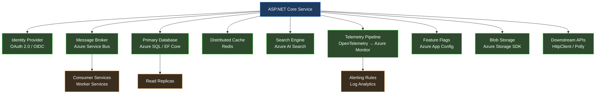
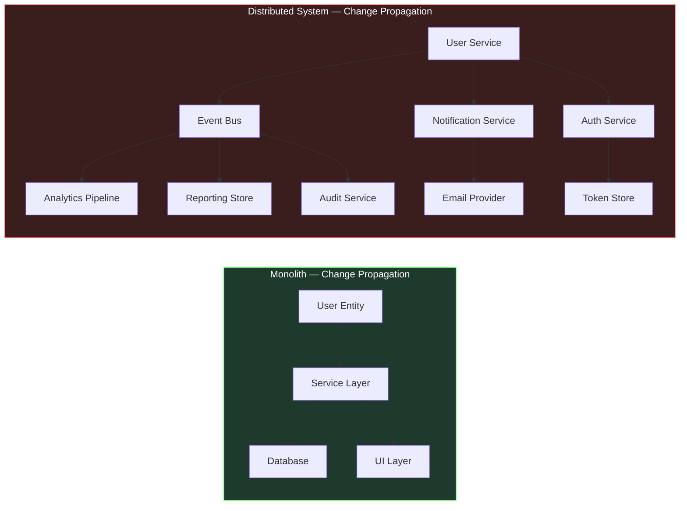
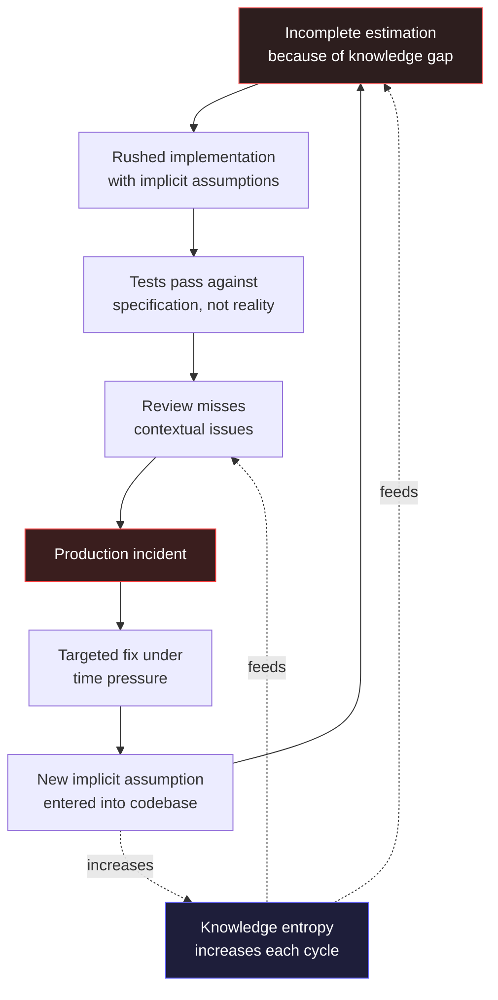
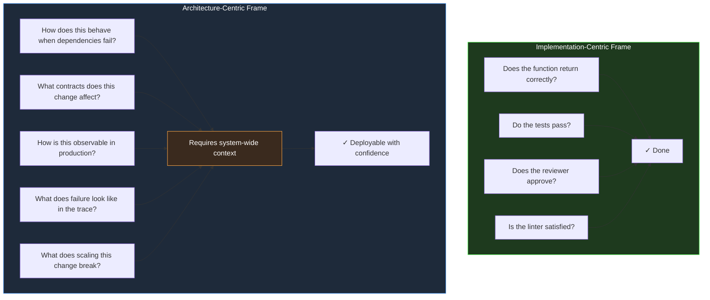
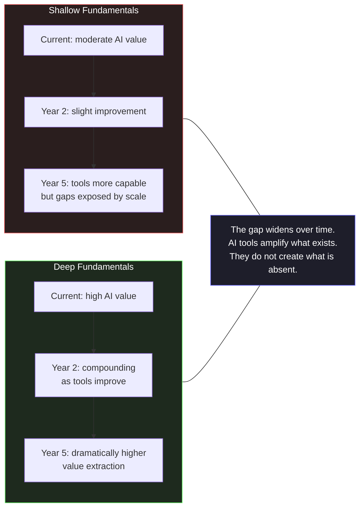

# Section 01 — The Complexity Crisis in Modern Software Systems

## The Baseline Has Shifted

There is a particular kind of software that was straightforward to reason about. A Windows Forms application connected to a SQL Server database, deployed on a single server, used by a hundred employees inside a corporate network. A developer could hold the entire system in their head: the schema had fifty tables, the business logic lived in a service layer, the UI was a thin shell over that logic. When something broke, the failure surface was bounded. When a requirement changed, the blast radius was predictable. When a new developer joined the team, two weeks of orientation produced a functional understanding of the whole.

That mental model — developer as possessor of complete system knowledge — was the foundation on which most software engineering practice was built. The majority of design patterns, the structure of most software curricula, the implicit assumptions behind code review practices, the very concept of "senior developer" as someone who simply knows more — all of it rests on the premise that a sufficiently experienced engineer can maintain a coherent understanding of the system they are building.

That premise has collapsed. Not gradually, and not as an abstract trend, but as a concrete operational reality that affects the daily work of every engineer building production systems today. The question is not whether modern systems are more complex than their predecessors. They are, by every measurable dimension. The question is whether that complexity is merely quantitative — more tables, more services, more lines of code — or whether it represents a qualitative shift that demands fundamentally different engineering practice.

The answer, examined carefully, is unambiguous. Modern distributed systems have crossed a threshold of complexity beyond which the individual developer's cognitive model, however detailed, is structurally insufficient. What follows is an engineering analysis of why that threshold was crossed, what it means for how software must be designed, and why this creates the specific conditions that make AI-assisted development not a convenience, but an architectural necessity.

## The Dimensions of Modern Complexity

To understand the magnitude of the shift, it is necessary to be precise about what "complexity" means in this context. The term is commonly used as a synonym for "large" or "difficult," but complexity in software systems has distinct, measurable dimensions that behave differently from each other and interact in ways that compound their individual effects.

**Integration surface area.** A modern enterprise .NET application does not exist in isolation. It integrates with authentication providers, message brokers, third-party APIs, cloud storage, distributed caches, search engines, telemetry pipelines, feature flag services, and data warehouses. Each of these integrations introduces a dependency with its own versioning contract, failure modes, latency characteristics, and rate limits. When Microsoft released ASP.NET Core, a standard web application project pulled in approximately 80 NuGet packages. A production-grade enterprise service today routinely references 400 to 600 packages, each representing a node in a directed acyclic dependency graph that can contain cycles across major version boundaries. A single `dotnet add package` command is never just adding one thing — it is modifying a complex dependency resolution problem that may have no optimal solution given conflicting transitive requirements.

**Temporal complexity.** Distributed systems do not execute in the sequential, deterministic order that is natural to reason about in a single-process program. Events arrive out of order. Operations complete asynchronously. State is replicated across nodes that may disagree about current values during network partitions. A request that takes 200 milliseconds in a development environment may take 2,000 milliseconds in production due to cold starts, garbage collection pauses, or noisy neighbors in a shared cloud environment. The async/await model in C# made asynchronous programming dramatically more accessible, but it did not reduce the conceptual complexity of concurrent state management — it lowered the barrier to introducing that complexity into codebases that were not architecturally prepared for it.

**Operational complexity.** The systems that developers build today must be understood not only at development time but throughout their operational lifetime. A service that performs correctly under unit test conditions may fail in production due to configuration drift, infrastructure changes, or the interaction of multiple individually correct behaviors. Kubernetes deployments, Helm charts, Terraform configurations, Azure Resource Manager templates — these are not deployment details that can be left to a platform team. They are part of the system's specification, and misunderstandings about how they interact with application code produce production failures that cannot be diagnosed from application logs alone.

**Organizational complexity.** Software systems today are built by teams, often distributed across time zones and organizational boundaries. The codebase is a shared artifact that accumulates the decisions of dozens or hundreds of contributors over years. Code review processes, branching strategies, semantic versioning conventions, and architectural decision records are not bureaucratic overhead — they are the mechanisms by which a distributed team maintains coherent shared understanding of a system that no individual can hold in their head completely.



This diagram represents a conservative estimate of the integration surface for a mid-sized .NET service. Each arrow is not a line of code — it is a contract with a remote system that has its own versioning, failure modes, operational requirements, and behavioral edge cases. The developer maintaining this service must understand not only their own code, but the behavioral characteristics of every dependency well enough to design for its failure.

The practical consequence of this integration surface is that most of the failure-relevant knowledge about a system lives outside the codebase that the developer edits. The retry policy of a downstream API, the eventual consistency window of the message broker, the eviction policy of the distributed cache, the rate limit of the identity provider — none of this appears in the service's own source files, yet each one determines whether a correct-looking implementation behaves correctly in production. This is why the diagram's density matters more than its accuracy: it makes visible the true distribution of knowledge that a developer must hold, and it demonstrates why that knowledge cannot be acquired from reading the service's code alone. The knowledge is elsewhere — in vendor documentation, in configuration files, in the incident history of related services, in the operational playbooks of the platform team — and connecting it to the code under modification is a separate, uncompensated cognitive task.

The complexity here is not an artifact of poor engineering choices. Each integration exists because it delivers a capability the business requires. The identity provider replaces self-managed authentication; the message broker enables decoupled processing; the distributed cache makes response latency acceptable. Reversing these decisions to simplify the system would reverse the business value they provide. The engineer is therefore not facing a choice between complexity and simplicity but a question of how to maintain reliable understanding in a system whose complexity is a permanent feature of the problem being solved.

## The Engineering Limitation of the Individual Mental Model

Software engineering practice evolved, almost entirely, around the capabilities and limitations of a single human mind. The patterns documented in the Gang of Four were responses to the cognitive difficulty of managing object relationships in programs that a single developer could fully understand. Domain-Driven Design's bounded contexts were invented to make it possible for a developer to maintain local coherence in a system too large to model globally. Clean Architecture's dependency rules exist to make it possible to reason about one layer without holding the entire stack in working memory simultaneously.

These are excellent engineering techniques. They remain valid and important. But they were designed to compensate for a specific cognitive limitation operating at a specific scale of system complexity. When the scale of complexity increases by an order of magnitude, compensating for the same limitation requires qualitatively different approaches — not better individual techniques, but different organizational strategies for how engineering knowledge is structured, shared, and verified.

Consider the following scenario, which is not hypothetical but representative of conditions that exist in production systems across the industry. An engineering team maintains a .NET service that processes financial transactions. The service has been in production for four years. It has had eleven primary contributors and dozens of occasional contributors. It integrates with seven external systems, three of which have changed their API contracts during the service's lifetime and required migration. The codebase contains 180,000 lines of code across 900 files. It has 3,200 unit tests and 240 integration tests. The test coverage is 78%.

When a new requirement arrives — the service must support a new payment method with regulatory reporting obligations — where does understanding of the system's current behavior come from? Not from any single developer's knowledge, because no single developer has maintained continuous involvement throughout the service's four-year history. Not from the tests, because tests verify specified behavior, not behavior that emerged from four years of incremental change. Not from the documentation, because documentation decays faster than code in environments where engineering velocity is the primary optimization target.

Understanding comes, in practice, from archaeology: reading code, tracing execution paths through the system, running queries against production databases to understand actual data distributions, examining telemetry to understand real-world behavioral patterns. This archaeology takes time proportional to the complexity of the system being explored, and the relationship is not linear — it is superlinear. Doubling the system's complexity more than doubles the time required to achieve confident understanding of how a change will behave in production.

The superlinear relationship is worth dwelling on because it determines the economic shape of maintenance. The first fifty thousand lines of a codebase are cheap to understand: conventions are still consistent, the dependency graph is small, and the original authors are still present. Beyond that, understanding cost climbs steeply. New contributors must reconstruct context that the code no longer carries — decisions that were made but not recorded, workarounds that exist without explanation, contracts that are honored by convention rather than enforcement. Seniority in such a codebase is not primarily a matter of skill; it is a matter of accumulated context that was never written down. The consequence is structural: the team's effective knowledge is concentrated in the minds of the longest-serving members, and their departure or reassignment silently deletes the system's most valuable documentation.

This concentration also explains why onboarding time is the clearest observable symptom of the mental-model limit. When a system can be held in one head, orientation is a transfer of knowledge from one mind to another. When the system exceeds that limit, orientation becomes an excavation project — the new engineer must reconstruct, from artifacts, a model that no living person possesses in complete form. The two-week orientation described in the opening paragraph becomes a two-month effort, and even then the newcomer's model has gaps that only production incidents will reveal.

## The Structural Failure Point

The failure mode that emerges from this condition is not dramatic. Systems do not collapse suddenly because a developer lacked complete knowledge. The failure is incremental and insidious: the accumulating cost of decisions made with incomplete information.

A developer adds a caching layer to a slow query without fully understanding the write patterns that invalidate that cache. The behavior is correct in testing, where write loads are synthetic, and incorrect in production at peak load. A developer refactors a shared data access component without recognizing that its performance characteristics under concurrent access were intentional, not accidental. The refactored version is cleaner and performs identically in unit tests; it deadlocks under the concurrent load patterns of production.

```csharp id="code-01-01"
// Target Framework: .NET 8.0
// Chapter: 01 | Section: 01
// This code is correct in isolation. Every individual decision is defensible.
// The problem is what it assumes about the systems it integrates with.

public sealed class PaymentProcessor
{
    private readonly IPaymentGateway _gateway;
    private readonly IPaymentRepository _repository;
    private readonly IDistributedCache _cache;
    private readonly ILogger<PaymentProcessor> _logger;

    public PaymentProcessor(
        IPaymentGateway gateway,
        IPaymentRepository repository,
        IDistributedCache cache,
        ILogger<PaymentProcessor> logger)
    {
        _gateway = gateway;
        _repository = repository;
        _cache = cache;
        _logger = logger;
    }

    public async Task<PaymentResult> ProcessAsync(
        PaymentRequest request,
        CancellationToken cancellationToken = default)
    {
        // Assumption 1: The idempotency key check is fast.
        // Reality: _cache is a remote Redis instance. Cold starts can add 50-200ms.
        // Upstream callers have a 100ms timeout. This works until it doesn't.
        var cachedResult = await _cache.GetStringAsync(
            request.IdempotencyKey, cancellationToken);

        if (cachedResult is not null)
            return JsonSerializer.Deserialize<PaymentResult>(cachedResult)!;

        // Assumption 2: The gateway call is bounded.
        // Reality: No HttpClient timeout is configured. The gateway occasionally
        // hangs for 30+ seconds during upstream incidents. Thread pool exhaustion follows.
        var gatewayResponse = await _gateway.ChargeAsync(
            request.Amount,
            request.PaymentMethod,
            cancellationToken);

        var payment = Payment.Create(request, gatewayResponse);

        // Assumption 3: The database write and cache write are atomic enough.
        // Reality: If the process restarts between these two lines, the payment
        // is persisted but not cached. The idempotency check on retry misses.
        // The gateway charges the customer twice.
        await _repository.SaveAsync(payment, cancellationToken);
        await _cache.SetStringAsync(
            request.IdempotencyKey,
            JsonSerializer.Serialize(PaymentResult.From(payment)),
            new DistributedCacheEntryOptions
            {
                AbsoluteExpirationRelativeToNow = TimeSpan.FromHours(24)
            },
            cancellationToken);

        _logger.LogInformation(
            "Payment {PaymentId} processed successfully", payment.Id);

        return PaymentResult.From(payment);
    }
}
```

This code is not the work of an incompetent developer. Every individual decision is technically correct and defensible in isolation. The dependency injection follows the right patterns. The logging is structured. The async/await usage is clean. The problem is not in the code — it is in the gap between what the code assumes about its operational environment and what that environment actually provides. That gap is invisible to the developer who wrote this code, because the knowledge required to see it is distributed across the system rather than localized in any file or any developer's understanding.

This is the structural failure point: not that individual developers write bad code, but that the complexity of modern systems creates conditions in which even careful, experienced developers routinely make decisions with insufficient information about their systemic consequences.

The incident pattern that follows from this condition is recognizable to anyone who has worked on a large production system. The service degrades, not abruptly but over weeks. A metric drifts. A retry storm builds slowly as an upstream dependency's latency increases by increments too small to trigger alerts. The incident that finally fires — a timeout spike, an error-rate breach — is the visible endpoint of a chain of decisions, each of which was reasonable at the moment it was made, each of which contributed a small amount of risk. The post-mortem investigation traces the chain backward: the caching layer added without understanding invalidation patterns, the timeout raised to accommodate a slow dependency, the retry policy configured without accounting for the downstream's rate limits. No single decision was reckless. The accumulation was invisible because each decision's systemic consequence was invisible to the developer who made it — not from negligence, but from the structural distribution of knowledge across the system.

## The Constraint That Prevents Simple Solutions

The instinctive response to complexity is to slow down, invest in documentation, conduct more thorough design reviews, and increase test coverage. These are sensible responses, and they help. But they do not resolve the underlying constraint, which is not a deficit of care or effort but a fundamental mismatch between the scale of the system and the bandwidth of human cognition.

Comprehensive documentation of a 180,000-line service would itself be a massive undertaking — and documentation begins decaying the moment it is written, because the code continues changing while the documentation does not. Thorough design reviews require reviewers who understand the full system well enough to evaluate a change's systemic consequences — but the premise we established is that no single reviewer possesses that understanding. Increased test coverage verifies specified behavior at the time the tests were written, not the emergent behavior of a system that has evolved over four years of production use.

The constraint is real: human cognitive bandwidth has not scaled with the complexity of the systems that humans are now required to build and maintain. Any approach to this problem that requires the individual developer to simply know more, read more, review more carefully, or document more thoroughly is not addressing the constraint — it is asking for a quantity of a resource that is finite and already largely consumed.

## The Insight: Distributed Cognition as Engineering Infrastructure

The resolution to this constraint does not come from any single developer becoming more capable. It comes from recognizing that the engineering problem has changed in kind, not just in degree, and that addressing it requires engineering infrastructure for distributed cognition — systematic mechanisms by which engineering knowledge is captured, made searchable, and made available at decision points throughout the development process.

This insight reshapes how we understand the role of specifications, of architectural decision records, of test suites, of telemetry, and ultimately of AI-assisted development tools. Each of these is not merely a development practice — it is infrastructure for extending the effective cognitive reach of the engineer beyond what individual memory and attention can sustain.

A well-structured Architecture Decision Record does not just document a past decision. It externalizes the reasoning context that would otherwise exist only in the mind of the engineer who made the decision, making that reasoning available to future engineers facing related decisions. A comprehensive integration test suite does not just verify current behavior. It encodes behavioral knowledge about how the system interacts with its dependencies — knowledge that would otherwise require hours of investigation to reconstruct.

And an AI-assisted development environment, used correctly, does not just generate code faster. It provides on-demand access to a compressed representation of engineering knowledge — patterns, precedents, failure modes, and implementation approaches — that would otherwise require years of experience or hours of research to access at the moment of decision.

## The New Engineering Model: Architecture-Centric Development

What changes, in the face of irreducible systemic complexity, is the center of gravity of the engineering task. The primary engineering activity shifts from *writing code that implements specified behavior* to *designing systems whose behavior under real operational conditions can be confidently predicted and controlled*.

This is not a deprecation of implementation skill — implementation skill remains essential and difficult. It is a reprioritization of where the highest-leverage engineering judgment is applied. The developer who understands the system's failure boundaries, who designs for the right level of consistency in distributed operations, who chooses appropriate resilience patterns for the specific failure modes of their integration partners — that developer's implementation decisions are systematically better than those of a developer who focuses on implementation without that architectural context.

The chapters that follow examine how AI-assisted development tools can extend the effective reach of this architecture-centric approach: not by replacing the architectural judgment that experienced engineers exercise, but by providing on-demand access to the knowledge that informs that judgment. Before those tools can be used effectively, however, it is necessary to understand both their capabilities and the specific ways in which they fail. That understanding begins with an honest examination of what language models actually do, and what they cannot do — which is the subject of the next section of this chapter.

---

*Section 01 examines the structural conditions that make modern software complexity qualitatively different from historical complexity. Section 02 examines the specific ways in which traditional development workflows — effective for systems at one level of complexity — break under the operational demands of modern distributed systems, and why that breakdown creates the conditions for AI-assisted engineering to provide genuine architectural value rather than superficial productivity gains.*

# Section 02 — The Breakdown of Traditional Workflows at Scale

## The Workflow Assumption

Every software development methodology rests on assumptions about the system being built and the team building it. Agile ceremonies assume that work can be decomposed into independent increments whose integration cost is manageable within a sprint boundary. Test-driven development assumes that the behavior of a unit can be specified completely before its implementation begins, and that the resulting tests will meaningfully constrain the unit's behavior in production contexts. Code review assumes that a reviewer can, in reasonable time, develop sufficient understanding of a change to evaluate its systemic consequences.

These assumptions held, largely, for the class of systems that dominated software development for the first several decades of the discipline. They were designed in an era when a service consumed a handful of dependencies, deployed to a predictable infrastructure, and whose behavior under load could be reasoned about from first principles.

Modern distributed .NET systems have invalidated each of these assumptions — not by making them false in all cases, but by creating conditions in which they break in specific, predictable ways that compound each other. Understanding exactly where and why they break is not an academic exercise. It is the prerequisite for understanding what AI-assisted development tools can actually do for an engineering team, and which of their advertised capabilities are genuine versus which are pattern-matching over familiar-looking code.

## How Agile Ceremonies Break Under Distributed Scale

The sprint planning ceremony assumes that a team can estimate the cost of a user story with reasonable accuracy. Estimation accuracy depends on understanding the current system well enough to identify all the places a change will propagate. In a monolithic system with well-understood boundaries, this is achievable — most changes are localized, and the few that cross layer boundaries do so in predictable ways.

In a distributed system, the propagation graph of a change is a tree that extends across service boundaries, and understanding it requires knowledge of the protocols, contracts, and behavioral characteristics of every service that might be affected. A seemingly simple requirement — "users should be able to update their email address" — propagates across an authentication service, an identity store, a notifications service, an event bus contract, a downstream analytics pipeline, and potentially a reporting system that denormalizes user data for performance. The team member who estimates this story as three points has experience with the local implementation. The team member who estimates it as thirteen has experience with the distributed consequences.

Neither estimate is wrong given the knowledge of the estimator. The variance is a measurement of the gap between the knowledge available at planning time and the knowledge required to implement the change without incident.

This gap does not close as teams become more experienced. It widens as the system becomes more complex, because each new service, each new integration, each new denormalized data store adds to the propagation graph that must be understood for accurate estimation. Teams manage this by reducing ambition — breaking stories into smaller increments, accepting that certain integrations will be discovered during implementation rather than during planning, and building in explicit "integration buffer" time. These are practical adaptations to a real constraint, but they represent a degradation in the planning process's ability to provide accurate forecasts.



The left side of this diagram represents the change propagation for "update email" in a monolithic system — three nodes, predictable. The right side represents the same change in a moderately complex distributed system — nine nodes across eight services, each with its own deployment lifecycle and failure characteristics. The planning ceremony was designed for the left side.

The asymmetry in the diagram is the mechanism by which estimation fails, and it is worth making concrete. On the left, the entire propagation graph is visible in a single codebase; a senior developer can enumerate the affected components from memory, and the estimate reflects a genuine understanding of the work. On the right, no individual sees the whole graph. The auth service is owned by a different team, the event bus contract is maintained by a platform group, and the analytics pipeline is a separate deployment whose schema changes are governed by a different release calendar. The estimator does not knowingly ignore these nodes — they are simply outside the set of facts available at planning time. The estimate is therefore not an estimate of the work at all; it is an estimate of the subset of the work that is locally visible, plus an implicit, unstated multiplier for the rest.

This is why the common advice to "involve senior engineers in estimation" does not resolve the problem. Seniority predicts local knowledge: how the team's own services are structured, what conventions are followed, where the historical traps are. It does not predict knowledge of a propagation graph that spans ownership boundaries and is changing continuously as other teams deploy independently. The planning ceremony compensates by building in buffer time, but buffer is a blunt instrument — it cannot distinguish between a change with genuinely low propagation cost and a change whose propagation cost is unknown. In practice, teams discover the difference only after the fact, in the deployment incident or the missed commitment.

## How Test-Driven Development Breaks at Integration Boundaries

Test-driven development, in its classical formulation, requires that the developer write a failing test before writing the implementation. The test specifies the expected behavior, and the implementation is driven by the requirement to make the test pass. This creates a discipline that produces well-specified, testable code.

The practice works exceptionally well for units that can be specified completely in isolation: pure functions, domain logic, validation rules, transformation pipelines. It degrades gracefully when the unit under test has simple dependencies that can be replaced by test doubles. It breaks meaningfully when the behavior being specified is an emergent property of the interaction between the unit and its real dependencies under real operational conditions.

Consider a service that processes payment webhooks from an external provider. The webhook payload format is documented, but the documentation omits several edge cases that only manifest under specific transaction conditions. The retry behavior is documented, but the actual retry interval is not always what the documentation states, and changes with provider configuration. The ordering guarantees are stated but not universally honored during provider-side incidents. None of these behavioral characteristics can be specified in a unit test against a mock of the webhook provider — because the specification does not fully capture the actual behavior.

This is not a criticism of test-driven development as a practice. It is an observation about the class of correctness problems that tests can and cannot address. Tests verify correctness against a specification. They cannot verify correctness against an external system whose behavior is incompletely specified, dynamically changing, or emergent under conditions that testing environments cannot reproduce. And in distributed .NET systems, this class of behavior — integration behavior at external boundaries — is precisely where the most consequential failures occur.

```csharp id="code-01-02"
// Target Framework: .NET 8.0
// Chapter: 01 | Section: 02
// book/chapters/chapter-01/sections/section-02.en.md
// This test suite provides 100% branch coverage of the webhook processor.
// Every assertion passes. The implementation is correct against the specification.
// The production failure that follows is not visible from here.

[TestClass]
public sealed class WebhookProcessorTests
{
    private readonly Mock<IWebhookRepository> _repository = new();
    private readonly Mock<IEventBus> _eventBus = new();
    private readonly WebhookProcessor _processor;

    public WebhookProcessorTests()
    {
        _processor = new WebhookProcessor(_repository.Object, _eventBus.Object);
    }

    [TestMethod]
    public async Task ProcessAsync_ValidPayload_PublishesPaymentEvent()
    {
        var payload = WebhookPayloadBuilder.ValidCharge();
        _repository.Setup(r => r.ExistsAsync(payload.EventId, It.IsAny<CancellationToken>()))
                   .ReturnsAsync(false);

        await _processor.ProcessAsync(payload, CancellationToken.None);

        _eventBus.Verify(b => b.PublishAsync(
            It.Is<PaymentReceivedEvent>(e => e.Amount == payload.Amount),
            It.IsAny<CancellationToken>()), Times.Once);
    }

    [TestMethod]
    public async Task ProcessAsync_DuplicateEventId_SkipsProcessing()
    {
        var payload = WebhookPayloadBuilder.ValidCharge();
        _repository.Setup(r => r.ExistsAsync(payload.EventId, It.IsAny<CancellationToken>()))
                   .ReturnsAsync(true);

        await _processor.ProcessAsync(payload, CancellationToken.None);

        _eventBus.Verify(b => b.PublishAsync(
            It.IsAny<PaymentReceivedEvent>(),
            It.IsAny<CancellationToken>()), Times.Never);
    }

    // Production failures not visible in this test file:
    //
    // 1. The provider sends the same event_id for different transaction types
    //    during partial payment scenarios. The deduplication logic incorrectly
    //    skips legitimate events with shared identifiers.
    //
    // 2. The provider occasionally delivers charge.succeeded before
    //    payment_intent.created during high-volume periods. The processor
    //    assumes creation precedes charge. It doesn't handle the out-of-order case.
    //
    // 3. The retry webhook carries a modified_at timestamp that differs from
    //    the original by milliseconds. The idempotency check compares the full
    //    payload hash including this timestamp, causing retries to be processed
    //    as new events.
    //
    // None of these failure modes are discoverable from the specification.
    // All of them are discoverable from production observation.
}
```

The three failure modes documented in comments in this code are real patterns that appear in production systems across the industry. None of them represent a failure of the test-driven development methodology — the tests are correct. They represent the inherent limitation of specification-based verification against systems whose behavior is not fully captured by any available specification.

## How Code Review Breaks Under Complexity

Code review operates on the assumption that a reviewer can develop sufficient understanding of a change to evaluate whether it is safe to merge. This requires understanding the change itself — straightforward — and understanding the systemic context in which the change will execute — frequently not straightforward in a complex distributed system.

The systemic context question has two parts. First: does the reviewer understand the current behavior of the components the change interacts with well enough to predict how the change will affect that behavior? Second: does the reviewer understand the downstream consumers of the changed component well enough to predict whether the change will be backward-compatible with their expectations?

In practice, these questions are answered by proxy: the reviewer checks whether the change follows established conventions, whether its tests are reasonable, whether the implementation looks like similar changes that have worked in the past, and whether the author has explicitly considered the edge cases that the reviewer can identify from memory. This is a reasonable process, and it catches a large class of problems. But its effectiveness is proportional to the reviewer's depth of knowledge about the specific components involved — knowledge that degrades over time as systems evolve and that cannot be maintained uniformly across all areas of a large distributed system.

The proxy nature of review explains a subtle but important phenomenon: reviews of changes in well-trodden areas are rigorous in a way that reviews of unfamiliar areas are not, yet the two reviews look identical on the surface. Both contain substantive comments, both have tests attached, both pass. The difference is invisible in the review artifact and lives entirely in the reviewer's mind — in whether the comments reflect genuine understanding of the change's systemic consequences or a plausible reading of its surface structure. A reviewer who has not touched the payments subsystem in eighteen months can still identify a violation of naming conventions, spot a missing null check, and approve a change whose interaction with the payment reconciliation workflow is deeply wrong. Nothing in the process distinguishes these cases until the change reaches production.

This is the specific sense in which code review "breaks" under complexity: it does not stop working, and it does not produce visibly worse output. It produces output whose quality has become a function of an invisible variable — reviewer familiarity with the affected area — that the process neither measures nor controls. The failure is quiet because every individual review remains defensible. The cost is paid in the aggregate, as the distribution of reviewer knowledge diverges from the distribution of production risk.

The result is a systematic pattern: changes in areas the team knows well receive rigorous review; changes in areas where knowledge is thin receive superficially correct but effectively cursory review. The team does not know which areas fall into which category in any given review, because knowledge depth is not a visible property of the codebase. The distribution of this unknown is what drives a substantial fraction of production incidents that occur immediately after a code deployment.

## The Accumulation Pattern and Its Engineering Consequences

The three workflow breakdowns described above — estimation accuracy, specification completeness, and review depth — do not fail independently. They compound each other through a mechanism that can be described precisely: each failure increases the entropy of the codebase in ways that make the other failures worse in subsequent cycles.

Underestimated complexity leads to incomplete implementation, which leads to integration defects that are not caught in testing, which leads to production incidents. Post-incident investigation reveals knowledge gaps that are addressed with targeted fixes — but targeted fixes that are applied under time pressure to a system that was not fully understood often introduce new implicit assumptions that future changes will violate. Over time, the codebase accumulates a layer of archaeological decisions: code that implements behaviors for reasons that are no longer visible, constraints that were added in response to production incidents whose context has been forgotten, performance optimizations that prevent certain refactorings without any documented explanation.



This accumulation pattern is not a failure of process. It is the predictable outcome of applying processes designed for bounded, well-understood systems to systems that have grown beyond the boundaries those processes were designed to manage.

The cycle in the diagram has one property that distinguishes it from an ordinary feedback loop: it is asymmetric in time. Each complete revolution takes longer than the previous one, because each revolution leaves behind more archaeological context — more implicit assumptions, more undocumented constraints, more decisions whose reasoning has been forgotten. The targeted fix at the bottom of the cycle appears to close the loop quickly, but it does not remove the knowledge gap that caused the incident; it patches the incident's symptom and, as the diagram shows, often adds a new implicit assumption in the process. The loop therefore does not return to its starting state after each revolution. It returns to a state with slightly higher entropy, and the next revolution takes slightly longer. This is the mechanism by which the same incident, or a near-variant of it, recurs in systems that appear to be well-managed: the process prevents the exact incident from repeating while permitting its structural cause to grow.

The compounding has a practical consequence for teams deciding where to intervene. Intervening at the top of the cycle — improving estimation by improving knowledge availability — is the only intervention that breaks the loop, because it addresses the deficit that feeds all subsequent stages. Intervening at lower stages — improving review, adding tests, tightening deployment controls — mitigates symptoms but leaves the knowledge gap intact, so the loop continues with slightly different incidents. This is why the workflow improvements described in the following sections consistently point in one direction: not toward more process, but toward infrastructure that makes the system's knowledge available at the moment a decision is made.

## What This Means for Engineering Practice

The conclusion from this analysis is not that traditional workflows should be abandoned. Sprint planning, test-driven development, and code review remain valuable practices that improve software quality. The conclusion is more specific: these practices have a characteristic failure mode at scale, and that failure mode is defined by a specific type of knowledge deficit — the inability to maintain accurate, comprehensive understanding of large distributed systems as they evolve.

This knowledge deficit is not addressable by harder work, better tooling within existing workflows, or more experienced engineers. It is addressable by changing how engineering knowledge is captured, maintained, and made available at decision points.

The shift this requires is from workflows designed around individual knowledge to workflows designed around distributed knowledge infrastructure. Specifications that capture architectural intent, not just interface contracts. Test suites that verify integration behavior, not just unit behavior against mocks. Review practices augmented by tooling that makes the systemic context of a change visible rather than relying on reviewer memory. And development environments that can surface relevant knowledge — patterns, precedents, failure modes — at the moment a developer is making a decision, rather than requiring that developer to already know what to search for.

Specifically, the incidental couplings that arise across shared data stores add another layer of complexity that does not appear in formal change-propagation diagrams. A service may modify a database table in a way that looks local, yet the same table is used as the source for a query view in another service that a former engineer created to simplify a particular query. This undocumented linkage is not discovered until the consuming service stops suddenly after a deployment that looked entirely safe in code review.

This is the precise engineering context into which AI-assisted development tools arrive. Not as productivity multipliers in a well-functioning workflow, but as a potential solution to a specific, structural knowledge deficit that traditional workflows cannot address. Whether they provide that solution — and under what conditions, and with what limitations — is the subject of the next section.

---

*Section 02 has examined the specific mechanisms by which traditional development workflows break as system complexity scales. Section 03 examines what the architectural shift to AI-augmented development actually requires from the engineer — not in terms of tool adoption, but in terms of how architectural judgment is exercised and where it must be applied.*

# Section 03 — The Architectural Shift: From Implementation to Judgment

## What Training Produces

Software engineers are trained, almost universally, for implementation excellence. Computer science curricula teach algorithms, data structures, language semantics, and the mechanics of computation. Bootcamps teach frameworks, toolchains, and the patterns used to construct working applications quickly. Early career experience reinforces this: the metric by which junior engineers are evaluated is primarily whether they can write correct code that satisfies the specification in front of them.

This training produces engineers who are skilled at a specific and valuable activity: given a problem with defined boundaries, produce working code that solves it. The activity requires significant competence — understanding language semantics, choosing appropriate data structures, writing tests that verify correctness, handling error conditions, organizing code for maintainability. None of this is trivial. All of it is necessary.

But it is not sufficient for the class of problem that the previous two sections described. The complexity crisis and the workflow breakdown they examined are not problems of implementation quality. The `PaymentProcessor` from Section 01 was implemented correctly by a skilled engineer. The `WebhookProcessor` tests from Section 02 were written carefully and passed. The failures were not in the implementation — they were in the gap between the implementation's assumptions about the system and what the system actually provided under real operational conditions.

That gap is not closed by writing better code. It is closed by exercising a different kind of engineering judgment: the judgment required to understand a system as a whole, including the parts you did not write, under conditions you have not directly observed, and to make implementation decisions whose consequences at the system level can be predicted with confidence.

This judgment has a name in engineering discourse — architectural thinking — but the name obscures how concrete and learnable it actually is. It is not a personality trait or a function of seniority alone. It is a specific cognitive activity that can be described precisely, practiced deliberately, and applied to everyday engineering decisions, not just to the grand architecture meetings that happen once a year.

## Two Cognitive Modes in Engineering

The distinction between implementation-centric and architecture-centric thinking is not about the size of the problem being solved. It is about the frame through which the problem is viewed and the questions that frame generates.

The implementation-centric frame asks: *Does this code correctly solve the problem as specified?* The answers it seeks are local: Does the function return the right value? Does the test pass? Does the linter approve? Does the pull request reviewer find anything obviously wrong? The frame is closed — it evaluates the code against its specification, and a passing evaluation means the work is done.

The architecture-centric frame asks: *How will this code behave in the system under real operational conditions, and what are the consequences of that behavior for the system's overall reliability and evolution?* The answers it seeks are distributed across the system: What happens to the callers of this service when the external dependency this code introduces becomes unavailable? What does the failure mode of this implementation look like in the distributed trace? If this code changes, what contracts have changed, and who depends on those contracts? The frame is open — it evaluates the code against the system, and a complete evaluation requires knowledge that extends far beyond the file being changed.



Both frames are necessary. The implementation-centric frame is not wrong — code must work correctly at the unit level before systemic correctness is even relevant. But the implementation-centric frame alone is structurally insufficient for the reasons examined in the previous sections. An engineer operating only within it will produce locally correct code that fails systemically, because they are not asking the questions that systemic correctness requires.

The diagram's asymmetry encodes the difference between a frame that can be closed and a frame that cannot. The implementation frame terminates: the tests run, the linter passes, the review approves, and the work is complete. This closure is precisely what makes the frame attractive — it offers certainty and a defined endpoint. The architecture frame never terminates in the same way. "How does this behave when dependencies fail?" is a question whose answer depends on the actual failure characteristics of the specific dependencies, the traffic they carry, the time of day, and the state of the deployment. It must be answered afresh for each decision, and a complete answer is always provisional.

This difference in termination conditions explains the strongest cognitive bias an engineer faces in adopting architecture-centric thinking: the implementation frame feels responsible because it finishes, while the architecture frame feels like an endless obligation. In practice, the obligations are not endless — they are a finite set of recurring questions, each of which becomes faster to answer with practice — but the perception is real, and it is the main reason the shift is resisted even by engineers who understand the argument. The sections below address that resistance directly by making the architecture frame's questions concrete and showing that their cost is a small, repeatable increment per decision.

## The Concrete Difference in Practice

The distinction between these two frames is not abstract. It manifests in specific, observable differences in how engineers approach common engineering tasks.

Consider the task of implementing a new endpoint in an ASP.NET Core service that retrieves user preferences from a downstream service, caches them for performance, and returns them to the caller.

The implementation-centric approach produces code that: calls the downstream service, stores the result in Redis with a reasonable TTL, returns the result to the caller, and handles the obvious error cases (downstream unavailable, Redis unreachable) by returning appropriate HTTP status codes.

The architecture-centric approach asks additional questions before writing a single line: What is the latency budget for this endpoint, and what portion of it can the downstream service consume? What happens to callers if the downstream service is degraded but not fully unavailable — should they receive cached data that may be stale, or an error that tells them the data cannot be trusted? What is the invalidation strategy for the cached data, and what happens if a user's preferences change while their previous preferences are still cached? What does a cascading failure look like if this endpoint becomes the entry point for a thundering herd on cache expiry?

These questions do not change the implementation dramatically in the happy path. They change the implementation's behavior under the conditions that determine whether the service is reliable or unreliable in production.

It is worth being precise about what the architecture-centric questions are doing in this example, because their effect is easy to mischaracterize. They are not producing a more defensive or more pessimistic implementation. They are producing an implementation that has explicitly decided its behavior under each of the system's plausible operating states. Implementation A does have behavior in those states — every code path does something under every condition — but the behavior was never decided; it is whatever the default APIs happen to do. When Redis is slow, Implementation A's caller waits indefinitely because no budget was defined. When the downstream service degrades, Implementation A's caller receives an unhandled exception because no degraded-mode contract was chosen. The difference between the two implementations is not that one handles failure and the other does not — both "handle" failure in the sense that code runs. The difference is that Implementation B's failure behavior was a designed decision, while Implementation A's was an accident of the defaults. Reliability is the cumulative product of such decisions being made rather than inherited.

```csharp id="code-01-03"
// Target Framework: .NET 8.0
// Chapter: 01 | Section: 03
// book/chapters/chapter-01/sections/section-03.en.md
//
// Two implementations of the same endpoint.
// Both compile. Both pass their tests. One is architecture-centric.
//
// ── Implementation A: Implementation-Centric ───────────────────────────────
//
// Asks: Does this correctly retrieve and cache user preferences?
// Answer: Yes.
// What it misses: all the questions in the architecture-centric frame.

app.MapGet("/users/{userId}/preferences", async (
    string userId,
    IUserPreferenceService preferenceService,
    IDistributedCache cache,
    CancellationToken ct) =>
{
    var cached = await cache.GetStringAsync(userId, ct);
    if (cached is not null)
        return Results.Ok(JsonSerializer.Deserialize<UserPreferences>(cached));

    var preferences = await preferenceService.GetAsync(userId, ct);
    await cache.SetStringAsync(userId,
        JsonSerializer.Serialize(preferences),
        new DistributedCacheEntryOptions { AbsoluteExpirationRelativeToNow = TimeSpan.FromMinutes(15) },
        ct);

    return Results.Ok(preferences);
});

// ── Implementation B: Architecture-Centric ─────────────────────────────────
//
// Asks: How will this behave under the real conditions of this system?
// Considers: latency budget, stale-on-error, cache stampede, observability,
//            caller contract under degraded conditions.

app.MapGet("/users/{userId}/preferences", async (
    string userId,
    IUserPreferenceService preferenceService,
    IDistributedCache cache,
    ILogger<Program> logger,
    CancellationToken ct) =>
{
    // Bounded cache read — Redis failures should not block the endpoint.
    // Callers receive data or an explicit signal, never a silent hang.
    UserPreferences? preferences = null;
    string? cached = null;

    try
    {
        using var cacheTimeout = CancellationTokenSource.CreateLinkedTokenSource(ct);
        cacheTimeout.CancelAfter(TimeSpan.FromMilliseconds(50)); // explicit cache budget
        cached = await cache.GetStringAsync(userId, cacheTimeout.Token);
    }
    catch (OperationCanceledException)
    {
        // Cache read exceeded budget. Continue to the source of truth.
        // This path is observable: the caller still gets correct data.
        logger.LogWarning("Cache read timeout for user {UserId} — falling through to service", userId);
    }

    if (cached is not null)
        return Results.Ok(JsonSerializer.Deserialize<UserPreferences>(cached));

    // Source-of-truth read with a defined timeout that respects the caller's
    // overall budget. Timeout is configured, not default.
    try
    {
        using var serviceTimeout = CancellationTokenSource.CreateLinkedTokenSource(ct);
        serviceTimeout.CancelAfter(TimeSpan.FromMilliseconds(300));
        preferences = await preferenceService.GetAsync(userId, serviceTimeout.Token);
    }
    catch (OperationCanceledException)
    {
        // Service read exceeded budget. Return a typed error that callers can
        // handle. Do NOT return 500 — this is an expected degraded-mode outcome.
        logger.LogError("Preference service timeout for user {UserId}", userId);
        return Results.StatusCode(503); // Service Unavailable — caller should retry
    }

    // Write-behind: do not block the response on the cache write.
    // A failed cache write is a performance degradation, not a correctness issue.
    _ = cache.SetStringAsync(userId,
        JsonSerializer.Serialize(preferences),
        new DistributedCacheEntryOptions
        {
            // Jittered TTL prevents cache stampede when many entries expire together.
            AbsoluteExpirationRelativeToNow =
                TimeSpan.FromMinutes(15) + TimeSpan.FromSeconds(Random.Shared.Next(0, 60))
        },
        CancellationToken.None) // Intentional: don't cancel on caller disconnect
        .ConfigureAwait(false);

    return Results.Ok(preferences);
});
```

Implementation A is not wrong in the sense that most engineers use the word wrong. In a low-traffic service with a reliable downstream and a local Redis instance, it will work correctly for years. The problems become visible only when the downstream service becomes intermittently slow, when Redis is cold after a deployment, when cache entries for ten thousand users expire simultaneously after fifteen minutes of service startup.

Implementation B is not overengineered. Each decision — the bounded cache read, the explicit timeout on the service call, the write-behind pattern, the jittered TTL — addresses a specific failure mode that real distributed systems encounter. The additional complexity is not architectural decoration. It is the concrete expression of asking the questions the architecture-centric frame generates.

## Why the Shift Is Difficult and What Makes It Possible

The transition from implementation-centric to architecture-centric thinking is genuinely difficult, for three reasons that are worth understanding directly rather than glossing over.

**The feedback cycle is asymmetric.** Implementation correctness produces immediate feedback — the test either passes or it does not. Architectural correctness produces feedback on a delay that can be months or years: the cascading timeout failure, the cache stampede, the data race under production concurrency. This means that an engineer can operate in implementation-centric mode for a long time without receiving negative feedback, which makes the mode feel sufficient even when it is not.

**The knowledge required is distributed.** Architectural judgment requires understanding not just the code being written but the full system context: the failure modes of dependencies, the actual traffic patterns in production, the implicit contracts that callers have formed with the service over time. This knowledge is not concentrated in any document or any single engineer. It exists distributed across the team's collective experience, the production telemetry, the incident history, and the code itself. Developing architectural judgment requires systematically integrating these sources, which takes time and deliberate practice.

**The questions are not on the checklist.** Implementation-centric verification can be automated: tests, linters, type checkers, coverage tools. Architecture-centric verification requires the engineer to generate the right questions, which requires knowing what to ask before the problem manifests. This is a different kind of competence — less procedural, more analogical, built from a library of failure modes accumulated over experience with real systems under real conditions.

These three difficulties operate differently on different career stages, which is why the shift is misperceived as purely a seniority phenomenon. Junior engineers lack the failure-mode library, so the architecture frame produces questions they cannot answer; the implementation frame produces answers they can verify, so they default to it. Senior engineers possess the library but have often internalized the questions so thoroughly that they no longer recognize them as a distinct activity — they experience architectural judgment as instinct rather than method. Neither group is well served by the way the shift is usually framed. Juniors need the questions made explicit and answerable; seniors need the method articulated so they can teach and scale it. The middle years — where engineers have enough experience to know the questions matter but not enough to answer them confidently — are where the practice described at the end of this section has the greatest leverage.

What makes the shift possible, despite these difficulties, is that the architectural questions are not arbitrary. They follow recognizable patterns. Timeout boundaries, fallback behavior, cache invalidation strategies, idempotency under retry, backward compatibility of interface changes — these are the recurring concerns of distributed systems, and an engineer who has internalized them can apply them systematically to new situations.

This is precisely the domain in which AI-assisted development tools can provide genuine value that is not merely about code generation velocity. A language model trained on the engineering corpus has encoded the patterns of these recurring concerns. It can surface them on demand, at the moment a developer is making a specific decision, without requiring that developer to have personally encountered every failure mode in production. The tool does not supply architectural judgment — it supplies the knowledge base that informs that judgment.

But it can only supply that knowledge usefully to an engineer who knows how to apply it: who is already asking the architecture-centric questions and needs the knowledge to answer them, rather than an engineer who is not yet asking those questions and would benefit primarily from having the implementation completed more quickly.

## The Architecture-Centric Questions in .NET Systems

The architecture-centric questions are not abstract. When working with distributed .NET systems, they take specific, recurring forms that every engineer in this space recognizes.

**Timeout budgets across the call chain.** Every operation in a distributed .NET system has an implicit or explicit timeout. The default HttpClient timeout is 100 seconds — a value that is almost never correct for production use, and it produces thread pool exhaustion when a downstream service stalls. The architecture-centric question is not "does this code have a timeout?" but "does this code's timeout fit correctly within the budget of its callers, and does its failure behavior on timeout match the callers' expectations?" An HttpClient timeout that fires after the caller has already disconnected is not a timeout — it is a resource leak.

**CancellationToken propagation.** The CancellationToken parameter in asynchronous .NET code is not a formality. It is the mechanism by which cancellation signals propagate through the call chain, and its absence at any link breaks the chain's ability to respond to a client disconnect or a deployment shutdown. The architecture-centric question is not "does this function accept a CancellationToken?" but "does cancellation at any point in the chain correctly release all resources and avoid orphaned downstream operations?"

**DbContext lifetime and Entity Framework concurrency.** The DbContext in Entity Framework Core is not thread-safe and is designed for the lifetime of a single unit of work. The architecture-centric question is not "does this code use a DbContext?" but "is the DbContext's lifetime correctly scoped to the operation, and what happens when two requests attempt to use the same context concurrently?" Scoped lifetime in a background Worker Service — where the host provides no HTTP request scopes — is a common misconfiguration that produces InvalidOperationException under concurrent load, but only under concurrent load, which is why a test suite does not catch it.

These are not the only questions relevant to .NET systems. They are representative examples of the questions the architecture-centric frame generates naturally, and which the implementation-centric frame does not raise because they are not visible from the local code alone. Developing the habit of asking them consistently — before writing the implementation, not after deploying it — is the concrete practice that produces the shift this section describes.

## The Practical Path to the Shift

Architectural thinking is not acquired by reading about it. It is acquired through deliberate practice of the questions, applied to real systems and real engineering decisions.

The most direct path is to develop the habit of appending a specific set of questions to every implementation decision, before the implementation begins:

What happens to the callers of this component when it behaves unexpectedly — returns a wrong value, takes ten times as long as expected, or becomes completely unavailable?

What does the failure of this component look like in the system's observability infrastructure — in the distributed trace, in the structured log, in the metric dashboard?

What implicit contracts have callers formed with this component's current behavior, and which of those contracts does this change violate?

What is the worst-case behavior of this implementation at ten times the expected load, and is that worst case acceptable or catastrophic?

These questions do not need to produce elaborate answers at every decision point. Many implementations are simple enough that the answers are immediately obvious. But the habit of asking them — consistently, at the moment of decision — is what produces the architectural judgment that makes the difference between code that works in testing and systems that are reliable in production.

The next section examines how AI-assisted development tools interact with this shift — and specifically, why their value is proportional to the architectural judgment of the engineer using them.

## Applying It to Everyday Engineering Decisions

The architecture-centric questions can seem ambitious and broad, as if reserved for large system design sessions rather than the ordinary work of a normal day. That impression is worth correcting early. The architectural questions apply to every change, regardless of its size or how technical it appears. A small change to HttpClient configuration receives the same question as a large architectural decision: what are the consequences of this for system behavior under production load?

The practical difference between two engineers working on the same codebase becomes clear in how they handle small decisions on a daily basis. The implementation-centric engineer adds retry handling when they hit a transient error: they pick a pattern from code they know, apply it, verify the test passes, and move on. The architecture-centric engineer asks first: is retry safe here? Is the operation being retried idempotent? If we retry three times and all three fail, how much time has elapsed, and does that exceed the caller's timeout? Does the chosen retry pattern multiply the pressure on a service that is already overloaded?

The answers do not always change the decision. Sometimes the initial retry pattern is the right one. But asking the questions changes the probability of catching the problem at design time instead of in production. Across hundreds of such small decisions in a system's lifetime, the aggregate difference in reliability is substantial and measurable.

The deeper point is that architectural judgment is not a separate activity that happens in special meetings. It is a continuous posture that affects every decision, large or small. Engineers who have made the architectural shift do not dedicate hours per day to "architectural thinking" — they integrate the architectural questions into the natural rhythm of their daily work, until those questions become automatic reflex rather than additional effort.

What makes these questions learnable and systematically applicable is that they derive from a relatively limited set of recurring failure patterns in distributed systems. Distributed systems do not fail in endless unpredictable ways — they fail in ways that can be classified, documented, and learned from the experience of others. The engineer who invests in building this vocabulary of failure modes expands their architectural reach steadily, making every new tool, service, and integration pattern easier to evaluate correctly than the last. This is the real accumulation in professional software engineering.

Architecture Decision Records provide a concrete mechanism for consolidating this shift. When an engineer documents why a particular architectural decision was made — which alternatives were rejected and why, which failure conditions were estimated and applied — they create a knowledge reference that allows future reviewers to understand the full context of the decision without having to retrieve it from the team's changing memory.

This investment in depth is not incremental — it is foundational for everything that follows in this book, because understanding how systems behave under pressure is the basis on which effective collaboration with AI in building systems that survive in production rests. And the engineer who recognizes that architectural questions apply to every decision, small and large, builds over time an engineering judgment that makes every subsequent decision more precise and safer than the last.

---

*Section 03 has defined the architectural shift from implementation-centric to architecture-centric thinking, grounded it in a concrete dual implementation, and identified the specific cognitive habits that make the shift practical. Section 04 examines how AI tools function as amplifiers of this judgment rather than substitutes for it — and why the distinction is not theoretical but has direct consequences for the quality of systems built with AI assistance.*

# Section 04 — AI as Professional Amplifier: Defining the Relationship

## The Proportionality Claim

There is a claim about AI-assisted development that is not made often enough, because it runs against the dominant narrative of AI as a universal productivity multiplier: the value an engineer extracts from AI tools is proportional to the architectural judgment they bring to those tools.

This is not a moral argument about whether engineers should develop their skills. It is an engineering observation about how these tools actually function. A language model does not evaluate the quality of the context it receives. It generates a response that is statistically consistent with the patterns in its training data, conditioned on the prompt. If the prompt encodes shallow understanding of the problem — if the engineer asking the question has not yet made the shift described in Section 03 — the response will be well-formed code that addresses the stated problem, with no awareness of the unstated architectural context that makes the stated problem the wrong thing to optimize.

The consequence is precise: AI tools applied without architectural judgment produce locally correct code that accumulates systemic risk, at a rate that scales with the velocity the AI provides. An engineer using AI to generate code faster without the judgment to evaluate that code systemically is accelerating the accumulation of the knowledge entropy described in Section 02, not reducing it.

The inverse is equally important: AI tools applied with strong architectural judgment become genuinely powerful. An engineer who knows what questions to ask, who can evaluate the systemic consequences of a generated implementation, and who understands which aspects of a problem require human judgment and which can be safely delegated — that engineer finds that AI tools expand their effective reach in ways that would not be possible otherwise.

## The Four Collaboration Models

The relationship between an engineer and an AI tool is not uniform. It varies depending on the type of task and the type of knowledge required to perform it well. Four collaboration models cover the range of productive interaction.

```mermaid id="diagram-01-05"
graph TD
    subgraph GEN ["Generator Mode"]
        G1["Engineer defines:\nconstraints, patterns, context"]
        G2["AI generates:\ninitial implementation"]
        G3["Engineer evaluates:\nsystemic correctness"]
        G1 --> G2 --> G3
    end

    subgraph REV ["Reviewer Mode"]
        R1["Engineer writes:\nimplementation"]
        R2["AI reviews:\npatterns, edge cases, alternatives"]
        R3["Engineer decides:\nwhat to incorporate"]
        R1 --> R2 --> R3
    end

    subgraph ADV ["Advisor Mode"]
        A1["Engineer describes:\narchitectural problem"]
        A2["AI surfaces:\npatterns, tradeoffs, precedents"]
        A3["Engineer judges:\nwhat applies to this system"]
        A1 --> A2 --> A3
    end

    subgraph EXE ["Executor Mode"]
        E1["Engineer specifies:\nexact requirement"]
        E2["AI executes:\nroutine transformation"]
        E3["Engineer verifies:\noutput correctness"]
        E1 --> E2 --> E3
    end

    style GEN fill:#1e2a3a,stroke:#4a9eff,color:#fff
    style REV fill:#1e3a2a,stroke:#4aff6a,color:#fff
    style ADV fill:#2a1e3a,stroke:#9a4aff,color:#fff
    style EXE fill:#3a2a1e,stroke:#ffaa4a,color:#fff
```



**Generator mode** is the model most commonly discussed — the AI produces an initial implementation from a description. It is the mode with the highest risk of misuse, because it creates the most complete-looking output and therefore the strongest temptation to treat the output as finished. Generator mode is productive when the engineer provides rich context: the architectural constraints of the system, the failure modes that must be handled, the contracts that must be honored, the performance characteristics required. It is dangerous when the engineer provides only the happy-path requirement and accepts the output without evaluating its systemic implications.

**Reviewer mode** inverts the direction. The engineer writes the implementation; the AI examines it. This mode tends to produce more reliable results than generator mode, because the engineer has invested the implementation energy and is more likely to critically evaluate the AI's feedback. The AI's value here is primarily in surfacing patterns and edge cases the engineer has not considered, suggesting alternatives the engineer can evaluate, and identifying potential issues that benefit from an external perspective. The engineer retains the decision authority entirely.

**Advisor mode** is the most powerful and the least discussed. The engineer presents an architectural problem: a design decision with multiple viable options, a failure mode they are trying to reason about, a constraint they are trying to satisfy. The AI surfaces relevant patterns, historical approaches, and tradeoff considerations from its training. The engineer applies this knowledge to their specific system. The value here is in the AI's ability to surface relevant knowledge quickly — knowledge that would otherwise require research, experienced colleagues, or trial and error to access.

**Executor mode** applies to tasks that are well-specified, routine, and where the engineer can verify correctness easily: generating boilerplate, writing documentation from code, converting between data formats, applying mechanical refactoring patterns. The engineer specifies exactly what is needed; the AI performs the transformation; the engineer verifies the output. This mode carries low risk precisely because the verification step is straightforward.

The common error in AI-assisted development is applying executor-mode expectations to generator-mode tasks: treating a generated implementation as a completed transformation rather than as an initial draft that requires architectural evaluation.

## What AI Can and Cannot Contribute

Understanding the collaboration models requires understanding what property of AI tools produces their value — and what property produces their risks.

Language models are, at their core, extraordinarily efficient compression and retrieval systems for the engineering knowledge encoded in their training data. When a model generates an implementation of a distributed circuit breaker pattern, it is not reasoning about circuit breakers from first principles. It is retrieving and composing patterns from the substantial body of engineering writing, code repositories, and technical documentation that exists about circuit breakers. The quality of that retrieval is genuinely impressive, and the productivity gain from not having to research the pattern from scratch is real.

What language models cannot do is apply that pattern to your specific system with accurate awareness of your system's specific constraints. They do not know the actual latency distribution of your downstream service. They do not know that your Redis instance has a specific memory pressure characteristic at peak load. They do not know that the team agreed six months ago to avoid the pattern the AI just generated because it caused a production incident in a subtly different context. They do not know what the production telemetry reveals about the actual failure mode you are trying to address.

This is not a limitation that will be resolved by making language models larger. It is a fundamental epistemic constraint: the model's knowledge is general, and your system's constraints are specific. The engineer's role is precisely the translation layer between general patterns and specific constraints — and that translation requires the architectural judgment that Section 03 described.

The asymmetry is worth making explicit because it determines where review effort belongs. The AI's contribution is measured in the breadth of what it retrieves: it can enumerate the standard failure modes of a pattern, name the libraries that implement it, and draft the idiomatic usage. Its knowledge is wide but uniformly shallow at the point of application — every pattern arrives pre-emptied of the specific facts that make it correct in a particular codebase. The engineer's contribution is measured in the depth of what they verify: the deployment topology, the measured latency budget, the incident history, the team's documented conventions. Neither contribution substitutes for the other. A team that relies on the AI's breadth while skipping the engineer's depth produces architecture that is pattern-perfect and system-incorrect — which is the most dangerous form of incorrect because it passes every review that does not know the system.

```csharp id="code-01-04"
// Target Framework: .NET 8.0
// Chapter: 01 | Section: 04
// book/chapters/chapter-01/sections/section-04.en.md
//
// AI-assisted implementation of a Polly resilience pipeline for an external API client.
// The AI generates a technically correct implementation.
// Two engineers use it differently. The outcomes differ substantially.

// ── What the AI generates (correct against general patterns) ──────────────

services.AddHttpClient<IExternalApiClient, ExternalApiClient>()
    .AddResilienceHandler("external-api", builder =>
    {
        builder
            .AddRetry(new HttpRetryStrategyOptions
            {
                MaxRetryAttempts = 3,
                Delay = TimeSpan.FromSeconds(1),
                BackoffType = DelayBackoffType.Exponential,
                UseJitter = true,
                ShouldHandle = new PredicateBuilder<HttpResponseMessage>()
                    .Handle<HttpRequestException>()
                    .HandleResult(r => r.StatusCode >= HttpStatusCode.InternalServerError)
            })
            .AddCircuitBreaker(new HttpCircuitBreakerStrategyOptions
            {
                FailureRatio = 0.5,
                SamplingDuration = TimeSpan.FromSeconds(30),
                MinimumThroughput = 10,
                BreakDuration = TimeSpan.FromSeconds(15)
            })
            .AddTimeout(TimeSpan.FromSeconds(10));
    });

// ── Engineer A: Does not ask the architecture-centric questions ───────────
//
// Deploys the generated configuration as-is. The configuration is technically
// correct. Three issues become visible only in production:
//
// Issue 1: The circuit breaker's MinimumThroughput of 10 means it requires
//   10 requests before it can trip. Under low-traffic conditions (< 5 req/min),
//   the circuit never trips regardless of the failure rate. The downstream
//   service can fail completely without triggering circuit isolation.
//
// Issue 2: The 10-second timeout is longer than the calling endpoint's own
//   timeout (8 seconds). When the external API hangs, the circuit breaker
//   timeout fires AFTER the caller has already disconnected, creating orphaned
//   downstream connections that consume thread pool slots.
//
// Issue 3: The retry policy handles HttpStatusCode.InternalServerError
//   (500) but not 429 (Too Many Requests). When the external API rate-limits
//   the service, the retry policy immediately retries, making the rate-limiting
//   condition worse instead of backing off.

// ── Engineer B: Applies architecture-centric questions ────────────────────
//
// Before deploying, Engineer B asks:
// "What is the actual traffic pattern to this service?"          → ~2 req/min avg
// "What is this endpoint's own timeout?"                          → 8 seconds
// "Does this API ever return 429?"                                → yes, at > 100 req/hour
// "What is the acceptable blast radius if this dependency fails?" → callers get 503

services.AddHttpClient<IExternalApiClient, ExternalApiClient>()
    .AddResilienceHandler("external-api", builder =>
    {
        builder
            .AddRetry(new HttpRetryStrategyOptions
            {
                MaxRetryAttempts = 2,   // Reduced: low traffic, fewer retries needed
                Delay = TimeSpan.FromSeconds(1),
                BackoffType = DelayBackoffType.Exponential,
                UseJitter = true,
                ShouldHandle = new PredicateBuilder<HttpResponseMessage>()
                    .Handle<HttpRequestException>()
                    .HandleResult(r =>
                        r.StatusCode >= HttpStatusCode.InternalServerError ||
                        r.StatusCode == HttpStatusCode.TooManyRequests) // 429 added
            })
            .AddCircuitBreaker(new HttpCircuitBreakerStrategyOptions
            {
                FailureRatio = 0.5,
                SamplingDuration = TimeSpan.FromSeconds(60), // Longer window for low traffic
                MinimumThroughput = 3,  // Lower threshold: reflects actual traffic volume
                BreakDuration = TimeSpan.FromSeconds(30)
            })
            .AddTimeout(TimeSpan.FromSeconds(5)); // Below caller's 8s budget
    });
//
// The generated code and the deployed code are similar. The differences are small.
// The production behavior is substantially different.
// The difference was not in the AI's output — it was in the questions the engineer asked.
```

This example illustrates the proportionality claim in concrete form. The AI generated a correct implementation. Engineer A deployed it unchanged and accepted a set of production risks that were not visible in the code review. Engineer B used the AI's output as a starting point, applied the architecture-centric questions, and produced a deployment that correctly reflects the system's actual operating conditions.

The AI's contribution was identical in both cases. The outcomes differed because of the engineer's judgment.

## The Knowledge That AI Provides and the Judgment That Engineers Supply

The most productive mental model for working with AI tools is the following: the AI provides knowledge; the engineer provides judgment.

Knowledge, in this context, means the patterns, implementations, and engineering approaches that exist in the training corpus. A correctly formulated prompt reliably surfaces relevant knowledge from that corpus — the right resilience pattern for a given failure mode, the idiomatic way to implement a specific .NET API, the common edge cases in a distributed transaction pattern, the typical security considerations for a given class of system.

Judgment means the application of that knowledge to a specific system, with full awareness of that system's specific constraints, history, failure modes, operational characteristics, and organizational context. Judgment is what the engineer supplies that the AI structurally cannot — because it requires exactly the distributed, context-specific knowledge that no training corpus can encode for your particular system.

The collaboration works when these two contributions are correctly separated: the engineer asks questions that retrieve relevant knowledge from the AI, then applies judgment to determine what that knowledge means for their specific system. It fails when the engineer treats the AI's output as judgment-complete — as an answer rather than as evidence to be evaluated.

The distinction between evidence and answer is the operational test of this separation, and it is worth making concrete because the surface of an AI response obscures it. An AI response is delivered as a confident, complete, well-structured answer — formatted, referenced, self-assured. There is nothing in its presentation that marks it as provisional. The engineer who receives a confident answer must actively reclassify it as evidence: a candidate hypothesis about the correct approach, generated from general patterns rather than from observation of the specific system. The reclassification is a cognitive act, and it is the entire substance of the judgment contribution. Skipping it — treating the response's confidence as a property of the content rather than a property of the language model's generation — is the single most common mechanism by which AI assistance produces systemically incorrect deployments.

This is why the proportionality claim of the section's example is not about the AI's output at all. Engineer A and Engineer B received identical evidence. The difference was that Engineer B treated it as evidence to be tested against the system's actual conditions, while Engineer A treated it as a complete answer. The gap between those two orientations is the entire gap between a productivity gain and a risk factory — and it is a gap that no improvement in AI capability will close, because it is not a property of the AI. It is a property of how the engineer consumes the AI's contribution.

This separation is not a temporary workaround for the current limitations of AI technology. It is the permanent structure of the engineer-AI relationship, because the constraint is fundamental: general patterns require contextual judgment for application, and contextual judgment requires knowledge that lives outside the model. What will change with more capable AI is the quality and breadth of the knowledge the model can surface, not the need for the engineer to exercise judgment in applying it.

## Implications for How Engineers Should Work

The collaboration model described here has direct practical implications for how engineers should structure their interaction with AI tools.

The investment in context preparation is not overhead. Spending time describing the architectural constraints of the system, the failure modes that matter, the contracts that must be preserved, and the operational characteristics that are relevant is not time wasted before getting to the "real" AI assistance. It is the primary mechanism by which architectural judgment is encoded into the prompt, and it determines the quality of what the AI returns.

The evaluation of AI output is not optional. Reviewing AI-generated code for systemic correctness — asking the architecture-centric questions about what the generated implementation assumes and what happens when those assumptions are violated — is not a bureaucratic step before merging. It is the step at which the engineer's judgment is applied, and its omission is precisely what converts AI assistance from a productivity gain into a systemic risk factory.

The choice of collaboration mode should match the task type. Executor mode for routine transformations, advisor mode for architectural decisions, reviewer mode for implementations that the engineer needs a second perspective on, generator mode for well-scoped implementations where rich context can be provided. The common error of applying generator mode to everything is not a failure of the tool — it is a failure of the engineer's discipline in selecting the appropriate mode.

Mode selection deserves more attention than it typically receives, because it is the practical lever through which the knowledge-judgment separation is enforced. Executor mode is appropriate when the engineer has already made the architectural decisions and the AI is transforming a well-specified input into a well-specified output — a rename, a refactor with defined invariants, a DTO conversion. The judgment was applied upstream, in the specification, so the mode is safe. Advisor mode is appropriate when the engineer is deciding between approaches and the AI's breadth can surface options or failure modes the engineer has not considered; here the AI's contribution is explicitly provisional, which keeps the judgment boundary visible. Reviewer mode is appropriate when the engineer has written the implementation and wants the AI to challenge it — effectively using the model's pattern knowledge as an additional reviewer. Generator mode, where the AI produces an implementation from a prompt, is the mode in which the judgment boundary is most at risk, because the output arrives looking finished. Selecting generator mode without first doing the work that advisor mode requires — establishing the architectural constraints the implementation must satisfy — is the pattern that converts a productive tool into a risk factory. The discipline is not to avoid generator mode but to earn it, by front-loading the context and architectural constraints that make the generated output's evaluation tractable.

Section 05 examines where the responsibility boundary between engineer and AI lies, and how to maintain it under the specific pressures that AI-assisted development creates.

## How Collaboration Changes as Tools Improve

There is a common misunderstanding about what improving language-model capability means for the relationship described in this section. Some assume that more capable models will shrink the need for human architectural judgment, approaching a point where AI-assisted development becomes a form of autonomous development. This conclusion is wrong, and it grows out of a misreading of the nature of the fundamental constraint.

The constraint is not in the quality of the output the model generates — though quality improves noticeably with every model generation. The constraint is in the context-specific knowledge that real production systems demand. The payment system you are building today carries a history of decisions made in response to specific production incidents, constraints imposed by recent regulatory requirements, and implicit contracts formed by how actual consumers have used the service over time. This information does not exist in any training corpus and never will, because it is specific to your system in its specific context.

What changes with more capable models is the surface of the collaboration: the first three collaboration modes — generation, review, and advisor — expand to cover tasks that are more complex and more technically demanding. A more capable model can generate more sophisticated implementations, review code more precisely, and advise on deeper architectural problems. But the engineer receiving those improved outputs needs deeper architectural judgment to evaluate them correctly, because higher architectural complexity means a wider space of implicit assumptions that may not hold for their specific system.

This dynamic means that investing in architectural judgment compounds its return as tools improve — it does not diminish. The engineer who builds genuine depth now in reasoning about distributed systems, their failure modes, and their operational characteristics is positioning themselves to extract maximum value from every future generation of AI tools — because they possess what is required to evaluate those tools' more capable outputs correctly.

## The Generation-Speed Trap

There is a specific and common failure pattern in AI-assisted development that deserves explicit naming: the generation-speed trap. It occurs when the success criterion for a development session becomes the volume of generated code that passes tests, rather than the number of architectural decisions that were understood and correctly evaluated.

In this pattern, generator mode is applied to tasks that actually require advisor mode or reviewer mode. The engineer describes what they want built, receives a complete implementation in seconds, confirms the tests pass, and adds the code to the pull request. The cycle takes ten minutes instead of an hour. Productivity appears to have doubled when measured by completed code.

What this measurement does not capture is the accumulation of unevaluated assumptions. Every implementation accepted without architectural evaluation adds a new layer of implicit decisions to the codebase — decisions that nobody knows about because nobody made them consciously. Over time, the system accumulates archaeological complexity of the kind Section 02 described, but at a much faster accumulation rate.

The answer to the generation-speed trap is not a return to writing all code manually. The answer is measuring productivity with a more complete metric: not the volume of generated code that passes tests, but the number of architectural decisions that were understood, formulated, and correctly evaluated. This metric rewards using AI as an amplifier of architectural judgment rather than as a tool for bypassing it.

And this distinction — between measuring code volume and measuring the quality of architectural judgment — is what determines the real difference between AI-assisted development that produces reliable systems and development that produces an infrastructure of untested assumptions.

The concrete practice of this distinction requires new measurement approaches at the team level. Instead of measuring code coverage or pull-request turnaround speed, a team can measure the fraction of changes that include explicit architectural documentation — a description of the assumptions the generated code makes, the conditions under which it fails, and the dependencies it interacts with. This metric gives the team genuine visibility into how thoroughly the judgment boundary is being applied to generated output, not merely how much of it there is.

The engineer who recognizes this distinction and applies it consistently builds, over time, a compounding advantage: genuine confidence in the systems they create, because every decision in them was understood, documented, and evaluated before it was released to production.

Obtaining that confidence concretely requires the team to adopt explicit review mechanisms that evaluate not only the correctness of the code but the soundness of the assumptions it rests on. A review that applies architectural questions to every AI-generated code artifact — what assumptions does it make? how does it fail? why this pattern and not another? — converts review from a surface inspection into a genuine evaluation of the architectural judgment delegated to the AI. This kind of review surfaces gaps that traditional code inspection does not, because those gaps live at the level of assumptions rather than at the level of characters written in files.

---

*Section 04 has defined the AI-as-amplifier model, described the four collaboration modes, examined what AI can and cannot contribute, and grounded the argument in a concrete example of two engineers using identical AI output to produce substantially different production outcomes. Section 05 examines the responsibility boundary — the precise line between what an engineer delegates to AI and what they own regardless of who or what generated the code.*

# Section 05 — The Responsibility Boundary in AI-Augmented Development

## The Diffusion Problem

There is a specific psychological pressure that AI-assisted development creates, which traditional development does not. When an engineer writes a line of code, the authorship is unambiguous. The engineer made a decision. The engineer is responsible for the consequences. The internal sense of ownership is automatic, because the effort of writing was also the effort of deciding.

When an AI generates a block of code and the engineer accepts it, the authorship is syntactically theirs — the commit is in their name, the pull request is theirs — but the psychological experience of ownership is attenuated. The engineer did not make the individual decisions that produced the code. They accepted a set of decisions that were made, in some sense, by an aggregate of engineering patterns encoded in a model. This creates a subtle but consequential diffusion of the felt sense of responsibility, which manifests in a specific failure mode: code that gets deployed because it passed review rather than because the engineer understood it and accepted the consequences.

This failure mode is not hypothetical. It is the mechanism behind a class of production incidents that follow a recognizable pattern: an AI-generated implementation is accepted in code review because it looks like correct patterns, the test suite passes, the incident happens weeks later when a specific operational condition activates an assumption the engineer never consciously made, and the post-mortem reveals that no one on the team could explain why the specific configuration or behavior that caused the incident was present.

The responsibility boundary is the answer to this problem. It is the explicit, consciously maintained line between what the engineer delegates to AI and what the engineer owns regardless of source. Maintaining this boundary is not a matter of intellectual honesty — it is a matter of engineering discipline, because the boundary defines the quality of the decision-making that stands behind the production system.

## What the Boundary Is and Is Not

The responsibility boundary is not the line between code the engineer typed and code the AI generated. That line exists at the keyboard; the responsibility boundary exists at the understanding.

An engineer who thoroughly evaluates AI-generated code, understands its behavior under all relevant operational conditions, verifies its systemic correctness, and deploys it with full awareness of its assumptions and failure modes has crossed the responsibility boundary correctly. The code originated with the AI; the judgment about whether it is safe to deploy belongs entirely to the engineer.

An engineer who accepts AI-generated code without that evaluation has not crossed the boundary correctly, regardless of whether the code happens to be correct. They have transferred authorship to themselves without transferring understanding — which means they have accepted the consequences of the code without accepting the knowledge that would allow them to predict those consequences.

```mermaid id="diagram-01-06"
graph LR
    subgraph AI_CONTRIB ["AI Contributes"]
        AC1["Pattern knowledge\nfrom training corpus"]
        AC2["Initial implementation\nagainst specification"]
        AC3["Alternative approaches\nfor engineer evaluation"]
        AC4["Documentation\nfrom code"]
    end

    subgraph ENG_OWNS ["Engineer Owns — Always"]
        EO1["Architectural decisions\nfor this specific system"]
        EO2["Acceptance of systemic\ncorrectness"]
        EO3["Deployment decision\nand its consequences"]
        EO4["Understanding of failure\nmodes in production context"]
    end

    subgraph BOUNDARY ["The Responsibility Boundary"]
        B1["Evaluation of generated\ncode against system constraints"]
        B2["Judgment about which\npatterns apply here"]
        B3["Decision to deploy\nbased on understanding"]
    end

    AI_CONTRIB --> BOUNDARY
    BOUNDARY --> ENG_OWNS

    style AI_CONTRIB fill:#1e2a1e,stroke:#4aff4a,color:#fff
    style ENG_OWNS fill:#3a1e1e,stroke:#ff4a4a,color:#fff
    style BOUNDARY fill:#2a2a1e,stroke:#ffff4a,color:#fff
```



The boundary is the evaluation step. Not the code review checkbox. Not the test suite passage. The conscious evaluation of what the generated code assumes, how it will behave when those assumptions are violated, and whether that behavior is acceptable for this specific system in its specific operational context.

The placement of the boundary in the diagram — between contribution and ownership — is intentional and worth examining closely. On the left, the AI contributes pattern knowledge, initial implementations, and alternatives for evaluation. On the right, the engineer owns the architectural decisions, the acceptance of systemic correctness, the deployment decision, and the understanding of failure modes. The boundary between them is not a fixed wall; it is a transfer point. Every accepted implementation moves from the AI's contribution side to the engineer's ownership side, and the transfer is only valid if it passes through the evaluation step in the middle. The diagram's architecture encodes a process, not a partition: contribution feeds evaluation, and evaluation is what legitimizes ownership.

This process view resolves a common misunderstanding about the boundary. Engineers sometimes interpret it as a prohibition — a claim that AI-generated code is inherently suspect and must be treated differently from hand-written code. That is not the claim. The evaluation step applies to all code, regardless of origin; the difference is that hand-written code arrives at evaluation already carrying the author's decision-making context, while AI-generated code arrives without it. The evaluation is not a penalty imposed on AI output. It is the reconstruction of the decision-making context that the engineer would have had if they had written the code themselves — the context that turns acceptance into ownership. When the reconstruction is complete, the code's origin is architecturally irrelevant.

## The Verification Obligations

Maintaining the responsibility boundary requires a specific set of verification activities that apply to AI-generated code but are less systematically applied to code the engineer wrote themselves. The irony is intentional: engineers have a better-developed intuition for what they do not know about their own code. AI-generated code can look more complete than it is, precisely because it looks like familiar patterns.

**Contract verification** examines whether the generated code honors all the contracts of the system it will join. Contracts in this sense are not just interface signatures — they include the timing expectations callers have formed about response latency, the error semantics callers depend on, the ordering guarantees downstream consumers rely on, and the idempotency properties that retry infrastructure assumes. AI-generated code frequently honors the interface contract completely while subtly violating one of these implicit contracts.

**Failure mode verification** asks what the generated code does when each of its dependencies fails. Not the happy-path dependencies — the adversarial ones. What happens when the database is slow but not unavailable? What happens when the cache returns an unexpected value type? What happens when the downstream service returns a valid response with an unexpected body structure? The answers to these questions are not always in the generated code's test suite, because the test suite was written against the specification, and the specification typically describes the happy path.

**Operational visibility verification** asks whether the generated code is observable when it misbehaves in production. Can the specific failure mode that this code introduces be detected from the structured logs? From the distributed trace? From the metric dashboard? An implementation that fails silently — that degrades without signaling, that accumulates errors without surfacing them to alerting — is operationally dangerous regardless of how correct its behavior is in the happy path.

```csharp id="code-01-05"
// Target Framework: .NET 8.0
// Chapter: 01 | Section: 05
// book/chapters/chapter-01/sections/section-05.en.md
//
// AI-generated implementation of an outbox pattern for reliable
// event publishing in a distributed .NET system.
// The implementation is architecturally sophisticated and correct
// against the pattern specification.
// Three responsibility boundary violations follow.

public sealed class OrderService
{
    private readonly AppDbContext _db;
    private readonly IOutboxPublisher _publisher;
    private readonly ILogger<OrderService> _logger;

    public OrderService(AppDbContext db, IOutboxPublisher publisher,
        ILogger<OrderService> logger)
    {
        _db = db;
        _publisher = publisher;
        _logger = logger;
    }

    public async Task<OrderId> PlaceOrderAsync(
        PlaceOrderRequest request,
        CancellationToken ct)
    {
        await using var transaction = await _db.Database.BeginTransactionAsync(ct);

        var order = Order.Create(request.CustomerId, request.Items);
        _db.Orders.Add(order);

        // Outbox pattern: write the event to the database atomically
        // with the business entity. A background processor publishes it.
        var outboxMessage = OutboxMessage.Create(
            new OrderPlacedEvent(order.Id, order.CustomerId, order.TotalAmount));
        _db.OutboxMessages.Add(outboxMessage);

        await _db.SaveChangesAsync(ct);
        await transaction.CommitAsync(ct);

        _logger.LogInformation("Order {OrderId} placed", order.Id);
        return order.Id;
    }
}

// ── Responsibility Boundary Violation 1: Contract ─────────────────────────
//
// The calling team expects OrderPlacedEvent to be published before
// PlaceOrderAsync returns, because that is how the previous (non-outbox)
// implementation behaved. The outbox pattern changes this guarantee:
// the event will be published eventually, but not immediately.
//
// The generated code is correct for the outbox pattern.
// The engineer who deploys it without notifying the calling team has
// violated a behavioral contract that is not visible in any interface signature.
// The downstream consumer will miss events during the window between
// order placement and outbox processing.

// ── Responsibility Boundary Violation 2: Failure Mode ────────────────────
//
// The outbox processor (not shown) reads OutboxMessages and publishes them.
// What happens if the processor crashes after publishing but before marking
// the message as processed? The message is published twice.
// The consumer of OrderPlacedEvent must be idempotent.
//
// The generated code does not comment on this requirement.
// If the downstream consumer is not idempotent — perhaps it was written
// before the outbox pattern was introduced — the engineer who deploys
// this without verifying consumer idempotency has accepted a responsibility
// they may not know they accepted.

// ── Responsibility Boundary Violation 3: Operational Visibility ───────────
//
// The log message "Order {OrderId} placed" signals successful persistence,
// not successful event publication. If the outbox processor stops running —
// due to a deployment issue, a configuration error, or a bug — no alert
// fires. Orders accumulate in the outbox. Downstream systems receive no
// events. The system is silent about a significant failure mode.
//
// The correct implementation adds a metric for outbox queue depth and
// an alert when that depth exceeds an acceptable threshold. This is not
// in the generated code, because it is not in the pattern specification.
// It is operational knowledge that must come from the engineer.
//
// The engineer who deploys this without the monitoring in place has accepted
// an operational risk that will only become visible when something goes wrong.
```

Each of the three violations in this example follows the same structure: the generated code is correct against the pattern specification, but the responsibility boundary requires knowing something about the specific system — its behavioral contracts, its consumers' assumptions, its operational monitoring strategy — that the AI cannot know. The engineer's obligation is not to distrust the AI's output. It is to supply the system-specific knowledge that converts correct pattern implementation into correct system behavior.

## The Boundary Under Pressure

The responsibility boundary is easiest to maintain when there is no time pressure, no delivery urgency, and no organizational pressure to move quickly. In practice, the conditions under which AI tools are most tempting are exactly the conditions under which the boundary is hardest to maintain: late in a sprint, under a deployment deadline, when a pattern-matching review is faster than a thorough evaluation.

This pressure is not new to software engineering — it is the same pressure that produces technical debt in traditional development. What is different with AI-assisted development is that the pressure operates on a more complete-looking artifact. A developer who writes code under time pressure knows they have made shortcuts, because they experienced the act of making them. An engineer who accepts AI-generated code under time pressure has a less clear signal that shortcuts were made, because the code looks like the real implementation.

The practical countermeasure is to make the evaluation explicit and visible rather than leaving it as an implicit internal activity. A code review comment that says "I have verified the failure behavior of this implementation under the following conditions" is not bureaucratic overhead — it is the engineer making the responsibility boundary explicit in the artifact that others will read. It converts a private judgment into a public commitment, which changes the felt sense of responsibility from diffuse to concentrated.

The responsibility boundary, maintained consistently, is also the mechanism by which AI-assisted development produces the outcome it promises: faster delivery of reliable systems. Without the boundary, faster delivery means faster accumulation of unexamined assumptions. With the boundary, the AI accelerates the implementation work while the engineer's judgment ensures that the implementation's systemic consequences are understood and acceptable.

## Maintaining the Boundary Across a Team

The responsibility boundary described in this section has been framed as an individual engineering discipline. In practice, the challenge scales across the team, and the mechanisms for maintaining it must scale accordingly.

When multiple engineers on a team are using AI tools to generate code, the problem is not just that any individual engineer might fail to maintain their responsibility boundary — it is that the review process must now evaluate the systemic correctness of code that reviewers did not write and whose generation they did not observe. The reviewer faces the same asymmetry that the author faces: the code looks complete, the tests pass, and the architectural evaluation requires system-specific context that may not be visible in the diff.

Several practices address this at the team level without adding prohibitive overhead.

The first is the practice of explicit architectural context in pull request descriptions. When AI-generated code is submitted for review, the description should include not just what the code does, but what assumptions it makes about the system and what the author verified about those assumptions. This is not a documentation requirement for its own sake — it is the mechanism by which the author's responsibility boundary evaluation becomes visible to reviewers. A reviewer who sees "I verified this timeout is below the caller's budget and that the failure mode returns a typed error rather than a 500" can evaluate whether those verifications are complete. A reviewer who sees no such context must either conduct the full evaluation themselves or rely on the test suite — which, as established, does not capture systemic correctness under real operational conditions.

The second is the practice of maintaining a team-level catalog of the system's implicit contracts: the behavioral expectations that callers have formed, the timing assumptions downstream consumers depend on, the error semantics that retry infrastructure relies on. This catalog is not a formal specification document — it is a living reference, maintained in the repository, that engineers consult when evaluating whether a change violates a contract that is not expressed in any interface signature. AI tools are effective at querying this catalog for relevant context, which creates a productive loop: the team maintains the catalog, the AI surfaces relevant entries during implementation, and the engineer applies the surfaced context to the evaluation.

The third is the practice of treating post-incident analysis as a team learning investment rather than a blame process. The incidents that result from responsibility boundary violations — AI-generated code deployed without adequate systemic evaluation — contain the specific architectural knowledge gaps that need to be addressed. A post-mortem that identifies "the generated code did not handle the out-of-order webhook delivery that this provider exhibits during high-load periods" is not just a description of what went wrong. It is an addition to the team's collective pattern library: a specific failure mode, from a specific integration, that must be in the mental model of every engineer who touches that system going forward. Treating these incidents as learning events rather than failures is what builds the collective knowledge that makes the responsibility boundary maintainable at scale.

The responsibility boundary is, in the end, the mechanism by which AI-assisted development fulfills its promise. The promise is not simply faster code generation — it is faster delivery of reliable systems. Reliability requires that the engineer's judgment stands behind every deployed decision, including decisions that originated with the AI. The boundary is where that judgment is applied. Maintaining it, individually and collectively, is the discipline that distinguishes productive AI-assisted development from accelerated technical debt accumulation.

## The Boundary and Established Engineering Practices

It is worth placing the responsibility boundary in the context of established engineering practices that addressed similar problems in the pre-AI era. Code refactoring is well documented as a practice requiring understanding of the systemic consequences of localized changes. Careful technical review has always been the standard for accepting high-risk changes. Tests were never sufficient on their own to verify correct behavior under real production conditions.

What AI-assisted development adds is a new dimension to an old problem: code now arrives faster and more complete in appearance, which places additional pressure on established practices that were designed to slow engineers down enough to think deeply. The value of the responsibility boundary lies in reintroducing that necessary friction in a way appropriate to the context of AI-assisted development.

The practical application is simple in principle, though it requires discipline in execution: before adding any AI-generated code to a pull request, the engineer answers three questions in writing or mentally: what contracts does this code assume? How will it behave when those assumptions are violated? How can that behavior be detected in production? If the engineer cannot answer all three questions, this is a clear signal that the evaluation is not yet complete, regardless of how complete the code's appearance is.

## The Responsibility Boundary as a Learning Practice

A less obvious aspect of the responsibility boundary, but one of great long-term value: it is a learning mechanism. The engineer who systematically evaluates AI-generated code against their specific system's constraints builds, over time, a vocabulary of failure modes specific to those systems. This vocabulary is the essence of what makes architectural judgment possible: not abstract knowledge of patterns, but concrete knowledge of how specific systems fail under specific conditions.

The engineer who crosses the responsibility boundary by accepting generated code without evaluation forfeits this learning opportunity. The accepted block of code may work without problems. But the engineer will never know why it worked — which assumptions held, which failure modes did not activate in that cycle, and which conditions would need to arise for them to activate later. This lost knowledge is what distinguishes the engineer who builds genuine architectural judgment over time from the engineer who accumulates working code without accumulating deep understanding.

More profoundly, maintaining the responsibility boundary is not merely a safety practice for production systems — it is an investment in long-term professional capability. Every systematic evaluation of AI-generated code is a lesson in the mechanics of the system the engineer works on. The sum of these lessons across hundreds of evaluations is what builds the judgment that enables the engineer to evaluate the next generation of AI outputs with greater precision and greater speed.

This compounding of knowledge is the real answer to the question of whether AI-assisted development weakens or strengthens engineers' capabilities. The answer depends entirely on whether the engineer maintains the responsibility boundary. Maintaining it means every generated artifact becomes a learning opportunity, every evaluation adds to the architectural vocabulary, and every deeply investigated incident enriches the team's collective understanding. Crossing it means code accumulates without understanding, risk accumulates without visibility, and professional capability erodes slowly behind a facade of visible productivity that conceals diminishing depth.

The next section completes this picture by examining the specific skills whose value compounds as AI tools improve rather than eroding — and why the skills of architectural judgment are precisely those skills.

## The Boundary and Individual Onboarding

A practical aspect worth naming: the responsibility boundary directly affects how quickly new team members are onboarded. A new engineer joining a team that uses AI tools intensively, without clear guidance on the responsibility boundary, faces the risk of absorbing a working pattern that produces code that looks correct but carries assumptions nobody fully understands. The countermeasure is to include the responsibility boundary explicitly in the onboarding process: not as a list of abstract rules, but as a joint review of real examples from the codebase showing how architectural evaluation is applied to AI-generated code, and how the final result differs from code accepted without evaluation.

Investing in this onboarding saves the team the cost of future incidents that far exceeds the time dedicated to training, because a properly onboarded engineer reduces the number of responsibility boundary violations that could reach production undetected.

The practical goal of this onboarding is not merely error reduction — it is building institutional confidence that every deployed decision, whether written manually or AI-generated, has passed through a verification chain ensuring the engineer stands behind it with full understanding. That confidence is what enables the team to move quickly without sacrificing reliability.

---

*Section 05 has defined the responsibility boundary, described the diffusion problem that AI-assisted development creates, and specified the three verification obligations that constitute crossing the boundary correctly. Section 06 examines which engineering skills retain and increase their value as AI tools become more capable, and why the skills required for architectural judgment are structurally irreplaceable.*

# Section 06 — Building Skills That Outlast Tools

## The Investment Question

Every technology transition raises the same investment question: what should engineers spend their finite learning time on? When a new tool arrives that claims to automate a significant part of an engineering activity, the implicit promise is that the activity being automated becomes less important to develop manually. This promise has sometimes been accurate — few engineers today need to know how to manage memory manually in systems where garbage collection handles it correctly — and sometimes misleading in ways that produce engineers with shallow understanding of the systems they build.

The AI-assisted development transition raises this question with unusual sharpness, because the tools are unusually capable and the automation extends unusually deep into the engineering stack. A language model can generate not just boilerplate but architecturally non-trivial implementations, documentation, test suites, and refactoring strategies. The question of what skills remain worth developing intensively is not academic — it has direct consequences for the kind of engineers the current generation will become, and for the quality of the systems that generation will build and maintain.

The answer follows directly from the analysis in the previous five sections: the skills that compound in value in an AI-augmented world are precisely the skills that AI tools structurally cannot supply. They are the skills required to exercise architectural judgment, to maintain the responsibility boundary, and to understand systems deeply enough to evaluate generated code against real operational conditions.

## What AI Tools Cannot Make Unnecessary

The previous sections identified a specific set of things the AI cannot provide: knowledge of your specific system's constraints, behavioral contracts, operational characteristics, and failure history. These things cannot be encoded in any training corpus, because they are specific to a particular system's particular context.

The skills required to work with this kind of system-specific knowledge are correspondingly irreplaceable. They are not replaceable by a more capable AI model. They are not replaceable by a better prompt. They are not replaceable by any tool that operates on general patterns rather than specific context, because the gap between general patterns and specific context is exactly where these skills live.

**Distributed systems reasoning.** The ability to reason about system behavior under partial failure, concurrent access, network partitioning, eventual consistency, and the interaction effects between services is not a skill that becomes less important when AI can generate individual components. It becomes more important, because the components are generated faster, the system grows more complex more quickly, and the interactions between components are where the consequential failures occur. An engineer who understands how distributed systems fail under real conditions can evaluate AI-generated components against those failure modes. An engineer who does not must rely on the test suite — which, as Section 02 demonstrated, does not capture integration behavior under real operational conditions.

**Production operations literacy.** Understanding what happens to a running system — how it consumes resources under load, how it behaves during deployment, how failures propagate across service boundaries, what the telemetry reveals about its actual behavior versus its intended behavior — is not knowledge that AI tools supply. They generate code that will run in production. The engineer must understand how running code actually behaves in production to evaluate that generated code against real operational constraints. This is experience that accumulates through operating real systems, reading production telemetry, participating in incident response, and building the pattern library of production failure modes that Section 03 described as the foundation of architectural judgment.

**Domain knowledge.** AI tools generate implementations that are correct against programming patterns. They do not know the business rules, regulatory requirements, organizational constraints, and domain-specific invariants that make a particular implementation correct for a particular system. An engineer building a payment processing system must know enough about payment protocols, financial regulations, and business requirements to evaluate whether an AI-generated implementation is correct for their domain — not just correct against generic programming patterns. Domain knowledge is acquired through time in the domain. No AI tool can substitute for it.

These three skill families share a structural property that is worth stating explicitly: each one is a *measurement instrument* for the correctness of generated code. Distributed systems reasoning measures generated components against how systems actually fail. Production operations literacy measures generated code against how code actually behaves under load. Domain knowledge measures generated implementations against the business reality they serve. The AI produces code; these skills are what let the engineer see through the code's surface — its structure, its naming, its testability — to its behavior in the specific world where it will run. Without the instruments, the generated code is evaluated only on its appearance: does it look like correct code, does it use idiomatic APIs, do the tests pass. With the instruments, it is evaluated on its substance. The asymmetry between surface evaluation and substance evaluation is the entire productivity-versus-risk difference that the chapter has developed, and it is why these three skill families — not prompt proficiency, not tool fluency — are the durable investments.

## The Compound Curve

The relationship between foundational engineering skills and AI tool productivity is not additive — it is multiplicative. This is the compound curve: an engineer with deep distributed systems knowledge extracts more value from AI tools than an engineer with shallow knowledge, and the gap between them grows as AI capabilities increase.



The reason is structural: better AI tools extend the reach of the engineer's judgment to more problems, more quickly. An engineer whose judgment is shallow is extended across more problems with the same shallow judgment. An engineer whose judgment is deep is extended across more problems with deep judgment. The productivity gain is real in both cases. The quality gain is different.

The diagram's two curves converge at the start and diverge over time, which is why the effect is invisible in the short term. In the first months of adoption, the shallow-fundamentals engineer and the deep-fundamentals engineer both report satisfaction with the tools: both produce more code per day, both have similar review experiences, both observe the same reduction in boilerplate effort. The divergence is delayed because it is not expressed in what the tools produce — it is expressed in what survives production. The shallow engineer's generated code is indistinguishable at review time from the deep engineer's; it differs in the assumptions it makes about the system, and those differences surface weeks or months later, in the incident that the shallow engineer cannot diagnose because the same gap that produced it prevents understanding it.

This delayed expression is why the compound curve is so frequently misread. Teams evaluate AI tooling adoption on short-horizon metrics — pull request velocity, lines of code, story completion — all of which improve immediately and identically across both curves. The divergence lives in metrics with longer horizons: incident frequency per deployed change, mean time to resolve, the fraction of production failures that require archaeology to understand. By the time those metrics diverge, the teams have already invested years in tool-driven workflows, and the structural difference between them is embedded in their systems' codebases. The curve is compound because the gap grows not only from continued improvement on the deep side but from continued production failure on the shallow side — each incident adding implicit constraints that make the shallow engineer's next evaluation harder.

Consider the concrete example of an engineer with deep knowledge of the .NET runtime: garbage collection pressure, thread pool behavior, async state machine overhead, the interaction between HttpClient lifetime and connection pool management. When AI tools generate code that will run under these constraints, this engineer can evaluate the generated code against the runtime's actual behavior rather than its specification. They can identify, for example, that an AI-generated implementation allocates a closure in a hot path that will create generational GC pressure under the traffic pattern their system actually experiences. An engineer without that runtime knowledge cannot make this evaluation from code review alone. They would need to discover it through production profiling — after deployment.

As AI tools become more capable, this dynamic intensifies. More capable tools generate more complete implementations that look more correct. The surface area of what needs to be evaluated increases. The engineer with deep runtime knowledge has more to evaluate — and the tools to help them evaluate it quickly. The engineer without it has the same gap, now expressed across a larger volume of generated code.

## The Learning Investment That Compounds

Given this analysis, the question of where to invest learning time has a clear answer: in the fundamentals that the AI cannot supply, applied to real systems under real conditions.

For engineers working in the .NET ecosystem, this means several concrete areas of investment.

**The .NET runtime and CLR internals.** Understanding how the CLR allocates memory, how the garbage collector manages generational pressure, how the thread pool dispatches work, how async state machines are compiled, how the JIT compiler optimizes hot paths — this knowledge does not expire with AI tool generations. It informs the evaluation of every generated piece of code that runs on the .NET runtime. The resources for this are the CLR documentation, the source code of the runtime itself, and the writings of engineers who have done deep runtime analysis. The investment is significant, but the compounding is long-lived.

```csharp id="code-01-06"
// Target Framework: .NET 8.0
// Chapter: 01 | Section: 06
// book/chapters/chapter-01/sections/section-06.en.md
//
// AI generates a high-throughput data processing implementation for a
// .NET Worker Service. The implementation is architecturally correct.
// An engineer with deep .NET runtime knowledge finds a subtle issue
// that code review alone would not reveal.

// ── AI-generated implementation ───────────────────────────────────────────

public sealed class DataProcessingWorker : BackgroundService
{
    private readonly IMessageBus _bus;
    private readonly IDataProcessor _processor;
    private readonly ILogger<DataProcessingWorker> _logger;

    protected override async Task ExecuteAsync(CancellationToken stoppingToken)
    {
        await foreach (var batch in _bus.ReadBatchesAsync(stoppingToken))
        {
            var results = await Task.WhenAll(
                batch.Messages.Select(m => _processor.ProcessAsync(m, stoppingToken)));

            await _bus.AcknowledgeAsync(batch.BatchId, stoppingToken);

            _logger.LogInformation(
                "Processed batch {BatchId} with {Count} messages",
                batch.BatchId, results.Length);
        }
    }
}

// ── What the runtime-aware engineer sees ─────────────────────────────────
//
// batch.Messages.Select(m => _processor.ProcessAsync(m, stoppingToken))
//
// This LINQ expression creates an IEnumerable<Task<ProcessingResult>>.
// Task.WhenAll materializes it by calling .ToArray() internally.
// The Select lambda captures `stoppingToken` — a struct.
// Each lambda is a new closure allocation on the managed heap.
//
// At 1,000 messages per batch and 50 batches per second:
//   → 50,000 closure allocations per second
//   → Each allocation is a short-lived gen0 object
//   → At this rate, GC gen0 collections occur every ~100ms
//   → Each gen0 collection pauses all managed threads
//   → At 50 batches/sec, GC pauses consume ~5% of total throughput
//
// The fix: eliminate the closure by not capturing the token in a lambda,
// or pre-materialize the batch into an array before the LINQ chain.
//
// The AI-generated code is architecturally correct. The test suite passes.
// The performance degradation is only visible under production load,
// and only diagnosable by an engineer who knows how closures and the
// generational GC interact.

// ── Corrected implementation ──────────────────────────────────────────────

protected override async Task ExecuteAsync(CancellationToken stoppingToken)
{
    await foreach (var batch in _bus.ReadBatchesAsync(stoppingToken))
    {
        // Materialize once — no repeated LINQ evaluation, no closure over CT.
        var messages = batch.Messages.ToArray();
        var tasks    = new Task<ProcessingResult>[messages.Length];

        for (int i = 0; i < messages.Length; i++)
            tasks[i] = _processor.ProcessAsync(messages[i], stoppingToken);

        var results = await Task.WhenAll(tasks);

        await _bus.AcknowledgeAsync(batch.BatchId, stoppingToken);

        _logger.LogInformation(
            "Processed batch {BatchId} with {Count} messages",
            batch.BatchId, results.Length);
    }
}

// This is not a micro-optimization. At production scale, the difference
// between these two implementations is measurable in GC pause frequency,
// P99 latency, and throughput ceiling.
// The knowledge that makes the difference visible is runtime knowledge,
// not pattern knowledge. No AI tool can supply it.
```

**Distributed systems theory and practice.** Consistency models, consensus protocols, partition tolerance, eventual consistency patterns, the failure taxonomy of distributed systems — these concepts are the vocabulary in which production distributed systems problems are understood and solved. They are also the vocabulary in which AI-generated distributed system components must be evaluated. An engineer who does not know what "exactly-once delivery" actually means, why it is impossible in a distributed system without specific constraints, and what "effectively-once" means in practice cannot evaluate an AI-generated event publishing implementation against those constraints. The investment is in reading the academic and practitioner literature — the distributed systems papers that are freely available, the postmortems from major engineering organizations, the books that translate the theory into production practice.

**Production experience with real systems.** There is no substitute for operating systems under real conditions: watching metrics during deployments, participating in incident response, reading post-mortems with the specificity that distinguishes engineering learning from narrative interest, instrumenting systems deeply enough that the telemetry reveals what is actually happening rather than what was designed to happen. This experience builds the pattern library that makes architectural judgment possible. It cannot be accelerated by AI tools, only by time in production.

## What This Means for How to Approach This Book

The argument of this chapter has a specific implication for how to approach the material that follows. This book examines AI-assisted development for the .NET ecosystem in depth — the integration patterns, the resilience strategies, the testing approaches, the observability requirements, the security considerations, the architectural patterns, the team dynamics. Each of these topics has an AI tool dimension: how AI tools can accelerate the work, what they generate correctly, where they fail.

But the AI tool dimension is not the primary lesson. The primary lesson in each chapter is the engineering substance: what distributed resilience actually requires, how testing AI-generated code differs from testing hand-written code and why, what observability must capture about an AI-integrated system, why the security surface of a prompt-based system is different from a traditional API. The AI tool dimension is the application of that engineering substance.

An engineer who reads this book for the tool tips will extract some practical value. An engineer who reads it for the engineering substance will extract value that compounds as tools change — because the substance is what the tools amplify.

The next chapter examines that amplification from a different angle: not how engineers should think about AI tools, but how AI tools actually work, where they fail, and what accurate mental models of their behavior look like. That understanding is the foundation for using them well.

## The Danger of Optimizing for the Current Tool Generation

There is a specific risk in the current moment of AI-assisted development that is worth naming directly: the risk of optimizing learning investment for the capabilities and interfaces of the current generation of tools, at the expense of the fundamentals those tools rely on.

The interface through which engineers interact with AI tools changes faster than the underlying engineering problems those tools help solve. The prompt engineering techniques that are effective today will be different from those that are effective in two years, as model architectures change and context windows expand. The specific APIs and SDK patterns for integrating language model services will evolve as the services themselves evolve. An engineer who invests heavily in understanding the current tool generation's specific interface patterns is making a high-depreciation investment.

The engineering problems, by contrast, do not depreciate. Distributed systems exhibit the same fundamental failure modes they have exhibited for decades, because those failure modes are properties of the distributed computing environment, not of the specific technologies used to build distributed systems. The CAP theorem is not going to be repealed. Network partitions are not going to become impossible. The interaction between concurrent writes and eventual consistency is not going to become simpler. An engineer who invests in understanding these failure modes is building knowledge that compounds across every generation of tools that help build distributed systems.

The practical implication is a specific allocation of learning investment. Time spent understanding the .NET runtime, distributed systems theory, production operations, domain modeling, and the architectural patterns that address the specific failure modes of the systems being built is time whose return compounds over years and across tool generations. Time spent understanding current tool interfaces is valuable but depreciates faster.

This does not mean ignoring tools. It means maintaining the right ratio: enough tool familiarity to use them productively, enough foundational depth to evaluate what they produce correctly. The engineers who will extract the most value from AI tools five years from now are the ones who are investing in fundamentals today, not the ones who are optimizing for the current tool interface.

The remainder of this book is structured around this ratio. Each chapter examines a domain of engineering practice — debugging, testing, architecture, security, observability — and addresses both the foundational engineering substance and the AI tool application. The goal is not a tour of current tool capabilities. It is a development of the architectural judgment that makes those capabilities genuinely useful.

---

*Section 06 has examined the compound relationship between foundational engineering skills and AI tool productivity, identified the specific skill investments that compound over time, and grounded the argument in a concrete runtime example that distinguishes pattern knowledge from runtime knowledge. The chapter has argued throughout that the engineering transformation underway is a shift in cognitive mode — from implementation-centric to architecture-centric — and that AI tools are most valuable to engineers who have already made that shift. Chapter 02 examines the AI systems themselves: how they work, where they fail, and how to build the accurate mental models that make collaboration with them productive.*
