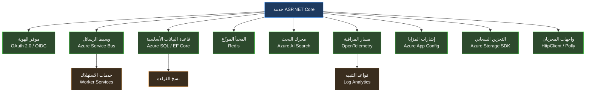

<div dir="rtl">

# القسم الأول — أزمة التعقيد في أنظمة البرمجيات الحديثة

## انهيار الخط الأساسي

ثمة نوع من البرمجيات كان بالإمكان استيعابه ذهنياً بالكامل. تطبيق Windows Forms متصل بقاعدة بيانات SQL Server، يعمل على خادم واحد، يستخدمه مئة موظف داخل شبكة مؤسسية مغلقة. كان بمقدور المطوّر استيعاب النظام بأكمله في ذهنه: المخطط يحتوي على خمسين جدولاً، المنطق التجاري يسكن في طبقة الخدمة، وواجهة المستخدم ليست سوى غلاف رفيع فوق تلك الطبقة. حين يتعطل شيء، كان نطاق الفشل محدوداً ومفهوماً. حين يتغير متطلب، كانت تداعيات التغيير قابلة للتنبؤ والقياس. حين ينضم مطوّر جديد للفريق، كانت أسبوعان من التعريف تُنتج فهماً عملياً وظيفياً بالنظام بأكمله.

ذلك النموذج الذهني — المطوّر بوصفه حاملاً لمعرفة شاملة بالنظام — كان الأساس الذي بُنيت عليه معظم ممارسات هندسة البرمجيات. الأنماط الكلاسيكية كانت استجابات للصعوبة المعرفية في إدارة علاقات الكائنات داخل برامج يمكن للمطوّر الواحد استيعابها كاملةً. السياقات المُحدَّدة - Bounded Contexts في Domain-Driven Design اختُرعت لتمكين المطوّر من الحفاظ على تماسك محلي في نظام أكبر من أن يُنمذَج عالمياً. وقواعد الاعتماديات في Clean Architecture موجودة لتجعل الاستدلال على طبقة واحدة ممكناً دون الحاجة للإمساك بالمكدس بالكامل في الذاكرة العاملة في آن واحد.

هذا النموذج انهار. ليس تدريجياً، وليس كاتجاه مجرد، بل كواقع تشغيلي ملموس يؤثر على العمل اليومي لكل مهندس يبني أنظمة إنتاجية اليوم. الأنظمة الموزعة الحديثة تجاوزت عتبة من التعقيد تجعل النموذج الذهني الفردي للمطوّر، مهما بلغ من التفصيل والعمق، غير كافٍ هيكلياً. ما يلي هو تحليل هندسي لكيفية تجاوز هذه العتبة، ولما يعنيه ذلك على تصميم البرمجيات، ولماذا يخلق هذا بالضبط الشروط التي تجعل التطوير بمساعدة الذكاء الاصطناعي ضرورة معمارية لا مجرد ميزة إضافية.

## أبعاد التعقيد الحديث

لفهم حجم هذا التحوّل، لا بد من الدقة في تعريف "التعقيد". الكلمة تُستخدم عادةً مرادفةً لـ "الكبير" أو "الصعب"، لكن التعقيد في أنظمة البرمجيات يمتلك أبعاداً متمايزة وقابلة للقياس، وكل بُعد يتصرف بطريقة مختلفة ويتفاعل مع الأبعاد الأخرى بأساليب تُضاعف تأثيره التراكمي.

**مساحة سطح التكامل - Integration Surface Area.** التطبيق المؤسسي الحديث بـ .NET لا يعمل في عزلة. يتكامل مع موفري الهوية عبر بروتوكولات OAuth 2.0 و OIDC، ووسطاء الرسائل كـ Azure Service Bus، وقواعد البيانات الأساسية عبر Entity Framework Core، والمخبأ الموزّع - Distributed Cache كـ Redis، ومحركات البحث كـ Azure AI Search، ومسارات بيانات المراقبة عبر OpenTelemetry، وأعلام الميزات البرمجية - Feature Flags، وأنظمة التخزين السحابي، فضلاً عن عشرات الواجهات البرمجية الخارجية. كل تكامل يُدخل اعتمادية لها عقد إصدار خاص بها، وأنماط فشل محددة، وخصائص كمون - Latency، وحدود معدل استخدام - Rate Limits، وآليات استيثاق مستقلة.

حين أطلقت Microsoft الإصدار الأول من ASP.NET Core، كان مشروع ويب قياسي يستدعي نحو ثمانين حزمة NuGet. اليوم، الخدمة المؤسسية الإنتاجية تستدعي بانتظام ما بين أربعمئة وستمئة حزمة، كل منها عقدة في مخطط موجّه لاتجاهي - DAG للاعتماديات قد يحتوي على تعارضات عبر حدود الإصدارات الرئيسية. أمر بسيط كـ `dotnet add package` ليس إضافة شيء واحد فحسب — إنه تعديل في مسألة حل اعتماديات معقدة قد لا يوجد لها حل مثالي في ضوء المتطلبات المتعارضة للاعتماديات المتعدية.

**التعقيد الزمني - Temporal Complexity.** الأنظمة الموزعة لا تنفّذ بالترتيب التسلسلي الحتمي الطبيعي في برنامج أحادي العملية. الأحداث تصل خارج الترتيب. العمليات تكتمل بشكل غير متزامن. الحالة مُنسوخة عبر عقد قد تختلف حول القيم الحالية أثناء انقطاعات الشبكة. طلب يستغرق مئتي ميلي ثانية في بيئة التطوير قد يستغرق ألفي ميلي ثانية في الإنتاج بسبب النشرات الباردة - Cold Starts، أو توقفات جامع النفايات - Garbage Collection Pauses، أو ضوضاء الجيران في البيئة السحابية المشتركة. نموذج async/await في C# جعل البرمجة غير المتزامنة أكثر قابلية للوصول، لكنه لم يُقلل من التعقيد المفاهيمي لإدارة الحالة المتزامنة — بل خفّض الحاجز أمام إدخال ذلك التعقيد في قواعد كود غير مُجهَّزة معمارياً له. نتيجة ذلك أن كثيراً من الأنظمة تحمل الآن ديناميكيات تزامن غير متوقعة خُبِّئت خلف واجهة برمجية تبدو بسيطة.

**التعقيد التشغيلي - Operational Complexity.** الأنظمة التي يبنيها المطوّرون اليوم يجب فهمها ليس فقط في وقت التطوير بل طوال دورة حياتها التشغيلية الكاملة. نشرات Kubernetes، ومخططات Helm، وإعدادات Terraform، وقوالب Azure Resource Manager — هذه ليست تفاصيل نشر يمكن تركها لفريق البنية التحتية. إنها جزء من مواصفة النظام، والسوء في فهم تفاعلها مع كود التطبيق يُنتج أعطالاً إنتاجية لا يمكن تشخيصها من سجلات التطبيق وحدها. المطوّر الذي لا يفهم كيف تؤثر سياسات إعادة تشغيل الحاوية على حالة الاتصالات المفتوحة، أو كيف تتفاعل حدود الموارد مع أنماط الذاكرة في وقت التشغيل - Runtime، يكتب كوداً يعمل في الاختبار ويفشل في الإنتاج بطرق لا يمكن استنتاجها من الكود نفسه.

**التعقيد التنظيمي - Organizational Complexity.** أنظمة البرمجيات اليوم تبنيها فِرق، غالباً موزعة عبر مناطق زمنية وحدود تنظيمية. قاعدة الكود هي قطعة مشتركة تتراكم فيها قرارات عشرات أو مئات المساهمين على مدى سنوات. وعمليات مراجعة الكود، واستراتيجيات التفرّع، واتفاقيات الإصدار الدلالي - Semantic Versioning، وسجلات قرارات المعمارية - Architecture Decision Records ليست عبئاً بيروقراطياً — إنها الآليات التي يحافظ بها الفريق الموزع على فهم مشترك متماسك لنظام لا يستطيع أي فرد استيعابه بالكامل.



هذا المخطط يمثّل تقديراً محافظاً لمساحة سطح التكامل لخدمة .NET متوسطة الحجم. كل سهم ليس سطر كود — إنه عقد مع نظام بعيد يمتلك إصداراته الخاصة، وأنماط فشله الخاصة، ومتطلباته التشغيلية المستقلة، وحالاته الحدّية السلوكية التي تنكشف فقط تحت ظروف تحميل إنتاجية حقيقية. المطوّر الذي يحتفظ بهذه الخدمة يجب أن يفهم ليس كوده فحسب، بل الخصائص السلوكية لكل اعتمادية بما يكفي للتصميم المسبق لأجل فشلها المحتمل.

## القصور الهندسي للنموذج الذهني الفردي

تطوّرت ممارسة هندسة البرمجيات تقريباً بالكامل حول قدرات وقيود العقل البشري الواحد. هذه حقيقة مؤسِّسة تستحق الوقوف عندها بدلاً من تجاوزها. الأنماط الكلاسيكية كانت استجابات للصعوبة المعرفية الناشئة عن إدارة علاقات الكائنات داخل برامج يمكن للمطوّر الواحد فهمها كاملةً في رأسه في أي لحظة. وهذه تقنيات هندسية ممتازة ما زالت صالحة ومهمة. لكنها صُمِّمت للتعويض عن قصور معرفي محدد يعمل عند مستوى محدد من تعقيد النظام. حين يزداد مستوى التعقيد بمقدار رتبة كاملة، يتطلب التعويض عن القصور ذاته مناهج مختلفة نوعياً — ليس تقنيات فردية أفضل، بل استراتيجيات تنظيمية مختلفة لكيفية هيكلة المعرفة الهندسية ومشاركتها والتحقق منها عبر الزمن.

تأمّل السيناريو التالي، الذي ليس افتراضياً بل تمثيلياً لظروف موجودة في أنظمة إنتاجية حول العالم. فريق هندسي يصون خدمة .NET تعالج المعاملات المالية. الخدمة في الإنتاج منذ أربع سنوات. كان لها أحد عشر مساهماً رئيسياً وعشرات المساهمين العرضيين. تتكامل مع سبعة أنظمة خارجية، ثلاثة منها غيّرت عقود واجهتها البرمجية خلال عمر الخدمة وتطلبت هجرة مكلفة. قاعدة الكود تحتوي على مئة وثمانين ألف سطر عبر تسعمئة ملف. لديها ثلاثة آلاف ومئتا اختبار وحدة وأربعمئة وأربعون اختبار تكامل. تغطية الاختبار 78%.

حين يصل متطلب جديد — الخدمة يجب أن تدعم طريقة دفع جديدة مع التزامات تقارير تنظيمية — من أين يأتي فهم السلوك الحالي للنظام؟ ليس من معرفة أي مطوّر واحد، لأنه لا يوجد مطوّر واحد حافظ على مشاركة مستمرة طوال تاريخ الخدمة الممتد لأربع سنوات. وليس من الاختبارات، لأن الاختبارات تتحقق من السلوك المحدد وقت كتابتها، لا من السلوك الناشئ عن أربع سنوات من التغيير التراكمي. وليس من التوثيق، لأن التوثيق يتدهور أسرع من الكود في البيئات التي تُعدّ فيها سرعة الإنجاز الهندسي الهدف الأساسي للتقييم.

الفهم يأتي، في الممارسة الفعلية، عبر التنقيب الأثري: قراءة الكود، وتتبع مسارات التنفيذ عبر النظام، وتشغيل استفسارات على قواعد البيانات الإنتاجية لفهم التوزيعات الفعلية للبيانات، وفحص بيانات المراقبة لفهم الأنماط السلوكية الواقعية التي تختلف أحياناً جوهرياً عما توقعه المصمّمون الأصليون. هذا التنقيب يستغرق وقتاً يتناسب مع تعقيد النظام المُستكشَف، والعلاقة ليست خطية — إنها فوق خطية - Superlinear. مضاعفة تعقيد النظام أكثر من مضاعفة الوقت اللازم للوصول إلى فهم واثق لكيفية تصرّف أي تغيير في الإنتاج.

## نقطة الفشل البنيوي

نمط الفشل الناشئ عن هذه الحالة ليس دراماتيكياً ولا مفاجئاً. الأنظمة لا تنهار فجأة لأن مطوّراً افتقر للمعرفة الكاملة. الفشل تراكمي وخبيث: إنه التكلفة المتراكمة على مدى أشهر وسنوات لقرارات اتُّخذت بمعلومات ناقصة. قرارات كل واحدة منها تبدو معقولة في سياقها المباشر، لكن مجموعها يُضعف بنية النظام بشكل لا يُكتشف عادةً إلا حين يُطلب من النظام التطور في اتجاه غير متوقع أو العمل تحت ضغط لم يُصمَّم له.

مطوّر يُضيف طبقة تخزين مؤقت - Caching لاستعلام بطيء دون فهم كامل لأنماط الكتابة التي تُبطل ذلك التخزين في الإنتاج. السلوك صحيح في الاختبار حيث تحميل الكتابة اصطناعي ومسيطر عليه، وخاطئ في الإنتاج تحت ذروة التحميل الحقيقي. مطوّر آخر يُعيد هيكلة مكوّن مشترك للوصول للبيانات دون إدراك أن خصائص أدائه تحت الوصول المتزامن - Concurrent Access كانت مقصودة لا عرضية، وأنها كانت نتيجة قرار هندسي واعٍ اتُّخذ قبل عامين وغير موثق في أي مكان سوى ذاكرة من تقاعد من المشروع. الإصدار المُعاد هيكلته أنظف وأداؤه متطابق في اختبارات الوحدة؛ يُصاب بالجمود - Deadlock تحت أنماط التحميل المتزامن للإنتاج.

```csharp id="code-01-01"
// Target Framework: .NET 8.0
// Chapter: 01 | Section: 01
// book/chapters/chapter-01/sections/section-01.ar.md
// هذا الكود صحيح في عزلته. كل قرار فردي مبرر ومدافع عنه.
// المشكلة ليست في الكود — بل في الفجوة بين ما يفترضه
// الكود حول بيئته التشغيلية وما تُقدّمه تلك البيئة فعلاً.

public sealed class PaymentProcessor
{
    private readonly IPaymentGateway _gateway;
    private readonly IPaymentRepository _repository;
    private readonly IDistributedCache _cache;
    private readonly ILogger<PaymentProcessor> _logger;

    public PaymentProcessor(
        IPaymentGateway gateway,
        IPaymentRepository repository,
        IDistributedCache cache,
        ILogger<PaymentProcessor> logger)
    {
        _gateway = gateway;
        _repository = repository;
        _cache = cache;
        _logger = logger;
    }

    public async Task<PaymentResult> ProcessAsync(
        PaymentRequest request,
        CancellationToken cancellationToken = default)
    {
        // افتراض 1: فحص مفتاح تكرار التنفيذ الآمن - Idempotency Key سريع.
        // الواقع: _cache هو نسخة Redis بعيدة. النشرات الباردة - Cold Starts
        // تضيف 50-200ms. المستدعون الأعلى لديهم مهلة 100ms.
        // يعمل بشكل مثالي حتى يفشل فجأة تحت ضغط الإنتاج.
        var cachedResult = await _cache.GetStringAsync(
            request.IdempotencyKey, cancellationToken);

        if (cachedResult is not null)
            return JsonSerializer.Deserialize<PaymentResult>(cachedResult)!;

        // افتراض 2: استدعاء البوابة محدود زمنياً بشكل ضمني.
        // الواقع: لا توجد مهلة HttpClient مُعرَّفة صراحةً. البوابة تتوقف
        // أحياناً لأكثر من 30 ثانية خلال حوادث المنبع - Upstream Incidents.
        // يلي ذلك استنزاف Thread Pool وتوقف الخدمة بالكامل.
        var gatewayResponse = await _gateway.ChargeAsync(
            request.Amount,
            request.PaymentMethod,
            cancellationToken);

        var payment = Payment.Create(request, gatewayResponse);

        // افتراض 3: الكتابة للقاعدة والذاكرة المؤقتة ذرية بما يكفي.
        // الواقع: إذا أُعيد تشغيل العملية - Process Restart بين هذين
        // السطرين، يُحفظ الدفع في القاعدة دون تخزينه مؤقتاً. فحص
        // تكرار التنفيذ الآمن عند إعادة المحاولة يفشل في اكتشاف العملية الموجودة.
        // النتيجة: البوابة تُحاسب العميل مرتين على نفس العملية.
        await _repository.SaveAsync(payment, cancellationToken);
        await _cache.SetStringAsync(
            request.IdempotencyKey,
            JsonSerializer.Serialize(PaymentResult.From(payment)),
            new DistributedCacheEntryOptions
            {
                AbsoluteExpirationRelativeToNow = TimeSpan.FromHours(24)
            },
            cancellationToken);

        _logger.LogInformation(
            "Payment {PaymentId} processed successfully", payment.Id);

        return PaymentResult.From(payment);
    }
}
```

هذا الكود ليس عمل مطوّر غير كفء. كل قرار فردي صحيح تقنياً ومبرر في سياقه المباشر. حقن التبعيات - Dependency Injection يتبع الأنماط الصحيحة. التسجيل - Logging منظّم ومفيد. استخدام async/await نظيف ومتسق. المشكلة ليست في الكود — بل في الفجوة بين ما يفترضه الكود حول بيئته التشغيلية وما تُقدّمه تلك البيئة فعلاً في الإنتاج. تلك الفجوة غير مرئية للمطوّر الذي كتب هذا الكود، لأن المعرفة المطلوبة لرؤيتها موزّعة عبر النظام وليست موضعية في أي ملف أو محصورة في فهم أي مطوّر بعينه.

هذه هي نقطة الفشل البنيوي: ليس أن المطوّرين الأفراد يكتبون كوداً رديئاً، بل أن تعقيد الأنظمة الحديثة يخلق ظروفاً يتخذ فيها المطوّرون الحذرون المتمرسون باستمرار قرارات بمعلومات غير كافية عن تداعياتها النظامية بعيدة المدى.

## القيد الذي يمنع الحلول البسيطة

الاستجابة الغريزية للتعقيد هي الإبطاء، والاستثمار في التوثيق، وإجراء مراجعات تصميم أكثر شمولاً، وزيادة تغطية الاختبار. هذه استجابات معقولة ومساعدة، لكنها لا تُحل القيد الكامن، الذي ليس عجزاً في العناية أو الجهد بل عدم تطابق جوهري بين مستوى النظام وعرض النطاق التراكمي للإدراك البشري الفردي.

توثيق شامل لخدمة بمئة وثمانين ألف سطر سيكون مشروعاً ضخماً في حد ذاته — والتوثيق يبدأ في التدهور اللحظة التي يُكتب فيها، لأن الكود يستمر في التغيير بينما التوثيق يتأخر دائماً عن مواكبته. مراجعات التصميم الشاملة تتطلب مُراجِعين يفهمون النظام الكامل بما يكفي لتقييم التداعيات النظامية للتغيير — لكن الفرضية الثابتة هي أن لا مُراجِع واحد يمتلك ذلك الفهم الشامل. زيادة تغطية الاختبار تتحقق من السلوك المحدد وقت كتابة الاختبارات، لا من السلوك الناشئ لنظام تطوّر على مدى أربع سنوات من الاستخدام الإنتاجي المتواصل.

القيد حقيقي وعميق: لم يتوسّع عرض النطاق المعرفي للمطوّر الفردي مع تعقيد الأنظمة التي يُطلب منه الآن بناؤها وصيانتها وتطويرها. أي منهج لهذه المشكلة يتطلب من المطوّر الفردي أن يعرف أكثر، أو يقرأ أكثر، أو يراجع بعناية أكبر، أو يوثّق بشكل أشمل، ليس معالجةً حقيقية للقيد — إنه طلب كميةٍ إضافية من موردٍ محدود يُستنفَد في معظمه بالفعل.

## الإدراك المتوزّع كبنية تحتية هندسية

الحل لهذا القيد لا يأتي من أن يصبح المطوّر الفردي أكثر قدرة. يأتي من إدراك أن المشكلة الهندسية تغيّرت في طبيعتها لا في درجتها فحسب، وأن معالجتها تتطلب بنية تحتية هندسية للإدراك الموزع - Distributed Cognition. هذا يعني آليات منهجية يُلتقط بها المعرفة الهندسية، وتُتاح للبحث والاسترجاع، وتُوفَّر تلقائياً في نقاط القرار الحرجة خلال عملية التطوير بدلاً من الانتظار حتى يصطدم المطوّر بالمشكلة في الإنتاج.

هذا المنظور يُعيد تشكيل فهمنا لدور المواصفات، وسجلات قرارات المعمارية - Architecture Decision Records، ومجموعات الاختبار، وبيانات المراقبة، وفي نهاية المطاف أدوات التطوير بمساعدة الذكاء الاصطناعي. كل منها ليس مجرد ممارسة تطوير — إنه بنية تحتية لتمديد المدى الإدراكي الفعّال للمهندس إلى ما وراء ما تستطيع الذاكرة الفردية والانتباه المحدود استيعابه في لحظة اتخاذ القرار.

سجل قرارات المعمارية المُهيكَل جيداً لا يوثّق قراراً ماضياً فحسب. إنه يُخرج سياق التفكير الذي كان يسكن في عقل المهندس الذي اتخذ القرار، مُتيحاً ذلك التفكير للمهندسين المستقبليين الذين يواجهون قرارات ذات صلة في سياق مختلف. ومجموعة اختبارات التكامل الشاملة لا تتحقق من السلوك الحالي فحسب — إنها تُرمّز المعرفة السلوكية حول كيفية تفاعل النظام مع اعتمادياته، معرفة كانت ستتطلب ساعات من التحقيق لإعادة بنائها من الصفر.

وبيئة التطوير بمساعدة الذكاء الاصطناعي، المُستخدَمة بشكل صحيح، لا تُولّد الكود بشكل أسرع فحسب. إنها تُوفر وصولاً فورياً إلى تمثيل مضغوط للمعرفة الهندسية المتراكمة — الأنماط، والسوابق، وأنماط الفشل، ومناهج التنفيذ المُجرَّبة — التي كانت ستتطلب سنوات من الخبرة المتراكمة أو ساعات من البحث المضني للوصول إليها في اللحظة الحاسمة.

## النموذج الهندسي الجديد: التطوير المتمحور حول المعمارية

ما يتغيّر جوهرياً، في مواجهة التعقيد النظامي الذي لا يمكن اختزاله، هو مركز ثقل المهمة الهندسية. النشاط الهندسي الأساسي يتحوّل من *كتابة كود يُنفّذ سلوكاً محدداً* إلى *تصميم أنظمة يمكن التنبؤ بسلوكها بثقة تحت الظروف التشغيلية الحقيقية والتحكم فيه عند الحاجة*. الفارق بين هاتين الصياغتين ليس لفظياً — إنه يصف مستوى مختلفاً تماماً من التحليل والمسؤولية الهندسية.

هذا ليس إلغاءً لمهارة التنفيذ — مهارة التنفيذ تبقى ضرورية وصعبة ومُقدَّرة. إنه إعادة ترتيب للأولويات لمعرفة أين تُطبَّق أعلى رافعة من حكم المهندس. المطوّر الذي يفهم حدود فشل النظام، والذي يُصمّم لمستوى التناسق المناسب في العمليات الموزعة، والذي يختار أنماط المرونة - Resilience Patterns المناسبة لأنماط فشل شركاء التكامل المحددين — قرارات التنفيذ لذلك المطوّر أفضل بشكل منهجي ومتكرر من قرارات مطوّر يركّز على التنفيذ دون ذلك السياق المعماري العميق.

تتناول الفصول التالية كيفية توسيع نطاق فعالية هذا النهج الذي يركز على بنية النظام باستخدام أدوات التطوير المدعومة بالذكاء الاصطناعي: ليس بإحلال الحكم المعماري الذي يمارسه المهندسون المتمرسون، بل بتوفير وصول فوري للمعرفة التي تُعلم ذلك الحكم وتُغذّيه. قبل أن تُستخدَم تلك الأدوات بفعالية، من الضروري بناء نموذج ذهني دقيق لما تفعله النماذج اللغوية فعلاً، وما لا تستطيع فعله مطلقاً — وهو موضوع القسم التالي.

</div>
