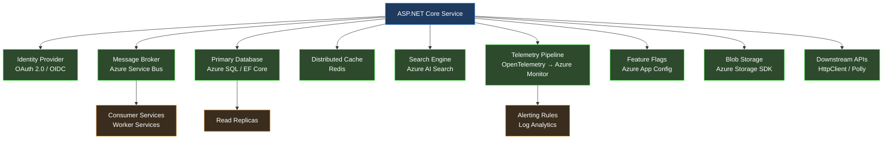

<!-- book/chapters/chapter-01/sections/section-01.en.md -->
---
chapter: 01
section: 01
title: "The Complexity Crisis in Modern Software Systems"
language: en
tags: [complexity, software-engineering, architecture, dotnet, systems-thinking]
status: in-progress
---

<!-- SECTION_METADATA
Chapter: 01
Section: 01
Language: en
Status: IN_PROGRESS
-->

# Section 01 — The Complexity Crisis in Modern Software Systems

## The Baseline Has Shifted

There is a particular kind of software that was straightforward to reason about. A Windows Forms application connected to a SQL Server database, deployed on a single server, used by a hundred employees inside a corporate network. A developer could hold the entire system in their head: the schema had fifty tables, the business logic lived in a service layer, the UI was a thin shell over that logic. When something broke, the failure surface was bounded. When a requirement changed, the blast radius was predictable. When a new developer joined the team, two weeks of orientation produced a functional understanding of the whole.

That mental model — developer as possessor of complete system knowledge — was the foundation on which most software engineering practice was built. The majority of design patterns, the structure of most software curricula, the implicit assumptions behind code review practices, the very concept of "senior developer" as someone who simply knows more — all of it rests on the premise that a sufficiently experienced engineer can maintain a coherent understanding of the system they are building.

That premise has collapsed. Not gradually, and not as an abstract trend, but as a concrete operational reality that affects the daily work of every engineer building production systems today. The question is not whether modern systems are more complex than their predecessors. They are, by every measurable dimension. The question is whether that complexity is merely quantitative — more tables, more services, more lines of code — or whether it represents a qualitative shift that demands fundamentally different engineering practice.

The answer, examined carefully, is unambiguous. Modern distributed systems have crossed a threshold of complexity beyond which the individual developer's cognitive model, however detailed, is structurally insufficient. What follows is an engineering analysis of why that threshold was crossed, what it means for how software must be designed, and why this creates the specific conditions that make AI-assisted development not a convenience, but an architectural necessity.

## The Dimensions of Modern Complexity

To understand the magnitude of the shift, it is necessary to be precise about what "complexity" means in this context. The term is commonly used as a synonym for "large" or "difficult," but complexity in software systems has distinct, measurable dimensions that behave differently from each other and interact in ways that compound their individual effects.

**Integration surface area.** A modern enterprise .NET application does not exist in isolation. It integrates with authentication providers, message brokers, third-party APIs, cloud storage, distributed caches, search engines, telemetry pipelines, feature flag services, and data warehouses. Each of these integrations introduces a dependency with its own versioning contract, failure modes, latency characteristics, and rate limits. When Microsoft released ASP.NET Core, a standard web application project pulled in approximately 80 NuGet packages. A production-grade enterprise service today routinely references 400 to 600 packages, each representing a node in a directed acyclic dependency graph that can contain cycles across major version boundaries. A single `dotnet add package` command is never just adding one thing — it is modifying a complex dependency resolution problem that may have no optimal solution given conflicting transitive requirements.

**Temporal complexity.** Distributed systems do not execute in the sequential, deterministic order that is natural to reason about in a single-process program. Events arrive out of order. Operations complete asynchronously. State is replicated across nodes that may disagree about current values during network partitions. A request that takes 200 milliseconds in a development environment may take 2,000 milliseconds in production due to cold starts, garbage collection pauses, or noisy neighbors in a shared cloud environment. The async/await model in C# made asynchronous programming dramatically more accessible, but it did not reduce the conceptual complexity of concurrent state management — it lowered the barrier to introducing that complexity into codebases that were not architecturally prepared for it.

**Operational complexity.** The systems that developers build today must be understood not only at development time but throughout their operational lifetime. A service that performs correctly under unit test conditions may fail in production due to configuration drift, infrastructure changes, or the interaction of multiple individually correct behaviors. Kubernetes deployments, Helm charts, Terraform configurations, Azure Resource Manager templates — these are not deployment details that can be left to a platform team. They are part of the system's specification, and misunderstandings about how they interact with application code produce production failures that cannot be diagnosed from application logs alone.

**Organizational complexity.** Software systems today are built by teams, often distributed across time zones and organizational boundaries. The codebase is a shared artifact that accumulates the decisions of dozens or hundreds of contributors over years. Code review processes, branching strategies, semantic versioning conventions, and architectural decision records are not bureaucratic overhead — they are the mechanisms by which a distributed team maintains coherent shared understanding of a system that no individual can hold in their head completely.



This diagram represents a conservative estimate of the integration surface for a mid-sized .NET service. Each arrow is not a line of code — it is a contract with a remote system that has its own versioning, failure modes, operational requirements, and behavioral edge cases. The developer maintaining this service must understand not only their own code, but the behavioral characteristics of every dependency well enough to design for its failure.

## The Engineering Limitation of the Individual Mental Model

Software engineering practice evolved, almost entirely, around the capabilities and limitations of a single human mind. The patterns documented in the Gang of Four were responses to the cognitive difficulty of managing object relationships in programs that a single developer could fully understand. Domain-Driven Design's bounded contexts were invented to make it possible for a developer to maintain local coherence in a system too large to model globally. Clean Architecture's dependency rules exist to make it possible to reason about one layer without holding the entire stack in working memory simultaneously.

These are excellent engineering techniques. They remain valid and important. But they were designed to compensate for a specific cognitive limitation operating at a specific scale of system complexity. When the scale of complexity increases by an order of magnitude, compensating for the same limitation requires qualitatively different approaches — not better individual techniques, but different organizational strategies for how engineering knowledge is structured, shared, and verified.

Consider the following scenario, which is not hypothetical but representative of conditions that exist in production systems across the industry. An engineering team maintains a .NET service that processes financial transactions. The service has been in production for four years. It has had eleven primary contributors and dozens of occasional contributors. It integrates with seven external systems, three of which have changed their API contracts during the service's lifetime and required migration. The codebase contains 180,000 lines of code across 900 files. It has 3,200 unit tests and 240 integration tests. The test coverage is 78%.

When a new requirement arrives — the service must support a new payment method with regulatory reporting obligations — where does understanding of the system's current behavior come from? Not from any single developer's knowledge, because no single developer has maintained continuous involvement throughout the service's four-year history. Not from the tests, because tests verify specified behavior, not behavior that emerged from four years of incremental change. Not from the documentation, because documentation decays faster than code in environments where engineering velocity is the primary optimization target.

Understanding comes, in practice, from archaeology: reading code, tracing execution paths through the system, running queries against production databases to understand actual data distributions, examining telemetry to understand real-world behavioral patterns. This archaeology takes time proportional to the complexity of the system being explored, and the relationship is not linear — it is superlinear. Doubling the system's complexity more than doubles the time required to achieve confident understanding of how a change will behave in production.

## The Structural Failure Point

The failure mode that emerges from this condition is not dramatic. Systems do not collapse suddenly because a developer lacked complete knowledge. The failure is incremental and insidious: the accumulating cost of decisions made with incomplete information.

A developer adds a caching layer to a slow query without fully understanding the write patterns that invalidate that cache. The behavior is correct in testing, where write loads are synthetic, and incorrect in production at peak load. A developer refactors a shared data access component without recognizing that its performance characteristics under concurrent access were intentional, not accidental. The refactored version is cleaner and performs identically in unit tests; it deadlocks under the concurrent load patterns of production.

```csharp id="code-01-01"
// This code is correct in isolation. Every individual decision is defensible.
// The problem is what it assumes about the systems it integrates with.

public sealed class PaymentProcessor
{
    private readonly IPaymentGateway _gateway;
    private readonly IPaymentRepository _repository;
    private readonly IDistributedCache _cache;
    private readonly ILogger<PaymentProcessor> _logger;

    public PaymentProcessor(
        IPaymentGateway gateway,
        IPaymentRepository repository,
        IDistributedCache cache,
        ILogger<PaymentProcessor> logger)
    {
        _gateway = gateway;
        _repository = repository;
        _cache = cache;
        _logger = logger;
    }

    public async Task<PaymentResult> ProcessAsync(
        PaymentRequest request,
        CancellationToken cancellationToken = default)
    {
        // Assumption 1: The idempotency key check is fast.
        // Reality: _cache is a remote Redis instance. Cold starts can add 50-200ms.
        // Upstream callers have a 100ms timeout. This works until it doesn't.
        var cachedResult = await _cache.GetStringAsync(
            request.IdempotencyKey, cancellationToken);

        if (cachedResult is not null)
            return JsonSerializer.Deserialize<PaymentResult>(cachedResult)!;

        // Assumption 2: The gateway call is bounded.
        // Reality: No HttpClient timeout is configured. The gateway occasionally
        // hangs for 30+ seconds during upstream incidents. Thread pool exhaustion follows.
        var gatewayResponse = await _gateway.ChargeAsync(
            request.Amount,
            request.PaymentMethod,
            cancellationToken);

        var payment = Payment.Create(request, gatewayResponse);

        // Assumption 3: The database write and cache write are atomic enough.
        // Reality: If the process restarts between these two lines, the payment
        // is persisted but not cached. The idempotency check on retry misses.
        // The gateway charges the customer twice.
        await _repository.SaveAsync(payment, cancellationToken);
        await _cache.SetStringAsync(
            request.IdempotencyKey,
            JsonSerializer.Serialize(PaymentResult.From(payment)),
            new DistributedCacheEntryOptions
            {
                AbsoluteExpirationRelativeToNow = TimeSpan.FromHours(24)
            },
            cancellationToken);

        _logger.LogInformation(
            "Payment {PaymentId} processed successfully", payment.Id);

        return PaymentResult.From(payment);
    }
}
```

This code is not the work of an incompetent developer. Every individual decision is technically correct and defensible in isolation. The dependency injection follows the right patterns. The logging is structured. The async/await usage is clean. The problem is not in the code — it is in the gap between what the code assumes about its operational environment and what that environment actually provides. That gap is invisible to the developer who wrote this code, because the knowledge required to see it is distributed across the system rather than localized in any file or any developer's understanding.

This is the structural failure point: not that individual developers write bad code, but that the complexity of modern systems creates conditions in which even careful, experienced developers routinely make decisions with insufficient information about their systemic consequences.

## The Constraint That Prevents Simple Solutions

The instinctive response to complexity is to slow down, invest in documentation, conduct more thorough design reviews, and increase test coverage. These are sensible responses, and they help. But they do not resolve the underlying constraint, which is not a deficit of care or effort but a fundamental mismatch between the scale of the system and the bandwidth of human cognition.

Comprehensive documentation of a 180,000-line service would itself be a massive undertaking — and documentation begins decaying the moment it is written, because the code continues changing while the documentation does not. Thorough design reviews require reviewers who understand the full system well enough to evaluate a change's systemic consequences — but the premise we established is that no single reviewer possesses that understanding. Increased test coverage verifies specified behavior at the time the tests were written, not the emergent behavior of a system that has evolved over four years of production use.

The constraint is real: human cognitive bandwidth has not scaled with the complexity of the systems that humans are now required to build and maintain. Any approach to this problem that requires the individual developer to simply know more, read more, review more carefully, or document more thoroughly is not addressing the constraint — it is asking for a quantity of a resource that is finite and already largely consumed.

## The Insight: Distributed Cognition as Engineering Infrastructure

The resolution to this constraint does not come from any single developer becoming more capable. It comes from recognizing that the engineering problem has changed in kind, not just in degree, and that addressing it requires engineering infrastructure for distributed cognition — systematic mechanisms by which engineering knowledge is captured, made searchable, and made available at decision points throughout the development process.

This insight reshapes how we understand the role of specifications, of architectural decision records, of test suites, of telemetry, and ultimately of AI-assisted development tools. Each of these is not merely a development practice — it is infrastructure for extending the effective cognitive reach of the engineer beyond what individual memory and attention can sustain.

A well-structured Architecture Decision Record does not just document a past decision. It externalizes the reasoning context that would otherwise exist only in the mind of the engineer who made the decision, making that reasoning available to future engineers facing related decisions. A comprehensive integration test suite does not just verify current behavior. It encodes behavioral knowledge about how the system interacts with its dependencies — knowledge that would otherwise require hours of investigation to reconstruct.

And an AI-assisted development environment, used correctly, does not just generate code faster. It provides on-demand access to a compressed representation of engineering knowledge — patterns, precedents, failure modes, and implementation approaches — that would otherwise require years of experience or hours of research to access at the moment of decision.

## The New Engineering Model: Architecture-Centric Development

What changes, in the face of irreducible systemic complexity, is the center of gravity of the engineering task. The primary engineering activity shifts from *writing code that implements specified behavior* to *designing systems whose behavior under real operational conditions can be confidently predicted and controlled*.

This is not a deprecation of implementation skill — implementation skill remains essential and difficult. It is a reprioritization of where the highest-leverage engineering judgment is applied. The developer who understands the system's failure boundaries, who designs for the right level of consistency in distributed operations, who chooses appropriate resilience patterns for the specific failure modes of their integration partners — that developer's implementation decisions are systematically better than those of a developer who focuses on implementation without that architectural context.

The chapters that follow examine how AI-assisted development tools can extend the effective reach of this architecture-centric approach: not by replacing the architectural judgment that experienced engineers exercise, but by providing on-demand access to the knowledge that informs that judgment. Before those tools can be used effectively, however, it is necessary to understand both their capabilities and the specific ways in which they fail. That understanding begins with an honest examination of what language models actually do, and what they cannot do — which is the subject of the next section of this chapter.

---

*Section 01 examines the structural conditions that make modern software complexity qualitatively different from historical complexity. Section 02 examines the specific ways in which traditional development workflows — effective for systems at one level of complexity — break under the operational demands of modern distributed systems, and why that breakdown creates the conditions for AI-assisted engineering to provide genuine architectural value rather than superficial productivity gains.*
