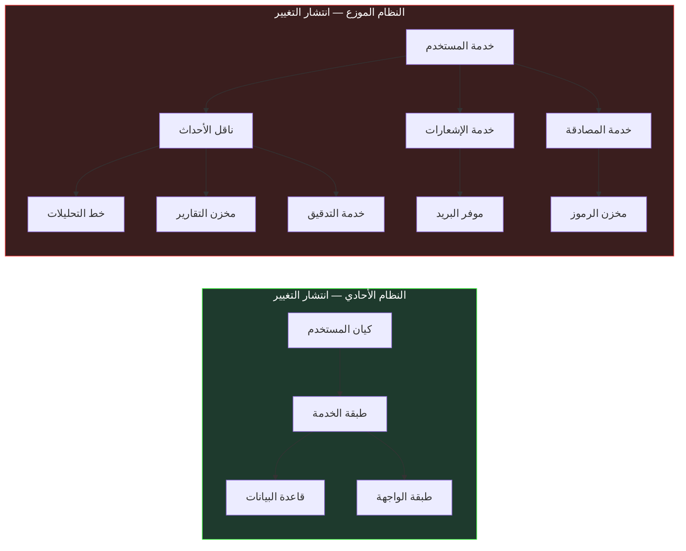
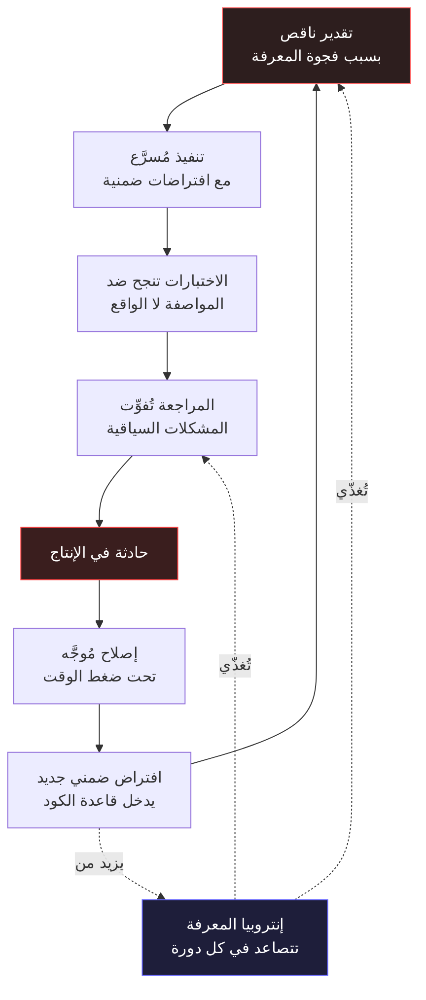

<div dir="rtl">

# القسم الثاني — انهيار سير العمل التقليدي في الأنظمة الواسعة

## افتراض سير العمل

كل منهجية في تطوير البرمجيات تقوم على افتراضات صريحة أو ضمنية حول طبيعة النظام المُنشأ وحجمه، وحول قدرة الفريق المعني على استيعاب ذلك النظام وإدارته. مراسم Agile تفترض أن العمل يمكن تفكيكه إلى أجزاء مستقلة يمكن التعبير عنها كـ User Stories، وأن تكلفة تكاملها تبقى قابلة للإدارة داخل حدود Sprint محدودة الزمن. التطوير المدفوع بالاختبار - Test-Driven Development يفترض أن سلوك الوحدة يمكن تحديده بالكامل قبل بدء التنفيذ، وأن الاختبارات الناتجة ستُقيّد سلوك تلك الوحدة بشكل ذي معنى في سياقات الإنتاج الحقيقية. ومراجعة الكود - Code Review تفترض أن المُراجِع يستطيع، في وقت معقول ومحدود، تطوير فهم كافٍ للتغيير المُقترح لتقييم تداعياته النظامية على المدى القريب والبعيد.

صمدت هذه الافتراضات إلى حد بعيد للنوع من الأنظمة الذي هيمن على تطوير البرمجيات لعقود متتالية. صُمِّمت في حقبة كانت فيها الخدمة الواحدة تستهلك حفنة محدودة من الاعتماديات، وتُنشر على بنية تحتية قابلة للتنبؤ ومفهومة، ويمكن الاستدلال على سلوكها تحت التحميل المتوقع من المبادئ الأولى دون الحاجة إلى بيانات إنتاجية فعلية.

الأنظمة الموزعة الحديثة المبنية بـ .NET أبطلت كل واحد من هذه الافتراضات بشكل منهجي وقابل للتوثيق. ليس بجعلها خاطئة في جميع الحالات وتحت جميع الظروف، بل بخلق ظروف محددة تنهار فيها بطرق قابلة للتنبؤ، وتتضافر مع بعضها بحيث يُعزّز فشل كل منها فشل الأخرى في الدورات اللاحقة. فهم أين تنهار هذه الافتراضات ولماذا ليس تمريناً أكاديمياً مجرداً — إنه الشرط المسبق الضروري لفهم ما تستطيع أدوات التطوير بمساعدة الذكاء الاصطناعي تقديمه فعلاً للفريق الهندسي، وأيُّ قدراتِها المُعلَنة عنها أصيلةٌ وأيُّها مجردُ مطابقةٍ للأنماط فوق كودٍ يبدو مألوفاً.

## كيف تنهار مراسم Agile تحت النطاق الموزع

حفلة تخطيط Sprint تفترض أن الفريق يستطيع تقدير تكلفة قصة المستخدم - User Story بدقة معقولة. دقة هذا التقدير تعتمد كلياً على فهم النظام الحالي بما يكفي لتحديد جميع الأماكن التي سيتوسع إليها التغيير وينتشر عبرها. في النظام الأحادي - Monolith ذي الحدود الواضحة والمفهومة جيداً، هذا ممكن التحقيق في معظم الأحوال — معظم التغييرات موضعية ومحدودة، والقليل الذي يعبر حدود الطبقات يفعل ذلك بطرق قابلة للتتبع والتنبؤ.

في النظام الموزع، مخطط انتشار التغيير - Change Propagation Graph هو شجرة متفرعة تمتد عبر حدود الخدمات المتعددة، وفهمها بشكل كافٍ يتطلب معرفة عميقة بالبروتوكولات والعقود والخصائص السلوكية لكل خدمة قد تتأثر بذلك التغيير ولو بصورة غير مباشرة. متطلب يبدو في ظاهره بسيطاً — "يجب أن يتمكن المستخدمون من تحديث عنوان بريدهم الإلكتروني" — ينتشر في الواقع عبر خدمة المصادقة - Authentication Service، ومخزن الهوية، وخدمة الإشعارات، وعقد ناقل الأحداث - Event Bus Contract، وخط أنابيب التحليلات اللاحقة - Downstream Analytics Pipeline، وربما نظام التقارير الذي يُلغي تطبيع بيانات المستخدمين لأغراض الأداء، وكذلك نظام التدقيق المسؤول عن تسجيل تغييرات البيانات الحساسة.

عضو الفريق الذي يُقدّر هذه القصة بثلاث نقاط لديه خبرة بالتنفيذ المحلي في خدمة المستخدم. عضو الفريق الذي يُقدّرها بثلاث عشرة نقطة لديه خبرة مباشرة بالتداعيات الموزعة لتغييرات تبدو بسيطة. كلا التقديرين ليس خاطئاً بالنظر إلى المعرفة المتاحة للمُقدِّر في لحظة التخطيط. التباين الكبير بينهما هو عملياً قياس موضوعي للفجوة بين المعرفة المتاحة وقت التخطيط والمعرفة الفعلية المطلوبة لتنفيذ التغيير بأمان وبدون حوادث جانبية غير متوقعة.



الجانب الأيسر من هذا المخطط يمثّل انتشار تغيير "تحديث البريد الإلكتروني" في نظام أحادي — ثلاث عقد، انتشار محدود وقابل للتنبؤ. الجانب الأيمن يمثّل التغيير ذاته في نظام موزع متوسط التعقيد — تسع عقد عبر ثماني خدمات مستقلة، كل منها لها دورة نشر خاصة بها وخصائص فشل مستقلة وعقد واجهات برمجية قد لا تكون متزامنة مع ما تفترضه خدمة المستخدم. حفلة التخطيط صُمِّمت في الأصل للجانب الأيسر وتحتاج للتطور لاستيعاب الجانب الأيمن.

التفاوت في المخطط هو الآلية التي يفشل بها التقدير، ويستحق أن نُقربه من الملموس. في الجانب الأيسر، مخطط الانتشار بأكمله مرئي في قاعدة كود واحدة؛ مطوّر كبير يستطيع تعداد المكونات المتأثرة من الذاكرة، والتقدير يعكس فهماً حقيقياً للعمل. في الجانب الأيمن، لا يرى أي فرد المخطط كاملاً. خدمة المصادقة مملوكة لفريق مختلف، وعقد ناقل الأحداث يحافظ عليه فريق المنصة، وخط التحليلات نشر منفصل تخضع تغييرات مخططه لدورة إصدار مختلفة. المُقدِّر لا يتجاهل هذه العقد عن وعي — إنها ببساطة خارج مجموعة الحقائق المتاحة وقت التخطيط. التقدير إذاً ليس تقديراً للعمل إطلاقاً؛ إنه تقدير للمجموعة الجزئية من العمل المرئية محلياً، مضافاً إليها مُضاعِف ضمني غير معلن لباقي العمل.

لهذا لا يحل النصح الشائع بـ«إشراك مهندسين كبار في التقدير» المشكلة. الأقدمية تتنبأ بالمعرفة المحلية: كيف تُهيكل خدمات الفريق نفسه، وما الاتفاقيات المتبعة، وأين توجد الفخاخ التاريخية. وهي لا تتنبأ بالمعرفة بمخطط انتشار يمتد عبر حدود ملكية مختلفة ويتغير باستمرار بينما تنشر الفرق الأخرى بشكل مستقل. حفلة التخطيط تعوّض ببناء وقت احتياطي، لكن الوقت الاحتياطي أداة غير حادة — فهو لا يميز بين تغيير تكلفة انتشاره منخفضة فعلاً وتغيير تكلفة انتشاره مجهولة. في الممارسة، تكتشف الفرق الفارق بعد فوات الأوان — في حادثة النشر أو في الالتزام الضائع.

هذه الفجوة لا تضيق مع اكتساب الفِرق خبرةً أكثر بمرور الوقت. إنها تتسع مع ازدياد تعقيد النظام بشكل مطّرد، لأن كل خدمة جديدة وكل تكامل جديد وكل مخزن بيانات مُلغى تطبيعه يُضيف عقدة جديدة إلى مخطط الانتشار الذي يجب فهمه للتقدير الدقيق والآمن. الفِرق تتعامل مع هذا الواقع عادةً بتقليص الطموح — تقسيم القصص إلى أجزاء أصغر، وقبول أن تكاملات معينة ستُكتشف خلال التنفيذ لا خلال التخطيط، وبناء "وقت احتياطي للتكامل" صريح في الخطة. هذه تكيّفات عملية لقيد حقيقي، لكنها تمثّل تدهوراً في قدرة عملية التخطيط على تقديم توقعات دقيقة يمكن الاعتماد عليها.

## كيف ينهار التطوير المدفوع بالاختبار عند حدود التكامل

التطوير المدفوع بالاختبار - Test-Driven Development في صياغته الكلاسيكية يتطلب من المطوّر كتابة اختبار فاشل قبل الشروع في كتابة التنفيذ. الاختبار يُحدد السلوك المتوقع بدقة، والتنفيذ يُقاد حصراً بمتطلب إنجاح ذلك الاختبار. هذا ينشئ انضباطاً هندسياً صارماً يُنتج كوداً جيد التحديد وقابلاً للاختبار بشكل فعّال.

الممارسة تعمل بامتياز لا جدال فيه للوحدات التي يمكن تحديدها بالكامل بمعزل عن محيطها التشغيلي: الدوال النقية - Pure Functions، ومنطق النطاق - Domain Logic، وقواعد التحقق، وخطوط أنابيب التحويل. وتتدهور بشكل مقبول حين تمتلك الوحدة المُختبَرة اعتماديات بسيطة يمكن استبدالها ببدائل اختبار - Test Doubles دون خسارة الدلالة الحقيقية. وتنهار بشكل حقيقي وجوهري حين السلوك المُراد تحديده هو خاصية ناشئة من تفاعل الوحدة مع اعتمادياتها الحقيقية في ظروف تشغيلية حقيقية لا يمكن محاكاتها بدقة في بيئة الاختبار.

تأمّل خدمة تعالج Webhook للدفع من موفر خارجي. صيغة Payload موثقة بشكل رسمي، لكن التوثيق يحذف عدة حالات حدّية تظهر فقط في ظروف معاملات محددة ونادرة. سلوك إعادة المحاولة - Retry Behavior مُعرَّف في الوثيقة، لكن الفاصل الزمني الفعلي لإعادة المحاولة لا يطابق دائماً ما يصفه التوثيق، ويتغيّر مع إعدادات الموفر الداخلية التي لا يملك العميل رؤية عليها. ضمانات الترتيب مُعلنة رسمياً لكنها غير محترمة بشكل منتظم خلال حوادث جانب الموفر أو خلال فترات الصيانة. لا يمكن تحديد أيٍّ من هذه الخصائص السلوكية الحرجة في اختبار وحدة يعمل ضد Mock لموفر الـ Webhook — لأن الـ Mock يعكس ما تقوله المواصفة، لا ما يفعله النظام الحقيقي في بيئة الإنتاج تحت ضغط حقيقي.

```csharp id="code-01-02"
// Target Framework: .NET 8.0
// Chapter: 01 | Section: 02
// book/chapters/chapter-01/sections/section-02.ar.md
// مجموعة الاختبار هذه تُغطي 100% من الفروع في معالج Webhook.
// كل تأكيد يجتاز. التنفيذ صحيح وفق المواصفة المتاحة.
// أعطال الإنتاج التي تلي ذلك غير مرئية من هنا بالكامل.

[TestClass]
public sealed class WebhookProcessorTests
{
    private readonly Mock<IWebhookRepository> _repository = new();
    private readonly Mock<IEventBus> _eventBus = new();
    private readonly WebhookProcessor _processor;

    public WebhookProcessorTests()
    {
        _processor = new WebhookProcessor(_repository.Object, _eventBus.Object);
    }

    [TestMethod]
    public async Task ProcessAsync_ValidPayload_PublishesPaymentEvent()
    {
        var payload = WebhookPayloadBuilder.ValidCharge();
        _repository.Setup(r => r.ExistsAsync(payload.EventId, It.IsAny<CancellationToken>()))
                   .ReturnsAsync(false);

        await _processor.ProcessAsync(payload, CancellationToken.None);

        _eventBus.Verify(b => b.PublishAsync(
            It.Is<PaymentReceivedEvent>(e => e.Amount == payload.Amount),
            It.IsAny<CancellationToken>()), Times.Once);
    }

    [TestMethod]
    public async Task ProcessAsync_DuplicateEventId_SkipsProcessing()
    {
        var payload = WebhookPayloadBuilder.ValidCharge();
        _repository.Setup(r => r.ExistsAsync(payload.EventId, It.IsAny<CancellationToken>()))
                   .ReturnsAsync(true);

        await _processor.ProcessAsync(payload, CancellationToken.None);

        _eventBus.Verify(b => b.PublishAsync(
            It.IsAny<PaymentReceivedEvent>(),
            It.IsAny<CancellationToken>()), Times.Never);
    }

    // أعطال الإنتاج غير المرئية في هذا الملف:
    //
    // 1. الموفر يُرسل نفس event_id لأنواع معاملات مختلفة في سيناريوهات
    //    الدفع الجزئي. منطق إلغاء التكرار يتجاهل أحداثاً مشروعة بمعرّفات مشتركة.
    //
    // 2. الموفر يُسلّم charge.succeeded قبل payment_intent.created أحياناً
    //    خلال فترات الحجم العالي. المعالج يفترض تسلسلاً معيناً لا يتحقق دائماً.
    //
    // 3. Webhook إعادة المحاولة يحمل modified_at مختلفاً بميلي ثوانٍ.
    //    فحص تكرار التنفيذ الآمن يُدرجها كأحداث جديدة مستقلة فيعالجها مرة أخرى.
}
```

أنماط الفشل الثلاثة الموثقة في هذا الكود هي أنماط حقيقية موثقة في أنظمة إنتاجية متعددة. لا يمثّل أيٌّ منها فشلاً في منهجية التطوير المدفوع بالاختبار كممارسة — الاختبارات صحيحة ودقيقة ضد المواصفة المتاحة. إنها تمثّل القصور الجوهري والحتمي للتحقق المبني على المواصفة حين يواجه أنظمة خارجية لا يلتقط أي توثيق متاح سلوكها الكامل في جميع الظروف التشغيلية الممكنة. هذا قصور بنيوي في المنهجية حين تُطبَّق خارج نطاقها المصمَّم له، لا خطأ في تطبيقها.

## كيف تنهار مراجعة الكود تحت التعقيد المتراكم

مراجعة الكود - Code Review تعمل على افتراض جوهري: أن المُراجِع يستطيع تطوير فهم كافٍ للتغيير المُقترح خلال جلسة مراجعة محدودة الزمن لتقييم ما إذا كان آمناً للدمج في قاعدة الكود الرئيسية. هذا يتطلب شقّين متمايزين من الفهم: فهم التغيير ذاته في عزلته — وهو أمر متاح ومباشر عادةً — وفهم السياق النظامي الكامل الذي سيُنفَّذ فيه ذلك التغيير — وهو كثيراً ما يكون غير متاح بالكامل لأي مُراجِع واحد في نظام موزع واسع ومتشعّب.

سؤال السياق النظامي له شقّان حرجان: أولاً، هل يفهم المُراجِع السلوك الحالي للمكونات التي يتفاعل معها التغيير بما يكفي للتنبؤ بكيفية تأثير ذلك التغيير على سلوكها في الإنتاج؟ ثانياً، هل يفهم المُراجِع المستهلكين اللاحقين للمكوّن المُغيَّر بما يكفي للتنبؤ بما إذا كان التغيير سيكون متوافقاً مع توقعاتهم الضمنية التي لم تُوثَّق بالضرورة في أي مكان؟

في الممارسة الفعلية، يُجاب على هذين السؤالين الحرجين بالتقريب والاستدلال: المُراجِع يتحقق مما إذا كان التغيير يتبع الاتفاقيات المُعتمدة في قاعدة الكود، وما إذا كانت الاختبارات المرافقة معقولة وكافية من الظاهر، وما إذا كان التنفيذ يشبه تغييرات مماثلة نجحت في الماضي في سياقات مشابهة، وما إذا كان مؤلف التغيير قد أخذ صراحةً بعين الاعتبار الحالات الحدّية التي يمكن للمُراجِع تحديدها من ذاكرته الشخصية. هذه عملية معقولة ومفيدة، وتكشف نطاقاً واسعاً من المشكلات القابلة للكشف. لكن فاعليتها الحقيقية تتناسب طردياً مع عمق معرفة المُراجِع بالمكونات المحددة المعنية — معرفة تتدهور حتماً بمرور الوقت مع تطور الأنظمة، ولا يمكن الحفاظ عليها بشكل متساوٍ عبر جميع مجالات نظام موزع كبير يضم عشرات الخدمات المستقلة.

الطبيعة الوكيلة للمراجعة تفسّر ظاهرة دقيقة ومهمة: مراجعات التغييرات في المجالات المطروقة جيداً صارمة بطريقة لا تكون عليها مراجعات المجالات غير المألوفة، ومع ذلك تبدو المراجعتان متطابقتين على السطح. كلتاهما تحتويان تعليقات جوهرية، وكلتاهما مرتبطتان باختبارات، وكلتاهما تجتازان. الفارق غير مرئي في أثر المراجعة ويعيش بالكامل في ذهن المُراجِع — في ما إذا كانت التعليقات تعكس فهماً حقيقياً للتداعيات النظامية للتغيير أم قراءة معقولة لبنية سطحية. المُراجِع الذي لم يلمس نظام المدفوعات منذ ثمانية عشر شهراً يستطيع مع ذلك تحديد انتهاك لاتفاقية تسمية، وملاحظة غياب فحصٍ للقيم الخالية - Null Check، والموافقة على تغييرٍ يكون تفاعُله مع سير عمل تسوية المدفوعات خطأً عميقاً. لا شيء في العملية يميز هذه الحالات حتى يصل التغيير إلى الإنتاج.

هذا هو المعنى المحدد الذي «تنهار» فيه مراجعة الكود تحت التعقيد: لا تتوقف عن العمل، ولا تُنتج مخرجات أسوأ بشكل مرئي. تُنتج مخرجات صارت جودتها دالةً لمتغير غير مرئي — إلمام المُراجِع بالمجال المتأثر — لا تقيسه العملية ولا تتحكم فيه. الفشل هادئ لأن كل مراجعة فردية تبقى قابلة للدفاع عنها. الثمن يُدفع تراكمياً، حين ينحرف توزيع معرفة المُراجِعين عن توزيع مخاطر الإنتاج.

النتيجة نمط منهجي مُستمر وموثق جيداً في الأدبيات الهندسية: التغييرات في المجالات التي يعرفها الفريق جيداً تخضع لمراجعة دقيقة وعميقة تكشف المشكلات الحقيقية؛ التغييرات في المجالات التي تكون فيها المعرفة الجماعية ضحلة تخضع لمراجعة صحيحة شكلاً لكن فعلياً سطحية لا تتجاوز التحقق من الاتفاقيات الظاهرية. الفريق عادةً لا يعلم أي المجالات تقع في أي فئة في أي مراجعة بعينها وفي أي لحظة، لأن عمق المعرفة ليس خاصية مرئية أو قابلة للقياس في قاعدة الكود نفسها. هذا التوزيع المجهول لعمق المعرفة هو ما يقود نسبة كبيرة من حوادث الإنتاج التي تقع مباشرة في الساعات والأيام الأولى التالية لنشر كود جديد.

## نمط التراكم وتداعياته الهندسية طويلة المدى

الانهيارات الثلاثة في سير العمل — دقة التقدير، واكتمال المواصفة، وعمق المراجعة — لا تفشل بشكل مستقل ومنفصل عن بعضها. إنها تتضافر من خلال آلية يمكن وصفها بدقة وموضوعية: كل فشل يزيد من إنتروبيا - Entropy قاعدة الكود بطرق محددة تجعل الإخفاقات الأخرى أعمق وأشد في الدورات التالية من التطوير.



التقدير الناقص يؤدي إلى تنفيذ غير مكتمل يحمل افتراضات ضمنية لم تُختبر، مما يؤدي إلى عيوب تكامل تمر بصمت عبر الاختبارات المبنية على المواصفة، مما يؤدي إلى حوادث إنتاج تُكشف في أسوأ الأوقات. التحقيق في ما بعد الحادثة يكشف فجوات معرفية تُعالج بإصلاحات مُوجَّهة — لكن الإصلاحات المُوجَّهة المُطبَّقة تحت ضغط الوقت والمسؤولية على نظام لم يُفهم بالكامل، كثيراً ما تُدخل افتراضات ضمنية جديدة ستنتهكها تغييرات مستقبلية يكتبها مطوّرون لا يعلمون بوجودها. بمرور الوقت، تتراكم في قاعدة الكود طبقة متزايدة من القرارات الأثرية غير الموثقة: كود يُنفّذ سلوكيات لأسباب لم تعد مرئية لأحد، وقيود أُضيفت استجابةً لحوادث إنتاج نُسي سياقها الكامل، وتحسينات أداء تمنع إعادة هيكلة معينة دون أي تفسير موثق يُخبر المطوّر المستقبلي لماذا لا يجوز لمسها.

هذا النمط التراكمي ليس فشلاً في العملية ولا دليلاً على قصور في فريق بعينه. إنه النتيجة المتوقعة والحتمية لتطبيق عمليات صُمِّمت لأنظمة محدودة ومفهومة جيداً على أنظمة نمت بمرور الوقت إلى ما وراء الحدود التي صُمِّمت تلك العمليات لإدارتها. التشخيص الصحيح يُفضي إلى نوع مختلف من الحلول.

للدورة في المخطط خاصية تميزها عن حلقة التغذية الراجعة العادية: إنها غير متماثلة في الزمن. كل دورة كاملة تستغرق أطول من سابقتها، لأن كل دورة تترك وراءها سياقاً أثرياً أكثر — افتراضات ضمنية أكثر، وقيوداً غير موثقة أكثر، وقرارات نُسي منطقها. الإصلاح الموجَّه في أسفل الدورة يبدو وكأنه يغلق الحلقة بسرعة، لكنه لا يزيل فجوة المعرفة التي سببت الحادث؛ إنه يُرقّع عرض الحادث، وكما يظهر في المخطط، كثيراً ما يُدخل افتراضاً ضمنياً جديداً في هذه العملية. الدورة إذاً لا تعود إلى حالتها الابتدائية بعد كل ثورة. تعود إلى حالة إنتروبيا أعلى قليلاً، والدورة التالية تستغرق أطول قليلاً. هذه هي الآلية التي يتكرر بها الحادث ذاته، أو نسخة قريبة منه، في أنظمة تبدو محكمة الإدارة: العملية تمنع تكرار الحادث بعينه بينما تسمح لسببه البنيوي بالنمو.

للتضاعف نتيجة عملية تحدد أين ينبغي للفريق أن يتدخل. التدخل في أعلى الدورة — تحسين التقدير بتحسين إتاحة المعرفة — هو التدخل الوحيد الذي يكسر الحلقة، لأنه يعالج العجز الذي يغذي جميع المراحل اللاحقة. التدخل في المراحل الأدنى — تحسين المراجعة، وإضافة الاختبارات، وشدّ ضوابط النشر — يخفف الأعراض لكنه يترك فجوة المعرفة كما هي، فتستمر الدورة بحوادث مختلفة قليلاً. لهذا تشير تحسينات سير العمل الموصوفة في الأقسام التالية باستمرار في اتجاه واحد: ليس نحو مزيد من العملية، بل نحو بنية تحتية تجعل معرفة النظام متاحة في اللحظة التي يُتخذ فيها القرار.

## ما يعنيه هذا للممارسة الهندسية اليومية

الخلاصة من هذا التحليل ليست أن سير العمل التقليدي يجب التخلي عنه أو استبداله بالكامل. تخطيط Sprint، والتطوير المدفوع بالاختبار، ومراجعة الكود تبقى ممارسات قيّمة تُحسّن جودة البرمجيات بشكل ملموس وموثق. الخلاصة أكثر تحديداً ودقةً: لهذه الممارسات نمط فشل مميز ومنهجي عند نطاق واسع، ويُعرَّف هذا النمط بعجز معرفي من نوع محدد — عدم القدرة على الحفاظ على فهم دقيق وشامل للأنظمة الموزعة الكبيرة أثناء تطورها المستمر عبر الزمن وعبر الفِرق المتعاقبة.

هذا العجز المعرفي لا يمكن معالجته جوهرياً بعمل أشد، أو بأدوات أفضل ضمن سير العمل الحالي دون تغيير افتراضاته، أو بمهندسين أكثر خبرة يعملون بنفس الأدوات والعمليات. يمكن معالجته بتغيير كيفية التقاط المعرفة الهندسية والحفاظ عليها وإتاحتها تلقائياً في نقاط القرار الحرجة عبر دورة حياة التطوير بأكملها.

التحوّل المطلوب هو من سير عمل مصمّم حول المعرفة الفردية المركّزة في أذهان الأفراد إلى سير عمل مصمّم حول بنية تحتية للمعرفة الموزعة تعمل كدعم مؤسسي دائم. مواصفات هندسية تلتقط النية المعمارية العميقة، لا مجرد عقود الواجهات السطحية. مجموعات اختبار تتحقق من سلوك التكامل الفعلي مع الاعتماديات الحقيقية، لا فقط سلوك الوحدة المعزولة ضد Mocks. ممارسات مراجعة مُعزَّزة بأدوات تجعل السياق النظامي الكامل للتغيير مرئياً وقابلاً للتقييم بدلاً من الاعتماد على ذاكرة المُراجِع المحدودة والمتغيّرة. وبيئات تطوير قادرة على إتاحة المعرفة ذات الصلة — الأنماط والسوابق وأنماط الفشل والقرارات السابقة — في اللحظة الحاسمة التي يتخذ فيها المطوّر قراراً، بدلاً من مطالبته بأن يعرف مسبقاً وبدقة ما الذي يجب البحث عنه.

بشكل خاص، الاقترانات العرضية - Incidental Coupling التي تنشأ عبر مخازن البيانات المشتركة تُضيف طبقة أخرى من التعقيد لا تظهر في رسوم انتشار التغيير الرسمية. خدمة قد تُعدّل جدول قاعدة بيانات بشكل يبدو محلياً، لكن الجدول نفسه يُستخدم كمصدر لاستعلام عرض - `query view` في خدمة أخرى أنشأها مهندس سابق لتبسيط استعلام معين. هذا الارتباط غير الموثق لا ينكشف إلا حين تتوقف الخدمة المستهلكة فجأة بعد نشر كان يبدو آمناً تماماً في مراجعة الكود.

هذا هو السياق الهندسي الدقيق والمحدد الذي وصلت إليه أدوات التطوير بمساعدة الذكاء الاصطناعي. ليس بوصفها مُضاعِفات للإنتاجية في سير عمل يعمل بشكل جيد أصلاً، بل بوصفها حلاً محتملاً لعجز معرفي هيكلي بنيوي محدد لا تستطيع سير العمل التقليدية معالجته بأدواتها الحالية. ما إذا كانت تُوفر هذا الحل بالفعل — وفي ظل أي ظروف تحديداً، وبأي قيود حقيقية لا ينبغي إغفالها — هو موضوع القسم التالي الذي سيبني على ما رسخناه هنا.

---

*استعرض القسم الثاني الآليات المحددة التي تنهار بها سير عمل التطوير التقليدية حين تُطبَّق على الأنظمة الموزعة الواسعة: فجوات التقدير الناجمة عن رسوم بيانية انتشار التغيير غير المرئية، وقصور مجموعات الاختبار في التقاط السلوك الناشئ عند حدود التكامل الخارجية، وتدهور عمق مراجعة الكود عبر مجالات المعرفة غير المتساوية، والنمط التراكمي الذي يُضخّم هذه الإخفاقات في كل دورة. أما القسم الثالث فيفحص ما يتطلبه التحوّل المعماري إلى التطوير المدعوم بالذكاء الاصطناعي فعلاً من المهندس — ليس من حيث اعتماد الأدوات، بل من حيث كيفية ممارسة الحكم المعماري وأين يجب تطبيقه.*

</div>
