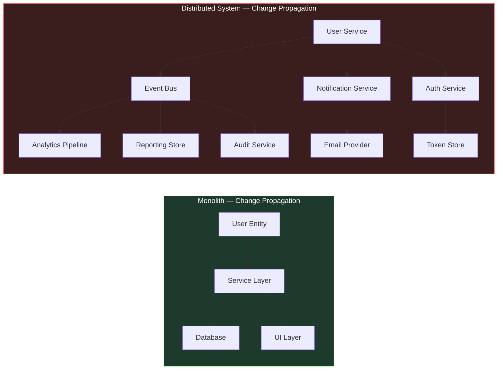
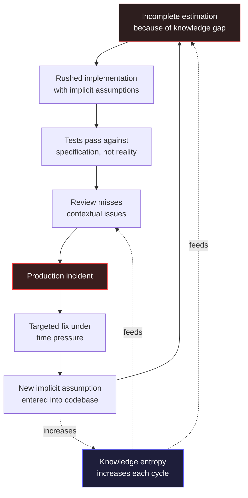

# Section 02 — The Breakdown of Traditional Workflows at Scale

## The Workflow Assumption

Every software development methodology rests on assumptions about the system being built and the team building it. Agile ceremonies assume that work can be decomposed into independent increments whose integration cost is manageable within a sprint boundary. Test-driven development assumes that the behavior of a unit can be specified completely before its implementation begins, and that the resulting tests will meaningfully constrain the unit's behavior in production contexts. Code review assumes that a reviewer can, in reasonable time, develop sufficient understanding of a change to evaluate its systemic consequences.

These assumptions held, largely, for the class of systems that dominated software development for the first several decades of the discipline. They were designed in an era when a service consumed a handful of dependencies, deployed to a predictable infrastructure, and whose behavior under load could be reasoned about from first principles.

Modern distributed .NET systems have invalidated each of these assumptions — not by making them false in all cases, but by creating conditions in which they break in specific, predictable ways that compound each other. Understanding exactly where and why they break is not an academic exercise. It is the prerequisite for understanding what AI-assisted development tools can actually do for an engineering team, and which of their advertised capabilities are genuine versus which are pattern-matching over familiar-looking code.

## How Agile Ceremonies Break Under Distributed Scale

The sprint planning ceremony assumes that a team can estimate the cost of a user story with reasonable accuracy. Estimation accuracy depends on understanding the current system well enough to identify all the places a change will propagate. In a monolithic system with well-understood boundaries, this is achievable — most changes are localized, and the few that cross layer boundaries do so in predictable ways.

In a distributed system, the propagation graph of a change is a tree that extends across service boundaries, and understanding it requires knowledge of the protocols, contracts, and behavioral characteristics of every service that might be affected. A seemingly simple requirement — "users should be able to update their email address" — propagates across an authentication service, an identity store, a notifications service, an event bus contract, a downstream analytics pipeline, and potentially a reporting system that denormalizes user data for performance. The team member who estimates this story as three points has experience with the local implementation. The team member who estimates it as thirteen has experience with the distributed consequences.

Neither estimate is wrong given the knowledge of the estimator. The variance is a measurement of the gap between the knowledge available at planning time and the knowledge required to implement the change without incident.

This gap does not close as teams become more experienced. It widens as the system becomes more complex, because each new service, each new integration, each new denormalized data store adds to the propagation graph that must be understood for accurate estimation. Teams manage this by reducing ambition — breaking stories into smaller increments, accepting that certain integrations will be discovered during implementation rather than during planning, and building in explicit "integration buffer" time. These are practical adaptations to a real constraint, but they represent a degradation in the planning process's ability to provide accurate forecasts.



The left side of this diagram represents the change propagation for "update email" in a monolithic system — three nodes, predictable. The right side represents the same change in a moderately complex distributed system — nine nodes across eight services, each with its own deployment lifecycle and failure characteristics. The planning ceremony was designed for the left side.

The asymmetry in the diagram is the mechanism by which estimation fails, and it is worth making concrete. On the left, the entire propagation graph is visible in a single codebase; a senior developer can enumerate the affected components from memory, and the estimate reflects a genuine understanding of the work. On the right, no individual sees the whole graph. The auth service is owned by a different team, the event bus contract is maintained by a platform group, and the analytics pipeline is a separate deployment whose schema changes are governed by a different release calendar. The estimator does not knowingly ignore these nodes — they are simply outside the set of facts available at planning time. The estimate is therefore not an estimate of the work at all; it is an estimate of the subset of the work that is locally visible, plus an implicit, unstated multiplier for the rest.

This is why the common advice to "involve senior engineers in estimation" does not resolve the problem. Seniority predicts local knowledge: how the team's own services are structured, what conventions are followed, where the historical traps are. It does not predict knowledge of a propagation graph that spans ownership boundaries and is changing continuously as other teams deploy independently. The planning ceremony compensates by building in buffer time, but buffer is a blunt instrument — it cannot distinguish between a change with genuinely low propagation cost and a change whose propagation cost is unknown. In practice, teams discover the difference only after the fact, in the deployment incident or the missed commitment.

## How Test-Driven Development Breaks at Integration Boundaries

Test-driven development, in its classical formulation, requires that the developer write a failing test before writing the implementation. The test specifies the expected behavior, and the implementation is driven by the requirement to make the test pass. This creates a discipline that produces well-specified, testable code.

The practice works exceptionally well for units that can be specified completely in isolation: pure functions, domain logic, validation rules, transformation pipelines. It degrades gracefully when the unit under test has simple dependencies that can be replaced by test doubles. It breaks meaningfully when the behavior being specified is an emergent property of the interaction between the unit and its real dependencies under real operational conditions.

Consider a service that processes payment webhooks from an external provider. The webhook payload format is documented, but the documentation omits several edge cases that only manifest under specific transaction conditions. The retry behavior is documented, but the actual retry interval is not always what the documentation states, and changes with provider configuration. The ordering guarantees are stated but not universally honored during provider-side incidents. None of these behavioral characteristics can be specified in a unit test against a mock of the webhook provider — because the specification does not fully capture the actual behavior.

This is not a criticism of test-driven development as a practice. It is an observation about the class of correctness problems that tests can and cannot address. Tests verify correctness against a specification. They cannot verify correctness against an external system whose behavior is incompletely specified, dynamically changing, or emergent under conditions that testing environments cannot reproduce. And in distributed .NET systems, this class of behavior — integration behavior at external boundaries — is precisely where the most consequential failures occur.

```csharp id="code-01-02"
// Target Framework: .NET 8.0
// Chapter: 01 | Section: 02
// book/chapters/chapter-01/sections/section-02.en.md
// This test suite provides 100% branch coverage of the webhook processor.
// Every assertion passes. The implementation is correct against the specification.
// The production failure that follows is not visible from here.

[TestClass]
public sealed class WebhookProcessorTests
{
    private readonly Mock<IWebhookRepository> _repository = new();
    private readonly Mock<IEventBus> _eventBus = new();
    private readonly WebhookProcessor _processor;

    public WebhookProcessorTests()
    {
        _processor = new WebhookProcessor(_repository.Object, _eventBus.Object);
    }

    [TestMethod]
    public async Task ProcessAsync_ValidPayload_PublishesPaymentEvent()
    {
        var payload = WebhookPayloadBuilder.ValidCharge();
        _repository.Setup(r => r.ExistsAsync(payload.EventId, It.IsAny<CancellationToken>()))
                   .ReturnsAsync(false);

        await _processor.ProcessAsync(payload, CancellationToken.None);

        _eventBus.Verify(b => b.PublishAsync(
            It.Is<PaymentReceivedEvent>(e => e.Amount == payload.Amount),
            It.IsAny<CancellationToken>()), Times.Once);
    }

    [TestMethod]
    public async Task ProcessAsync_DuplicateEventId_SkipsProcessing()
    {
        var payload = WebhookPayloadBuilder.ValidCharge();
        _repository.Setup(r => r.ExistsAsync(payload.EventId, It.IsAny<CancellationToken>()))
                   .ReturnsAsync(true);

        await _processor.ProcessAsync(payload, CancellationToken.None);

        _eventBus.Verify(b => b.PublishAsync(
            It.IsAny<PaymentReceivedEvent>(),
            It.IsAny<CancellationToken>()), Times.Never);
    }

    // Production failures not visible in this test file:
    //
    // 1. The provider sends the same event_id for different transaction types
    //    during partial payment scenarios. The deduplication logic incorrectly
    //    skips legitimate events with shared identifiers.
    //
    // 2. The provider occasionally delivers charge.succeeded before
    //    payment_intent.created during high-volume periods. The processor
    //    assumes creation precedes charge. It doesn't handle the out-of-order case.
    //
    // 3. The retry webhook carries a modified_at timestamp that differs from
    //    the original by milliseconds. The idempotency check compares the full
    //    payload hash including this timestamp, causing retries to be processed
    //    as new events.
    //
    // None of these failure modes are discoverable from the specification.
    // All of them are discoverable from production observation.
}
```

The three failure modes documented in comments in this code are real patterns that appear in production systems across the industry. None of them represent a failure of the test-driven development methodology — the tests are correct. They represent the inherent limitation of specification-based verification against systems whose behavior is not fully captured by any available specification.

## How Code Review Breaks Under Complexity

Code review operates on the assumption that a reviewer can develop sufficient understanding of a change to evaluate whether it is safe to merge. This requires understanding the change itself — straightforward — and understanding the systemic context in which the change will execute — frequently not straightforward in a complex distributed system.

The systemic context question has two parts. First: does the reviewer understand the current behavior of the components the change interacts with well enough to predict how the change will affect that behavior? Second: does the reviewer understand the downstream consumers of the changed component well enough to predict whether the change will be backward-compatible with their expectations?

In practice, these questions are answered by proxy: the reviewer checks whether the change follows established conventions, whether its tests are reasonable, whether the implementation looks like similar changes that have worked in the past, and whether the author has explicitly considered the edge cases that the reviewer can identify from memory. This is a reasonable process, and it catches a large class of problems. But its effectiveness is proportional to the reviewer's depth of knowledge about the specific components involved — knowledge that degrades over time as systems evolve and that cannot be maintained uniformly across all areas of a large distributed system.

The proxy nature of review explains a subtle but important phenomenon: reviews of changes in well-trodden areas are rigorous in a way that reviews of unfamiliar areas are not, yet the two reviews look identical on the surface. Both contain substantive comments, both have tests attached, both pass. The difference is invisible in the review artifact and lives entirely in the reviewer's mind — in whether the comments reflect genuine understanding of the change's systemic consequences or a plausible reading of its surface structure. A reviewer who has not touched the payments subsystem in eighteen months can still identify a violation of naming conventions, spot a missing null check, and approve a change whose interaction with the payment reconciliation workflow is deeply wrong. Nothing in the process distinguishes these cases until the change reaches production.

This is the specific sense in which code review "breaks" under complexity: it does not stop working, and it does not produce visibly worse output. It produces output whose quality has become a function of an invisible variable — reviewer familiarity with the affected area — that the process neither measures nor controls. The failure is quiet because every individual review remains defensible. The cost is paid in the aggregate, as the distribution of reviewer knowledge diverges from the distribution of production risk.

The result is a systematic pattern: changes in areas the team knows well receive rigorous review; changes in areas where knowledge is thin receive superficially correct but effectively cursory review. The team does not know which areas fall into which category in any given review, because knowledge depth is not a visible property of the codebase. The distribution of this unknown is what drives a substantial fraction of production incidents that occur immediately after a code deployment.

## The Accumulation Pattern and Its Engineering Consequences

The three workflow breakdowns described above — estimation accuracy, specification completeness, and review depth — do not fail independently. They compound each other through a mechanism that can be described precisely: each failure increases the entropy of the codebase in ways that make the other failures worse in subsequent cycles.

Underestimated complexity leads to incomplete implementation, which leads to integration defects that are not caught in testing, which leads to production incidents. Post-incident investigation reveals knowledge gaps that are addressed with targeted fixes — but targeted fixes that are applied under time pressure to a system that was not fully understood often introduce new implicit assumptions that future changes will violate. Over time, the codebase accumulates a layer of archaeological decisions: code that implements behaviors for reasons that are no longer visible, constraints that were added in response to production incidents whose context has been forgotten, performance optimizations that prevent certain refactorings without any documented explanation.



This accumulation pattern is not a failure of process. It is the predictable outcome of applying processes designed for bounded, well-understood systems to systems that have grown beyond the boundaries those processes were designed to manage.

The cycle in the diagram has one property that distinguishes it from an ordinary feedback loop: it is asymmetric in time. Each complete revolution takes longer than the previous one, because each revolution leaves behind more archaeological context — more implicit assumptions, more undocumented constraints, more decisions whose reasoning has been forgotten. The targeted fix at the bottom of the cycle appears to close the loop quickly, but it does not remove the knowledge gap that caused the incident; it patches the incident's symptom and, as the diagram shows, often adds a new implicit assumption in the process. The loop therefore does not return to its starting state after each revolution. It returns to a state with slightly higher entropy, and the next revolution takes slightly longer. This is the mechanism by which the same incident, or a near-variant of it, recurs in systems that appear to be well-managed: the process prevents the exact incident from repeating while permitting its structural cause to grow.

The compounding has a practical consequence for teams deciding where to intervene. Intervening at the top of the cycle — improving estimation by improving knowledge availability — is the only intervention that breaks the loop, because it addresses the deficit that feeds all subsequent stages. Intervening at lower stages — improving review, adding tests, tightening deployment controls — mitigates symptoms but leaves the knowledge gap intact, so the loop continues with slightly different incidents. This is why the workflow improvements described in the following sections consistently point in one direction: not toward more process, but toward infrastructure that makes the system's knowledge available at the moment a decision is made.

## What This Means for Engineering Practice

The conclusion from this analysis is not that traditional workflows should be abandoned. Sprint planning, test-driven development, and code review remain valuable practices that improve software quality. The conclusion is more specific: these practices have a characteristic failure mode at scale, and that failure mode is defined by a specific type of knowledge deficit — the inability to maintain accurate, comprehensive understanding of large distributed systems as they evolve.

This knowledge deficit is not addressable by harder work, better tooling within existing workflows, or more experienced engineers. It is addressable by changing how engineering knowledge is captured, maintained, and made available at decision points.

The shift this requires is from workflows designed around individual knowledge to workflows designed around distributed knowledge infrastructure. Specifications that capture architectural intent, not just interface contracts. Test suites that verify integration behavior, not just unit behavior against mocks. Review practices augmented by tooling that makes the systemic context of a change visible rather than relying on reviewer memory. And development environments that can surface relevant knowledge — patterns, precedents, failure modes — at the moment a developer is making a decision, rather than requiring that developer to already know what to search for.

This is the precise engineering context into which AI-assisted development tools arrive. Not as productivity multipliers in a well-functioning workflow, but as a potential solution to a specific, structural knowledge deficit that traditional workflows cannot address. Whether they provide that solution — and under what conditions, and with what limitations — is the subject of the next section.

---

*Section 02 has examined the specific mechanisms by which traditional development workflows break as system complexity scales. Section 03 examines what the architectural shift to AI-augmented development actually requires from the engineer — not in terms of tool adoption, but in terms of how architectural judgment is exercised and where it must be applied.*
