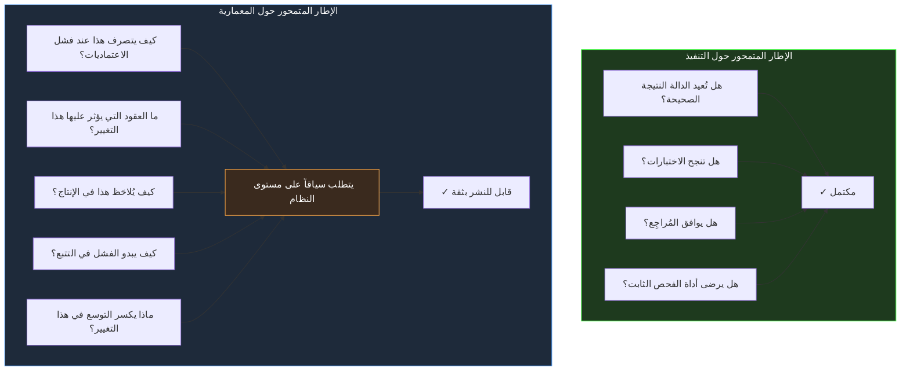

<div dir="rtl">

# القسم الثالث — التحول المعماري: من التنفيذ إلى الحكم

## ما تُنتجه عملية التدريب

يُدرَّب المهندسون، شبه عالمياً، على التميز في التنفيذ. المناهج الأكاديمية تُعلّم الخوارزميات وهياكل البيانات ودلالات اللغة وميكانيكيات الحوسبة. البرامج التسريعية تُعلّم الأطر والأدوات والأنماط المستخدمة لبناء التطبيقات بسرعة. والخبرة المبكرة في المجال تُعزز هذا التوجه: المقياس الذي يُقيَّم به المطوّرون في بداياتهم هو في الأساس قدرتهم على كتابة كود صحيح يُحقق المواصفة الموجودة أمامهم.

هذا التدريب يُنتج مهندسين متقنين لنشاط محدد وذي قيمة حقيقية: بمواجهة مشكلة محددة الحدود، يتمكنون من إنتاج كود يعمل بشكل صحيح لحلها. النشاط يستلزم كفاءة جوهرية — فهم دلالات اللغة، واختيار هياكل البيانات المناسبة، وكتابة اختبارات تتحقق من الصحة، ومعالجة حالات الخطأ، وتنظيم الكود للصيانة. لا شيء من هذا هيّن. وكله ضروري.

لكنه غير كافٍ لفئة المشكلات التي وصفها القسمان السابقان. أزمة التعقيد وانهيار سير العمل اللذان فحصناهما ليسا مشكلتَي جودة تنفيذ. كانت `PaymentProcessor` من القسم الأول مُنفَّذة بشكل صحيح من قِبل مهندس متمكن. كانت اختبارات `WebhookProcessor` من القسم الثاني مكتوبة بعناية ونجحت جميعها. الإخفاقات لم تكن في التنفيذ — بل كانت في الفجوة بين افتراضات التنفيذ حول النظام وما يُقدمه النظام فعلاً في الظروف التشغيلية الحقيقية.

تلك الفجوة لا تُغلق بكتابة كود أفضل. تُغلق بممارسة نوع مختلف من الحكم الهندسي: الحكم المطلوب لفهم النظام كوحدة متكاملة، بما فيه الأجزاء التي لم تكتبها، في ظل ظروف لم تلاحظها مباشرةً، لاتخاذ قرارات تنفيذ يمكن التنبؤ بتداعياتها على مستوى النظام بثقة.

لهذا الحكم اسم في الخطاب الهندسي — التفكير المعماري — لكن الاسم يحجب مدى ملموسيته وقابليته للتعلم. ليس سمة شخصية ولا وظيفة للأقدمية وحدها. إنه نشاط معرفي محدد يمكن وصفه بدقة، وممارسته عن قصد، وتطبيقه على القرارات الهندسية اليومية، لا على اجتماعات المعمارية الكبرى التي تُعقد مرة في العام فحسب.

## نمطان معرفيان في الهندسة

التمييز بين التفكير المتمحور حول التنفيذ - Implementation-Centric والتفكير المتمحور حول المعمارية - Architecture-Centric ليس تمييزاً في حجم المشكلة المُحلَّة. إنه تمييز في الإطار الذي تُرى من خلاله المشكلة والأسئلة التي يُولّدها ذلك الإطار.

الإطار المتمحور حول التنفيذ يسأل: *هل يحل هذا الكود المشكلة بشكل صحيح وفق المواصفة؟* الإجابات التي يسعى إليها محلية ومباشرة: هل تُعيد الدالة القيمة الصحيحة؟ هل ينجح الاختبار؟ هل يوافق مُراجع الكود على ما كُتب؟ الإطار مُغلق — يُقيّم الكود مقابل مواصفته، وتعني النتيجة الناجحة أن العمل انتهى.

الإطار المتمحور حول المعمارية يسأل: *كيف سيتصرف هذا الكود في النظام تحت الظروف التشغيلية الحقيقية، وما هي تداعيات ذلك السلوك على موثوقية النظام وقدرته على التطور؟* الإجابات التي يسعى إليها موزعة عبر النظام: ماذا يحدث للمستدعين عندما تصبح الاعتمادية الخارجية التي يُدخلها هذا الكود غير متاحة؟ كيف يبدو نمط فشل هذا التنفيذ في التتبع الموزع - Distributed Trace؟ إذا تغيّر هذا الكود، فأي العقود تغيّرت، ومن يعتمد على تلك العقود؟ الإطار مفتوح — يُقيّم الكود مقابل النظام، وتتطلب التقييم الكامل معرفة تتجاوز الملف الذي يُعدَّل بكثير.



كلا الإطارين ضروريان. الإطار المتمحور حول التنفيذ ليس خاطئاً — يجب أن يعمل الكود بشكل صحيح على مستوى الوحدة قبل أن تكون الصحة النظامية ذات صلة أصلاً. لكن الإطار المتمحور حول التنفيذ وحده غير كافٍ هيكلياً للأسباب التي فحصناها في الأقسام السابقة. المهندس الذي يعمل فقط ضمن هذا الإطار يُنتج كوداً صحيحاً محلياً يفشل نظامياً، لأنه لا يطرح الأسئلة التي تتطلبها الصحة النظامية.

تفاوت المخطط يرمّز الفرق بين إطار يمكن إغلاقه وإطار لا يمكن إغلاقه. الإطار المتمحور حول التنفيذ ينتهي: الاختبارات تُشغَّل، والمُفحص الثابت يجتاز، والمراجعة توافق، والعمل اكتمل. هذا الإغلاق هو بالضبط ما يجعل الإطار جذاباً — إنه يقدم اليقين ونقطة نهاية محددة. الإطار المتمحور حول المعمارية لا ينتهي بالطريقة نفسها أبداً. «كيف يتصرف هذا عند فشل الاعتماديات؟» سؤال تعتمد إجابته على الخصائص الفعلية لفشل الاعتماديات المحددة، والحركة المرورية التي تحملها، والوقت من اليوم، وحالة النشر. يجب الإجابة عنه من جديد لكل قرار، والإجابة الكاملة دائماً مؤقتة.

هذا الفرق في شروط الانتهاء يفسّر أقوى تحيّز معرفي يواجهه المهندس في تبنّي التفكير المتمحور حول المعمارية: الإطار المتمحور حول التنفيذ يبدو مسؤولاً لأنه ينتهي، بينما الإطار المتمحور حول المعمارية يبدو التزاماً بلا نهاية. في الممارسة، الالتزامات ليست بلا نهاية — إنها مجموعة محدودة من الأسئلة المتكررة، يزداد كل منها سرعة في الإجابة مع الممارسة — لكن الانطباع حقيقي، وهو السبب الرئيسي لمقاومة التحول حتى من قبل مهندسين يفهمون الحجة. الأقسام التالية تعالج هذه المقاومة مباشرةً بجعل أسئلة الإطار المعماري ملموسة وإظهار أن تكلفتها زيادة صغيرة متكررة لكل قرار.

## الفارق الملموس في الممارسة

التمييز بين هذين الإطارين ليس مجرداً. إنه يتجلى في اختلافات محددة وقابلة للملاحظة في كيفية تعامل المهندسين مع المهام الهندسية الاعتيادية.

تأمّل مهمة تنفيذ نقطة نهاية - Endpoint جديدة في خدمة ASP.NET Core تسترجع تفضيلات المستخدم من خدمة لاحقة - Downstream Service، وتُخزّنها مؤقتاً لأغراض الأداء، وتُعيدها للمستدعي.

المنهج المتمحور حول التنفيذ يُنتج كوداً يستدعي الخدمة اللاحقة ويُخزّن النتيجة في Redis بـ TTL معقول ويُعيد النتيجة للمستدعي ويعالج حالات الخطأ الواضحة. هذا الكود صحيح في المسار السعيد.

المنهج المتمحور حول المعمارية يطرح أسئلة إضافية قبل كتابة سطر واحد: ما ميزانية الكمون - Latency Budget لهذه النقطة، وأي جزء منها يمكن أن تستهلكه الخدمة اللاحقة؟ ماذا يحدث للمستدعين إذا كانت الخدمة مُثقَلة لكن غير متوقفة تماماً — هل يتلقون بيانات مؤقتة قد تكون قديمة، أم خطأ يُخبرهم بعدم الوثوق بالبيانات؟ ما استراتيجية إبطال صحة البيانات المؤقتة، وماذا يحدث إذا تغيّرت تفضيلات المستخدم بينما تفضيلاته السابقة لا تزال مُخزَّنة؟

هذه الأسئلة لا تغيّر التنفيذ تغييراً جوهرياً في المسار السعيد. إنها تغيّر سلوك التنفيذ في الظروف التي تحدد ما إذا كانت الخدمة موثوقة أم غير موثوقة في الإنتاج.

ويستحق أن نكون دقيقين حول ما تفعله الأسئلة المتمحورة حول المعمارية في هذا المثال، لأن تأثيرها سهل الإساءة في توصيفه. إنها لا تُنتج تنفيذاً أكثر دفاعية أو أكثر تشاؤماً. إنها تُنتج تنفيذاً قرر صراحةً سلوكه في كل حالة من حالات التشغيل المعقولة للنظام. للتنفيذ A سلوك في تلك الحالات — كل مسار كود يفعل شيئاً في كل ظرف — لكن السلوك لم يُقرَّر قط؛ إنه ما تفعله الواجهات البرمجية الافتراضية مصادفةً. حين يكون Redis بطيئاً، ينتظر مستدعي التنفيذ A إلى أجل غير مسمى لأن لا ميزانية مُعرَّفة. حين تتدهور الخدمة اللاحقة، يتلقى مستدعي التنفيذ A استثناءً غير معالج لأن لا عقد لحالة التدهور مُختار. الفارق بين التنفيذين ليس أن أحدهما يعالج الفشل والآخر لا — كلاهما «يعالج» الفشل بمعنى أن الكود يعمل. الفارق أن سلوك الفشل للتنفيذ B كان قراراً مصمَّماً، بينما كان سلوك الفشل للتنفيذ A مصادفةً للافتراضات الافتراضية. الموثوقية هي الحصيلة التراكمية لقرارات اتُّخذت بهذه الطريقة لا وُرِثت.

```csharp id="code-01-03"
// Target Framework: .NET 8.0
// Chapter: 01 | Section: 03
// book/chapters/chapter-01/sections/section-03.ar.md
//
// تنفيذان لنفس نقطة النهاية.
// كلاهما يُصرَّف بنجاح. كلاهما يجتاز الاختبارات.
// واحد فقط متمحور حول المعمارية.

// ── التنفيذ A: متمحور حول التنفيذ ──────────────────────────────────────
// يسأل: هل يسترجع هذا تفضيلات المستخدم بشكل صحيح ويُخزّنها مؤقتاً؟
// الجواب: نعم.
// ما يُفوّته: كل أسئلة الإطار المتمحور حول المعمارية.

app.MapGet("/users/{userId}/preferences", async (
    string userId,
    IUserPreferenceService preferenceService,
    IDistributedCache cache,
    CancellationToken ct) =>
{
    var cached = await cache.GetStringAsync(userId, ct);
    if (cached is not null)
        return Results.Ok(JsonSerializer.Deserialize<UserPreferences>(cached));

    var preferences = await preferenceService.GetAsync(userId, ct);
    await cache.SetStringAsync(userId,
        JsonSerializer.Serialize(preferences),
        new DistributedCacheEntryOptions
            { AbsoluteExpirationRelativeToNow = TimeSpan.FromMinutes(15) },
        ct);

    return Results.Ok(preferences);
});

// ── التنفيذ B: متمحور حول المعمارية ─────────────────────────────────────
// يسأل: كيف سيتصرف هذا في ظل الظروف الحقيقية لهذا النظام؟
// يأخذ بعين الاعتبار: ميزانية الكمون، السلوك عند التدهور، Cache Stampede،
// قابلية الرصد - Observability، وعقد المستدعي في ظل ظروف التدهور.

app.MapGet("/users/{userId}/preferences", async (
    string userId,
    IUserPreferenceService preferenceService,
    IDistributedCache cache,
    ILogger<Program> logger,
    CancellationToken ct) =>
{
    // قراءة Cache محدودة زمنياً — أعطال Redis لا يجب أن تُوقف نقطة النهاية.
    // المستدعون يتلقون بيانات أو إشارة صريحة، لا توقفاً صامتاً.
    string? cached = null;
    try
    {
        using var cacheTimeout = CancellationTokenSource.CreateLinkedTokenSource(ct);
        cacheTimeout.CancelAfter(TimeSpan.FromMilliseconds(50)); // ميزانية Cache صريحة
        cached = await cache.GetStringAsync(userId, cacheTimeout.Token);
    }
    catch (OperationCanceledException)
    {
        // قراءة Cache تجاوزت الميزانية. يُستمر للمصدر الأصلي.
        logger.LogWarning("Cache read timeout for user {UserId}", userId);
    }

    if (cached is not null)
        return Results.Ok(JsonSerializer.Deserialize<UserPreferences>(cached));

    UserPreferences preferences;
    try
    {
        using var serviceTimeout = CancellationTokenSource.CreateLinkedTokenSource(ct);
        serviceTimeout.CancelAfter(TimeSpan.FromMilliseconds(300));
        preferences = await preferenceService.GetAsync(userId, serviceTimeout.Token);
    }
    catch (OperationCanceledException)
    {
        logger.LogError("Preference service timeout for user {UserId}", userId);
        return Results.StatusCode(503); // Service Unavailable — المستدعي يُعيد المحاولة
    }

    // Write-Behind: لا يُعيق الاستجابة بسبب الكتابة في Cache.
    // فشل الكتابة تدهور في الأداء، ليس مشكلة صحة.
    _ = cache.SetStringAsync(userId,
        JsonSerializer.Serialize(preferences),
        new DistributedCacheEntryOptions
        {
            // TTL مع جيتر - Jitter يمنع Cache Stampede عند انتهاء صلاحية إدخالات كثيرة معاً.
            AbsoluteExpirationRelativeToNow =
                TimeSpan.FromMinutes(15) + TimeSpan.FromSeconds(Random.Shared.Next(0, 60))
        },
        CancellationToken.None) // مقصود: لا إلغاء عند قطع اتصال المستدعي
        .ConfigureAwait(false);

    return Results.Ok(preferences);
});
```

التنفيذ A ليس خاطئاً بالمعنى الذي يستخدمه معظم المهندسين للكلمة. في خدمة ذات حركة مرور منخفضة ومع Redis محلي، سيعمل بشكل صحيح لسنوات. المشكلات تصبح مرئية فقط عندما تصبح الخدمة اللاحقة متقطعة الاستجابة، أو عندما يكون Redis بارداً - Cold بعد نشر جديد، أو عندما تنتهي صلاحية إدخالات Cache لعشرة آلاف مستخدم في وقت واحد بعد خمس عشرة دقيقة من بدء الخدمة.

التنفيذ B ليس مُبالَغاً في هندسته. كل قرار — قراءة Cache المحدودة زمنياً، والـ Timeout الصريح على استدعاء الخدمة، ونمط Write-Behind، وجيتر الـ TTL — يعالج نمط فشل محدداً تواجهه الأنظمة الموزعة الحقيقية. التعقيد الإضافي ليس زخرفة معمارية. إنه التعبير الملموس عن طرح الأسئلة التي يُولّدها الإطار المتمحور حول المعمارية.

## لماذا التحول صعب وما الذي يجعله ممكناً

الانتقال من التفكير المتمحور حول التنفيذ إلى التفكير المتمحور حول المعمارية صعب فعلاً، لثلاثة أسباب تستحق الفهم المباشر.

**دورة التغذية الراجعة غير متماثلة.** صحة التنفيذ تُنتج تغذية راجعة فورية — الاختبار إما ينجح أو يفشل. الصحة المعمارية تُنتج تغذية راجعة بتأخير قد يمتد لأشهر أو سنوات: فشل Timeout المتسلسل - Cascading، والـ Cache Stampede، وسباق البيانات - Data Race تحت تزامن الإنتاج. هذا يعني أن المهندس يمكنه العمل بالوضع المتمحور حول التنفيذ لفترة طويلة دون تلقي تغذية راجعة سلبية، مما يجعل الوضع يبدو كافياً حتى حين لا يكون كذلك.

**المعرفة المطلوبة موزعة.** الحكم المعماري يتطلب فهم ليس فقط الكود المكتوب بل السياق الكامل للنظام: أنماط فشل الاعتماديات، وأنماط حركة المرور الفعلية في الإنتاج، والعقود الضمنية التي شكّلها المستدعون مع الخدمة بمرور الوقت. هذه المعرفة ليست مُركَّزة في أي وثيقة أو مهندس واحد. إنها موزعة عبر الخبرة الجماعية للفريق، وبيانات المراقبة في الإنتاج، وتاريخ الحوادث، والكود نفسه.

**الأسئلة ليست على قائمة المراجعة.** التحقق المتمحور حول التنفيذ يمكن أتمتته: الاختبارات، وأدوات الفحص الثابت، ومحققات النوع، وأدوات التغطية. التحقق المتمحور حول المعمارية يتطلب من المهندس توليد الأسئلة الصحيحة، وهذا يتطلب معرفة ما يجب السؤال عنه قبل أن تتجلى المشكلة.

هذه الصعوبات الثلاث تعمل بشكل مختلف على مراحل المسار المهني المختلفة، ولهذا يُساء فهم التحول كونه ظاهرة أقدمية محضة. المهندسون المبتدئون يفتقرون إلى معجم أنماط الفشل، فتنتج الأسئلة المعمارية أسئلة لا يستطيعون الإجابة عنها؛ أما الإطار المتمحور حول التنفيذ فينتج إجابات يستطيعون التحقق منها، فيلجؤون إليه افتراضياً. المهندسون المخضرمون يمتلكون المعجم لكنهم استوعبوا الأسئلة بعمق لدرجة أنهم لم يعودوا يتعرفون عليها كنشاط مميز — يختبرون الحكم المعماري كحدس لا كمنهج. لا تُخدم أي من المجموعتين جيداً بالطريقة التي يُصاغ بها التحول عادةً. المبتدئون يحتاجون إلى جعل الأسئلة صريحة وقابلة للإجابة؛ والمخضرمون يحتاجون إلى صياغة المنهج ليعلموه ويوسعوا نطاقه. والسنوات الوسطى — حيث يمتلك المهندسون خبرة كافية ليعلموا أن الأسئلة مهمة لكنها غير كافية للإجابة عنها بثقة — هي حيث تمتلك الممارسة الموصوفة في نهاية هذا القسم أعلى رافعة.

ما يجعل التحول ممكناً رغم هذه الصعوبات هو أن الأسئلة المعمارية ليست اعتباطية. إنها تتبع أنماطاً قابلة للتعرف عليها. حدود Timeout، وسلوك Fallback، واستراتيجيات إبطال صحة الـ Cache، وضمانات تكرار التنفيذ الآمن - Idempotency تحت إعادة المحاولة، والتوافق الخلفي - Backward Compatibility لتغييرات الواجهة — هذه هي المخاوف المتكررة للأنظمة الموزعة، والمهندس الذي استوعبها يمكنه تطبيقها بشكل منهجي على مواقف جديدة.

هذا هو تحديداً المجال الذي تستطيع فيه أدوات التطوير بمساعدة الذكاء الاصطناعي تقديم قيمة حقيقية ليست مجرد سرعة في توليد الكود. النموذج اللغوي المُدرَّب على مجموع المعرفة الهندسية قد رمّز أنماط هذه المخاوف المتكررة. يستطيع إظهارها عند الطلب، في اللحظة التي يتخذ فيها المطوّر قراراً محدداً، دون أن يقتضي ذلك أن يكون المطوّر قد واجه كل نمط فشل شخصياً في الإنتاج. الأداة لا توفّر الحكم المعماري — إنها توفّر قاعدة المعرفة التي تُغذّي ذلك الحكم.

لكنها لا تستطيع توفير تلك المعرفة بفائدة إلا لمهندس يعرف كيف يطبّقها: مهندس يطرح بالفعل الأسئلة المتمحورة حول المعمارية ويحتاج إلى المعرفة للإجابة عنها، لا مهندس لا يطرح تلك الأسئلة بعد وسيستفيد في الأساس من إكمال التنفيذ بسرعة أكبر.

## الأسئلة المتمحورة حول المعمارية في أنظمة .NET

الأسئلة المتمحورة حول المعمارية ليست مجردة. عند العمل مع أنظمة موزعة بـ .NET، لها صياغات محددة ومتكررة يتعرف عليها كل مهندس يعمل في هذا المجال.

**ميزانيات Timeout عبر سلسلة الاستدعاء.** لكل عملية في نظام .NET موزع Timeout ضمني أو صريح. الـ Timeout الافتراضي لـ HttpClient هو مئة ثانية — قيمة تكاد لا تكون صحيحة أبداً للاستخدام في الإنتاج، وتُنتج استنزاف Thread Pool عندما تتعطل خدمة لاحقة. السؤال المتمحور حول المعمارية ليس "هل لهذا الكود Timeout؟" بل "هل يتناسب Timeout هذا الكود بشكل صحيح مع ميزانية مستدعييه، وهل سلوك الفشل عند انطلاق الـ Timeout يطابق توقعات المستدعين؟" Timeout لـ HttpClient ينطلق بعد قطع اتصال المستدعي أصلاً ليس Timeout — إنه تسريب موارد.

**انتشار CancellationToken.** المعامل CancellationToken في كود .NET غير المتزامن ليس شكلية. إنه الآلية التي تنتشر من خلالها إشارات الإلغاء عبر سلسلة الاستدعاء، وغيابه في أي حلقة من السلسلة يكسر قدرة السلسلة على الاستجابة لقطع اتصال العميل أو إيقاف تشغيل النشر - Deployment Shutdown. السؤال المتمحور حول المعمارية ليس "هل تقبل هذه الدالة CancellationToken؟" بل "هل يُحرّر الإلغاء في أي نقطة من السلسلة جميع الموارد بشكل صحيح ويتجنب العمليات اللاحقة اليتيمة - Orphaned Downstream Operations؟"

**عمر DbContext وتزامن Entity Framework.** الـ DbContext في Entity Framework Core غير آمن للخيوط المتعددة - Thread-Safe، ومُصمَّم لعمر وحدة العمل الواحدة - Single Unit of Work. السؤال المتمحور حول المعمارية ليس "هل يستخدم هذا الكود DbContext؟" بل "هل عمر DbContext مُحدَّد النطاق بشكل صحيح للعملية، وماذا يحدث عندما يحاول طلبان استخدام نفس الـ Context في وقت واحد؟" العمر المُحدَّد النطاق - Scoped في Worker Service في الخلفية، حيث لا يُوفّر المُضيف نطاقات طلبات HTTP، هو تكوين خاطئ شائع يُنتج InvalidOperationException تحت التحميل المتزامن — لكن فقط تحت التحميل المتزامن، وهذا لماذا لا تكتشفه مجموعة الاختبار.

هذه ليست الأسئلة الوحيدة ذات الصلة بأنظمة .NET. إنها أمثلة تمثيلية على الأسئلة التي يُولّدها الإطار المتمحور حول المعمارية بشكل طبيعي، والتي لا يطرحها الإطار المتمحور حول التنفيذ لأنها غير مرئية من الكود المحلي وحده. تطوير عادة طرحها باستمرار — قبل كتابة التنفيذ، لا بعد نشره — هو الممارسة الملموسة التي تُنتج التحول الذي يصفه هذا القسم.

## المسار العملي نحو التحول

التفكير المعماري لا يُكتسب بالقراءة عنه. يُكتسب من خلال الممارسة المتعمدة للأسئلة، مُطبَّقةً على أنظمة حقيقية وقرارات هندسية حقيقية.

المسار الأكثر مباشرة هو تطوير عادة إلحاق مجموعة محددة من الأسئلة بكل قرار تنفيذ، قبل أن يبدأ التنفيذ: ماذا يحدث للمستدعين عندما يتصرف هذا المكون بشكل غير متوقع؟ كيف يبدو فشل هذا المكون في بنية المراقبة - Observability Infrastructure للنظام؟ ما العقود الضمنية التي شكّلها المستدعون مع السلوك الحالي لهذا المكون، وأيٌّ منها ينتهكه هذا التغيير؟ ما أسوأ سلوك لهذا التنفيذ عند عشرة أضعاف التحميل المتوقع؟

هذه الأسئلة لا تحتاج إلى إجابات مطوّلة عند كل نقطة قرار. كثير من التنفيذات بسيطة بما يكفي لتكون الإجابات واضحة فوراً. لكن عادة طرحها — باستمرار، في لحظة القرار — هي ما يُنتج الحكم المعماري الذي يُحدث الفارق بين الكود الذي يعمل في الاختبار والأنظمة الموثوقة في الإنتاج.

القسم التالي يفحص كيف تتفاعل أدوات التطوير بمساعدة الذكاء الاصطناعي مع هذا التحول — ولماذا قيمتها تتناسب بشكل مباشر مع الحكم المعماري للمهندس الذي يستخدمها.


## التطبيق على القرارات الهندسية اليومية

الأسئلة المتمحورة حول المعمارية تبدو في ظاهرها طموحة وواسعة النطاق، وكأنها مخصصة لجلسات تصميم النظام الكبيرة دون العمل اليومي العادي. هذا انطباع يصحّ تصحيحه مبكراً. الأسئلة المعمارية تُطبَّق على كل تغيير، بصرف النظر عن حجمه أو مدى تقنيته الظاهرة. التغيير الصغير في تكوين HttpClient يُطرح عليه نفس السؤال الذي يُطرح على قرار المعمارية الكبير: ما تداعيات هذا على سلوك النظام تحت ضغط الإنتاج؟

الفارق العملي بين مهندسين يعملان على نفس قاعدة كود يتضح في كيفية معالجة القرارات الصغيرة يومياً. المهندس المتمحور حول التنفيذ يُضيف معالجة Retry عند مواجهة خطأ عابر: يختار نمطاً من الكود الذي يعرفه، يُطبّقه، يتحقق من نجاح الاختبار، ويُكمل. المهندس المتمحور حول المعمارية يطرح أولاً: هل إعادة المحاولة هنا آمنة؟ هل العملية التي نُعيد محاولتها أحادية - Idempotent؟ إذا أعدنا المحاولة ثلاث مرات وفشلت الثلاث، كم من الوقت انقضى وهل هذا يتجاوز Timeout المستدعي؟ هل نمط إعادة المحاولة المُختار يُضاعف الضغط على الخدمة المُثقَلة أصلاً؟

الإجابات على هذه الأسئلة لا تُغيّر القرار دائماً. أحياناً الـ Retry Pattern الأولي هو الصحيح. لكن طرح الأسئلة يُغيّر احتمالية اكتشاف المشكلة في مرحلة التصميم بدلاً من الإنتاج. وعلى مدى مئات من هذه القرارات الصغيرة في دورة حياة النظام، الفارق الإجمالي في موثوقية النظام يكون جوهرياً وقابلاً للقياس.

النقطة الأعمق هي أن الحكم المعماري ليس نشاطاً منفصلاً يحدث في اجتماعات خاصة. إنه وضعية ذهنية مستمرة تؤثر على كل قرار، كبيراً كان أم صغيراً. المهندسون الذين يُحدثون التحول المعماري لا يُخصصون ساعات في اليوم "للتفكير المعماري" — إنهم يُدمجون الأسئلة المعمارية في الإيقاع الطبيعي لعملهم اليومي، حتى تصبح تلك الأسئلة انعكاساً تلقائياً لا جهداً إضافياً.

ما يجعل هذه الأسئلة قابلة للتعلم والتطبيق المنهجي هو أنها مُشتقة من مجموعة محدودة نسبياً من أنماط الفشل المتكررة في الأنظمة الموزعة. الأنظمة الموزعة لا تفشل بطرق لانهائية غير متوقعة — إنها تفشل بطرق يمكن تصنيفها وتوثيقها وتعلّمها من تجربة الآخرين. المهندس الذي يستثمر في بناء هذا المعجم من أنماط الفشل يُوسّع مداه المعماري بشكل مضطرد، مما يجعل كل أداة وكل خدمة وكل نمط تكامل جديد أسهل في التقييم بشكل صحيح من السابق. هذا هو التراكم الحقيقي في هندسة البرمجيات المحترفة.

وسجلات القرارات المعمارية - Architecture Decision Records تُقدّم آلية ملموسة لتثبيت هذا التحول. حين يوثّق المهندس لماذا اتُّخذ قرار معماري بعينها — وما البدائل التي رُفضت ولماذا، وما ظروف الفشل التي قُدِّرت وطُبِّقت — فإنه يُنشئ مرجعاً معرفياً يُمكّن المُراجِعين المستقبليين من فهم السياق الكامل للقرار دون الحاجة لاسترجاعه من ذاكرة الفريق المتغيرة.

هذا الاستثمار في العمق ليس تحسينياً — إنه أساسي لكل ما يتبعه في هذا الكتاب، لأن فهم كيفية عمل الأنظمة تحت الضغط هو الأساس الذي يقوم عليه التعاون الفعّال مع الذكاء الاصطناعي في بناء الأنظمة التي تصمد في الإنتاج. والمهندس الذي يُدرك أن الأسئلة المعمارية تُطبَّق على كل قرار صغير وكبير يبني بمرور الوقت حكماً هندسياً يجعل كل قرار لاحق أدق وأأمن من سابقه باستمرار.

---

*استعرض القسم الثالث التحول المعماري من التفكير المتمحور حول التنفيذ إلى التفكير المتمحور حول المعمارية، وأسّسه في تنفيذين ملموسين للمهمة نفسها، وحدد العادات المعرفية المحددة التي تجعل التحول عملياً. القسم الرابع يفحص كيف تعمل أدوات الذكاء الاصطناعي كمضخّمات لهذا الحكم لا بدائل عنه — ولماذا ليس هذا الفارق نظرياً بل له عواقب مباشرة على جودة الأنظمة المبنية بمساعدة الذكاء الاصطناعي.*

</div>
