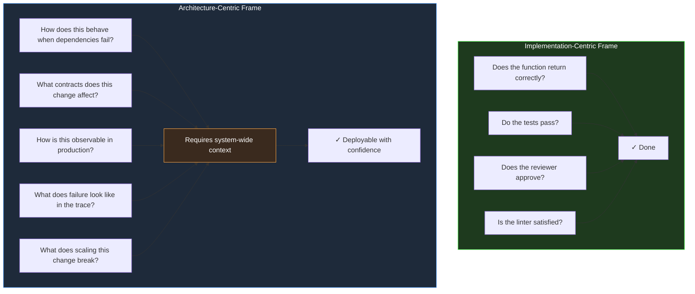

# Section 03 — The Architectural Shift: From Implementation to Judgment

## What Training Produces

Software engineers are trained, almost universally, for implementation excellence. Computer science curricula teach algorithms, data structures, language semantics, and the mechanics of computation. Bootcamps teach frameworks, toolchains, and the patterns used to construct working applications quickly. Early career experience reinforces this: the metric by which junior engineers are evaluated is primarily whether they can write correct code that satisfies the specification in front of them.

This training produces engineers who are skilled at a specific and valuable activity: given a problem with defined boundaries, produce working code that solves it. The activity requires significant competence — understanding language semantics, choosing appropriate data structures, writing tests that verify correctness, handling error conditions, organizing code for maintainability. None of this is trivial. All of it is necessary.

But it is not sufficient for the class of problem that the previous two sections described. The complexity crisis and the workflow breakdown they examined are not problems of implementation quality. The `PaymentProcessor` from Section 01 was implemented correctly by a skilled engineer. The `WebhookProcessor` tests from Section 02 were written carefully and passed. The failures were not in the implementation — they were in the gap between the implementation's assumptions about the system and what the system actually provided under real operational conditions.

That gap is not closed by writing better code. It is closed by exercising a different kind of engineering judgment: the judgment required to understand a system as a whole, including the parts you did not write, under conditions you have not directly observed, and to make implementation decisions whose consequences at the system level can be predicted with confidence.

This judgment has a name in engineering discourse — architectural thinking — but the name obscures how concrete and learnable it actually is. It is not a personality trait or a function of seniority alone. It is a specific cognitive activity that can be described precisely, practiced deliberately, and applied to everyday engineering decisions, not just to the grand architecture meetings that happen once a year.

## Two Cognitive Modes in Engineering

The distinction between implementation-centric and architecture-centric thinking is not about the size of the problem being solved. It is about the frame through which the problem is viewed and the questions that frame generates.

The implementation-centric frame asks: *Does this code correctly solve the problem as specified?* The answers it seeks are local: Does the function return the right value? Does the test pass? Does the linter approve? Does the pull request reviewer find anything obviously wrong? The frame is closed — it evaluates the code against its specification, and a passing evaluation means the work is done.

The architecture-centric frame asks: *How will this code behave in the system under real operational conditions, and what are the consequences of that behavior for the system's overall reliability and evolution?* The answers it seeks are distributed across the system: What happens to the callers of this service when the external dependency this code introduces becomes unavailable? What does the failure mode of this implementation look like in the distributed trace? If this code changes, what contracts have changed, and who depends on those contracts? The frame is open — it evaluates the code against the system, and a complete evaluation requires knowledge that extends far beyond the file being changed.



Both frames are necessary. The implementation-centric frame is not wrong — code must work correctly at the unit level before systemic correctness is even relevant. But the implementation-centric frame alone is structurally insufficient for the reasons examined in the previous sections. An engineer operating only within it will produce locally correct code that fails systemically, because they are not asking the questions that systemic correctness requires.

The diagram's asymmetry encodes the difference between a frame that can be closed and a frame that cannot. The implementation frame terminates: the tests run, the linter passes, the review approves, and the work is complete. This closure is precisely what makes the frame attractive — it offers certainty and a defined endpoint. The architecture frame never terminates in the same way. "How does this behave when dependencies fail?" is a question whose answer depends on the actual failure characteristics of the specific dependencies, the traffic they carry, the time of day, and the state of the deployment. It must be answered afresh for each decision, and a complete answer is always provisional.

This difference in termination conditions explains the strongest cognitive bias an engineer faces in adopting architecture-centric thinking: the implementation frame feels responsible because it finishes, while the architecture frame feels like an endless obligation. In practice, the obligations are not endless — they are a finite set of recurring questions, each of which becomes faster to answer with practice — but the perception is real, and it is the main reason the shift is resisted even by engineers who understand the argument. The sections below address that resistance directly by making the architecture frame's questions concrete and showing that their cost is a small, repeatable increment per decision.

## The Concrete Difference in Practice

The distinction between these two frames is not abstract. It manifests in specific, observable differences in how engineers approach common engineering tasks.

Consider the task of implementing a new endpoint in an ASP.NET Core service that retrieves user preferences from a downstream service, caches them for performance, and returns them to the caller.

The implementation-centric approach produces code that: calls the downstream service, stores the result in Redis with a reasonable TTL, returns the result to the caller, and handles the obvious error cases (downstream unavailable, Redis unreachable) by returning appropriate HTTP status codes.

The architecture-centric approach asks additional questions before writing a single line: What is the latency budget for this endpoint, and what portion of it can the downstream service consume? What happens to callers if the downstream service is degraded but not fully unavailable — should they receive cached data that may be stale, or an error that tells them the data cannot be trusted? What is the invalidation strategy for the cached data, and what happens if a user's preferences change while their previous preferences are still cached? What does a cascading failure look like if this endpoint becomes the entry point for a thundering herd on cache expiry?

These questions do not change the implementation dramatically in the happy path. They change the implementation's behavior under the conditions that determine whether the service is reliable or unreliable in production.

It is worth being precise about what the architecture-centric questions are doing in this example, because their effect is easy to mischaracterize. They are not producing a more defensive or more pessimistic implementation. They are producing an implementation that has explicitly decided its behavior under each of the system's plausible operating states. Implementation A does have behavior in those states — every code path does something under every condition — but the behavior was never decided; it is whatever the default APIs happen to do. When Redis is slow, Implementation A's caller waits indefinitely because no budget was defined. When the downstream service degrades, Implementation A's caller receives an unhandled exception because no degraded-mode contract was chosen. The difference between the two implementations is not that one handles failure and the other does not — both "handle" failure in the sense that code runs. The difference is that Implementation B's failure behavior was a designed decision, while Implementation A's was an accident of the defaults. Reliability is the cumulative product of such decisions being made rather than inherited.

```csharp id="code-01-03"
// Target Framework: .NET 8.0
// Chapter: 01 | Section: 03
// book/chapters/chapter-01/sections/section-03.en.md
//
// Two implementations of the same endpoint.
// Both compile. Both pass their tests. One is architecture-centric.
//
// ── Implementation A: Implementation-Centric ───────────────────────────────
//
// Asks: Does this correctly retrieve and cache user preferences?
// Answer: Yes.
// What it misses: all the questions in the architecture-centric frame.

app.MapGet("/users/{userId}/preferences", async (
    string userId,
    IUserPreferenceService preferenceService,
    IDistributedCache cache,
    CancellationToken ct) =>
{
    var cached = await cache.GetStringAsync(userId, ct);
    if (cached is not null)
        return Results.Ok(JsonSerializer.Deserialize<UserPreferences>(cached));

    var preferences = await preferenceService.GetAsync(userId, ct);
    await cache.SetStringAsync(userId,
        JsonSerializer.Serialize(preferences),
        new DistributedCacheEntryOptions { AbsoluteExpirationRelativeToNow = TimeSpan.FromMinutes(15) },
        ct);

    return Results.Ok(preferences);
});

// ── Implementation B: Architecture-Centric ─────────────────────────────────
//
// Asks: How will this behave under the real conditions of this system?
// Considers: latency budget, stale-on-error, cache stampede, observability,
//            caller contract under degraded conditions.

app.MapGet("/users/{userId}/preferences", async (
    string userId,
    IUserPreferenceService preferenceService,
    IDistributedCache cache,
    ILogger<Program> logger,
    CancellationToken ct) =>
{
    // Bounded cache read — Redis failures should not block the endpoint.
    // Callers receive data or an explicit signal, never a silent hang.
    UserPreferences? preferences = null;
    string? cached = null;

    try
    {
        using var cacheTimeout = CancellationTokenSource.CreateLinkedTokenSource(ct);
        cacheTimeout.CancelAfter(TimeSpan.FromMilliseconds(50)); // explicit cache budget
        cached = await cache.GetStringAsync(userId, cacheTimeout.Token);
    }
    catch (OperationCanceledException)
    {
        // Cache read exceeded budget. Continue to the source of truth.
        // This path is observable: the caller still gets correct data.
        logger.LogWarning("Cache read timeout for user {UserId} — falling through to service", userId);
    }

    if (cached is not null)
        return Results.Ok(JsonSerializer.Deserialize<UserPreferences>(cached));

    // Source-of-truth read with a defined timeout that respects the caller's
    // overall budget. Timeout is configured, not default.
    try
    {
        using var serviceTimeout = CancellationTokenSource.CreateLinkedTokenSource(ct);
        serviceTimeout.CancelAfter(TimeSpan.FromMilliseconds(300));
        preferences = await preferenceService.GetAsync(userId, serviceTimeout.Token);
    }
    catch (OperationCanceledException)
    {
        // Service read exceeded budget. Return a typed error that callers can
        // handle. Do NOT return 500 — this is an expected degraded-mode outcome.
        logger.LogError("Preference service timeout for user {UserId}", userId);
        return Results.StatusCode(503); // Service Unavailable — caller should retry
    }

    // Write-behind: do not block the response on the cache write.
    // A failed cache write is a performance degradation, not a correctness issue.
    _ = cache.SetStringAsync(userId,
        JsonSerializer.Serialize(preferences),
        new DistributedCacheEntryOptions
        {
            // Jittered TTL prevents cache stampede when many entries expire together.
            AbsoluteExpirationRelativeToNow =
                TimeSpan.FromMinutes(15) + TimeSpan.FromSeconds(Random.Shared.Next(0, 60))
        },
        CancellationToken.None) // Intentional: don't cancel on caller disconnect
        .ConfigureAwait(false);

    return Results.Ok(preferences);
});
```

Implementation A is not wrong in the sense that most engineers use the word wrong. In a low-traffic service with a reliable downstream and a local Redis instance, it will work correctly for years. The problems become visible only when the downstream service becomes intermittently slow, when Redis is cold after a deployment, when cache entries for ten thousand users expire simultaneously after fifteen minutes of service startup.

Implementation B is not overengineered. Each decision — the bounded cache read, the explicit timeout on the service call, the write-behind pattern, the jittered TTL — addresses a specific failure mode that real distributed systems encounter. The additional complexity is not architectural decoration. It is the concrete expression of asking the questions the architecture-centric frame generates.

## Why the Shift Is Difficult and What Makes It Possible

The transition from implementation-centric to architecture-centric thinking is genuinely difficult, for three reasons that are worth understanding directly rather than glossing over.

**The feedback cycle is asymmetric.** Implementation correctness produces immediate feedback — the test either passes or it does not. Architectural correctness produces feedback on a delay that can be months or years: the cascading timeout failure, the cache stampede, the data race under production concurrency. This means that an engineer can operate in implementation-centric mode for a long time without receiving negative feedback, which makes the mode feel sufficient even when it is not.

**The knowledge required is distributed.** Architectural judgment requires understanding not just the code being written but the full system context: the failure modes of dependencies, the actual traffic patterns in production, the implicit contracts that callers have formed with the service over time. This knowledge is not concentrated in any document or any single engineer. It exists distributed across the team's collective experience, the production telemetry, the incident history, and the code itself. Developing architectural judgment requires systematically integrating these sources, which takes time and deliberate practice.

**The questions are not on the checklist.** Implementation-centric verification can be automated: tests, linters, type checkers, coverage tools. Architecture-centric verification requires the engineer to generate the right questions, which requires knowing what to ask before the problem manifests. This is a different kind of competence — less procedural, more analogical, built from a library of failure modes accumulated over experience with real systems under real conditions.

These three difficulties operate differently on different career stages, which is why the shift is misperceived as purely a seniority phenomenon. Junior engineers lack the failure-mode library, so the architecture frame produces questions they cannot answer; the implementation frame produces answers they can verify, so they default to it. Senior engineers possess the library but have often internalized the questions so thoroughly that they no longer recognize them as a distinct activity — they experience architectural judgment as instinct rather than method. Neither group is well served by the way the shift is usually framed. Juniors need the questions made explicit and answerable; seniors need the method articulated so they can teach and scale it. The middle years — where engineers have enough experience to know the questions matter but not enough to answer them confidently — are where the practice described at the end of this section has the greatest leverage.

What makes the shift possible, despite these difficulties, is that the architectural questions are not arbitrary. They follow recognizable patterns. Timeout boundaries, fallback behavior, cache invalidation strategies, idempotency under retry, backward compatibility of interface changes — these are the recurring concerns of distributed systems, and an engineer who has internalized them can apply them systematically to new situations.

This is precisely the domain in which AI-assisted development tools can provide genuine value that is not merely about code generation velocity. A language model trained on the engineering corpus has encoded the patterns of these recurring concerns. It can surface them on demand, at the moment a developer is making a specific decision, without requiring that developer to have personally encountered every failure mode in production. The tool does not supply architectural judgment — it supplies the knowledge base that informs that judgment.

But it can only supply that knowledge usefully to an engineer who knows how to apply it: who is already asking the architecture-centric questions and needs the knowledge to answer them, rather than an engineer who is not yet asking those questions and would benefit primarily from having the implementation completed more quickly.

## The Architecture-Centric Questions in .NET Systems

The architecture-centric questions are not abstract. When working with distributed .NET systems, they take specific, recurring forms that every engineer in this space recognizes.

**Timeout budgets across the call chain.** Every operation in a distributed .NET system has an implicit or explicit timeout. The default HttpClient timeout is 100 seconds — a value that is almost never correct for production use, and it produces thread pool exhaustion when a downstream service stalls. The architecture-centric question is not "does this code have a timeout?" but "does this code's timeout fit correctly within the budget of its callers, and does its failure behavior on timeout match the callers' expectations?" An HttpClient timeout that fires after the caller has already disconnected is not a timeout — it is a resource leak.

**CancellationToken propagation.** The CancellationToken parameter in asynchronous .NET code is not a formality. It is the mechanism by which cancellation signals propagate through the call chain, and its absence at any link breaks the chain's ability to respond to a client disconnect or a deployment shutdown. The architecture-centric question is not "does this function accept a CancellationToken?" but "does cancellation at any point in the chain correctly release all resources and avoid orphaned downstream operations?"

**DbContext lifetime and Entity Framework concurrency.** The DbContext in Entity Framework Core is not thread-safe and is designed for the lifetime of a single unit of work. The architecture-centric question is not "does this code use a DbContext?" but "is the DbContext's lifetime correctly scoped to the operation, and what happens when two requests attempt to use the same context concurrently?" Scoped lifetime in a background Worker Service — where the host provides no HTTP request scopes — is a common misconfiguration that produces InvalidOperationException under concurrent load, but only under concurrent load, which is why a test suite does not catch it.

These are not the only questions relevant to .NET systems. They are representative examples of the questions the architecture-centric frame generates naturally, and which the implementation-centric frame does not raise because they are not visible from the local code alone. Developing the habit of asking them consistently — before writing the implementation, not after deploying it — is the concrete practice that produces the shift this section describes.

## The Practical Path to the Shift

Architectural thinking is not acquired by reading about it. It is acquired through deliberate practice of the questions, applied to real systems and real engineering decisions.

The most direct path is to develop the habit of appending a specific set of questions to every implementation decision, before the implementation begins:

What happens to the callers of this component when it behaves unexpectedly — returns a wrong value, takes ten times as long as expected, or becomes completely unavailable?

What does the failure of this component look like in the system's observability infrastructure — in the distributed trace, in the structured log, in the metric dashboard?

What implicit contracts have callers formed with this component's current behavior, and which of those contracts does this change violate?

What is the worst-case behavior of this implementation at ten times the expected load, and is that worst case acceptable or catastrophic?

These questions do not need to produce elaborate answers at every decision point. Many implementations are simple enough that the answers are immediately obvious. But the habit of asking them — consistently, at the moment of decision — is what produces the architectural judgment that makes the difference between code that works in testing and systems that are reliable in production.

The next section examines how AI-assisted development tools interact with this shift — and specifically, why their value is proportional to the architectural judgment of the engineer using them.

## Applying It to Everyday Engineering Decisions

The architecture-centric questions can seem ambitious and broad, as if reserved for large system design sessions rather than the ordinary work of a normal day. That impression is worth correcting early. The architectural questions apply to every change, regardless of its size or how technical it appears. A small change to HttpClient configuration receives the same question as a large architectural decision: what are the consequences of this for system behavior under production load?

The practical difference between two engineers working on the same codebase becomes clear in how they handle small decisions on a daily basis. The implementation-centric engineer adds retry handling when they hit a transient error: they pick a pattern from code they know, apply it, verify the test passes, and move on. The architecture-centric engineer asks first: is retry safe here? Is the operation being retried idempotent? If we retry three times and all three fail, how much time has elapsed, and does that exceed the caller's timeout? Does the chosen retry pattern multiply the pressure on a service that is already overloaded?

The answers do not always change the decision. Sometimes the initial retry pattern is the right one. But asking the questions changes the probability of catching the problem at design time instead of in production. Across hundreds of such small decisions in a system's lifetime, the aggregate difference in reliability is substantial and measurable.

The deeper point is that architectural judgment is not a separate activity that happens in special meetings. It is a continuous posture that affects every decision, large or small. Engineers who have made the architectural shift do not dedicate hours per day to "architectural thinking" — they integrate the architectural questions into the natural rhythm of their daily work, until those questions become automatic reflex rather than additional effort.

What makes these questions learnable and systematically applicable is that they derive from a relatively limited set of recurring failure patterns in distributed systems. Distributed systems do not fail in endless unpredictable ways — they fail in ways that can be classified, documented, and learned from the experience of others. The engineer who invests in building this vocabulary of failure modes expands their architectural reach steadily, making every new tool, service, and integration pattern easier to evaluate correctly than the last. This is the real accumulation in professional software engineering.

Architecture Decision Records provide a concrete mechanism for consolidating this shift. When an engineer documents why a particular architectural decision was made — which alternatives were rejected and why, which failure conditions were estimated and applied — they create a knowledge reference that allows future reviewers to understand the full context of the decision without having to retrieve it from the team's changing memory.

This investment in depth is not incremental — it is foundational for everything that follows in this book, because understanding how systems behave under pressure is the basis on which effective collaboration with AI in building systems that survive in production rests. And the engineer who recognizes that architectural questions apply to every decision, small and large, builds over time an engineering judgment that makes every subsequent decision more precise and safer than the last.

---

*Section 03 has defined the architectural shift from implementation-centric to architecture-centric thinking, grounded it in a concrete dual implementation, and identified the specific cognitive habits that make the shift practical. Section 04 examines how AI tools function as amplifiers of this judgment rather than substitutes for it — and why the distinction is not theoretical but has direct consequences for the quality of systems built with AI assistance.*
