# Section 04 — AI as Professional Amplifier: Defining the Relationship

## The Proportionality Claim

There is a claim about AI-assisted development that is not made often enough, because it runs against the dominant narrative of AI as a universal productivity multiplier: the value an engineer extracts from AI tools is proportional to the architectural judgment they bring to those tools.

This is not a moral argument about whether engineers should develop their skills. It is an engineering observation about how these tools actually function. A language model does not evaluate the quality of the context it receives. It generates a response that is statistically consistent with the patterns in its training data, conditioned on the prompt. If the prompt encodes shallow understanding of the problem — if the engineer asking the question has not yet made the shift described in Section 03 — the response will be well-formed code that addresses the stated problem, with no awareness of the unstated architectural context that makes the stated problem the wrong thing to optimize.

The consequence is precise: AI tools applied without architectural judgment produce locally correct code that accumulates systemic risk, at a rate that scales with the velocity the AI provides. An engineer using AI to generate code faster without the judgment to evaluate that code systemically is accelerating the accumulation of the knowledge entropy described in Section 02, not reducing it.

The inverse is equally important: AI tools applied with strong architectural judgment become genuinely powerful. An engineer who knows what questions to ask, who can evaluate the systemic consequences of a generated implementation, and who understands which aspects of a problem require human judgment and which can be safely delegated — that engineer finds that AI tools expand their effective reach in ways that would not be possible otherwise.

## The Four Collaboration Models

The relationship between an engineer and an AI tool is not uniform. It varies depending on the type of task and the type of knowledge required to perform it well. Four collaboration models cover the range of productive interaction.

```mermaid id="diagram-01-05"
graph TD
    subgraph GEN ["Generator Mode"]
        G1["Engineer defines:\nconstraints, patterns, context"]
        G2["AI generates:\ninitial implementation"]
        G3["Engineer evaluates:\nsystemic correctness"]
        G1 --> G2 --> G3
    end

    subgraph REV ["Reviewer Mode"]
        R1["Engineer writes:\nimplementation"]
        R2["AI reviews:\npatterns, edge cases, alternatives"]
        R3["Engineer decides:\nwhat to incorporate"]
        R1 --> R2 --> R3
    end

    subgraph ADV ["Advisor Mode"]
        A1["Engineer describes:\narchitectural problem"]
        A2["AI surfaces:\npatterns, tradeoffs, precedents"]
        A3["Engineer judges:\nwhat applies to this system"]
        A1 --> A2 --> A3
    end

    subgraph EXE ["Executor Mode"]
        E1["Engineer specifies:\nexact requirement"]
        E2["AI executes:\nroutine transformation"]
        E3["Engineer verifies:\noutput correctness"]
        E1 --> E2 --> E3
    end

    style GEN fill:#1e2a3a,stroke:#4a9eff,color:#fff
    style REV fill:#1e3a2a,stroke:#4aff6a,color:#fff
    style ADV fill:#2a1e3a,stroke:#9a4aff,color:#fff
    style EXE fill:#3a2a1e,stroke:#ffaa4a,color:#fff
```



**Generator mode** is the model most commonly discussed — the AI produces an initial implementation from a description. It is the mode with the highest risk of misuse, because it creates the most complete-looking output and therefore the strongest temptation to treat the output as finished. Generator mode is productive when the engineer provides rich context: the architectural constraints of the system, the failure modes that must be handled, the contracts that must be honored, the performance characteristics required. It is dangerous when the engineer provides only the happy-path requirement and accepts the output without evaluating its systemic implications.

**Reviewer mode** inverts the direction. The engineer writes the implementation; the AI examines it. This mode tends to produce more reliable results than generator mode, because the engineer has invested the implementation energy and is more likely to critically evaluate the AI's feedback. The AI's value here is primarily in surfacing patterns and edge cases the engineer has not considered, suggesting alternatives the engineer can evaluate, and identifying potential issues that benefit from an external perspective. The engineer retains the decision authority entirely.

**Advisor mode** is the most powerful and the least discussed. The engineer presents an architectural problem: a design decision with multiple viable options, a failure mode they are trying to reason about, a constraint they are trying to satisfy. The AI surfaces relevant patterns, historical approaches, and tradeoff considerations from its training. The engineer applies this knowledge to their specific system. The value here is in the AI's ability to surface relevant knowledge quickly — knowledge that would otherwise require research, experienced colleagues, or trial and error to access.

**Executor mode** applies to tasks that are well-specified, routine, and where the engineer can verify correctness easily: generating boilerplate, writing documentation from code, converting between data formats, applying mechanical refactoring patterns. The engineer specifies exactly what is needed; the AI performs the transformation; the engineer verifies the output. This mode carries low risk precisely because the verification step is straightforward.

The common error in AI-assisted development is applying executor-mode expectations to generator-mode tasks: treating a generated implementation as a completed transformation rather than as an initial draft that requires architectural evaluation.

## What AI Can and Cannot Contribute

Understanding the collaboration models requires understanding what property of AI tools produces their value — and what property produces their risks.

Language models are, at their core, extraordinarily efficient compression and retrieval systems for the engineering knowledge encoded in their training data. When a model generates an implementation of a distributed circuit breaker pattern, it is not reasoning about circuit breakers from first principles. It is retrieving and composing patterns from the substantial body of engineering writing, code repositories, and technical documentation that exists about circuit breakers. The quality of that retrieval is genuinely impressive, and the productivity gain from not having to research the pattern from scratch is real.

What language models cannot do is apply that pattern to your specific system with accurate awareness of your system's specific constraints. They do not know the actual latency distribution of your downstream service. They do not know that your Redis instance has a specific memory pressure characteristic at peak load. They do not know that the team agreed six months ago to avoid the pattern the AI just generated because it caused a production incident in a subtly different context. They do not know what the production telemetry reveals about the actual failure mode you are trying to address.

This is not a limitation that will be resolved by making language models larger. It is a fundamental epistemic constraint: the model's knowledge is general, and your system's constraints are specific. The engineer's role is precisely the translation layer between general patterns and specific constraints — and that translation requires the architectural judgment that Section 03 described.

The asymmetry is worth making explicit because it determines where review effort belongs. The AI's contribution is measured in the breadth of what it retrieves: it can enumerate the standard failure modes of a pattern, name the libraries that implement it, and draft the idiomatic usage. Its knowledge is wide but uniformly shallow at the point of application — every pattern arrives pre-emptied of the specific facts that make it correct in a particular codebase. The engineer's contribution is measured in the depth of what they verify: the deployment topology, the measured latency budget, the incident history, the team's documented conventions. Neither contribution substitutes for the other. A team that relies on the AI's breadth while skipping the engineer's depth produces architecture that is pattern-perfect and system-incorrect — which is the most dangerous form of incorrect because it passes every review that does not know the system.

```csharp id="code-01-04"
// Target Framework: .NET 8.0
// Chapter: 01 | Section: 04
// book/chapters/chapter-01/sections/section-04.en.md
//
// AI-assisted implementation of a Polly resilience pipeline for an external API client.
// The AI generates a technically correct implementation.
// Two engineers use it differently. The outcomes differ substantially.

// ── What the AI generates (correct against general patterns) ──────────────

services.AddHttpClient<IExternalApiClient, ExternalApiClient>()
    .AddResilienceHandler("external-api", builder =>
    {
        builder
            .AddRetry(new HttpRetryStrategyOptions
            {
                MaxRetryAttempts = 3,
                Delay = TimeSpan.FromSeconds(1),
                BackoffType = DelayBackoffType.Exponential,
                UseJitter = true,
                ShouldHandle = new PredicateBuilder<HttpResponseMessage>()
                    .Handle<HttpRequestException>()
                    .HandleResult(r => r.StatusCode >= HttpStatusCode.InternalServerError)
            })
            .AddCircuitBreaker(new HttpCircuitBreakerStrategyOptions
            {
                FailureRatio = 0.5,
                SamplingDuration = TimeSpan.FromSeconds(30),
                MinimumThroughput = 10,
                BreakDuration = TimeSpan.FromSeconds(15)
            })
            .AddTimeout(TimeSpan.FromSeconds(10));
    });

// ── Engineer A: Does not ask the architecture-centric questions ───────────
//
// Deploys the generated configuration as-is. The configuration is technically
// correct. Three issues become visible only in production:
//
// Issue 1: The circuit breaker's MinimumThroughput of 10 means it requires
//   10 requests before it can trip. Under low-traffic conditions (< 5 req/min),
//   the circuit never trips regardless of the failure rate. The downstream
//   service can fail completely without triggering circuit isolation.
//
// Issue 2: The 10-second timeout is longer than the calling endpoint's own
//   timeout (8 seconds). When the external API hangs, the circuit breaker
//   timeout fires AFTER the caller has already disconnected, creating orphaned
//   downstream connections that consume thread pool slots.
//
// Issue 3: The retry policy handles HttpStatusCode.InternalServerError
//   (500) but not 429 (Too Many Requests). When the external API rate-limits
//   the service, the retry policy immediately retries, making the rate-limiting
//   condition worse instead of backing off.

// ── Engineer B: Applies architecture-centric questions ────────────────────
//
// Before deploying, Engineer B asks:
// "What is the actual traffic pattern to this service?"          → ~2 req/min avg
// "What is this endpoint's own timeout?"                          → 8 seconds
// "Does this API ever return 429?"                                → yes, at > 100 req/hour
// "What is the acceptable blast radius if this dependency fails?" → callers get 503

services.AddHttpClient<IExternalApiClient, ExternalApiClient>()
    .AddResilienceHandler("external-api", builder =>
    {
        builder
            .AddRetry(new HttpRetryStrategyOptions
            {
                MaxRetryAttempts = 2,   // Reduced: low traffic, fewer retries needed
                Delay = TimeSpan.FromSeconds(1),
                BackoffType = DelayBackoffType.Exponential,
                UseJitter = true,
                ShouldHandle = new PredicateBuilder<HttpResponseMessage>()
                    .Handle<HttpRequestException>()
                    .HandleResult(r =>
                        r.StatusCode >= HttpStatusCode.InternalServerError ||
                        r.StatusCode == HttpStatusCode.TooManyRequests) // 429 added
            })
            .AddCircuitBreaker(new HttpCircuitBreakerStrategyOptions
            {
                FailureRatio = 0.5,
                SamplingDuration = TimeSpan.FromSeconds(60), // Longer window for low traffic
                MinimumThroughput = 3,  // Lower threshold: reflects actual traffic volume
                BreakDuration = TimeSpan.FromSeconds(30)
            })
            .AddTimeout(TimeSpan.FromSeconds(5)); // Below caller's 8s budget
    });
//
// The generated code and the deployed code are similar. The differences are small.
// The production behavior is substantially different.
// The difference was not in the AI's output — it was in the questions the engineer asked.
```

This example illustrates the proportionality claim in concrete form. The AI generated a correct implementation. Engineer A deployed it unchanged and accepted a set of production risks that were not visible in the code review. Engineer B used the AI's output as a starting point, applied the architecture-centric questions, and produced a deployment that correctly reflects the system's actual operating conditions.

The AI's contribution was identical in both cases. The outcomes differed because of the engineer's judgment.

## The Knowledge That AI Provides and the Judgment That Engineers Supply

The most productive mental model for working with AI tools is the following: the AI provides knowledge; the engineer provides judgment.

Knowledge, in this context, means the patterns, implementations, and engineering approaches that exist in the training corpus. A correctly formulated prompt reliably surfaces relevant knowledge from that corpus — the right resilience pattern for a given failure mode, the idiomatic way to implement a specific .NET API, the common edge cases in a distributed transaction pattern, the typical security considerations for a given class of system.

Judgment means the application of that knowledge to a specific system, with full awareness of that system's specific constraints, history, failure modes, operational characteristics, and organizational context. Judgment is what the engineer supplies that the AI structurally cannot — because it requires exactly the distributed, context-specific knowledge that no training corpus can encode for your particular system.

The collaboration works when these two contributions are correctly separated: the engineer asks questions that retrieve relevant knowledge from the AI, then applies judgment to determine what that knowledge means for their specific system. It fails when the engineer treats the AI's output as judgment-complete — as an answer rather than as evidence to be evaluated.

The distinction between evidence and answer is the operational test of this separation, and it is worth making concrete because the surface of an AI response obscures it. An AI response is delivered as a confident, complete, well-structured answer — formatted, referenced, self-assured. There is nothing in its presentation that marks it as provisional. The engineer who receives a confident answer must actively reclassify it as evidence: a candidate hypothesis about the correct approach, generated from general patterns rather than from observation of the specific system. The reclassification is a cognitive act, and it is the entire substance of the judgment contribution. Skipping it — treating the response's confidence as a property of the content rather than a property of the language model's generation — is the single most common mechanism by which AI assistance produces systemically incorrect deployments.

This is why the proportionality claim of the section's example is not about the AI's output at all. Engineer A and Engineer B received identical evidence. The difference was that Engineer B treated it as evidence to be tested against the system's actual conditions, while Engineer A treated it as a complete answer. The gap between those two orientations is the entire gap between a productivity gain and a risk factory — and it is a gap that no improvement in AI capability will close, because it is not a property of the AI. It is a property of how the engineer consumes the AI's contribution.

This separation is not a temporary workaround for the current limitations of AI technology. It is the permanent structure of the engineer-AI relationship, because the constraint is fundamental: general patterns require contextual judgment for application, and contextual judgment requires knowledge that lives outside the model. What will change with more capable AI is the quality and breadth of the knowledge the model can surface, not the need for the engineer to exercise judgment in applying it.

## Implications for How Engineers Should Work

The collaboration model described here has direct practical implications for how engineers should structure their interaction with AI tools.

The investment in context preparation is not overhead. Spending time describing the architectural constraints of the system, the failure modes that matter, the contracts that must be preserved, and the operational characteristics that are relevant is not time wasted before getting to the "real" AI assistance. It is the primary mechanism by which architectural judgment is encoded into the prompt, and it determines the quality of what the AI returns.

The evaluation of AI output is not optional. Reviewing AI-generated code for systemic correctness — asking the architecture-centric questions about what the generated implementation assumes and what happens when those assumptions are violated — is not a bureaucratic step before merging. It is the step at which the engineer's judgment is applied, and its omission is precisely what converts AI assistance from a productivity gain into a systemic risk factory.

The choice of collaboration mode should match the task type. Executor mode for routine transformations, advisor mode for architectural decisions, reviewer mode for implementations that the engineer needs a second perspective on, generator mode for well-scoped implementations where rich context can be provided. The common error of applying generator mode to everything is not a failure of the tool — it is a failure of the engineer's discipline in selecting the appropriate mode.

Mode selection deserves more attention than it typically receives, because it is the practical lever through which the knowledge-judgment separation is enforced. Executor mode is appropriate when the engineer has already made the architectural decisions and the AI is transforming a well-specified input into a well-specified output — a rename, a refactor with defined invariants, a DTO conversion. The judgment was applied upstream, in the specification, so the mode is safe. Advisor mode is appropriate when the engineer is deciding between approaches and the AI's breadth can surface options or failure modes the engineer has not considered; here the AI's contribution is explicitly provisional, which keeps the judgment boundary visible. Reviewer mode is appropriate when the engineer has written the implementation and wants the AI to challenge it — effectively using the model's pattern knowledge as an additional reviewer. Generator mode, where the AI produces an implementation from a prompt, is the mode in which the judgment boundary is most at risk, because the output arrives looking finished. Selecting generator mode without first doing the work that advisor mode requires — establishing the architectural constraints the implementation must satisfy — is the pattern that converts a productive tool into a risk factory. The discipline is not to avoid generator mode but to earn it, by front-loading the context and architectural constraints that make the generated output's evaluation tractable.

Section 05 examines where the responsibility boundary between engineer and AI lies, and how to maintain it under the specific pressures that AI-assisted development creates.

## How Collaboration Changes as Tools Improve

There is a common misunderstanding about what improving language-model capability means for the relationship described in this section. Some assume that more capable models will shrink the need for human architectural judgment, approaching a point where AI-assisted development becomes a form of autonomous development. This conclusion is wrong, and it grows out of a misreading of the nature of the fundamental constraint.

The constraint is not in the quality of the output the model generates — though quality improves noticeably with every model generation. The constraint is in the context-specific knowledge that real production systems demand. The payment system you are building today carries a history of decisions made in response to specific production incidents, constraints imposed by recent regulatory requirements, and implicit contracts formed by how actual consumers have used the service over time. This information does not exist in any training corpus and never will, because it is specific to your system in its specific context.

What changes with more capable models is the surface of the collaboration: the first three collaboration modes — generation, review, and advisor — expand to cover tasks that are more complex and more technically demanding. A more capable model can generate more sophisticated implementations, review code more precisely, and advise on deeper architectural problems. But the engineer receiving those improved outputs needs deeper architectural judgment to evaluate them correctly, because higher architectural complexity means a wider space of implicit assumptions that may not hold for their specific system.

This dynamic means that investing in architectural judgment compounds its return as tools improve — it does not diminish. The engineer who builds genuine depth now in reasoning about distributed systems, their failure modes, and their operational characteristics is positioning themselves to extract maximum value from every future generation of AI tools — because they possess what is required to evaluate those tools' more capable outputs correctly.

## The Generation-Speed Trap

There is a specific and common failure pattern in AI-assisted development that deserves explicit naming: the generation-speed trap. It occurs when the success criterion for a development session becomes the volume of generated code that passes tests, rather than the number of architectural decisions that were understood and correctly evaluated.

In this pattern, generator mode is applied to tasks that actually require advisor mode or reviewer mode. The engineer describes what they want built, receives a complete implementation in seconds, confirms the tests pass, and adds the code to the pull request. The cycle takes ten minutes instead of an hour. Productivity appears to have doubled when measured by completed code.

What this measurement does not capture is the accumulation of unevaluated assumptions. Every implementation accepted without architectural evaluation adds a new layer of implicit decisions to the codebase — decisions that nobody knows about because nobody made them consciously. Over time, the system accumulates archaeological complexity of the kind Section 02 described, but at a much faster accumulation rate.

The answer to the generation-speed trap is not a return to writing all code manually. The answer is measuring productivity with a more complete metric: not the volume of generated code that passes tests, but the number of architectural decisions that were understood, formulated, and correctly evaluated. This metric rewards using AI as an amplifier of architectural judgment rather than as a tool for bypassing it.

And this distinction — between measuring code volume and measuring the quality of architectural judgment — is what determines the real difference between AI-assisted development that produces reliable systems and development that produces an infrastructure of untested assumptions.

The concrete practice of this distinction requires new measurement approaches at the team level. Instead of measuring code coverage or pull-request turnaround speed, a team can measure the fraction of changes that include explicit architectural documentation — a description of the assumptions the generated code makes, the conditions under which it fails, and the dependencies it interacts with. This metric gives the team genuine visibility into how thoroughly the judgment boundary is being applied to generated output, not merely how much of it there is.

The engineer who recognizes this distinction and applies it consistently builds, over time, a compounding advantage: genuine confidence in the systems they create, because every decision in them was understood, documented, and evaluated before it was released to production.

Obtaining that confidence concretely requires the team to adopt explicit review mechanisms that evaluate not only the correctness of the code but the soundness of the assumptions it rests on. A review that applies architectural questions to every AI-generated code artifact — what assumptions does it make? how does it fail? why this pattern and not another? — converts review from a surface inspection into a genuine evaluation of the architectural judgment delegated to the AI. This kind of review surfaces gaps that traditional code inspection does not, because those gaps live at the level of assumptions rather than at the level of characters written in files.

---

*Section 04 has defined the AI-as-amplifier model, described the four collaboration modes, examined what AI can and cannot contribute, and grounded the argument in a concrete example of two engineers using identical AI output to produce substantially different production outcomes. Section 05 examines the responsibility boundary — the precise line between what an engineer delegates to AI and what they own regardless of who or what generated the code.*
