<div dir="rtl">

# القسم الخامس — حدود المسؤولية في التطوير المُعزَّز بالذكاء الاصطناعي

## مشكلة التشتت

ثمة ضغط نفسي محدد يخلقه التطوير بمساعدة الذكاء الاصطناعي، لا يُوجد في التطوير التقليدي. حين يكتب المهندس سطراً من الكود، تكون الملكية لا لبس فيها. المهندس اتخذ قراراً. المهندس مسؤول عن التبعات. الإحساس الداخلي بالملكية تلقائي، لأن جهد الكتابة كان في الوقت ذاته جهد اتخاذ القرار.

حين يُولّد الذكاء الاصطناعي كتلة من الكود ويقبلها المهندس، تكون الملكية الاسمية له — الـ Commit باسمه، والـ Pull Request له — لكن التجربة النفسية للملكية ضعيفة. المهندس لم يتخذ القرارات الفردية التي أنتجت الكود. قبل مجموعة من القرارات اتُّخذت، بمعنى ما، من مجموع أنماط هندسية مُرمَّزة في نموذج. هذا يخلق تشتتاً دقيقاً لكن ذا عواقب في الإحساس بالمسؤولية، يتجلى في نمط فشل محدد: كود يُنشر لأنه اجتاز المراجعة لا لأن المهندس فهمه وقبل تبعاته.

نمط الفشل هذا ليس افتراضياً. إنه الآلية التي تقف وراء فئة من حوادث الإنتاج تتبع نمطاً يُمكن التعرف عليه: يُقبل تنفيذ مُولَّد بالذكاء الاصطناعي في مراجعة الكود لأنه يبدو كأنماط صحيحة، تنجح مجموعة الاختبار، تحدث الحادثة بعد أسابيع حين يُفعِّل ظرف تشغيلي محدد افتراضاً لم يتخذه المهندس بوعي قط، ويكشف تحليلُ ما بعد الحادثة أن أحداً في الفريق لم يستطع تفسير سبب وجود التكوين أو السلوك المحدد الذي تسبب في الحادثة.

حدود المسؤولية هي الجواب على هذه المشكلة. إنها الخط الصريح المُحافَظ عليه بوعي بين ما يُفوّضه المهندس للذكاء الاصطناعي وما يملكه المهندس بصرف النظر عن المصدر. الحفاظ على هذا الخط ليس مسألة أمانة فكرية — إنها مسألة انضباط هندسي، لأن الخط يُحدد جودة عملية اتخاذ القرار التي تقف وراء النظام الإنتاجي.

## ما الحدود وما ليست عليه

حدود المسؤولية ليست الخط بين الكود الذي كتبه المهندس والكود الذي ولّده الذكاء الاصطناعي. هذا الخط موجود عند لوحة المفاتيح؛ حدود المسؤولية موجودة عند الفهم.

المهندس الذي يُقيّم بشكل شامل الكود المُولَّد بالذكاء الاصطناعي، ويفهم سلوكه في جميع الظروف التشغيلية ذات الصلة، ويتحقق من صحته النظامية، وينشره مع وعي كامل بافتراضاته وأنماط فشله — هذا المهندس عبر الحدود بشكل صحيح. الكود نشأ مع الذكاء الاصطناعي؛ الحكم حول ما إذا كان آمناً للنشر ينتمي بالكامل للمهندس.

المهندس الذي يقبل الكود المُولَّد بالذكاء الاصطناعي دون ذلك التقييم لم يعبر الحدود بشكل صحيح، بصرف النظر عما إذا كان الكود يحدث أن يكون صحيحاً. نقل الملكية إلى نفسه دون نقل الفهم — مما يعني أنه قبل تبعات الكود دون قبول المعرفة التي ستُمكّنه من التنبؤ بتلك التبعات.

```mermaid id="diagram-01-06"
graph LR
    subgraph AI_CONTRIB ["الذكاء الاصطناعي يُسهم"]
        AC1["معرفة الأنماط\nمن مجموعة التدريب"]
        AC2["تنفيذ أولي\nمقابل المواصفة"]
        AC3["مناهج بديلة\nلتقييم المهندس"]
        AC4["توثيق\nمن الكود"]
    end

    subgraph ENG_OWNS ["المهندس يملك — دائماً"]
        EO1["القرارات المعمارية\nلهذا النظام المحدد"]
        EO2["قبول الصحة النظامية"]
        EO3["قرار النشر وتبعاته"]
        EO4["فهم أنماط الفشل\nفي سياق الإنتاج"]
    end

    subgraph BOUNDARY ["حدود المسؤولية"]
        B1["تقييم الكود المُولَّد\nمقابل قيود النظام"]
        B2["الحكم على أي أنماط\nتنطبق هنا"]
        B3["قرار النشر\nالمبني على الفهم"]
    end

    AI_CONTRIB --> BOUNDARY
    BOUNDARY --> ENG_OWNS

    style AI_CONTRIB fill:#1e2a1e,stroke:#4aff4a,color:#fff
    style ENG_OWNS fill:#3a1e1e,stroke:#ff4a4a,color:#fff
    style BOUNDARY fill:#2a2a1e,stroke:#ffff4a,color:#fff
```



الحدود هي خطوة التقييم. ليست مربع اختيار مراجعة الكود. وليست اجتياز مجموعة الاختبار. إنها التقييم الواعي لما يفترضه الكود المُولَّد، وكيف سيتصرف حين تُنتهك تلك الافتراضات، وما إذا كان ذلك السلوك مقبولاً لهذا النظام المحدد في سياقه التشغيلي المحدد.

موقع الحدود في المخطط — بين المساهمة والملكية — مقصود ويستحق الفحص عن قرب. على اليسار، يُسهم الذكاء الاصطناعي بمعرفة الأنماط والتنفيذات الأولية والبدائل المراد تقييمها. على اليمين، يملك المهندس القرارات المعمارية، وقبول الصحة النظامية، وقرار النشر، وفهم أنماط الفشل. والحدود بينهما ليست جداراً ثابتاً؛ إنها نقطة تحويل. كل تنفيذ مقبول ينتقل من جانب مساهمة الذكاء الاصطناعي إلى جانب ملكية المهندس، ولا تكون عملية التحويل صحيحة إلا إذا مرت عبر خطوة التقييم في المنتصف. بنية المخطط تُرمّز عمليةً لا تجزئةً: المساهمة تُغذّي التقييم، والتقييم هو ما يُضفي الشرعية على الملكية.

هذه الرؤية الإجرائية تحل سوء فهم شائعاً حول الحدود. يفسّرها مهندسون أحياناً بوصفها حظراً — ادعاءً بأن الكود المُولَّد بالذكاء الاصطناعي مشبوه بطبيعته ويجب معاملته بغير طريقة الكود المكتوب يدوياً. هذا ليس الادعاء. خطوة التقييم تنطبق على كل الكود بصرف النظر عن مصدره؛ والفرق أن الكود المكتوب يدوياً يصل إلى التقييم حاملاً معه سياق اتخاذ قرار مؤلفه أصلاً، بينما الكود المُولَّد بالذكاء الاصطناعي يصل دون ذلك السياق. التقييم ليس عقوبة تُفرض على مخرجات الذكاء الاصطناعي. إنها إعادة بناء لسياق اتخاذ القرار الذي كان سيملكه المهندس لو كتب الكود بنفسه — السياق الذي يحوّل القبول إلى ملكية. حين تكتمل إعادة البناء، يصبح أصل الكود غير ذي صلة معمارياً.

## التزامات التحقق

الحفاظ على حدود المسؤولية يتطلب مجموعة محددة من أنشطة التحقق التي تنطبق على الكود المُولَّد بالذكاء الاصطناعي، لكنها تُطبَّق على الكود الذي كتبه المهندس بنفسه بشكلٍ أقلّ منهجيةً. المفارقة مقصودة: لدى المهندسين حدس أفضل تطوراً حول ما لا يعرفونه عن الكود الذي كتبوه بأنفسهم. الكود المُولَّد بالذكاء الاصطناعي يمكن أن يبدو أكثر اكتمالاً مما هو عليه فعلاً، بالضبط لأنه يبدو كأنماط مألوفة.

**تحقق العقود - Contract Verification** يفحص ما إذا كان الكود المُولَّد يحترم جميع عقود النظام الذي سينضم إليه. العقود بهذا المعنى ليست فقط توقيعات الواجهة — تشمل توقعات توقيت المستدعين حول كمون الاستجابة، ودلالات الخطأ التي يعتمد عليها المستدعون، وضمانات الترتيب التي يعتمد عليها المستهلكون اللاحقون، وخصائص تكرار التنفيذ الآمن - Idempotency التي تفترضها البنية التحتية لإعادة المحاولة. الكود المُولَّد بالذكاء الاصطناعي كثيراً ما يحترم عقد الواجهة كاملاً بينما ينتهك بشكل خفي أحد هذه العقود الضمنية.

**تحقق أنماط الفشل - Failure Mode Verification** يسأل عمّا يفعله الكود المُولَّد حين تفشل كل واحدة من اعتمادياته. ليس اعتماديات المسار السعيد — بل الاعتماديات في ظروف الضغط. ماذا يحدث حين تكون قاعدة البيانات بطيئة لكن غير متوقفة؟ ماذا يحدث حين يُعيد الـ Cache قيمة من نوع غير متوقع؟ ماذا يحدث حين تُعيد الخدمة اللاحقة استجابة صحيحة بهيكل جسم غير متوقع؟ إجابات هذه الأسئلة ليست دائماً في مجموعة الاختبار الخاصة بالكود المُولَّد، لأن مجموعة الاختبار كُتبت مقابل المواصفة، والمواصفة تصف عادة المسار السعيد.

**تحقق قابلية الرصد التشغيلية - Operational Observability Verification** يسأل ما إذا كان الكود المُولَّد قابلاً للملاحظة حين يُخطئ في الإنتاج. هل يمكن اكتشاف نمط الفشل المحدد الذي يُدخله هذا الكود من السجلات المُهيكَلة - Structured Logs؟ من التتبع الموزع - Distributed Trace؟ من لوحة قياس المقاييس - Metrics Dashboard؟ التنفيذ الذي يفشل بصمت — الذي يتدهور دون إشارة، الذي يُراكم الأخطاء دون إظهارها للتنبيه — خطير تشغيلياً بصرف النظر عن صحة سلوكه في المسار السعيد.

```csharp id="code-01-05"
// Target Framework: .NET 8.0
// Chapter: 01 | Section: 05
// book/chapters/chapter-01/sections/section-05.ar.md
//
// تنفيذ Outbox Pattern مُولَّد بالذكاء الاصطناعي لنشر الأحداث
// بشكل موثوق في نظام .NET موزع.
// التنفيذ متطور معماريًا وصحيح مقابل مواصفة النمط.
// ثلاث انتهاكات لحدود المسؤولية تلي.

public sealed class OrderService
{
    private readonly AppDbContext _db;
    private readonly IOutboxPublisher _publisher;
    private readonly ILogger<OrderService> _logger;

    public OrderService(AppDbContext db, IOutboxPublisher publisher,
        ILogger<OrderService> logger)
    {
        _db = db;
        _publisher = publisher;
        _logger = logger;
    }

    public async Task<OrderId> PlaceOrderAsync(
        PlaceOrderRequest request,
        CancellationToken ct)
    {
        await using var transaction = await _db.Database.BeginTransactionAsync(ct);

        var order = Order.Create(request.CustomerId, request.Items);
        _db.Orders.Add(order);

        // Outbox Pattern: كتابة الحدث في قاعدة البيانات بشكل ذري مع الكيان.
        // معالج في الخلفية - Background Processor ينشره لاحقاً.
        var outboxMessage = OutboxMessage.Create(
            new OrderPlacedEvent(order.Id, order.CustomerId, order.TotalAmount));
        _db.OutboxMessages.Add(outboxMessage);

        await _db.SaveChangesAsync(ct);
        await transaction.CommitAsync(ct);

        _logger.LogInformation("Order {OrderId} placed", order.Id);
        return order.Id;
    }
}

// ── انتهاك حدود المسؤولية 1: العقود ─────────────────────────────────────
//
// الفريق المستدعي يتوقع نشر OrderPlacedEvent قبل عودة PlaceOrderAsync،
// لأن هذا هو كيفية تصرف التنفيذ السابق (غير Outbox).
// نمط Outbox يُغيّر هذا الضمان: الحدث سيُنشر في نهاية المطاف، لكن ليس فوراً.
//
// الكود المُولَّد صحيح لنمط Outbox.
// المهندس الذي ينشره دون إخطار الفريق المستدعي انتهك عقداً سلوكياً
// غير مرئي في أي توقيع واجهة.
// لن يستلم المستهلك اللاحق الأحداثَ خلال النافذة الزمنية بين
// تسجيل الطلب ومعالجة Outbox.

// ── انتهاك حدود المسؤولية 2: أنماط الفشل ────────────────────────────────
//
// معالج Outbox (غير مُبيَّن) يقرأ OutboxMessages وينشرها.
// ماذا يحدث إذا انهار المعالج بعد النشر لكن قبل تأشير الرسالة كمعالَجة؟
// تُنشر الرسالة مرتين. يجب أن يكون مستهلك OrderPlacedEvent أحادياً - Idempotent.
//
// الكود المُولَّد لا يُعلّق على هذا المتطلب. إذا لم يكن المستهلك أحادياً
// — ربما كُتب قبل تقديم نمط Outbox — فالمهندس الذي ينشر هذا
// دون التحقق من أحادية المستهلك فقد تحمّل مسؤولية قد لا يعرف أنه تحمّلها.

// ── انتهاك حدود المسؤولية 3: قابلية الرصد التشغيلية ───────────────────────────
//
// رسالة السجل "Order {OrderId} placed" تُشير إلى نجاح الثبات،
// لا نجاح نشر الحدث. إذا توقف معالج Outbox — بسبب مشكلة نشر،
// أو خطأ تكوين، أو خطأ برمجي — لا ينطلق أي تنبيه.
// تتراكم الطلبات في Outbox. الأنظمة اللاحقة لا تتلقى أحداثاً.
// النظام صامت عن نمط فشل مهم.
//
// التنفيذ الصحيح يُضيف مقياساً - Metric لعمق قائمة Outbox
// وتنبيهاً حين يتجاوز ذلك العمق عتبةً مقبولة. هذا غير موجود
// في الكود المُولَّد، لأنه غير موجود في مواصفة النمط.
// إنه معرفة تشغيلية يجب أن تأتي من المهندس.
//
// المهندس الذي ينشر هذا التنفيذ دون توافر المراقبة فقد تحمّل مخاطرة
// تشغيلية لن تظهر إلا حين يقع الخطأ.
```

كل واحد من الانتهاكات الثلاثة يتبع نفس البنية: الكود المُولَّد صحيح مقابل مواصفة النمط، لكن حدود المسؤولية تتطلب معرفة شيء ما عن النظام المحدد — عقوده السلوكية، وافتراضات مستهلكيه، واستراتيجية مراقبته التشغيلية — لا يستطيع الذكاء الاصطناعي معرفته. والتزام المهندس هنا ليس انعدام الثقة بمخرجات الذكاء الاصطناعي، بل توفير المعرفة الخاصة بالنظام التي تحوّل تنفيذ النمط الصحيح إلى سلوك نظام صحيح.

## الحدود تحت الضغط

حدود المسؤولية أسهل في الصيانة حين لا يوجد ضغط زمني ولا إلحاح في التسليم ولا ضغط تنظيمي للتحرك بسرعة. في الممارسة الفعلية، الظروف التي تكون فيها أدوات الذكاء الاصطناعي الأكثر إغراءً هي بالضبط الظروف التي يكون فيها الحفاظ على الحدود الأصعب: في نهاية Sprint، مع ضيق موعد النشر، حين تكون المراجعة السطحية أسرع من التقييم الشامل.

هذا الضغط ليس جديداً على هندسة البرمجيات — إنه نفس الضغط الذي يُنتج الدَّين التقني في التطوير التقليدي. ما يختلف في التطوير بمساعدة الذكاء الاصطناعي هو أن الضغط يعمل على قطعة أثر تبدو أكثر اكتمالاً. المطوّر الذي يكتب الكود تحت ضغط الوقت يعلم أنه اتخذ اختصارات، لأنه عاش فعل اتخاذها. المهندس الذي يقبل الكود المُولَّد بالذكاء الاصطناعي تحت ضغط الوقت لديه إشارة أقل وضوحاً بأن الاختصارات اتُّخذت، لأن الكود يبدو كالتنفيذ الحقيقي.

الإجراء المضاد العملي هو جعل التقييم صريحاً ومرئياً بدلاً من تركه نشاطاً داخلياً ضمنياً. تعليق في مراجعة الكود يقول "تحققت من سلوك الفشل لهذا التنفيذ في الظروف التالية" ليس عبئاً بيروقراطياً — إنه المهندس يجعل حدود المسؤولية صريحةً في القطعة التي سيقرأها الآخرون. إنه يُحوّل حكماً خاصاً إلى التزام عام، مما يُغيّر الإحساس بالمسؤولية من مشتت إلى مُركَّز.

حدود المسؤولية، حين تُحافَظ عليها بانتظام، هي أيضاً الآلية التي يُنتج بها التطوير بمساعدة الذكاء الاصطناعي النتيجة التي يَعِد بها: تسليم أسرع لأنظمة موثوقة. بدون الحدود، يعني التسليم الأسرع تراكماً أسرع للافتراضات غير المُمتحَنة. ومع الحدود، يُسرّع الذكاء الاصطناعي عمل التنفيذ بينما يضمن حكم المهندس أن التداعيات النظامية للتنفيذ مفهومة ومقبولة.

## الحفاظ على الحدود عبر الفريق

حدود المسؤولية كما وصفناها حتى الآن صِيغت بوصفها انضباطاً هندسياً فردياً. في الممارسة، التحدي يتوسع عبر الفريق، والآليات اللازمة للحفاظ عليها يجب أن تتوسع وفق ذلك.

حين يستخدم مهندسون متعددون في فريق أدوات الذكاء الاصطناعي لتوليد الكود، لا تكمن المشكلة فقط في أن أي مهندس منهم قد يُخفق في الحفاظ على حدود مسؤوليته — بل في أن عملية المراجعة يجب الآن أن تُقيّم الصحة النظامية لكود لم يكتبه المُراجِعون ولم يلاحظوا توليده. يواجه المُراجِع عدم التماثل ذاته الذي يواجهه المؤلف: الكود يبدو مكتملاً، والاختبارات تنجح، والتقييم المعماري يتطلب سياقاً خاصاً بالنظام قد لا يكون مرئياً في الـ Diff.

تُعالج عدة ممارسات هذا على مستوى الفريق دون إضافة عبء باهظ.

الأولى هي الممارسة المتمثلة في تضمين السياق المعماري الصريح في أوصاف الـ Pull Request. حين يُقدَّم كود مُولَّد بالذكاء الاصطناعي للمراجعة، يجب أن يتضمن الوصف ليس فقط ما يفعله الكود، بل ما الافتراضات التي يتخذها والتي تحقق منها المؤلف. هذه ليست متطلباً توثيقياً لذاته — إنها الآلية التي يصبح بها تقييم حدود مسؤولية المؤلف مرئياً للمُراجِعين. المُراجِع الذي يرى "تحققت أن هذه المهلة أدنى من ميزانية المستدعي وأن نمط الفشل يُعيد خطأً مُصنَّفاً لا 500" يستطيع تقييم ما إذا كانت تلك التحققات مكتملة. أما المُراجِع الذي لا يرى سياقاً كهذا فيجب إما أن يُجري التقييم الكامل بنفسه أو أن يعتمد على مجموعة الاختبار — التي، كما أسسنا، لا تلتقط الصحة النظامية تحت الظروف التشغيلية الحقيقية.

الثانية هي الممارسة المتمثلة في الحفاظ على كتالوج على مستوى الفريق للعقود الضمنية للنظام: التوقعات السلوكية التي شكّلها المستدعون، وافتراضات التوقيت التي يعتمد عليها المستهلكون اللاحقون، ودلالات الخطأ التي تعتمد عليها بنية إعادة المحاولة. هذا الكتالوج ليس وثيقة مواصفة رسمية — إنه مرجع حي يُصان في المستودع، يستشيره المهندسون عند تقييم ما إذا كان التغيير ينتهك عقداً غير مُعبَّر عنه في أي توقيع واجهة. وأدوات الذكاء الاصطناعي فعّالة في الاستعلام عن هذا الكتالوج بحثاً عن السياق ذي الصلة، مما يُنشئ حلقة منتجة: الفريق يُصون الكتالوج، والذكاء الاصطناعي يُظهر المدخلات ذات الصلة أثناء التنفيذ، والمهندس يُطبّق السياق المُستخرَج على التقييم.

الثالثة هي معاملة تحليل ما بعد الحادثة كاستثمار تعلّم جماعي لا كعملية لومٍ. الحوادث الناتجة عن انتهاكات حدود المسؤولية — الكود المُولَّد بالذكاء الاصطناعي المنشور دون تقييم نظامي كافٍ — تحتوي على ثغرات المعرفة المعمارية المحددة التي يجب معالجتها. تحليل ما بعد الحادثة الذي يُحدد "الكود المُولَّد لم يعالج تسليم Webhook خارج الترتيب الذي يُظهره هذا الموفر خلال فترات الحجم العالي" ليس مجرد وصف لما حدث. إنه إضافة إلى مكتبة الأنماط الجماعية للفريق: نمط فشل محدد، من تكامل محدد، يجب أن يكون في النموذج الذهني لكل مهندس يلمس ذلك النظام لاحقاً. معاملة هذه الحوادث كأحداث تعلّم لا كإخفاقات هو ما يبني المعرفة الجماعية التي تجعل حدود المسؤولية قابلة للصيانة على نطاق أوسع.

حدود المسؤولية، المُحافَظ عليها باستمرار على المستوى الفردي والجماعي، هي الآلية التي يُحقق بها التطوير بمساعدة الذكاء الاصطناعي وعده الفعلي: تسليم أسرع لأنظمة موثوقة. الوعد ليس مجرد توليد كود أسرع — إنه تسليم أسرع لأنظمة موثوقة. الموثوقية تتطلب أن يقف حكم المهندس وراء كل قرار منشور، بما في ذلك القرارات التي نشأت مع الذكاء الاصطناعي. الحدود هي المكان الذي يُطبَّق فيه ذلك الحكم. والحفاظ عليها فردياً وجماعياً هو الانضباط الذي يُميّز التطوير المنتج بمساعدة الذكاء الاصطناعي عن التراكم المُسرَّع للدَّين التقني.


## الحدود والممارسات الهندسية الراسخة

من المفيد وضع حدود المسؤولية في سياق الممارسات الهندسية الراسخة التي تُعالج مشاكل مماثلة في عصر ما قبل الذكاء الاصطناعي. إعادة هيكلة الكود - Code Refactoring موثقة جيداً كممارسة تتطلب فهم التبعات النظامية للتغييرات الموضعية. المراجعة التقنية المتأنية - Careful Technical Review كانت دائماً المعيار لقبول التغييرات عالية المخاطر. الاختبارات لم تكن يوماً كافية وحدها للتحقق من السلوك الصحيح في ظروف الإنتاج الحقيقية.

ما يُضيفه التطوير بمساعدة الذكاء الاصطناعي هو بُعد جديد لمشكلة قديمة: الكود يأتي الآن أسرع وأكثر اكتمالاً في ظاهره، مما يُشكّل ضغطاً إضافياً على الممارسات الراسخة التي كانت مصمَّمة لإبطاء المهندسين بما يكفي ليفكروا بعمق. قيمة حدود المسؤولية هي في إعادة تقديم ذلك الإبطاء الضروري - Necessary Friction بطريقة ملائمة لسياق التطوير بمساعدة الذكاء الاصطناعي.

التطبيق العملي بسيط في مبدئه وإن كان يتطلب انضباطاً في التنفيذ: قبل إضافة أي كود مُولَّد بالذكاء الاصطناعي إلى Pull Request، يُجيب المهندس على ثلاثة أسئلة كتابةً أو في رأسه: ما العقود التي يفترضها هذا الكود؟ كيف سيتصرف حين تُنتهك تلك الافتراضات؟ كيف يمكن اكتشاف ذلك السلوك في الإنتاج؟ إذا لم يستطع المهندس الإجابة على الأسئلة الثلاثة، فهذه إشارة واضحة إلى أن التقييم لم يكتمل بعد، بصرف النظر عن مدى اكتمال مظهر الكود.

## حدود المسؤولية كممارسة تعلّمية

جانب أقل وضوحاً من حدود المسؤولية لكنه ذو قيمة كبيرة على المدى البعيد: إنها آلية تعلّم. المهندس الذي يُقيّم بشكل منهجي الكود المُولَّد بالذكاء الاصطناعي مقابل قيود نظامه المحدد يبني مع الوقت معجماً من أنماط الفشل المحددة لتلك الأنظمة. هذا المعجم هو جوهر ما يجعل الحكم المعماري ممكناً: ليس معرفة مجردة بالأنماط، بل معرفة ملموسة بكيفية فشل أنظمة محددة تحت ظروف محددة.

المهندس الذي يتجاوز حدود المسؤولية بقبول الكود المُولَّد دون تقييم يُفوّت هذه الفرصة التعلّمية. قد تنجح كتلة الكود المقبولة دون مشاكل. لكن المهندس لن يعرف لماذا نجحت — ما الافتراضات التي صمدت، وما أنماط الفشل التي لم تتفعّل في تلك الدورة، وما الظروف التي يجب أن تنشأ لتتفعّل لاحقاً. هذه المعرفة المفقودة هي ما يُميّز المهندس الذي يبني حكماً معمارياً حقيقياً عبر الوقت من المهندس الذي يَجمع الكود العامل دون تراكم فهم متعمق.

بمعنى أعمق، الحفاظ على حدود المسؤولية ليس مجرد ممارسة أمان للأنظمة الإنتاجية — إنه استثمار في القدرة المهنية على المدى البعيد. كل تقييم منهجي لكود مُولَّد بالذكاء الاصطناعي هو درس في ميكانيكيات النظام الذي يعمل عليه المهندس. مجموع هذه الدروس على مدى مئات من التقييمات هو ما يُبني الحكم الذي يجعل المهندس قادراً على تقييم الجيل التالي من مخرجات الذكاء الاصطناعي بدقة أكبر وسرعة أكبر.

هذا التراكم المعرفي المتدرج هو الجواب الحقيقي على السؤال حول ما إذا كان التطوير بمساعدة الذكاء الاصطناعي يُضعف قدرات المهندسين أو يُقوّيها. الإجابة تعتمد كلياً على ما إذا كان المهندس يحافظ على حدود المسؤولية. الحفاظ على الحدود يعني أن كل كود مُولَّد يُصبح فرصة تعلّم، وكل تقييم يُضيف إلى المعجم المعماري، وكل حادثة يُحقَّق فيها بعمق تُثري الفهم الجماعي للفريق بأسره. أما تجاوز الحدود فيعني أن الكود يتراكم بلا فهم، والمخاطر تتراكم بلا رؤية، والقدرة المهنية تتآكل ببطء خلف واجهة إنتاجية ظاهرة تُخفي عمقاً متناقصاً.

القسم السادس يُكمل هذه الصورة بفحص المهارات المحددة التي تتراكم قيمتها مع تحسن أدوات الذكاء الاصطناعي بدلاً من أن تتآكل، وسبب كون مهارات الحكم المعماري هي بالضبط تلك المهارات.

## حدود المسؤولية والتأهيل الفردي

جانب عملي يستحق التسمية: حدود المسؤولية تُؤثّر بشكل مباشر على سرعة تأهيل أعضاء الفريق الجدد. المهندس الجديد الذي ينضم إلى فريق يستخدم أدوات الذكاء الاصطناعي بشكل مكثف دون إرشاد واضح حول حدود المسؤولية، يواجه خطر الاندماج في نمط عمل يُنتج كوداً يبدو صحيحاً لكنه يحمل افتراضات لم يفهمها أحد بالكامل. الإجراء المضاد هو تضمين حدود المسؤولية بشكل صريح في عملية التأهيل: ليس كقائمة قواعد مجردة، بل كمراجعة مشتركة لأمثلة حقيقية من قاعدة الكود تُظهر كيف يُطبَّق التقييم المعماري على كود مُولَّد بالذكاء الاصطناعي، وكيف تختلف النتيجة النهائية عن الكود المقبول دون تقييم.

الاستثمار في هذا التأهيل يُوفّر على الفريق تكلفة حوادث مستقبلية تتجاوز بكثير الوقت المُخصَّص للتدريب، لأن المهندس المُؤهَّل يُقلّل عدد الانتهاكات لحدود المسؤولية التي قد تصل إلى الإنتاج دون اكتشاف.

الهدف العملي من هذا التأهيل ليس مجرد تقليل الأخطاء — بل بناء ثقة مؤسسية في أن كل قرار منشور، سواء كُتب يدوياً أو مُولَّد بالذكاء الاصطناعي، مر بسلسلة تحقق تضمن أن المهندس يقف خلفه بفهم كامل. هذه الثقة هي ما يُمكّن الفريق من التحرك بسرعة دون التضحية بالموثوقية.

---

*عرّف هذا القسم حدود المسؤولية، ووصف مشكلة التشتت التي يخلقها التطوير بمساعدة الذكاء الاصطناعي، وحدد التزامات التحقق الثلاثة التي تُشكّل عبور الحدود بشكل صحيح. القسم السادس يفحص أي المهارات الهندسية تحتفظ بقيمتها وتزيدها مع ازدياد قدرة أدوات الذكاء الاصطناعي، ولماذا المهارات المطلوبة للحكم المعماري غير قابلة للاستبدال هيكلياً.*

</div>
