# Section 05 — The Responsibility Boundary in AI-Augmented Development

## The Diffusion Problem

There is a specific psychological pressure that AI-assisted development creates, which traditional development does not. When an engineer writes a line of code, the authorship is unambiguous. The engineer made a decision. The engineer is responsible for the consequences. The internal sense of ownership is automatic, because the effort of writing was also the effort of deciding.

When an AI generates a block of code and the engineer accepts it, the authorship is syntactically theirs — the commit is in their name, the pull request is theirs — but the psychological experience of ownership is attenuated. The engineer did not make the individual decisions that produced the code. They accepted a set of decisions that were made, in some sense, by an aggregate of engineering patterns encoded in a model. This creates a subtle but consequential diffusion of the felt sense of responsibility, which manifests in a specific failure mode: code that gets deployed because it passed review rather than because the engineer understood it and accepted the consequences.

This failure mode is not hypothetical. It is the mechanism behind a class of production incidents that follow a recognizable pattern: an AI-generated implementation is accepted in code review because it looks like correct patterns, the test suite passes, the incident happens weeks later when a specific operational condition activates an assumption the engineer never consciously made, and the post-mortem reveals that no one on the team could explain why the specific configuration or behavior that caused the incident was present.

The responsibility boundary is the answer to this problem. It is the explicit, consciously maintained line between what the engineer delegates to AI and what the engineer owns regardless of source. Maintaining this boundary is not a matter of intellectual honesty — it is a matter of engineering discipline, because the boundary defines the quality of the decision-making that stands behind the production system.

## What the Boundary Is and Is Not

The responsibility boundary is not the line between code the engineer typed and code the AI generated. That line exists at the keyboard; the responsibility boundary exists at the understanding.

An engineer who thoroughly evaluates AI-generated code, understands its behavior under all relevant operational conditions, verifies its systemic correctness, and deploys it with full awareness of its assumptions and failure modes has crossed the responsibility boundary correctly. The code originated with the AI; the judgment about whether it is safe to deploy belongs entirely to the engineer.

An engineer who accepts AI-generated code without that evaluation has not crossed the boundary correctly, regardless of whether the code happens to be correct. They have transferred authorship to themselves without transferring understanding — which means they have accepted the consequences of the code without accepting the knowledge that would allow them to predict those consequences.

```mermaid id="diagram-01-06"
graph LR
    subgraph AI_CONTRIB ["AI Contributes"]
        AC1["Pattern knowledge\nfrom training corpus"]
        AC2["Initial implementation\nagainst specification"]
        AC3["Alternative approaches\nfor engineer evaluation"]
        AC4["Documentation\nfrom code"]
    end

    subgraph ENG_OWNS ["Engineer Owns — Always"]
        EO1["Architectural decisions\nfor this specific system"]
        EO2["Acceptance of systemic\ncorrectness"]
        EO3["Deployment decision\nand its consequences"]
        EO4["Understanding of failure\nmodes in production context"]
    end

    subgraph BOUNDARY ["The Responsibility Boundary"]
        B1["Evaluation of generated\ncode against system constraints"]
        B2["Judgment about which\npatterns apply here"]
        B3["Decision to deploy\nbased on understanding"]
    end

    AI_CONTRIB --> BOUNDARY
    BOUNDARY --> ENG_OWNS

    style AI_CONTRIB fill:#1e2a1e,stroke:#4aff4a,color:#fff
    style ENG_OWNS fill:#3a1e1e,stroke:#ff4a4a,color:#fff
    style BOUNDARY fill:#2a2a1e,stroke:#ffff4a,color:#fff
```



The boundary is the evaluation step. Not the code review checkbox. Not the test suite passage. The conscious evaluation of what the generated code assumes, how it will behave when those assumptions are violated, and whether that behavior is acceptable for this specific system in its specific operational context.

The placement of the boundary in the diagram — between contribution and ownership — is intentional and worth examining closely. On the left, the AI contributes pattern knowledge, initial implementations, and alternatives for evaluation. On the right, the engineer owns the architectural decisions, the acceptance of systemic correctness, the deployment decision, and the understanding of failure modes. The boundary between them is not a fixed wall; it is a transfer point. Every accepted implementation moves from the AI's contribution side to the engineer's ownership side, and the transfer is only valid if it passes through the evaluation step in the middle. The diagram's architecture encodes a process, not a partition: contribution feeds evaluation, and evaluation is what legitimizes ownership.

This process view resolves a common misunderstanding about the boundary. Engineers sometimes interpret it as a prohibition — a claim that AI-generated code is inherently suspect and must be treated differently from hand-written code. That is not the claim. The evaluation step applies to all code, regardless of origin; the difference is that hand-written code arrives at evaluation already carrying the author's decision-making context, while AI-generated code arrives without it. The evaluation is not a penalty imposed on AI output. It is the reconstruction of the decision-making context that the engineer would have had if they had written the code themselves — the context that turns acceptance into ownership. When the reconstruction is complete, the code's origin is architecturally irrelevant.

## The Verification Obligations

Maintaining the responsibility boundary requires a specific set of verification activities that apply to AI-generated code but are less systematically applied to code the engineer wrote themselves. The irony is intentional: engineers have a better-developed intuition for what they do not know about their own code. AI-generated code can look more complete than it is, precisely because it looks like familiar patterns.

**Contract verification** examines whether the generated code honors all the contracts of the system it will join. Contracts in this sense are not just interface signatures — they include the timing expectations callers have formed about response latency, the error semantics callers depend on, the ordering guarantees downstream consumers rely on, and the idempotency properties that retry infrastructure assumes. AI-generated code frequently honors the interface contract completely while subtly violating one of these implicit contracts.

**Failure mode verification** asks what the generated code does when each of its dependencies fails. Not the happy-path dependencies — the adversarial ones. What happens when the database is slow but not unavailable? What happens when the cache returns an unexpected value type? What happens when the downstream service returns a valid response with an unexpected body structure? The answers to these questions are not always in the generated code's test suite, because the test suite was written against the specification, and the specification typically describes the happy path.

**Operational visibility verification** asks whether the generated code is observable when it misbehaves in production. Can the specific failure mode that this code introduces be detected from the structured logs? From the distributed trace? From the metric dashboard? An implementation that fails silently — that degrades without signaling, that accumulates errors without surfacing them to alerting — is operationally dangerous regardless of how correct its behavior is in the happy path.

```csharp id="code-01-05"
// Target Framework: .NET 8.0
// Chapter: 01 | Section: 05
// book/chapters/chapter-01/sections/section-05.en.md
//
// AI-generated implementation of an outbox pattern for reliable
// event publishing in a distributed .NET system.
// The implementation is architecturally sophisticated and correct
// against the pattern specification.
// Three responsibility boundary violations follow.

public sealed class OrderService
{
    private readonly AppDbContext _db;
    private readonly IOutboxPublisher _publisher;
    private readonly ILogger<OrderService> _logger;

    public OrderService(AppDbContext db, IOutboxPublisher publisher,
        ILogger<OrderService> logger)
    {
        _db = db;
        _publisher = publisher;
        _logger = logger;
    }

    public async Task<OrderId> PlaceOrderAsync(
        PlaceOrderRequest request,
        CancellationToken ct)
    {
        await using var transaction = await _db.Database.BeginTransactionAsync(ct);

        var order = Order.Create(request.CustomerId, request.Items);
        _db.Orders.Add(order);

        // Outbox pattern: write the event to the database atomically
        // with the business entity. A background processor publishes it.
        var outboxMessage = OutboxMessage.Create(
            new OrderPlacedEvent(order.Id, order.CustomerId, order.TotalAmount));
        _db.OutboxMessages.Add(outboxMessage);

        await _db.SaveChangesAsync(ct);
        await transaction.CommitAsync(ct);

        _logger.LogInformation("Order {OrderId} placed", order.Id);
        return order.Id;
    }
}

// ── Responsibility Boundary Violation 1: Contract ─────────────────────────
//
// The calling team expects OrderPlacedEvent to be published before
// PlaceOrderAsync returns, because that is how the previous (non-outbox)
// implementation behaved. The outbox pattern changes this guarantee:
// the event will be published eventually, but not immediately.
//
// The generated code is correct for the outbox pattern.
// The engineer who deploys it without notifying the calling team has
// violated a behavioral contract that is not visible in any interface signature.
// The downstream consumer will miss events during the window between
// order placement and outbox processing.

// ── Responsibility Boundary Violation 2: Failure Mode ────────────────────
//
// The outbox processor (not shown) reads OutboxMessages and publishes them.
// What happens if the processor crashes after publishing but before marking
// the message as processed? The message is published twice.
// The consumer of OrderPlacedEvent must be idempotent.
//
// The generated code does not comment on this requirement.
// If the downstream consumer is not idempotent — perhaps it was written
// before the outbox pattern was introduced — the engineer who deploys
// this without verifying consumer idempotency has accepted a responsibility
// they may not know they accepted.

// ── Responsibility Boundary Violation 3: Operational Visibility ───────────
//
// The log message "Order {OrderId} placed" signals successful persistence,
// not successful event publication. If the outbox processor stops running —
// due to a deployment issue, a configuration error, or a bug — no alert
// fires. Orders accumulate in the outbox. Downstream systems receive no
// events. The system is silent about a significant failure mode.
//
// The correct implementation adds a metric for outbox queue depth and
// an alert when that depth exceeds an acceptable threshold. This is not
// in the generated code, because it is not in the pattern specification.
// It is operational knowledge that must come from the engineer.
//
// The engineer who deploys this without the monitoring in place has accepted
// an operational risk that will only become visible when something goes wrong.
```

Each of the three violations in this example follows the same structure: the generated code is correct against the pattern specification, but the responsibility boundary requires knowing something about the specific system — its behavioral contracts, its consumers' assumptions, its operational monitoring strategy — that the AI cannot know. The engineer's obligation is not to distrust the AI's output. It is to supply the system-specific knowledge that converts correct pattern implementation into correct system behavior.

## The Boundary Under Pressure

The responsibility boundary is easiest to maintain when there is no time pressure, no delivery urgency, and no organizational pressure to move quickly. In practice, the conditions under which AI tools are most tempting are exactly the conditions under which the boundary is hardest to maintain: late in a sprint, under a deployment deadline, when a pattern-matching review is faster than a thorough evaluation.

This pressure is not new to software engineering — it is the same pressure that produces technical debt in traditional development. What is different with AI-assisted development is that the pressure operates on a more complete-looking artifact. A developer who writes code under time pressure knows they have made shortcuts, because they experienced the act of making them. An engineer who accepts AI-generated code under time pressure has a less clear signal that shortcuts were made, because the code looks like the real implementation.

The practical countermeasure is to make the evaluation explicit and visible rather than leaving it as an implicit internal activity. A code review comment that says "I have verified the failure behavior of this implementation under the following conditions" is not bureaucratic overhead — it is the engineer making the responsibility boundary explicit in the artifact that others will read. It converts a private judgment into a public commitment, which changes the felt sense of responsibility from diffuse to concentrated.

The responsibility boundary, maintained consistently, is also the mechanism by which AI-assisted development produces the outcome it promises: faster delivery of reliable systems. Without the boundary, faster delivery means faster accumulation of unexamined assumptions. With the boundary, the AI accelerates the implementation work while the engineer's judgment ensures that the implementation's systemic consequences are understood and acceptable.

## Maintaining the Boundary Across a Team

The responsibility boundary described in this section has been framed as an individual engineering discipline. In practice, the challenge scales across the team, and the mechanisms for maintaining it must scale accordingly.

When multiple engineers on a team are using AI tools to generate code, the problem is not just that any individual engineer might fail to maintain their responsibility boundary — it is that the review process must now evaluate the systemic correctness of code that reviewers did not write and whose generation they did not observe. The reviewer faces the same asymmetry that the author faces: the code looks complete, the tests pass, and the architectural evaluation requires system-specific context that may not be visible in the diff.

Several practices address this at the team level without adding prohibitive overhead.

The first is the practice of explicit architectural context in pull request descriptions. When AI-generated code is submitted for review, the description should include not just what the code does, but what assumptions it makes about the system and what the author verified about those assumptions. This is not a documentation requirement for its own sake — it is the mechanism by which the author's responsibility boundary evaluation becomes visible to reviewers. A reviewer who sees "I verified this timeout is below the caller's budget and that the failure mode returns a typed error rather than a 500" can evaluate whether those verifications are complete. A reviewer who sees no such context must either conduct the full evaluation themselves or rely on the test suite — which, as established, does not capture systemic correctness under real operational conditions.

The second is the practice of maintaining a team-level catalog of the system's implicit contracts: the behavioral expectations that callers have formed, the timing assumptions downstream consumers depend on, the error semantics that retry infrastructure relies on. This catalog is not a formal specification document — it is a living reference, maintained in the repository, that engineers consult when evaluating whether a change violates a contract that is not expressed in any interface signature. AI tools are effective at querying this catalog for relevant context, which creates a productive loop: the team maintains the catalog, the AI surfaces relevant entries during implementation, and the engineer applies the surfaced context to the evaluation.

The third is the practice of treating post-incident analysis as a team learning investment rather than a blame process. The incidents that result from responsibility boundary violations — AI-generated code deployed without adequate systemic evaluation — contain the specific architectural knowledge gaps that need to be addressed. A post-mortem that identifies "the generated code did not handle the out-of-order webhook delivery that this provider exhibits during high-load periods" is not just a description of what went wrong. It is an addition to the team's collective pattern library: a specific failure mode, from a specific integration, that must be in the mental model of every engineer who touches that system going forward. Treating these incidents as learning events rather than failures is what builds the collective knowledge that makes the responsibility boundary maintainable at scale.

The responsibility boundary is, in the end, the mechanism by which AI-assisted development fulfills its promise. The promise is not simply faster code generation — it is faster delivery of reliable systems. Reliability requires that the engineer's judgment stands behind every deployed decision, including decisions that originated with the AI. The boundary is where that judgment is applied. Maintaining it, individually and collectively, is the discipline that distinguishes productive AI-assisted development from accelerated technical debt accumulation.

## The Boundary and Established Engineering Practices

It is worth placing the responsibility boundary in the context of established engineering practices that addressed similar problems in the pre-AI era. Code refactoring is well documented as a practice requiring understanding of the systemic consequences of localized changes. Careful technical review has always been the standard for accepting high-risk changes. Tests were never sufficient on their own to verify correct behavior under real production conditions.

What AI-assisted development adds is a new dimension to an old problem: code now arrives faster and more complete in appearance, which places additional pressure on established practices that were designed to slow engineers down enough to think deeply. The value of the responsibility boundary lies in reintroducing that necessary friction in a way appropriate to the context of AI-assisted development.

The practical application is simple in principle, though it requires discipline in execution: before adding any AI-generated code to a pull request, the engineer answers three questions in writing or mentally: what contracts does this code assume? How will it behave when those assumptions are violated? How can that behavior be detected in production? If the engineer cannot answer all three questions, this is a clear signal that the evaluation is not yet complete, regardless of how complete the code's appearance is.

## The Responsibility Boundary as a Learning Practice

A less obvious aspect of the responsibility boundary, but one of great long-term value: it is a learning mechanism. The engineer who systematically evaluates AI-generated code against their specific system's constraints builds, over time, a vocabulary of failure modes specific to those systems. This vocabulary is the essence of what makes architectural judgment possible: not abstract knowledge of patterns, but concrete knowledge of how specific systems fail under specific conditions.

The engineer who crosses the responsibility boundary by accepting generated code without evaluation forfeits this learning opportunity. The accepted block of code may work without problems. But the engineer will never know why it worked — which assumptions held, which failure modes did not activate in that cycle, and which conditions would need to arise for them to activate later. This lost knowledge is what distinguishes the engineer who builds genuine architectural judgment over time from the engineer who accumulates working code without accumulating deep understanding.

More profoundly, maintaining the responsibility boundary is not merely a safety practice for production systems — it is an investment in long-term professional capability. Every systematic evaluation of AI-generated code is a lesson in the mechanics of the system the engineer works on. The sum of these lessons across hundreds of evaluations is what builds the judgment that enables the engineer to evaluate the next generation of AI outputs with greater precision and greater speed.

This compounding of knowledge is the real answer to the question of whether AI-assisted development weakens or strengthens engineers' capabilities. The answer depends entirely on whether the engineer maintains the responsibility boundary. Maintaining it means every generated artifact becomes a learning opportunity, every evaluation adds to the architectural vocabulary, and every deeply investigated incident enriches the team's collective understanding. Crossing it means code accumulates without understanding, risk accumulates without visibility, and professional capability erodes slowly behind a facade of visible productivity that conceals diminishing depth.

The next section completes this picture by examining the specific skills whose value compounds as AI tools improve rather than eroding — and why the skills of architectural judgment are precisely those skills.

## The Boundary and Individual Onboarding

A practical aspect worth naming: the responsibility boundary directly affects how quickly new team members are onboarded. A new engineer joining a team that uses AI tools intensively, without clear guidance on the responsibility boundary, faces the risk of absorbing a working pattern that produces code that looks correct but carries assumptions nobody fully understands. The countermeasure is to include the responsibility boundary explicitly in the onboarding process: not as a list of abstract rules, but as a joint review of real examples from the codebase showing how architectural evaluation is applied to AI-generated code, and how the final result differs from code accepted without evaluation.

Investing in this onboarding saves the team the cost of future incidents that far exceeds the time dedicated to training, because a properly onboarded engineer reduces the number of responsibility boundary violations that could reach production undetected.

The practical goal of this onboarding is not merely error reduction — it is building institutional confidence that every deployed decision, whether written manually or AI-generated, has passed through a verification chain ensuring the engineer stands behind it with full understanding. That confidence is what enables the team to move quickly without sacrificing reliability.

---

*Section 05 has defined the responsibility boundary, described the diffusion problem that AI-assisted development creates, and specified the three verification obligations that constitute crossing the boundary correctly. Section 06 examines which engineering skills retain and increase their value as AI tools become more capable, and why the skills required for architectural judgment are structurally irreplaceable.*
