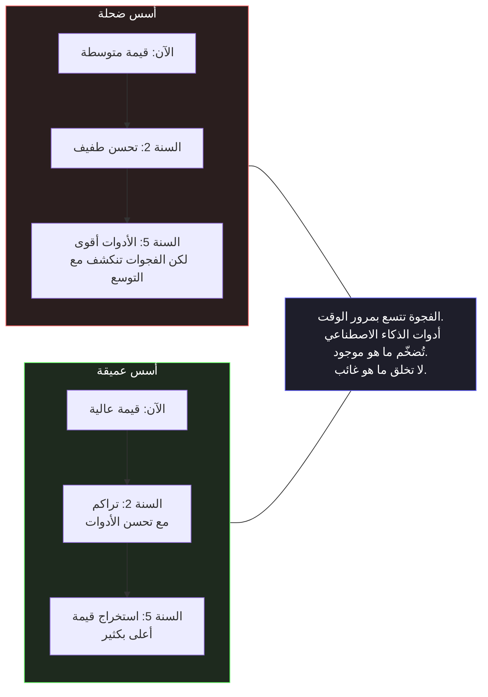

<div dir="rtl">

# القسم السادس — بناء المهارات التي تتجاوز الأدوات

## سؤال الاستثمار

يثير كل تحول تكنولوجي السؤال الاستثماري نفسه: على ماذا ينبغي للمهندسين أن يكرسوا وقتهم المحدود للتعلم؟ فعندما تظهر أداة جديدة تدعي أنها تُؤتمت جزءًا كبيرًا من نشاط هندسي ما، فإن الوعد الضمني هو أن هذا النشاط الذي يتم أتمتته يصبح أقل أهميةً لتطويره يدويًّا. وقد كان هذا الوعد دقيقًا في بعض الأحيان — فقليل من المهندسين اليوم يحتاجون إلى معرفة كيفية إدارة الذاكرة يدويًّا في الأنظمة التي تتولى فيها آلية جمع النفايات Garbage Collection هذه المهمة بشكل صحيح — ومضللًا في أحيان أخرى بطرق تؤدي إلى تخريج مهندسين ذوي فهم سطحي للأنظمة التي يبنونها.

يثير التحول في مجال التطوير المدعوم بالذكاء الاصطناعي هذا السؤال بحدة غير معتادة، لأن الأدوات تتمتع بقدرات استثنائية، كما أن الأتمتة تمتد بعمق غير مسبوق في المكونات الهندسية. فنموذج اللغة لا يقتصر على إنتاج النماذج الجاهزة Boilerplate فحسب، بل يمكنه أيضًا إنشاء تطبيقات ذات بنية معقدة، ووثائق، ومجموعات اختبارات، واستراتيجيات إعادة هيكلة. إن السؤال حول المهارات التي لا تزال تستحق التطوير المكثف ليس سؤالاً أكاديميًّا فحسب — بل له عواقب مباشرة على نوعية المهندسين الذين سيصبحون الجيل الحالي، وعلى جودة الأنظمة التي سيقوم هذا الجيل ببنائها وصيانتها.


تستنتج الإجابة مباشرةً من التحليل الوارد في الأقسام الخمسة السابقة: إن المهارات التي تزداد قيمتها في عالم مدعوم بالذكاء الاصطناعي هي بالضبط تلك المهارات التي لا تستطيع أدوات الذكاء الاصطناعي توفيرها من الناحية الهيكلية. وهي المهارات المطلوبة لممارسة الحكم المعماري، والحفاظ على حدود المسؤولية، وفهم الأنظمة بعمق كافٍ لتقييم الكود المُنتج في ضوء الظروف التشغيلية الفعلية.

## ما لا تُغني عنه أدوات الذكاء الاصطناعي

حدّدت الأقسام السابقة مجموعة محددة من الأشياء التي لا يستطيع الذكاء الاصطناعي توفيرها: المعرفة بقيود نظامك المحدد، وعقوده السلوكية، وخصائصه التشغيلية، وتاريخ حوادثه. هذه الأشياء لا يمكن ترميزها في أي مجموعة تدريب، لأنها خاصة بسياق نظام معين في لحظة معينة مع فريق معين.

المهارات المطلوبة للعمل مع هذا النوع من المعرفة الخاصة بالسياق لا يمكن الاستغناء عنها بالمقابل. لا يمكن الاستعاضة عنها بنموذج ذكاء اصطناعي أكثر قدرة. ولا يمكن الاستعاضة عنها بـ Prompt أفضل. ولا يمكن الاستعاضة عنها بأي أداة تعمل على الأنماط العامة بدلاً من السياق المحدد، لأن الفجوة بين الأنماط العامة والسياق المحدد هي بالضبط المكان الذي تعيش فيه هذه المهارات وتُحدث فيه فارقاً حقيقياً.

**الاستدلال على الأنظمة الموزعة - Distributed Systems Reasoning.** القدرة على الاستدلال على سلوك النظام في ظل الإخفاق الجزئي - Partial Failure، والوصول المتزامن - Concurrent Access، وتقسيم الشبكة - Network Partitioning، والاتساق النهائي - Eventual Consistency، وتأثيرات التفاعل بين الخدمات — هذه القدرة لا تصبح أقل أهمية حين يستطيع الذكاء الاصطناعي توليد مكونات فردية. إنها تصبح أكثر أهمية بالضبط، لأن المكونات تُولَّد بشكل أسرع والنظام ينمو بتعقيد أسرع، والتفاعلات بين المكونات هي المكان الذي تحدث فيه الإخفاقات الجوهرية التي تُوقف الخدمات وتُكبّد الخسائر. المهندس الذي يفهم كيف تفشل الأنظمة الموزعة تحت الظروف الحقيقية يستطيع تقييم المكونات المُولَّدة بالذكاء الاصطناعي مقابل أنماط الفشل تلك. أما المهندس الذي لا يفهم فليس أمامه إلا مجموعة الاختبارات — التي، كما بيّن القسم الثاني، لا تلتقط سلوك التكامل تحت الظروف التشغيلية الحقيقية.

**الإلمام بعمليات الإنتاج - Production Operations Literacy.** إن فهم ما يحدث للنظام أثناء تشغيله — كيف يستهلك الموارد تحت الضغط، وكيف يتصرف أثناء النشر، وكيف تنتشر الأعطال عبر حدود الخدمات، وما تكشفه بيانات القياس عن سلوكه الفعلي مقارنةً بسلوكه المقصود — ليس من المعرفة التي توفرها أدوات الذكاء الاصطناعي. فهذه الأدوات تولد كودًا يُنفذ في بيئة الإنتاج. يجب على المهندس أن يفهم كيف يتصرف الكود قيد التشغيل فعليًّا في بيئة الإنتاج لتقييم ذلك الكود الذي تم إنشاؤه في ضوء القيود التشغيلية الحقيقية. وهذه هي الخبرة التي تتراكم من خلال تشغيل الأنظمة الحقيقية، وقراءة بيانات القياس عن بُعد الخاصة بالإنتاج، والمشاركة في الاستجابة للحوادث، وبناء مكتبة الأنماط الخاصة بأنماط أعطال الإنتاج التي وصفها القسم الثالث بأنها أساس الحكم المعماري.

**معرفة النطاق - Domain Knowledge.** تُنشئ أدوات الذكاء الاصطناعي تطبيقات صحيحة وفقًا لأنماط البرمجة. لكنها لا تعرف القواعد التجارية، والمتطلبات التنظيمية، والقيود المؤسسية، والثوابت الخاصة بالمجال التي تجعل تطبيقًا معينًا صحيحًا لنظام معين. يجب على المهندس الذي يبني نظامًا لمعالجة المدفوعات أن يكون على دراية كافية ببروتوكولات الدفع، واللوائح المالية، ومتطلبات العمل لتقييم ما إذا كان التطبيق الذي أنشأته الذكاء الاصطناعي صحيحًا لمجاله — وليس صحيحًا فقط وفقًا لأنماط البرمجة العامة. تُكتسب المعرفة بالمجال من خلال قضاء الوقت في هذا المجال. ولا يمكن لأي أداة ذكاء اصطناعي أن تحل محلها.

تشترك هذه العائلات الثلاث من المهارات في خاصية بنيوية تستحق أن تُذكر صراحةً: كل واحدة منها أداة قياس - Measurement Instrument لصحة الكود المُولَّد. الاستدلال على الأنظمة الموزعة يقيس المكونات المُولَّدة مقابل الكيفية التي تفشل بها الأنظمة فعلاً. معرفة تشغيل الإنتاج تقيس الكود المُولَّد مقابل الكيفية التي يتصرف بها الكود فعلاً تحت الحمل. معرفة النطاق تقيس التنفيذات المُولَّدة مقابل الواقع التجاري الذي تخدمه. الذكاء الاصطناعي يُنتج الكود؛ وهذه المهارات هي ما يُمكّن المهندس من الرؤية عبر سطح الكود — بنيته، وتسمياته، وقابلية اختباره — إلى سلوكه في العالم المحدد الذي سيعمل فيه. دون أدوات القياس، يُقيَّم الكود المُولَّد على مظهره فقط: هل يشبه كوداً صحيحاً، وهل يستخدم واجهات برمجية مألوفة، وهل تنجح الاختبارات. ومعها، يُقيَّم على جوهره. هذا التفاوت بين تقييم السطح وتقييم الجوهر هو الفرق بين الإنتاجية والمخاطرة برمته الذي طوّره هذا الفصل، وهو السبب في أن هذه العائلات الثلاث من المهارات — لا البراعة في الـ Prompt ولا الطلاقة في الأدوات — هي الاستثمارات الدائمة.

## منحنى التراكم

العلاقة بين المهارات الهندسية الأساسية وإنتاجية أدوات الذكاء الاصطناعي ليست إضافة معرفة — إنها معرفة تضاعفية. هذا هو منحنى التراكم Compound Curve: المهندس ذو المعرفة العميقة بالأنظمة الموزعة يستخرج قيمة أكبر من أدوات الذكاء الاصطناعي مقارنةً بالمهندس ذي المعرفة الضحلة، والفجوة بينهما تتوسع وتتعمق مع تحسن قدرات الذكاء الاصطناعي جيلاً بعد جيل.



السبب هيكلي: أدوات الذكاء الاصطناعي المتطورة توسع نطاق خبرة المهندس لتشمل المزيد من المشكلات، وبسرعة أكبر. فالمهندس ذو الخبرة المحدودة يستطيع الوصول إلى عدد أكبر من المشكلات بنفس الخبرة المحدودة. أما المهندس ذو الخبرة الواسعة فيستطيع الوصول إلى عدد أكبر من المشكلات بخبرة واسعة. والزيادة في الإنتاجية حقيقية في كلتا الحالتين، لكن الزيادة في الجودة تختلف.

يتقارب المنحنيان في الرسم البياني عند البداية ثم يتباعدان بمرور الوقت، ولهذا السبب يظل التأثير غير مرئي على المدى القصير. في الأشهر الأولى من استخدام الأداة، يُعرب كل من المهندس الذي يعتمد على الأسس السطحية والمهندس الذي يعتمد على الأسس العميقة عن رضاهما عن الأداة: فكلاهما ينتج كمية أكبر من الكود يوميًا، وكلاهما يمر بتجارب مراجعة متشابهة، وكلاهما يلاحظان نفس الانخفاض في الجهد المبذول في كتابة النماذج الجاهزة. يتأخر الاختلاف في الظهور لأنه لا يتجلى في ما تنتجه الأدوات — بل يتجلى في ما يبقى في مرحلة الإنتاج. لا يمكن تمييز الكود الذي يولده المهندس الذي يعتمد على الأساسيات السطحية عن كود المهندس الذي يعتمد على الأساسيات العميقة عند المراجعة؛ فهو يختلف في الافتراضات التي يضعها حول النظام، وتظهر هذه الاختلافات بعد أسابيع أو أشهر، في الحادثة التي لا يستطيع المهندس الذي يعتمد على الأساسيات السطحية تشخيصها لأن الفجوة نفسها التي تسببت في حدوثها تمنعه من فهمها.

هذا التأخر في الظهور هو السبب وراء سوء تفسير منحنى التراكم في كثير من الأحيان. تُقيّم الفرق استخدام أدوات الذكاء الاصطناعي بناءً على مقاييس قصيرة المدى — مثل سرعة الـ Pull Request، وعدد أسطر الكود، وإنجاز المهام Story Completion — والتي تتحسن جميعها على الفور وبشكل متماثل عبر كلا المنحنيين. أما الاختلاف فيكمن في المؤشرات ذات الآفاق الأطول: تواتر الحوادث لكل تغيير تم نشره، ومتوسط الوقت اللازم للحل، ونسبة حالات الفشل في بيئة الإنتاج التي تتطلب تحليلاً متعمقاً لفهمها. وبحلول الوقت الذي تتباعد فيه هذه المقاييس، تكون الفرق قد استثمرت بالفعل سنوات في سير العمل المدفوع بالأدوات، ويكون الاختلاف الهيكلي بينها قد ترسخ في قواعد كود أنظمتها. ويُعد المنحنى مركبًا لأن الفجوة لا تنمو فقط من جراء التحسين المستمر في الجانب العميق، بل أيضًا من جراء استمرار حالات الفشل في الإنتاج في الجانب السطحي — حيث تضيف كل حادثة قيودًا ضمنية تجعل التقييم التالي للمهندس السطحي أكثر صعوبة.

لنأخذ مثالاً ملموساً لمهندس يتمتع بمعرفة عميقة ببيئة تشغيل .NET: ضغط عملية جمع النفايات Garbage Collection، وسلوك تجمع الخيوط Thread Pool، والحمل الإضافي لآلة الحالة غير المتزامنة Async State Machines، والتفاعل بين دورة حياة HttpClient وإدارة تجمع الاتصالات. عندما تولد أدوات الذكاء الاصطناعي كودًا سيتم تشغيله في ظل هذه القيود، يمكن لهذا المهندس تقييم الكود المولد مقارنةً بالسلوك الفعلي لبيئة التشغيل بدلاً من مواصفاتها. يمكنه، على سبيل المثال، تحديد أن التنفيذ الذي أنشأته الذكاء الاصطناعي يخصص إغلاقًا Closure في المسارات الحارة Hot Paths سيؤدي إلى ضغط جمع النفايات GC بين الأجيال في ظل نمط حركة المرور الذي يواجهه نظامه فعليًّا. لا يمكن للمهندس الذي يفتقر إلى تلك المعرفة ببيئة التشغيل إجراء هذا التقييم من خلال مراجعة الكود وحدها. سيحتاج إلى اكتشاف ذلك من خلال تحليل أداء الإنتاج — بعد النشر.

ومع ازدياد قدرات أدوات الذكاء الاصطناعي، تزداد هذه الديناميكية حدة. فالأدوات الأكثر قدرة تُنتج تطبيقات أكثر اكتمالاً تبدو أكثر صحة. ويزداد نطاق ما يحتاج إلى التقييم. ويكون لدى المهندس الذي يمتلك معرفة عميقة ببيئة التشغيل المزيد ليقيّمه — بالإضافة إلى الأدوات التي تساعده على تقييمه بسرعة. أما المهندس الذي يفتقر إلى هذه المعرفة، فيواجه الفجوة نفسها، التي تتجلى الآن عبر حجم أكبر من الكود المُنتج.

## الاستثمار التعليمي الذي يتراكم

بناءً على هذا التحليل، فإن السؤال حول أين يجب تخصيص وقت التعلم له إجابة واضحة: في الأساسيات التي لا يمكن للذكاء الاصطناعي توفيرها، وتطبيقها على أنظمة حقيقية في ظروف حقيقية.

بالنسبة للمهندسين العاملين في منظومة .NET، يعني هذا عدة مجالات محددة للاستثمار.

**بيئة تشغيل .NET وداخلية CLR.** فهم كيفية تخصيص CLR للذاكرة، وكيفية إدارة جامع النفايات Garbage Collector للضغط بين الأجيال Generational Pressure، وكيفية عمل توزيع تجمع الخيوط Thread Pool، وكيفية تصريف آلات الحالة غير المتزامنة، وكيفية قيام المُصرِّف JIT بتحسين المسارات الحارة Hot Paths — هذه المعرفة لا تنتهي صلاحيتها مع أجيال أدوات الذكاء الاصطناعي. فهي تُسترشد بها عملية تقييم كل جزء من الكود الذي يتم إنشاؤه ويُشغَّل على بيئة تشغيل .NET. وتتمثل الموارد اللازمة لذلك في وثائق CLR، والكود المصدري لبيئة التشغيل نفسها، وكتابات المهندسين الذين أجروا تحليلات متعمقة لبيئة التشغيل. والاستثمار كبير، لكن عائده يتراكم على المدى الطويل.

```csharp id="code-01-06"
// Target Framework: .NET 8.0
// Chapter: 01 | Section: 06
// book/chapters/chapter-01/sections/section-06.ar.md
//
// الذكاء الاصطناعي يُولّد تنفيذاً لمعالجة بيانات عالية الإنتاجية
// في .NET Worker Service. التنفيذ صحيح معمارياً.
// مهندس ذو معرفة عميقة بوقت تشغيل .NET يكتشف مشكلة دقيقة
// لا تكشفها مراجعة الكود وحدها.

// ── التنفيذ المُولَّد بالذكاء الاصطناعي ─────────────────────────────────

public sealed class DataProcessingWorker : BackgroundService
{
    private readonly IMessageBus _bus;
    private readonly IDataProcessor _processor;
    private readonly ILogger<DataProcessingWorker> _logger;

    protected override async Task ExecuteAsync(CancellationToken stoppingToken)
    {
        await foreach (var batch in _bus.ReadBatchesAsync(stoppingToken))
        {
            var results = await Task.WhenAll(
                batch.Messages.Select(m => _processor.ProcessAsync(m, stoppingToken)));

            await _bus.AcknowledgeAsync(batch.BatchId, stoppingToken);
            _logger.LogInformation(
                "Processed batch {BatchId} with {Count} messages",
                batch.BatchId, results.Length);
        }
    }
}

// ── ما يراه المهندس ذو المعرفة بوقت التشغيل ─────────────────────────────
//
// batch.Messages.Select(m => _processor.ProcessAsync(m, stoppingToken))
//
// تعبير LINQ هذا يُنشئ IEnumerable<Task<ProcessingResult>>.
// Task.WhenAll يُجسّده داخلياً عبر .ToArray().
// Lambda تلتقط stoppingToken — وهو Struct.
// كل Lambda هي تخصيص Closure جديد على الكومة المُدارة - Managed Heap.
//
// عند 1,000 رسالة لكل Batch و50 Batch في الثانية:
//   → 50,000 تخصيص Closure في الثانية
//   → كل تخصيص كائن Gen0 قصير العمر
//   → توقفات GC Gen0 كل ~100ms
//   → توقفات GC تستهلك ~5% من إجمالي الإنتاجية
//
// الإصلاح: إزالة Closure بتجسيد Batch في Array قبل LINQ.
//
// الكود المُولَّد صحيح معمارياً، ومجموعة الاختبارات تنجح.
// التدهور في الأداء لا يظهر إلا تحت حمل الإنتاج الفعلي،
// ولا يمكن تشخيصه إلا بمهندس يعرف كيف يتفاعل Closure مع GC متعدد الأجيال.

// ── التنفيذ المُصحَّح ─────────────────────────────────────────────────────

protected override async Task ExecuteAsync(CancellationToken stoppingToken)
{
    await foreach (var batch in _bus.ReadBatchesAsync(stoppingToken))
    {
        var messages = batch.Messages.ToArray(); // تجسيد مرة واحدة
        var tasks    = new Task<ProcessingResult>[messages.Length];

        for (int i = 0; i < messages.Length; i++)
            tasks[i] = _processor.ProcessAsync(messages[i], stoppingToken);

        var results = await Task.WhenAll(tasks);
        await _bus.AcknowledgeAsync(batch.BatchId, stoppingToken);
        _logger.LogInformation(
            "Processed batch {BatchId} with {Count} messages",
            batch.BatchId, results.Length);
    }
}

// هذا ليس تحسيناً دقيقاً - Micro-Optimization. على نطاق الإنتاج،
// الفرق بين التنفيذين يُقاس في تواتر توقفات GC،
// وكمون P99 - P99 Latency وسقف الإنتاجية - Throughput Ceiling.
// المعرفة التي تجعل الفارق مرئياً هي معرفة وقت التشغيل، لا معرفة الأنماط.
// لا تستطيع أي أداة ذكاء اصطناعي توفيرها.
```

**نظرية الأنظمة الموزعة وممارستها.** نماذج الاتساق - Consistency Models، وبروتوكولات الإجماع - Consensus Protocols، وتحمّل التقسيم - Partition Tolerance، وأنماط الاتساق النهائي - Eventual Consistency، وتصنيف الفشل في الأنظمة الموزعة — هذه المفاهيم هي المفردات التي تُفهم بها المشكلات وتُحلّ في أنظمة الإنتاج الموزعة وتُقيَّم بها مكوناتها المُولَّدة. المهندس الذي لا يعرف ما تعنيه "التسليم مرة واحدة بالضبط - Exactly-Once" بشكل صحيح، ولماذا هي مستحيلة في النظام الموزع بدون قيود محددة، وما الذي تعنيه "التسليم الفعلي مرة واحدة - Effectively-Once" عملياً، لا يستطيع تقييم تنفيذ نشر الأحداث المُولَّد بالذكاء الاصطناعي مقابل تلك القيود. والاستثمار فيه هو قراءة الأدبيات الأكاديمية والمهنية: أوراق الأنظمة الموزعة المتاحة مجاناً، وتحليلات ما بعد الحادثة من كبرى المنظمات الهندسية، والكتب التي تُترجم النظرية إلى ممارسة إنتاجية.

**الخبرة الإنتاجية مع الأنظمة الحقيقية.** لا بديل عن التشغيل تحت الظروف الحقيقية: مراقبة المقاييس أثناء عمليات النشر، والمشاركة في الاستجابة للحوادث، وقراءة تحليلات ما بعد الحادثة بالدقّة التي تميّز التعلم الهندسي عن الاهتمام القصصي، وتهيئة الأنظمة بأدوات قياس عميقة بما يكفي لتجعل بيانات المراقبة تكشف ما يحدث فعلاً لا ما صُمِّم ليحدث. هذه الخبرة تبني مكتبة الأنماط التي تجعل الحكم المعماري ممكناً، ولا يمكن تسريعها بأدوات الذكاء الاصطناعي، بل بالوقت في الإنتاج فقط.

والاستثمار العملي الأكثر قيمة الذي يستطيع مهندس .NET القيام به في اللحظة الراهنة هو بناء ما يمكن تسميته "خريطة الأنماط الشخصية" — مجموعة موثقة من أنماط الفشل التي لاقاها في الأنظمة الحقيقية وفهمها بعمق. هذه الخريطة ليست قائمة نظرية لأنماط الفشل المحتملة — إنها ذاكرة هندسية ملموسة مبنية على تجربة شخصية مع أنظمة محددة تحت ظروف محددة.

كل حادثة في الإنتاج، عند التحقيق فيها بعمق كافٍ، تُضيف نمطاً إلى هذه الخريطة: نمط الفشل المحدد الذي انكشف، والافتراض الذي خانه، والظروف التي فعّلته، والإشارات في بيانات المراقبة التي يجب مراقبتها لاكتشافه مبكراً في المستقبل. المهندس الذي يُحقق في حوادث الإنتاج بهذا العمق ويوثق ما يتعلمه يبني بمرور الوقت مورداً هندسياً لا تستطيع أي أداة ذكاء اصطناعي توفيره: معرفة ملموسة ومُختبَرة بكيفية فشل الأنظمة الحقيقية في البيئات الحقيقية.

هذه الخريطة هي الحكم المعماري في صورته الأكثر قيمة. وهي بالضبط ما يُمكّن المهندس من تقييم الكود المُولَّد بالذكاء الاصطناعي بدقة تتجاوز ما تستطيع مراجعة الكود التقليدية اكتشافه — لأن التقييم يُجرى مقابل أنماط فشل حقيقية مُختبَرة، لا مقابل مواصفات نظرية.

وهذه الخبرة المُكتسَبة من الممارسة الفعلية، المُدعَّمة بالنظرية الصحيحة، وبأدوات الذكاء الاصطناعي التي تُضخّمها وتُوسّع نطاق تطبيقها، هي ما يُنتج المهندس الذي يبني أنظمة تصمد في الإنتاج وتتطور بشكل مستدام عبر الزمن وعبر الفِرق المتعاقبة.

وأخيراً، الطريقة العملية لبناء خريطة الأنماط هي التحويل النشط لكل حادثة إنتاج إلى مدخل في الخريطة: تسجيل نمط الفشل، والظروف المُفعِّلة، والاقتراحات للمراقبة المبكرة. هذا التحويل النشط هو ما يُميّز المهندس الذي يتراكم حكمه من المهندس الذي يمر بالحوادث دون استخراج المعرفة منها.

وخلاصة القول: الاستثمار في العمق الهندسي الحقيقي، وتقنية وقت التشغيل، ونظرية الأنظمة الموزعة، وخبرة الإنتاج الفعلية، يبقى الاستثمار الأعلى عائداً على المدى البعيد في عالم تتطور فيه أدوات الذكاء الاصطناعي باستمرار.

## ما يعنيه هذا لقراءة هذا الكتاب

الحجة التي يُقدّمها هذا الفصل لها تداعيات محددة على كيفية التعامل مع المادة التي تلي. هذا الكتاب يفحص التطوير بمساعدة الذكاء الاصطناعي لمنظومة .NET بعمق — أنماط التكامل، واستراتيجيات المرونة، ومناهج الاختبار، ومتطلبات المراقبة، واعتبارات الأمان، والأنماط المعمارية، وديناميكيات الفريق. لكل موضوع من هذه المواضيع بُعد أدوات الذكاء الاصطناعي: كيف تُسرّع أدوات الذكاء الاصطناعي العمل، وما الذي تُولّده بشكل صحيح، وأين تُخفق بطرق قابلة للتنبؤ.

لكن بُعد أداة الذكاء الاصطناعي ليس الدرس الأساسي في أي فصل. الدرس الأساسي هو الجوهر الهندسي: ما الذي تتطلبه المرونة الموزعة حقاً في بيئات الإنتاج الفعلية، وكيف يختلف اختبار الكود المُولَّد بالذكاء الاصطناعي عن اختبار الكود المكتوب يدوياً ولماذا يختلف هيكلياً، وما الذي يجب أن تلتقطه المراقبة عن نظام مُدمَج بالذكاء الاصطناعي لإدارته بفعالية في الإنتاج، ولماذا يختلف سطح الأمان لنظام قائم على Prompt عن الـ API التقليدي. بُعد أداة الذكاء الاصطناعي هو تطبيق ذلك الجوهر الهندسي لا بديل عنه.

المهندس الذي يقرأ هذا الكتاب بحثاً عن نصائح الأدوات سيستخرج بعض القيمة العملية. المهندس الذي يقرأه لاستيعاب الجوهر الهندسي سيستخرج قيمة تتراكم وتتضاعف مع تغيّر الأدوات — لأن الجوهر هو ما تُضخّمه الأدوات.

الفصل التالي يفحص هذا التضخيم من زاوية مختلفة: ليس كيف يجب أن يفكر المهندسون في أدوات الذكاء الاصطناعي، بل كيف تعمل أدوات الذكاء الاصطناعي فعلاً، وأين تفشل بطرق قابلة للتنبؤ، وكيف تبدو النماذج الذهنية الدقيقة لسلوكها. ذلك الفهم هو الأساس الذي يُمكّن من استخدامها بشكل مثمر.

## خطر التحسين لجيل الأدوات الحالي

ثمة خطر محدد في اللحظة الراهنة يستحق التسمية الصريحة: خطر تحسين استثمار التعلم لقدرات وواجهات الجيل الحالي من الأدوات، على حساب الأسس الهندسية التي تعتمد عليها تلك الأدوات وستعتمد عليها الأجيال القادمة.

واجهة تفاعل المهندسين مع أدوات الذكاء الاصطناعي تتغيّر بشكل أسرع من المشكلات الهندسية الأساسية التي تُساعد تلك الأدوات على حلها. تقنيات هندسة الـ Prompt الفعّالة اليوم ستكون مختلفة بعد عامين مع تطور معماريات النماذج واتساع نوافذ السياق. الأنماط المحددة لـ API و SDK لتكامل خدمات النموذج اللغوي ستتطور مع تطور الخدمات نفسها. المهندس الذي يستثمر بكثافة في فهم أنماط الواجهة المحددة للجيل الحالي من الأدوات يُجري استثماراً عالي الإهلاك.

المشكلات الهندسية في المقابل لا تنخفض قيمتها. الأنظمة الموزعة تُبدي نفس أنماط الفشل الجوهرية التي أبدتها لعقود، لأن تلك الأنماط هي خصائص بيئة الحوسبة الموزعة، لا التقنيات المحددة المستخدمة لبناء الأنظمة الموزعة. نظرية CAP - CAP Theorem لن تُلغى. انقطاعات الشبكة لن تصبح مستحيلة. التفاعل بين الكتابات المتزامنة والاتساق النهائي لن يصبح أبسط. المهندس الذي يستثمر في فهم هذه الأنماط يبني معرفة تتراكم وتزداد قيمةً عبر كل جيل من الأدوات.

التداعيات العملية هي تخصيص محدد لاستثمار التعلم. الوقت المستثمر في فهم وقت تشغيل .NET، ونظرية الأنظمة الموزعة، وتشغيل الإنتاج، ونمذجة النطاق، والأنماط المعمارية التي تعالج أنماط الفشل المحددة للأنظمة قيد البناء هو وقت تتراكم عوائده عبر السنوات وعبر أجيال الأدوات. وأما الوقت المستثمر في فهم واجهات الجيل الحالي من الأدوات فهو أسرع إهلاكاً.

هذا لا يعني تجاهل الأدوات. إنه يعني الحفاظ على النسبة الصحيحة: مقدار كافٍ من الألفة بالأدوات لاستخدامها بشكل مثمر، وعمق كافٍ في الأسس لتقييم ما تُنتجه بشكل صحيح. المهندسون الذين سيستخرجون أكبر قيمة من أدوات الذكاء الاصطناعي بعد خمس سنوات هم الذين يستثمرون في الأسس اليوم، لا الذين يُحسّنون تحسيناً مبالغاً فيه لواجهة الأداة الحالية.

ثمة تصوّر شائع يستحق المواجهة المباشرة: أن المهندسين الذين يُجيدون التعامل مع أدوات الذكاء الاصطناعي سيحلون محل المهندسين الذين لا يُجيدونه، وأن هذا هو المتغير الأساسي الذي سيُحدد المسار الوظيفي للمهندس خلال السنوات القادمة. هذا التصور خاطئ، لكنه خاطئ بطريقة دقيقة تستحق الفهم الدقيق.

التمييز الوظيفي الحقيقي لن يكون بين من يستخدم أدوات الذكاء الاصطناعي ومن لا يستخدمها — فالاستخدام سيصبح معياراً أساسياً لا ميزةً تنافسية بسرعة كبيرة. التمييز الحقيقي سيكون بين المهندس الذي يستخدم تلك الأدوات لتوليد كود يفهمه عميقاً ويستطيع الدفاع عنه هندسياً وتشغيلياً، والمهندس الذي يستخدمها لتوليد كود يُنجز المهام الظاهرة لكنه يُراكم ديناً تقنياً خفياً لا يُكتشف إلا حين يتفاقم. الأول يُبني سمعة مهنية على الموثوقية؛ الثاني يُبني سمعة على السرعة التي تتحول إلى عبء مع الوقت.

المهارات التي تُميّز الأول عن الثاني هي بالضبط المهارات التي ناقشها هذا الفصل: الحكم المعماري الذي يُقيّم التداعيات النظامية للكود المُولَّد، وحدود المسؤولية التي تضمن الفهم قبل النشر، وعمق معرفة وقت التشغيل والأنظمة الموزعة الذي يُمكّن من اكتشاف المشكلات قبل أن تُكلّف الإنتاج.

بقية هذا الكتاب مبني على هذه النسبة. كل فصل يفحص نطاقاً من الممارسات الهندسية — تصحيح الأخطاء، والاختبار، والمعمارية، والأمان، وقابلية الرصد — ويُعالج كلاً من الجوهر الهندسي الأساسي وتطبيق أدوات الذكاء الاصطناعي. الهدف ليس جولة في قدرات الأدوات الحالية، بل تطوير الحكم المعماري الذي يجعل تلك القدرات مفيدة فعلاً.

---

*فحص القسم السادس العلاقة التراكمية بين المهارات الهندسية الأساسية وإنتاجية أدوات الذكاء الاصطناعي، وحدّد استثمارات المهارات المحددة التي تتراكم قيمتها بمرور الوقت، وأسّس الحجة على مثال ملموس من وقت التشغيل يميّز معرفة الأنماط عن معرفة وقت التشغيل. وقد جادل الفصل طواله بأن التحوّل الهندسي الجاري هو تحوّل في الطريقة المعرفية — من التركيز على التنفيذ إلى التركيز على المعمارية — وأن أدوات الذكاء الاصطناعي تكون في أقصى قيمتها لدى المهندسين الذين قاموا بهذا التحوّل بالفعل. ويتناول الفصل الثاني أنظمة الذكاء الاصطناعي نفسها: كيف تعمل، وأين تفشل، وكيف تبدو النماذج الذهنية الدقيقة لسلوكها.*

</div>