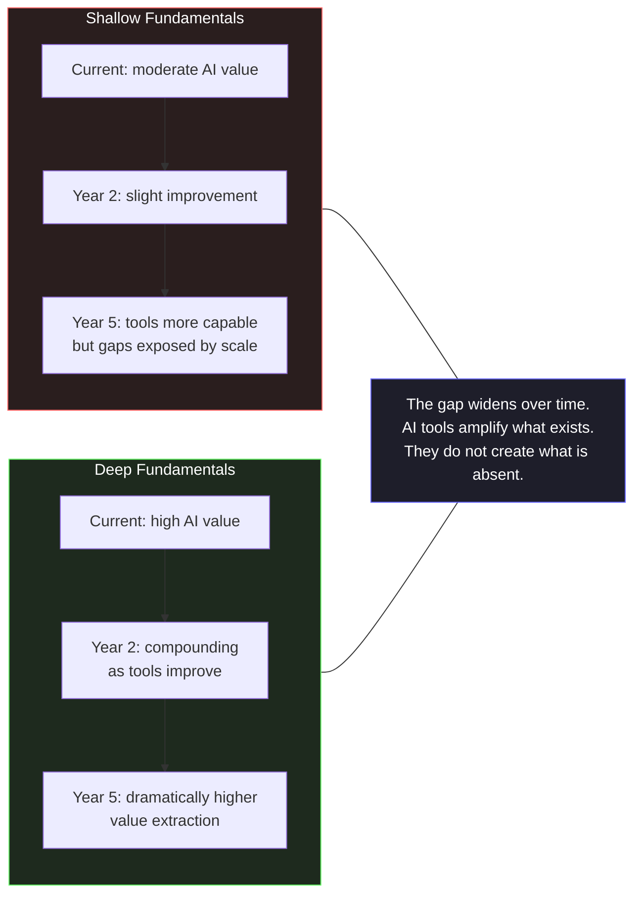

# Section 06 — Building Skills That Outlast Tools

## The Investment Question

Every technology transition raises the same investment question: what should engineers spend their finite learning time on? When a new tool arrives that claims to automate a significant part of an engineering activity, the implicit promise is that the activity being automated becomes less important to develop manually. This promise has sometimes been accurate — few engineers today need to know how to manage memory manually in systems where garbage collection handles it correctly — and sometimes misleading in ways that produce engineers with shallow understanding of the systems they build.

The AI-assisted development transition raises this question with unusual sharpness, because the tools are unusually capable and the automation extends unusually deep into the engineering stack. A language model can generate not just boilerplate but architecturally non-trivial implementations, documentation, test suites, and refactoring strategies. The question of what skills remain worth developing intensively is not academic — it has direct consequences for the kind of engineers the current generation will become, and for the quality of the systems that generation will build and maintain.

The answer follows directly from the analysis in the previous five sections: the skills that compound in value in an AI-augmented world are precisely the skills that AI tools structurally cannot supply. They are the skills required to exercise architectural judgment, to maintain the responsibility boundary, and to understand systems deeply enough to evaluate generated code against real operational conditions.

## What AI Tools Cannot Make Unnecessary

The previous sections identified a specific set of things the AI cannot provide: knowledge of your specific system's constraints, behavioral contracts, operational characteristics, and failure history. These things cannot be encoded in any training corpus, because they are specific to a particular system's particular context.

The skills required to work with this kind of system-specific knowledge are correspondingly irreplaceable. They are not replaceable by a more capable AI model. They are not replaceable by a better prompt. They are not replaceable by any tool that operates on general patterns rather than specific context, because the gap between general patterns and specific context is exactly where these skills live.

**Distributed systems reasoning.** The ability to reason about system behavior under partial failure, concurrent access, network partitioning, eventual consistency, and the interaction effects between services is not a skill that becomes less important when AI can generate individual components. It becomes more important, because the components are generated faster, the system grows more complex more quickly, and the interactions between components are where the consequential failures occur. An engineer who understands how distributed systems fail under real conditions can evaluate AI-generated components against those failure modes. An engineer who does not must rely on the test suite — which, as Section 02 demonstrated, does not capture integration behavior under real operational conditions.

**Production operations literacy.** Understanding what happens to a running system — how it consumes resources under load, how it behaves during deployment, how failures propagate across service boundaries, what the telemetry reveals about its actual behavior versus its intended behavior — is not knowledge that AI tools supply. They generate code that will run in production. The engineer must understand how running code actually behaves in production to evaluate that generated code against real operational constraints. This is experience that accumulates through operating real systems, reading production telemetry, participating in incident response, and building the pattern library of production failure modes that Section 03 described as the foundation of architectural judgment.

**Domain knowledge.** AI tools generate implementations that are correct against programming patterns. They do not know the business rules, regulatory requirements, organizational constraints, and domain-specific invariants that make a particular implementation correct for a particular system. An engineer building a payment processing system must know enough about payment protocols, financial regulations, and business requirements to evaluate whether an AI-generated implementation is correct for their domain — not just correct against generic programming patterns. Domain knowledge is acquired through time in the domain. No AI tool can substitute for it.

These three skill families share a structural property that is worth stating explicitly: each one is a *measurement instrument* for the correctness of generated code. Distributed systems reasoning measures generated components against how systems actually fail. Production operations literacy measures generated code against how code actually behaves under load. Domain knowledge measures generated implementations against the business reality they serve. The AI produces code; these skills are what let the engineer see through the code's surface — its structure, its naming, its testability — to its behavior in the specific world where it will run. Without the instruments, the generated code is evaluated only on its appearance: does it look like correct code, does it use idiomatic APIs, do the tests pass. With the instruments, it is evaluated on its substance. The asymmetry between surface evaluation and substance evaluation is the entire productivity-versus-risk difference that the chapter has developed, and it is why these three skill families — not prompt proficiency, not tool fluency — are the durable investments.

## The Compound Curve

The relationship between foundational engineering skills and AI tool productivity is not additive — it is multiplicative. This is the compound curve: an engineer with deep distributed systems knowledge extracts more value from AI tools than an engineer with shallow knowledge, and the gap between them grows as AI capabilities increase.



The reason is structural: better AI tools extend the reach of the engineer's judgment to more problems, more quickly. An engineer whose judgment is shallow is extended across more problems with the same shallow judgment. An engineer whose judgment is deep is extended across more problems with deep judgment. The productivity gain is real in both cases. The quality gain is different.

The diagram's two curves converge at the start and diverge over time, which is why the effect is invisible in the short term. In the first months of adoption, the shallow-fundamentals engineer and the deep-fundamentals engineer both report satisfaction with the tools: both produce more code per day, both have similar review experiences, both observe the same reduction in boilerplate effort. The divergence is delayed because it is not expressed in what the tools produce — it is expressed in what survives production. The shallow engineer's generated code is indistinguishable at review time from the deep engineer's; it differs in the assumptions it makes about the system, and those differences surface weeks or months later, in the incident that the shallow engineer cannot diagnose because the same gap that produced it prevents understanding it.

This delayed expression is why the compound curve is so frequently misread. Teams evaluate AI tooling adoption on short-horizon metrics — pull request velocity, lines of code, story completion — all of which improve immediately and identically across both curves. The divergence lives in metrics with longer horizons: incident frequency per deployed change, mean time to resolve, the fraction of production failures that require archaeology to understand. By the time those metrics diverge, the teams have already invested years in tool-driven workflows, and the structural difference between them is embedded in their systems' codebases. The curve is compound because the gap grows not only from continued improvement on the deep side but from continued production failure on the shallow side — each incident adding implicit constraints that make the shallow engineer's next evaluation harder.

Consider the concrete example of an engineer with deep knowledge of the .NET runtime: garbage collection pressure, thread pool behavior, async state machine overhead, the interaction between HttpClient lifetime and connection pool management. When AI tools generate code that will run under these constraints, this engineer can evaluate the generated code against the runtime's actual behavior rather than its specification. They can identify, for example, that an AI-generated implementation allocates a closure in a hot path that will create generational GC pressure under the traffic pattern their system actually experiences. An engineer without that runtime knowledge cannot make this evaluation from code review alone. They would need to discover it through production profiling — after deployment.

As AI tools become more capable, this dynamic intensifies. More capable tools generate more complete implementations that look more correct. The surface area of what needs to be evaluated increases. The engineer with deep runtime knowledge has more to evaluate — and the tools to help them evaluate it quickly. The engineer without it has the same gap, now expressed across a larger volume of generated code.

## The Learning Investment That Compounds

Given this analysis, the question of where to invest learning time has a clear answer: in the fundamentals that the AI cannot supply, applied to real systems under real conditions.

For engineers working in the .NET ecosystem, this means several concrete areas of investment.

**The .NET runtime and CLR internals.** Understanding how the CLR allocates memory, how the garbage collector manages generational pressure, how the thread pool dispatches work, how async state machines are compiled, how the JIT compiler optimizes hot paths — this knowledge does not expire with AI tool generations. It informs the evaluation of every generated piece of code that runs on the .NET runtime. The resources for this are the CLR documentation, the source code of the runtime itself, and the writings of engineers who have done deep runtime analysis. The investment is significant, but the compounding is long-lived.

```csharp id="code-01-06"
// Target Framework: .NET 8.0
// Chapter: 01 | Section: 06
// book/chapters/chapter-01/sections/section-06.en.md
//
// AI generates a high-throughput data processing implementation for a
// .NET Worker Service. The implementation is architecturally correct.
// An engineer with deep .NET runtime knowledge finds a subtle issue
// that code review alone would not reveal.

// ── AI-generated implementation ───────────────────────────────────────────

public sealed class DataProcessingWorker : BackgroundService
{
    private readonly IMessageBus _bus;
    private readonly IDataProcessor _processor;
    private readonly ILogger<DataProcessingWorker> _logger;

    protected override async Task ExecuteAsync(CancellationToken stoppingToken)
    {
        await foreach (var batch in _bus.ReadBatchesAsync(stoppingToken))
        {
            var results = await Task.WhenAll(
                batch.Messages.Select(m => _processor.ProcessAsync(m, stoppingToken)));

            await _bus.AcknowledgeAsync(batch.BatchId, stoppingToken);

            _logger.LogInformation(
                "Processed batch {BatchId} with {Count} messages",
                batch.BatchId, results.Length);
        }
    }
}

// ── What the runtime-aware engineer sees ─────────────────────────────────
//
// batch.Messages.Select(m => _processor.ProcessAsync(m, stoppingToken))
//
// This LINQ expression creates an IEnumerable<Task<ProcessingResult>>.
// Task.WhenAll materializes it by calling .ToArray() internally.
// The Select lambda captures `stoppingToken` — a struct.
// Each lambda is a new closure allocation on the managed heap.
//
// At 1,000 messages per batch and 50 batches per second:
//   → 50,000 closure allocations per second
//   → Each allocation is a short-lived gen0 object
//   → At this rate, GC gen0 collections occur every ~100ms
//   → Each gen0 collection pauses all managed threads
//   → At 50 batches/sec, GC pauses consume ~5% of total throughput
//
// The fix: eliminate the closure by not capturing the token in a lambda,
// or pre-materialize the batch into an array before the LINQ chain.
//
// The AI-generated code is architecturally correct. The test suite passes.
// The performance degradation is only visible under production load,
// and only diagnosable by an engineer who knows how closures and the
// generational GC interact.

// ── Corrected implementation ──────────────────────────────────────────────

protected override async Task ExecuteAsync(CancellationToken stoppingToken)
{
    await foreach (var batch in _bus.ReadBatchesAsync(stoppingToken))
    {
        // Materialize once — no repeated LINQ evaluation, no closure over CT.
        var messages = batch.Messages.ToArray();
        var tasks    = new Task<ProcessingResult>[messages.Length];

        for (int i = 0; i < messages.Length; i++)
            tasks[i] = _processor.ProcessAsync(messages[i], stoppingToken);

        var results = await Task.WhenAll(tasks);

        await _bus.AcknowledgeAsync(batch.BatchId, stoppingToken);

        _logger.LogInformation(
            "Processed batch {BatchId} with {Count} messages",
            batch.BatchId, results.Length);
    }
}

// This is not a micro-optimization. At production scale, the difference
// between these two implementations is measurable in GC pause frequency,
// P99 latency, and throughput ceiling.
// The knowledge that makes the difference visible is runtime knowledge,
// not pattern knowledge. No AI tool can supply it.
```

**Distributed systems theory and practice.** Consistency models, consensus protocols, partition tolerance, eventual consistency patterns, the failure taxonomy of distributed systems — these concepts are the vocabulary in which production distributed systems problems are understood and solved. They are also the vocabulary in which AI-generated distributed system components must be evaluated. An engineer who does not know what "exactly-once delivery" actually means, why it is impossible in a distributed system without specific constraints, and what "effectively-once" means in practice cannot evaluate an AI-generated event publishing implementation against those constraints. The investment is in reading the academic and practitioner literature — the distributed systems papers that are freely available, the postmortems from major engineering organizations, the books that translate the theory into production practice.

**Production experience with real systems.** There is no substitute for operating systems under real conditions: watching metrics during deployments, participating in incident response, reading post-mortems with the specificity that distinguishes engineering learning from narrative interest, instrumenting systems deeply enough that the telemetry reveals what is actually happening rather than what was designed to happen. This experience builds the pattern library that makes architectural judgment possible. It cannot be accelerated by AI tools, only by time in production.

## What This Means for How to Approach This Book

The argument of this chapter has a specific implication for how to approach the material that follows. This book examines AI-assisted development for the .NET ecosystem in depth — the integration patterns, the resilience strategies, the testing approaches, the observability requirements, the security considerations, the architectural patterns, the team dynamics. Each of these topics has an AI tool dimension: how AI tools can accelerate the work, what they generate correctly, where they fail.

But the AI tool dimension is not the primary lesson. The primary lesson in each chapter is the engineering substance: what distributed resilience actually requires, how testing AI-generated code differs from testing hand-written code and why, what observability must capture about an AI-integrated system, why the security surface of a prompt-based system is different from a traditional API. The AI tool dimension is the application of that engineering substance.

An engineer who reads this book for the tool tips will extract some practical value. An engineer who reads it for the engineering substance will extract value that compounds as tools change — because the substance is what the tools amplify.

The next chapter examines that amplification from a different angle: not how engineers should think about AI tools, but how AI tools actually work, where they fail, and what accurate mental models of their behavior look like. That understanding is the foundation for using them well.

## The Danger of Optimizing for the Current Tool Generation

There is a specific risk in the current moment of AI-assisted development that is worth naming directly: the risk of optimizing learning investment for the capabilities and interfaces of the current generation of tools, at the expense of the fundamentals those tools rely on.

The interface through which engineers interact with AI tools changes faster than the underlying engineering problems those tools help solve. The prompt engineering techniques that are effective today will be different from those that are effective in two years, as model architectures change and context windows expand. The specific APIs and SDK patterns for integrating language model services will evolve as the services themselves evolve. An engineer who invests heavily in understanding the current tool generation's specific interface patterns is making a high-depreciation investment.

The engineering problems, by contrast, do not depreciate. Distributed systems exhibit the same fundamental failure modes they have exhibited for decades, because those failure modes are properties of the distributed computing environment, not of the specific technologies used to build distributed systems. The CAP theorem is not going to be repealed. Network partitions are not going to become impossible. The interaction between concurrent writes and eventual consistency is not going to become simpler. An engineer who invests in understanding these failure modes is building knowledge that compounds across every generation of tools that help build distributed systems.

The practical implication is a specific allocation of learning investment. Time spent understanding the .NET runtime, distributed systems theory, production operations, domain modeling, and the architectural patterns that address the specific failure modes of the systems being built is time whose return compounds over years and across tool generations. Time spent understanding current tool interfaces is valuable but depreciates faster.

This does not mean ignoring tools. It means maintaining the right ratio: enough tool familiarity to use them productively, enough foundational depth to evaluate what they produce correctly. The engineers who will extract the most value from AI tools five years from now are the ones who are investing in fundamentals today, not the ones who are optimizing for the current tool interface.

The remainder of this book is structured around this ratio. Each chapter examines a domain of engineering practice — debugging, testing, architecture, security, observability — and addresses both the foundational engineering substance and the AI tool application. The goal is not a tour of current tool capabilities. It is a development of the architectural judgment that makes those capabilities genuinely useful.

---

*Section 06 has examined the compound relationship between foundational engineering skills and AI tool productivity, identified the specific skill investments that compound over time, and grounded the argument in a concrete runtime example that distinguishes pattern knowledge from runtime knowledge. The chapter has argued throughout that the engineering transformation underway is a shift in cognitive mode — from implementation-centric to architecture-centric — and that AI tools are most valuable to engineers who have already made that shift. Chapter 02 examines the AI systems themselves: how they work, where they fail, and how to build the accurate mental models that make collaboration with them productive.*
