<!-- book/chapters/chapter-02/sections/section-01.ar.md -->
---
chapter: 02
section: 01
title: "ما الذي يفعله النموذج اللغوي الكبير فعلاً: الرموز والتضمينات والسياق والاستدلال"
language: ar
tags: [llm-mechanics, tokens, embeddings, context-window, inference, dotnet]
status: validated
---

<!-- SECTION_METADATA
Chapter: 02
Section: 01
Language: ar
Status: VALIDATED
-->

<div dir="rtl">

# القسم الأول — ما الذي يفعله النموذج اللغوي الكبير فعلاً: الرموز والتضمينات والسياق والاستدلال

## الآلية خلف الواجهة

النموذج اللغوي الكبير - Large Language Model يُنتج كل رمز من خرجه عبر عملية تنبؤ واحدة مُكرَّرة: معطيات تمثّل النص حتى اللحظة الراهنة، وتوزيع احتمالي على الرمز التالي، وأخذ عينة من ذلك التوزيع، وإلحاق الرمز المُنتَج بالمتتالية ثم الإعادة. هذه هي آلية التوليد بأكملها — لا توجد خطوة تخطيط مستقلة، ولا تمثيل داخلي للمشكلة، ولا عملية تشبه الاسترجاع من قاعدة بيانات. كل شيء آخر — مظهر الاستدلال، ومظهر الطلاقة، ومفردات المعمارية، والكود الذي يبدو صحيحاً — هو ما تُنتجه هذه الآلية حين تكون الأرقام تمثيلاً للغة وحين يكون النموذج قد دُرِّب على مجموعة ضخمة من النصوص البشرية.

يصطدم مهندس .NET للمرة الأولى بهذا النموذج بشيء مألوف في مظهره ومُربك في جوهره: يُرسل طلباً فيعود إليه رد، والرد نص — كود C# صحيح نحوياً في أغلب الأحيان، أو تحليل معماري سليم البنية، أو صياغة تحمل نفس مستوى الدقة التقنية التي يتوقعها من زميل أول في جلسة مراجعة تصميم. كل الحدس المبني على سنوات من العمل مع أنظمة حتمية - Deterministic Systems يوحي بأن ثمة شيئاً تحت السطح يُنتج هذا الخرج بطريقة تشبه طريقة الخدمة حين تُنتج استجابةً: تمثيل داخلي للمشكلة، واسترجاع للحقائق ذات الصلة، وعملية تشبه التفكير. لكن الآلية الحقيقية مختلفة جوهرياً — وهي موضوع هذا القسم.

يبني هذا القسم تلك الآلية من الأساس، مستخدماً مفردات وأطراً تنسجم مع المفاهيم التي يملك مهندس .NET حدساً عملياً بشأنها: التسلسل والبحث في القواميس - Dictionary Lookup والمخازن المؤقتة ذات الحجم الثابت - Fixed-Size Buffers واستدعاءات الدوال. الهدف ليس الاكتمال الرياضي — بل نموذج ذهني دقيق بما يكفي لجعل السلوكيات التي يفحصها بقية هذا الفصل تبدو نتائج طبيعية متوقعة، لا مجرد مفاجآت عشوائية.

## الرموز - Tokens: وحدة كل شيء

قبل أن يتمكن النموذج اللغوي من فعل أي شيء بالنص، يجب تحويل ذلك النص إلى متتالية من الأعداد الصحيحة. يُجري هذه التحويل مُرمِّز - Tokenizer، والأعداد التي ينتجها تُسمى رموزاً - Tokens. الرمز ليس بالضرورة كلمة. الكلمات الشائعة غالباً ما تكون رمزاً واحداً. الكلمات الأقل شيوعاً تُقسَّم إلى رموز متعددة — لواحق وسوابق وأجزاء كلمات تتكرر بما يكفي عبر مجموعة التدريب لتستحق مدخلاً خاصاً بها في قاموس المُرمِّز. علامات الترقيم والمسافات البيضاء وحتى أجزاء من أنماط الكود الشائعة لها هويات رمزية خاصة بها.

بالنسبة لمهندس .NET، أقرب حدس متاح هو مخطط ضغط قائم على قاموس: يحتفظ المُرمِّز بمفردات ثابتة الحجم — عادةً ما بين 50,000 و200,000 مدخل حسب عائلة النموذج — وكل نص مُدخل يُشفَّر كمتتالية من المؤشرات إلى تلك المفردات. الكلمة "CancellationToken" قد تكون رمزاً واحداً في مفردات تدرّبت على كميات كبيرة من الكود، لأن تسلسل المحارف "CancellationToken" يظهر بما يكفي من التكرار في بيانات التدريب لتدمجه عملية بناء المُرمِّز — المعروفة عادةً بترميز أزواج البايت - Byte-Pair Encoding — في وحدة واحدة. معرّف أقل شيوعاً مثل "IIdempotencyKeyGenerator" يُرجَّح تقسيمه إلى رموز عدة: ربما "I" و"Idem" و"potency" و"Key" و"Generator"، كل منها شريحة تتكرر كثيراً في قاموس النموذج حتى وإن لم يكن المعرّف الكامل كذلك.

لهذا انعكاس مباشر وملموس يواجهه المهندسون الذين يبنون أنظمة .NET مدمجة بالذكاء الاصطناعي فوراً: التكلفة واستهلاك السياق تُقاس بالرموز لا بالكلمات أو المحارف، والعلاقة بين النص المصدري وعدد الرموز غير منتظمة. فقرة من النثر الإنجليزي الشائع قد تتوسط نحو أربعة محارف لكل رمز. كتلة من كود C# مليئة بمعرّفات خاصة بالمشروع أو معرّفات GUID أو أسلوب تسمية غير معتاد قد تستهلك رموزاً أكثر بكثير لنفس عدد المحارف. حين تُنشئ خدمة .NET موجّهاً - Prompt يتضمن Stack Trace أو ملف إعداد أو كتلة كود قديمة ذات تسمية غريبة، لا يمكن تقدير تكلفة الرموز لذلك السياق بقسمة عدد المحارف على ثابت، لأن التكلفة تعتمد على مدى تطابق مفردات المُرمِّز — التي شكّلتها مجموعة تدريبه — مع مفردات النص المُرمَّز.

```mermaid id="diagram-02-01"
flowchart LR
    A["نص الإدخال:
'var token = await
GetTokenAsync(ct);'"]
    B["المُرمِّز - Tokenizer
(بحث في مفردات ثابتة)"]
    C["معرّفات الرموز - Token IDs:
[1924, 6816, 284, 13, ...]"]
    D["طبقة التضمين - Embedding layer
(تحويل المعرّف إلى متجه)"]
    E["متجهات التضمين
(واحدة لكل رمز،
أبعاد ثابتة)"]
    F["طبقات المحوّل - Transformer
(انتباه + تغذية أمامية،
تُكرَّر N مرة)"]
    G["طبقة الخرج:
توزيع احتمالي
على الرمز التالي"]
    H["أخذ العينات - Sampling
(اختيار معرّف الرمز التالي)"]
    I["إضافة للمتتالية،
تكرار من F"]

    A --> B --> C --> D --> E --> F --> G --> H --> I
    I -.->|حلقة حتى
شرط التوقف| F

    style A fill:#1e2a3a,stroke:#4a9eff,color:#fff
    style C fill:#1e3a2a,stroke:#4aff6a,color:#fff
    style E fill:#1e3a2a,stroke:#4aff6a,color:#fff
    style G fill:#3a2a1e,stroke:#ffaa4a,color:#fff
    style H fill:#3a2a1e,stroke:#ffaa4a,color:#fff
```



المخطط يمثّل الحلقة التوليدية الكاملة. كل مربع مهم للقرارات الهندسية التي يتناولها هذا الفصل، لكن الحلقة ذاتها — ولا سيما سهم التغذية الراجعة من أخذ العينات - Sampling إلى طبقات المحوّل - Transformer Layers — هي الحقيقة البنيوية الأهم المتعلقة بكيفية عمل هذه الأنظمة. النموذج لا يُنتج استجابة ثم يتوقف ليقيّمها. إنه يُنتج رمزاً واحداً، يُضيف ذلك الرمز إلى مدخلاته الخاصة، ويُعيد تشغيل التمرير الأمامي - Forward Pass بأكمله مرة أخرى. نموذج يُولّد استجابة من خمسمئة رمز لسؤال معماري يُنفّذ خمسمئة تمرير أمامي كاملاً، كل منها مشروط بكل ما جاء قبله — بما في ذلك رموزه الأولى السابقة، صحيحةً كانت أم لا.

## التضمينات - Embeddings: أين يسكن المعنى كهندسة

معرّفات الرموز - Token IDs أعداد صحيحة اعتباطية — الرقم المحدد المخصص لـ "CancellationToken" لا يحمل في ذاته معنى متأصلاً يتجاوز دوره كمفتاح بحث. أول عملية جوهرية يُجريها النموذج هي تحويل كل معرّف رمز إلى متجه - Vector: قائمة من الأعداد العشرية، عادةً ما بين عدة مئات وعدة آلاف عنصراً حسب حجم النموذج. هذا المتجه هو تضمين الرمز - Token Embedding، ويُستخرج من جدول بحث متعلَّم — مفاهيمياً مشابه لـ Dictionary<int, float[]> حيث القاموس نفسه كان ناتج التدريب لا الإعداد.

هندسة فضاء المتجهات هذا هو المكان الذي تسكن فيه "معرفة" النموذج للغة. خلال التدريب، يُعدَّل تضمين الرمز بحيث تنتهي الرموز التي تميل إلى الظهور في سياقات متشابهة بمتجهات متشابهة — قريبة بعضها من بعض في الفضاء عالي الأبعاد الذي تشغله التضمينات. هذه ليست خاصية مُصمَّمة؛ إنها تنبثق من هدف التدريب. نموذج مدرَّب على التنبؤ بالرمز التالي، مع كميات كافية من النص، يكتشف أن "IRepository" و"IService" و"IPaymentGateway" تميل جميعها إلى الظهور في مواضع نحوية متشابهة — بعد `private readonly`، وقبل معامل نوع جنيسي أو اسم معامل في مُنشئ — وتضميناتها تتجه نحو بعضها في فضاء المتجهات كتأثير جانبي لتحسين ذلك الإطراد التوزيعي المشترك. ولا يتلقى النموذج تعليماً صريحاً بأن هذه كلها "أنواع واجهات تمثل تبعيات محقونة" — بل يكتشف إطراداً هندسياً يتوافق مع ذلك المفهوم البشري، لأن المفهوم ذاته هو ما أنتج الإطراد في بيانات التدريب أصلاً.

هذا مهم لسبب هندسي يصبح ملموساً في الأقسام اللاحقة: حين يُولّد النموذج اقتراحاً يتضمن معرّفاً غير مألوف — اسم دالة، أو اسم حزمة، أو مفتاح إعداد لم يره تحديداً — فهو لا يسترجعه من شيء يشبه قاعدة بيانات بحث في واجهات برمجية حقيقية. إنه يُموضَع، بفعل هندسة فضاء التضمين والأنماط المتعلَّمة عليه، قريباً من المعرّفات التي تبدو مشابهة، فيُولّد شيئاً يشغل موقعاً مماثلاً في فضاء "المعرّفات المعقولة في هذا السياق". في بعض الأحيان يتوافق ذلك الموقع مع واجهة برمجية حقيقية. وفي أحيان أخرى يتوافق مع واجهة برمجية منطقية نظراً لأعراف النظام البيئي، لكنها غير موجودة. الآلية التي تُنتج كلا النتيجتين متطابقة. لا شيء في عملية التوليد يُميّز "هذا المعرّف حقيقي" عن "هذا المعرّف يبدو فحسب كالمعرّفات القريبة منه في فضاء التضمين."

## نافذة السياق - Context Window: مجموعة عمل ذات حجم ثابت

لكل نموذج حد أقصى من الرموز التي يستطيع معالجتها في تمرير أمامي واحد — نافذة السياق - Context Window. تتراوح نوافذ السياق في النماذج الحديثة بين عشرات الآلاف وأكثر من مليون رمز، لكن الرقم دائماً منتهٍ، وهو مشترك بين كل ما يحتاج النموذج لأخذه في الحسبان: موجّه النظام - System Prompt، وتاريخ المحادثة، وأي وثائق أو كود مُقدَّم كسياق، والاستجابة الجارية حتى الآن.

أقرب تشبيه في .NET هو مخزن مؤقت ذو حجم ثابت - Fixed-Size Buffer أو Memory<T> محدودة تُخصَّص مرة واحدة لكل طلب. على خلاف List<T> التي تنمو حسب الحاجة، نافذة السياق لا تتوسع لاستيعاب المزيد من المعلومات — إذا تجاوز مجموع عدد رموز كل ما يحتاج أن يكون في السياق نافذةً، يجب اقتطاع شيء ما أو تلخيصه أو حذفه قبل إرسال الطلب. والأهم من ذلك أن كل رمز داخل تلك النافذة يُعالَج من جديد في كل تمرير أمامي أثناء التوليد. تعمل طبقات المحوّل المبيَّنة في المخطط أعلاه على المتتالية كاملةً — الإدخال وكل ما جرى توليده حتى الآن — في كل خطوة. وتتغير الكلفة الحسابية لكل عملية انتباه مع طول السياق، لأن الانتباه يُحسَب بين كل زوج من الرموز في المتتالية — فمضاعفة السياق لا تُضاعف البيانات المقروءة فحسب.

تُعامل نافذة السياق في الخدمة التي تُركّب الموجّهات برمجياً — موجّه نظام، ووثائق مسترجعة، وأدوار محادثة أخيرة، واستعلام مستخدم مُجمَّعة في طلب واحد — قيدَ مورد صلباً له تبعات الكلفة والكمون، لا إرشاداً مرناً. فخدمة تُلحق "كل ما قد يكون ذا صلة" بالموجّه تتخذ قرار تخصيص من الفئة ذاتها التي تتخذها خدمة تُخصّص مخزناً غير محدود لكل طلب: تعمل بكفاءة حتى تكبر المدخلات، ثم إما أن تفشل صراحةً (تجاوز حد السياق) أو تتدهور بطرق أصعب تشخيصاً — وهو موضوع فحص القسم الثاني لآثار "الضياع في المنتصف" - Lost in the Middle.

## أخذ العينات - Sampling: مصدر التباين غير الحتمي

تُؤدي طبقات المحوّل ما يُسمى الاستدلال - Inference: سلسلة عمليات رياضية — أساسها الانتباه، الذي يحسب مدى تأثر تمثيل كل رمز بتمثيلات الرموز الأخرى، وتحويلات تغذية أمامية - Feed-Forward تُطبَّق على كل موضع بصورة مستقلة.

يُنتج المحوّل في طبقته الأخيرة متجهاً من الدرجات الخام يُسمى اللوجيتات - Logits، درجة واحدة لكل مدخل في المفردات. تتحول هذه اللوجيتات إلى توزيع احتمالي عبر عملية Softmax، ويُختار الرمز التالي بأخذ عينة من ذلك التوزيع.

معامل يُسمى درجة الحرارة - Sampling Temperature يتحكم في كيفية تحويل التوزيع الاحتمالي إلى اختيار: عند درجة حرارة صفر يُختار دائماً الرمز الأعلى احتمالاً (حتمي، أو قريب من ذلك بقدر ما تسمح به دقة الفاصلة العشرية عبر الأجهزة)؛ وعند درجات حرارة أعلى يكون لرموز ذات احتمال أقل فرصة حقيقية غير صفرية للاختيار، مما يُنتج خرجاً أكثر تنوعاً — ومخرجات صالحة بمعيار النموذج الداخلي على قدم المساواة. فلا فرق نوعي بين الاستمرار الأعلى احتمالاً والاستمرار الخامس من حيث الاحتمال — كلاهما نقطة على التوزيع ذاته. ولا يختار النموذج افتراضياً "الرمز الأعلى احتمالاً" كقاعدة حتمية — وإن أمكن ضبطه ليفعل ذلك.

```csharp id="code-02-01"
// Target Framework: .NET 8.0
// Chapter: 02 | Section: 01
// book/chapters/chapter-02/sections/section-01.ar.md
//
// تطبيق Console بسيط في .NET يستدعي نقطة نهاية إكمال دردشة متدفقة
// ويطبع الاستجابة رمزاً بعد رمز فور وصولها، إلى جانب عدد رموز المحادثة.
//
// الهدف: إظهار الطبيعة المتتالية لكل رمز على حدة في عملية التوليد.
// كل سطر مطبوع يتوافق مع تمرير أمامي واحد عبر النموذج —
// لا مع "خطوة تفكير" واحدة أنتجت الإجابة كاملة.

using System.ClientModel;
using OpenAI.Chat;

var client = new ChatClient(
    model: "gpt-4o-mini",
    credential: new ApiKeyCredential(
        Environment.GetEnvironmentVariable("OPENAI_API_KEY")
            ?? throw new InvalidOperationException("OPENAI_API_KEY not set")));

var messages = new ChatMessage[]
{
    new SystemChatMessage(
        "You are a senior .NET engineer. Answer in one short paragraph."),
    new UserChatMessage(
        "What does the CancellationToken parameter do in an async method?"),
};

Console.WriteLine("--- استجابة متدفقة، كتلة واحدة لكل تمرير أمامي ---");

var tokenCount = 0;
await foreach (var update in client.CompleteChatStreamingAsync(messages))
{
    foreach (var part in update.ContentUpdate)
    {
        // كل part.Text هنا يتوافق عادةً مع رمز واحد أو عدد قليل من الرموز —
        // أصغر وحدة يمكن للنموذج إصدارها في كل تمرير أمامي.
        // الطباعة الفورية دون تخزين مؤقت تكشف عملية التوليد التسلسلية
        // في الوقت الفعلي بأوضح صورة ممكنة.
        Console.Write(part.Text);
        tokenCount++;
    }
}

Console.WriteLine();
Console.WriteLine($"--- الكتل التقريبية الملحوظة في الخرج: {tokenCount} ---");

// ملاحظة معمارية (S01 → S02):
// كل كتلة مطبوعة أعلاه نتاج إعادة تشغيل طبقات المحوّل بأكملها
// على الموجّه بالكامل بالإضافة إلى كل كتلة جرى توليدها حتى الآن.
// لا توجد "خطوة تخطيط" مستقلة سبقت هذه الحلقة.
// أي بنية في الإجابة النهائية — إن وُجد لها بداية ووسط ونهاية واضحة —
// نشأت رمزاً رمزاً، اختير كل منها بناءً على المتتالية حتى تلك اللحظة،
// لا بناءً على مخطط مُعَد مسبقاً.
```

تشغيل الكود أعلاه ضد الموجّه ذاته عدة مرات — حتى عند درجة حرارة منخفضة ثابتة — قد يُنتج متتاليات رموز مختلفة بفروق دقيقة: فخطوة أخذ العينات تُدخل مصدر تباين حقيقياً لا نظير له في استدعاء دالة .NET معتادة. ومهندس اعتاد كتابة اختبارات وحدة تُؤكّد المساواة النصية الدقيقة لقيمة مُرجَعة سيجد أن هذا الافتراض لا ينتقل إلى المخرجات المُولَّدة بالذكاء الاصطناعي دون قرار معماري صريح حول مقدار التباين المقبول وكيفية اكتشافه — وهو ما يعود إليه هذا الفصل مباشرةً في معالجة القسم الخامس للأنظمة الحتمية مقابل الاحتمالية.

## ما لا تحتويه هذه الآلية

من المفيد أن نكون صريحين بشأن ما هو غائب، لأن الغياب بالتحديد هو ما يُضلّ الحدس المُكتسَب من العمل مع الأنظمة الحتمية.

لا توجد ذاكرة مستمرة بين الطلبات فيما يتجاوز ما أُدرج صراحةً في نافذة السياق - Context Window. النموذج لا "يتذكر" محادثة سابقة ما لم تُعَد إرسال رموز تلك المحادثة كجزء من السياق الحالي. لا توجد قاعدة بيانات مستقلة من الحقائق يُراجعها النموذج — كل ما "يعرفه" مُشفَّر ضمنياً وبشكل لا يمكن الفصل فيه في أوزان جداول التضمين وطبقات المحوّل، أُثبتت خلال التدريب ولا يُحدِّثها شيء يحدث خلال الاستدلال - Inference. ولا يوجد تمثيل صريح لـ "المهمة الحالية" أو "خطة هذه الاستجابة" مستقل عن متتالية الرموز ذاتها — فإذا بدا المخرج وكأنه اتبع خطة، فتلك البنية ليست إلا نمطاً في الرموز المُولَّدة، لا يتميز من منظور النموذج عن أي متتالية رموز أخرى كان يمكن إنتاجها.

وهذا ليس قيداً يمكن لهندسة الموجّه - Prompt Engineering أن تتجاوزه بالكامل، وليس قيداً ستُزيله النماذج الأكبر بالضرورة — إنه البنية ذاتها. كل ما يُستكشَف في بقية هذا الفصل — لماذا تبدو النماذج وكأنها تستدل، وأين ينهار ذلك الاستدلال الظاهري، ولماذا الهلوسة - Hallucination بنيوية وليست عَرَضية، وما يبدو عليه التعامل المُعايَر والحذر مع المخرجات — يتبع مباشرةً من الآلية الموصوفة في هذا القسم.

## التمييز بين الأنواع المختلفة من "الخطأ" في النموذج اللغوي الكبير

من أكثر سوء الفهم شيوعاً لدى مهندسي .NET الذين يتعاملون مع نماذج لغوية كبيرة لأول مرة هو تصوّر أن أخطاء النموذج تشبه استثناءات وقت التشغيل - Runtime Exceptions أو أخطاء التحقق من النوع - Type Errors: أحداث مميزة يمكن اكتشافها وإدارتها بشكل موثوق. الآلية الموصوفة في هذا القسم تكشف لماذا هذا التصوّر مُضلِّل بنيوياً.

في نظام .NET حتمي، يفشل مسار الكود الخاطئ بطريقة واحدة من ثلاث: إما أن يرفض المُصرِّف - Compiler تصريفه لأنه يخرق نظام الأنواع، أو أن يتعطل وقت التشغيل ويُطلق استثناءً عند نقطة الفشل، أو أن يُنتج خرجاً خاطئاً يمكن اكتشافه باختبار تُوجد له مدخلات تعرض الفشل. في الحالات الثلاث، الفشل مميز وحدوده قابلة للتحديد.

في النموذج اللغوي الكبير، لا توجد آلية مكافئة لهذا التمييز. الرمز التالي هو ببساطة الرمز الأعلى احتمالاً وفق التوزيع المتعلَّم، بصرف النظر عمّا إذا كان ذلك الرمز جزءاً من إجابة صحيحة أو جزءاً من معلومة مُخترَعة. النموذج ليس لديه حالة داخلية تُمثّل "أنا واثق" أو "أنا أُخمّن" — إنه يُنتج توزيعاً احتمالياً في كلتا الحالتين، والفرق بين الحالتين هو في الأرجحيات النسبية للرموز المختلفة، لا في أي علم صريح يمكن استفساره. هذا هو السبب الجوهري وراء كون الثقة المُعبَّر عنها في مخرجات النموذج — النبرة القاطعة، والجمل الحاسمة غير المُتحفِّظة — مُولَّدةً كأرجح الرموز في سياق تتضمن نصوصاً تقنية واثقة النبرة، لا مشتقةً من أي تقييم داخلي لصحة المحتوى المتاخم. القسمان الثالث والرابع يعودان إلى هذا مباشرةً بتحليل تفصيلي للأنماط التي ينهار فيها الاستدلال الإحصائي وما يبدو عليه ذلك الانهيار من وجهة نظر مهندس .NET يُقيّم مخرجات النموذج.

## الأهمية العملية لفهم الآلية

ربما يتساءل المهندس بحق: لماذا يستحق هذا المستوى من التفصيل المعماري الدراسة حين يمكنني ببساطة اختبار مخرجات النموذج والتعامل مع ما لا يعمل؟ الجواب يظهر في ثلاثة مواضع.

الأول هو أن فهم الآلية يُمكّن من التنبؤ بالفشل بدلاً من مجرد رصده. مهندس يعرف أن مهارة النموذج دالة في كثافة البيانات التدريبية يستطيع إجراء تقييم استباقي للمخاطر قبل دمج نموذج في خدمة إنتاجية: هل هذه المهمة تعتمد على أنماط موثقة جيداً؟ أم تعتمد على تفاعلات نادرة بين ميزات .NET متعددة لا توجد لها أمثلة كافية في بيانات التدريب؟ الإجابة تُحدد مستوى التحقق الذي يتطلبه دمج الذكاء الاصطناعي في المسار الحرج.

الثاني هو أن فهم نافذة السياق - Context Window يُحسّن جودة مخرجات النموذج بشكل مباشر. المهندس الذي يعرف أن النموذج يُعالج كل رمز في نافذته في كل تمرير أمامي — وأن الرموز في منتصف السياق الطويل تحظى باهتمام أقل بفعل ما أشارت إليه الأبحاث بظاهرة "الضياع في المنتصف" - Lost in the Middle — سيُصمّم بنية الموجّهات بشكل مختلف: سيضع المعلومات الأكثر أهمية في البداية والنهاية، وسيُدار حجم السياق بوعي بدلاً من الإضافة غير المحدودة لكل ما قد يكون ذا صلة.

الثالث هو أن فهم التوليد التسلسلي يُوضّح لماذا التعليمات المتأخرة في الموجّه لها أثر مختلف عن التعليمات المبكرة فيه. الرموز السابقة تُؤثر في توزيعات الاحتمال للرموز اللاحقة. السياق الذي يُقدّمه النظام في بداية الموجّه يُشكّل التوزيع الإجمالي لكل ما يأتي بعده. تعليمات تُعطى متأخرة في المحادثة الطويلة قد تُخفَّف تأثيراتها إذا كانت الرموز المُولَّدة مسبقاً قد رسّخت بالفعل نمطاً إحصائياً قوياً يسير في اتجاه مختلف.

هذه الاعتبارات الثلاثة لا تُضاف إلى القائمة من باب الاستيفاء النظري — هي التطبيق المباشر للآلية المشروحة في هذا القسم على قرارات تصميم خدمات .NET مدمجة بالذكاء الاصطناعي. القسم التالي يبني عليها بطرح السؤال المكمّل: إذا كانت الآلية مجرد تنبؤ بالرمز التالي عبر متتالية، فمن أين يأتي الإيهام الإقناعي بالفهم والاستدلال الذي يُشاهده المهندس في كثير من مخرجاته؟


</div>
