# Section 01 — What an LLM Actually Does: Tokens, Embeddings, Context, and Inference

## The Mechanism Behind the Interface

A large language model produces every token in its output through a single repeated operation: given a sequence of numbers representing the text so far, produce a probability distribution over what number is most likely to come next, sample one number from that distribution, append it to the sequence, and repeat. This is the entire generative process — there is no separate planning step, no internal representation of the problem, no retrieval from a knowledge base. Everything else — the appearance of reasoning, the fluency, the architectural vocabulary, the code that compiles — is what this process produces when the numbers represent language and the model producing the distribution has been trained on an enormous corpus of human text.

A .NET engineer interacting with this system for the first time encounters something deceptively familiar: a request goes out, a response comes back, and the response is text — often syntactically valid C#, often structurally sound architectural reasoning, often phrased with the same register a senior colleague would use in a design review. Every instinct built over a career of working with deterministic systems suggests that there must be something underneath producing this output in a way that parallels how a service produces a response: some internal representation of the problem, some retrieval of relevant facts, some process that resembles thinking. But the actual mechanism is fundamentally different — and understanding it precisely is the subject of this section.

This section builds that mechanism from the ground up, using vocabulary and framing that maps onto concepts a .NET engineer already has working intuitions for: serialization, lookup tables, fixed-size buffers, and function calls. The goal is not mathematical completeness — it is a mental model precise enough that the behaviours described in the rest of this chapter stop looking like quirks and start looking like direct, predictable consequences of how the system works.

## Tokens: The Unit of Everything

Before a language model can do anything with text, the text must be
converted into a sequence of integers. This conversion is performed by a
tokenizer, and the integers it produces are called tokens. A token is not
necessarily a word. Common words are often a single token. Less common
words are split into multiple tokens — prefixes, suffixes, and word
fragments that recur often enough across the training corpus to have earned
their own entry in the tokenizer's vocabulary. Punctuation, whitespace, and
even parts of common code patterns each have their own token identities.

For a .NET engineer, the closest intuition is a dictionary-based compression
scheme: the tokenizer maintains a fixed vocabulary — typically on the order
of 50,000 to 200,000 entries depending on the model family — and every piece
of input text is encoded as a sequence of indices into that vocabulary. The
word `"CancellationToken"` might be a single token in a vocabulary trained
heavily on code, because the sequence of characters `CancellationToken`
appears often enough in the training data that the tokenizer's construction
process — typically a variant of byte-pair encoding — merged it into one
unit. A less common identifier, say `"IIdempotencyKeyGenerator"`, is more
likely to be split into several tokens: perhaps `I`, `Idem`, `potency`,
`Key`, `Generator`, each a fragment that recurred often enough on its own to
warrant a vocabulary entry, even though the full identifier did not.

This has a direct, measurable consequence that engineers building
AI-integrated .NET systems encounter immediately: cost and context
consumption are measured in tokens, not words or characters, and the
relationship between source text and token count is uneven. A block of
common English prose might average around four characters per token. A
block of C# code dense with project-specific identifiers, GUIDs, or
unusual naming conventions can consume substantially more tokens for the
same character count, because the tokenizer is forced to fall back to
shorter fragments more often. When a .NET service constructs a prompt that
embeds a stack trace, a configuration file, or a chunk of legacy code with
idiosyncratic naming, the token cost of that context is not something that
can be estimated by counting characters and dividing by a constant — it
depends on how well the tokenizer's vocabulary, shaped by its training
corpus, happens to match the vocabulary of the text being encoded.

```mermaid id="diagram-02-01"
flowchart LR
    A["Input text:\n'var token = await\nGetTokenAsync(ct);'"]
    B["Tokenizer\n(fixed vocabulary lookup)"]
    C["Token IDs:\n[1924, 6816, 284, 13, ...]"]
    D["Embedding layer\n(ID → vector lookup)"]
    E["Embedding vectors\n(one per token,\nfixed dimensionality)"]
    F["Transformer layers\n(attention + feed-forward,\nrepeated N times)"]
    G["Output layer:\nprobability distribution\nover next token"]
    H["Sampling\n(pick next token ID)"]
    I["Append to sequence,\nrepeat from F"]

    A --> B --> C --> D --> E --> F --> G --> H --> I
    I -.->|loop until\nstop condition| F

    style A fill:#1e2a3a,stroke:#4a9eff,color:#fff
    style C fill:#1e3a2a,stroke:#4aff6a,color:#fff
    style E fill:#1e3a2a,stroke:#4aff6a,color:#fff
    style G fill:#3a2a1e,stroke:#ffaa4a,color:#fff
    style H fill:#3a2a1e,stroke:#ffaa4a,color:#fff
```



The diagram above is the complete generative loop. Every box matters for
the engineering decisions that follow in this chapter, but the loop itself
— particularly the feedback arrow from sampling back into the transformer
layers — is the single most important structural fact about how these
systems operate. The model does not produce a response and then stop to
evaluate it. It produces one token, appends that token to its own input, and
runs the entire forward pass again. A model generating a five-hundred-token
response to an architectural question performs five hundred complete
forward passes, each one conditioned on everything generated so far,
including its own earlier tokens — whether or not those earlier tokens were
correct.

## Embeddings: Where Meaning Lives as Geometry

Token IDs are arbitrary integers — the specific number assigned to
`CancellationToken` carries no inherent meaning beyond its role as a lookup
key. The first substantive operation the model performs is to convert each
token ID into a vector: a list of floating-point numbers, typically
somewhere between several hundred and several thousand elements long
depending on the model's size. This vector is called the token's embedding,
and it is retrieved from a learned lookup table — conceptually similar to a
`Dictionary<int, float[]>` where the dictionary itself was produced by
training, not configuration.

The geometry of this vector space is where the model's "knowledge" of
language lives. During training, the embedding for a token is adjusted so
that tokens which tend to appear in similar contexts end up with similar
vectors — close together in the high-dimensional space the embeddings
occupy. This is not a designed property; it falls out of the training
objective. A model trained to predict the next token, given enough text,
discovers that `IRepository` and `IService` and `IPaymentGateway` all tend
to appear in similar syntactic positions — after `private readonly`, before
a generic type parameter or a constructor parameter name — and their
embeddings drift toward each other in the vector space as a side effect of
optimizing for that shared distributional behaviour. The model never
receives an explicit instruction that these are all "interface types
representing injected dependencies." It discovers a geometric regularity
that happens to correlate with that human concept, because the concept is
what produced the regularity in the training data in the first place.

This matters for an engineering reason that becomes concrete in later
sections: when a model generates a suggestion involving an unfamiliar
identifier — a method name, a package name, a configuration key it has
never specifically seen — it is not retrieving that identifier from
anything resembling a database lookup of real APIs. It is positioned, by
the geometry of the embedding space and the patterns learned over it, near
identifiers that look like that one, and it generates something that
occupies a similar position in the space of "plausible identifiers in this
context." Sometimes that position corresponds to a real API. Sometimes it
corresponds to an API that would make sense, given the conventions of the
ecosystem, but does not exist. The mechanism that produces both outcomes is
identical. Nothing in the generative process distinguishes "this identifier
is real" from "this identifier merely looks like the identifiers near it in
embedding space."

## The Context Window: A Fixed-Size Working Set

Every model has a maximum number of tokens it can process in a single
forward pass — the context window. Modern models offer context windows
ranging from tens of thousands to over a million tokens, but the number is
always finite, and it is shared between everything the model needs to
consider: the system prompt, the conversation history, any documents or
code provided as context, and the response being generated so far.

The closest .NET analogy is a fixed-size buffer or a bounded `Memory<T>`
allocated once per request. Unlike a `List<T>`, which grows as needed, the
context window does not expand to accommodate more information — if the
combined token count of everything that needs to be in context exceeds the
window, something must be truncated, summarized, or omitted before the
request is even sent. And critically, every token inside that window is
re-processed on every forward pass during generation. The transformer layers
in the diagram above operate over the entire sequence — input plus
everything generated so far — at every step. This is why response latency
for long contexts grows non-linearly with context length for many model
architectures: doubling the context does not merely double the data being
read, it changes the computational cost of every attention operation across
every layer, because attention is computed between every pair of tokens in
the sequence.

For an engineer designing a .NET service that constructs prompts
programmatically — assembling a system prompt, retrieved documentation,
recent conversation turns, and a user query into a single request — the
context window is a hard resource constraint with cost and latency
consequences, not a soft guideline. A service that naively concatenates
"everything that might be relevant" into the prompt is making a resource
allocation decision with the same category of consequences as a service
that allocates an unbounded buffer per request: it works fine until the
inputs grow, and then it either fails outright (context limit exceeded) or
degrades in ways that are much harder to diagnose, which is the subject of
Section 02's examination of "lost in the middle" effects.

## Inference: One Forward Pass, One Token

With tokens converted to embeddings and the context window established, the
transformer layers perform what is called inference: a sequence of
mathematical operations — primarily attention, which computes how much each
token's representation should be influenced by every other token's
representation, and feed-forward transformations applied independently to
each position — that produce, at the final layer, a vector of raw scores
called logits, one score per entry in the vocabulary. These logits are
converted into a probability distribution via a softmax operation, and the
next token is chosen by sampling from that distribution.

The word "sampling" is doing real work in that sentence and deserves to be
unpacked, because it is the source of behaviour that engineers used to
deterministic systems often find disorienting. The model does not select
"the most likely next token" as a deterministic rule by default — though it
can be configured to do so. Instead, a parameter called temperature controls
how the probability distribution is converted into a selection: at
temperature zero, the highest-probability token is always chosen
(deterministic, or as close to it as floating-point reproducibility allows
across hardware); at higher temperatures, tokens with lower probability have
a real, non-zero chance of being selected, which produces more varied —
and, from the model's internal perspective, equally "valid" — output. From
the model's perspective, there is no difference in kind between the
highest-probability continuation and the fifth-highest-probability
continuation. Both are points on the same distribution. The only thing that
differs is how likely each one is to have been selected.

```csharp id="code-02-01"
// Target Framework: .NET 8.0
// Chapter: 02 | Section: 01
// book/chapters/chapter-02/sections/section-01.en.md
//
// Minimal .NET console application that calls a streaming chat
// completion endpoint and prints the response token-by-token as it
// arrives, alongside the token count of the prompt and response.
//
// Purpose: make the per-token, sequential nature of generation visible.
// Each line printed below corresponds to ONE forward pass through the
// model — not a single "thinking" step that produced the whole answer.

using System.ClientModel;
using OpenAI.Chat;

var client = new ChatClient(
    model: "gpt-4o-mini",
    credential: new ApiKeyCredential(
        Environment.GetEnvironmentVariable("OPENAI_API_KEY")
            ?? throw new InvalidOperationException("OPENAI_API_KEY not set")));

var messages = new ChatMessage[]
{
    new SystemChatMessage(
        "You are a senior .NET engineer. Answer in one short paragraph."),
    new UserChatMessage(
        "What does the CancellationToken parameter do in an async method?"),
};

Console.WriteLine("--- Streaming response, one chunk per forward pass ---");

var tokenCount = 0;
await foreach (var update in client.CompleteChatStreamingAsync(messages))
{
    foreach (var part in update.ContentUpdate)
    {
        // Each `part.Text` here typically corresponds to one or a small
        // number of tokens — the smallest unit the model can emit per
        // forward pass. Printing immediately, without buffering, shows
        // the sequential generation process in real time.
        Console.Write(part.Text);
        tokenCount++;
    }
}

Console.WriteLine();
Console.WriteLine($"\n--- Approximate output chunks observed: {tokenCount} ---");

// Architecture note (S01→S02 handoff):
// Every chunk printed above was produced by re-running the ENTIRE
// transformer stack over the prompt PLUS every chunk generated so far.
// There is no separate "planning" pass that ran before this loop began.
// Whatever structure the final answer has — if it has a clear beginning,
// middle, and conclusion — emerged token-by-token, with each token chosen
// based only on the sequence so far, not on a pre-computed outline.
```

The code above is deliberately minimal, but the behaviour it surfaces is
not. Running it against the same prompt multiple times — even at a fixed,
low temperature — can produce subtly different token sequences, because the
sampling step introduces a genuine source of variation that does not exist
in a typical .NET method call. A .NET engineer accustomed to writing unit
tests that assert exact string equality on a method's return value will find
that this assumption does not transfer to AI-generated output without an
explicit architectural decision about how much variation is acceptable and
how it will be detected — a concern this chapter returns to directly in
Section 05's treatment of deterministic versus probabilistic systems.

## What This Mechanism Does Not Contain

It is worth being explicit about absences, because the absences are exactly
where engineering intuitions trained on deterministic systems lead engineers
astray.

There is no persistent memory between requests beyond what is explicitly
included in the context window. A model does not "remember" a previous
conversation unless that conversation's tokens are re-sent as part of the
current context. There is no separate database of facts that the model
consults — everything it "knows" is encoded, implicitly and inseparably,
in the weights of the embedding tables and transformer layers, set during
training and not updated by anything that happens during inference. There is
no explicit representation of "the current task" or "the plan for this
response" that exists independently of the token sequence itself — if the
model's output reads as though it followed a plan, that structure exists
only as a pattern in the generated tokens, indistinguishable, from the
model's perspective, from any other sequence of tokens it might have
produced.

This is not a limitation that better prompting fully overcomes, and it is
not a limitation that will necessarily be removed by larger models — it is
the architecture. Everything explored in the remainder of this chapter —
why models seem to reason, where that apparent reasoning breaks down, why
hallucination is structural rather than incidental, and what calibrated
trust looks like in practice — follows directly from the mechanism described
in this section.

## Distinguishing the Different Kinds of "Error" in a Large Language Model

One of the most common misunderstandings among .NET engineers encountering
large language models for the first time is to imagine that a model's errors
resemble runtime exceptions or type errors: discrete events that can be
detected and managed reliably. The mechanism described in this section shows
why that picture is structurally misleading.

In a deterministic .NET system, an incorrect code path fails in exactly one
of three ways: either the compiler refuses to compile it because it violates
the type system, or the runtime crashes and throws an exception at the point
of failure, or it produces incorrect output that a test with exposing inputs
can detect. In all three cases, the failure is discrete and its bounds can
be determined.

A large language model has no equivalent discriminator. The next token is
simply the most probable token under the learned distribution, whether it is
part of a correct answer or part of a fabricated claim. The model has no
internal state representing "I am confident" or "I am guessing" — it produces
a probability distribution in both cases, and the difference between the two
cases lies in the relative likelihoods of different tokens, not in any
explicit flag that can be queried. This is the underlying reason why the
confidence expressed in a model's output — the categorical tone, the decisive
unhedged sentences — is generated as the most likely tokens in a context of
confident-sounding technical prose, not derived from any internal assessment
of the neighbouring content. Sections 03 and 04 return to this directly with
a detailed analysis of the patterns in which statistical inference collapses.

## Why Understanding the Mechanism Matters in Practice

An engineer might reasonably ask: why does this level of architectural detail
deserve study when the model's outputs can simply be tested and whatever does
not work handled? The answer appears in three places.

The first is that understanding the mechanism enables predicting failure
instead of merely observing it. An engineer who knows that the model's skill
is a function of training-data density can perform a proactive risk
assessment before integrating a model into a production service: does this
task depend on well-documented patterns, or on rare interactions between
multiple .NET features with insufficient examples in the training data? The
answer determines the level of verification that AI integration into the
critical path requires.

The second is that understanding the context window directly improves the
quality of model output. An engineer who knows that the model re-processes
every token in its window on every forward pass — and that tokens in the
middle of a long context receive less attention through what research has
called the "lost in the middle" effect — will design prompt structure
differently: placing the most important information first and last, and
managing context size deliberately instead of unboundedly appending
everything that might be relevant.

The third is that understanding sequential generation clarifies why late
instructions in a prompt have a different effect from early ones. Earlier
tokens shape the probability distributions of later tokens. The system
context provided at the start of a prompt shapes the overall distribution of
everything that follows. Instructions given late in a long conversation may
be diluted if previously generated tokens have already entrenched a strong
statistical pattern heading in a different direction.

These three considerations are not added for theoretical completeness — they
are the direct application of the mechanism described in this section to the
design decisions of AI-integrated .NET services. The next section builds on
them by posing the complementary question: if the mechanism is only
next-token prediction over a sequence, where does the persuasive impression
of comprehension and reasoning that engineers observe in so much of its
output come from?
