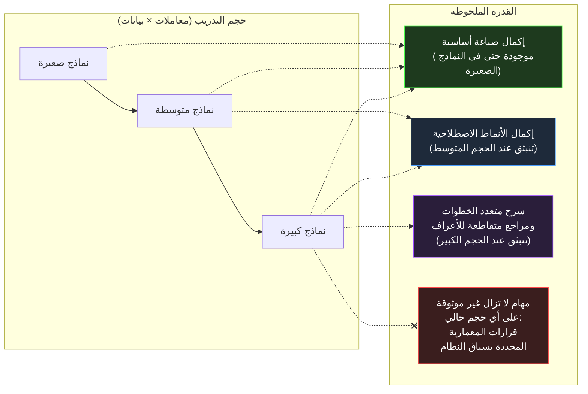

<div dir="rtl">

# القسم الثاني — لماذا تبدو النماذج اللغوية ذكيةً

## آلية دون مكوّن "فهم"، تُنتج مخرجات تبدو كالفهم

أرسى القسم الأول الآلية كاملةً: الرموز - Tokens والتضمينات - Embeddings ونافذة السياق - Context Window الثابتة وحلقة أخذ العينات - Sampling التي تُنتج رمزاً واحداً في كل مرة. لا شيء في ذلك الوصف يمثّل مكوناً يحتفظ بـ "معمارية هذا النظام في .NET"، أو "القصد وراء هذا التعليق في مراجعة الكود"، أو "الطريقة الصحيحة لتنفيذ معالجة الرسائل أحادية التنفيذ - Idempotent Message Handling". ومع ذلك، النموذج المبني من تلك الآلية بالضبط يمكنه إجراء مراجعة لطلب سحب - Pull Request، وتحديد إغفال توزيع CancellationToken، وشرح أهمية ذلك للإيقاف الرشيق - Graceful Shutdown، واقتراح إصلاح يستخدم نمط الرمز المرتبط الصحيح - Linked-Token-Source Pattern — وكل ذلك بطلاقة وتخصيص يصعب تمييزهما، في قراءة منفصلة، عن استجابة مهندس أول.

يُعالج هذا القسم الفجوة بين الآلية والمخرج مباشرةً، لأن الفجوة ليست لغزاً يُمرَّر بتأمله بكلمة "انبثاق - Emergence" — وإن كان ذلك هو المصطلح المستخدم لها — وليست دليلاً على وقوع شيء يتجاوز التنبؤ بالرمز التالي. إنها دليل على ما يصبح قادراً عليه التنبؤ بالرمز التالي حين تكون مجموعة التدريب واسعةً بما يكفي والأنماط فيها كثيفةً ومتسقةً إلى الحد الكافي. فهم سبب صحة ذلك هو ما يُتيح للمهندس التنبؤ بالمكان الذي يكون فيه هذا الذكاء الظاهري موثوقاً وبالمكان الذي لا يكون فيه كذلك.

## مجموعة التدريب ليست نصاً. إنها سلوك مضغوط.

تتضمن مجموعة التدريب لنموذج لغوي كبير حجماً هائلاً من الكود المصدري، والتوثيق التقني، ومراجع واجهات برمجة التطبيقات - API References، وخيوط Stack Overflow، ومناقشات مشكلات GitHub، ومراجعات طلبات السحب - Pull Request Reviews، ومنشورات المدوّنات المعمارية، والكتب المدرسية. وهذا الأمر بالغ الأهمية: ليس هذا موسوعة ثابتة من الحقائق — إنه سجل لكيفية تصرّف البشر حين يكتبون ويُراجعون ويشرحون ويتجادلون حول البرمجيات. خيط Stack Overflow لا يحتوي مجرد "الإجابة" على سؤال عن IAsyncEnumerable<T>؛ بل يحتوي السؤال بصياغته كما يُعبّر عنها المهندسون حين يشعرون بالحيرة، والإجابة بصياغتها كما يشرح بها المهندسون المفاهيم، والتعليقات المتابعة التي تُثير الحالات الحدية - Edge Cases، وأحياناً تصحيحاً للإجابة الأصلية حين يُشير أحدهم إلى أنها لا تعالج الإلغاء - Cancellation بشكل صحيح.

حين يُدرَّب نموذج على التنبؤ بالرمز التالي عبر ملايين الوثائق من هذا القبيل، فإنه — كتأثير جانبي لذلك الهدف الواحد — يُضطَر لاستيعاب البنية الإحصائية للتفكير التقني ذاته. للتنبؤ بالرمز التالي في "المشكلة هنا أن await foreach على هذا IAsyncEnumerable لن يحترم الإلغاء ما لم..." بدقة كافية، يجب على النموذج أن يكون قد تعلّم شيئاً عن العلاقة التوزيعية بين IAsyncEnumerable والإلغاء و await foreach وأنواع العبارات التي تُكمل الجمل المتعلقة بتفاعلها. ولم يتعلّم هذا كقاعدة قيلت مرة واحدة وخُزّنت — بل كإطراد إحصائي تعزّز عبر كل شرح وتصحيح وتعليق مراجعة كود مماثل ظهر في بيانات التدريب، يدفع كل منها معاملات النموذج خطوةً نحو إنتاج نص بالبنية ذاتها حين يتكرر سياق مشابه.



يُلخّص المخطط نمطاً تجريبياً يُلاحَظ عبر أجيال النماذج: بعض القدرات لا تتحسن بصورة سلسة مع الحجم — بل تكون غائبة إلى حد بعيد دون عتبة معينة من حجم النموذج وبيانات التدريب، ثم تظهر بشكل مفاجئ نسبياً فوق تلك العتبة. هذا ما يُشير إليه مصطلح "السلوك الانبثاقي - Emergent Behaviour" في هذا السياق. ليس أمراً غامضاً. إنه يعكس حقيقة أن بعض الأنماط — الشروح التقنية متعددة الخطوات التي تُشير بشكل صحيح إلى عدة مفاهيم متفاعلة — تتطلب من النموذج تعلّم تمثيل مشترك غني بما يكفي لتلك المفاهيم معاً. ودون تلك العتبة، يستطيع النموذج إكمال أنماط قصيرة محلية التوقع — إنهاء توقيع دالة شائع، وإغلاق قوس — لكنه لا يستطيع الحفاظ على الاتساق بعيد المدى الذي يتطلبه شرح تقني متعدد الفقرات.

## لماذا يُنتج هذا مخرجات مفيدة فعلاً لهندسة .NET

لا شيء مما سبق نقدٌ للقدرة الناتجة — بل تفسير لسبب حقيقتها ضمن فئات المهام التي تُغطيها. فنظام البيئة في .NET ممثَّل في بيانات التدريب تمثيلاً استثنائياً بمعايير مدونات البرمجيات: عقود من توثيق Microsoft، وحضور ضخم على Stack Overflow، ومدونة مفتوحة المصدر واسعة على GitHub تمتد من أمثلة Minimal API المبسّطة إلى قواعد كود المؤسسات الكبيرة، وتاريخ طويل من منشورات المدوّنات التي تشرح أنماط المعمارية وخصائص الأداء وإرشادات الترحيل عبر الإصدارات.

والكثافة ليست منتظمة عبر النظام — فدورة حياة العرض في Blazor، وإعداد البث في gRPC، ودلالات إتمام `System.Threading.Channels` ممثَّلة تمثيلاً أقل من حقن التبعيات السائد أو استعلامات Entity Framework — لكن الفئات المركزية لعمل .NET اليومي تُعَد من بين الأكثف في أي نظام تقني موجود. وهذه ميزة جوهرية يجدر بمهندسي .NET فهمها وإدخالها في استراتيجية التبني.

وتعني هذه الكثافة أن طيفاً واسعاً من المهام — شرح ما تفعله ميزة لغوية، وتوليد تنفيذ لنمط معروف، وتحديد نمط مضاد شائع في مراجعة كود، والترجمة بين واجهات برمجية مكافئة تقريباً عبر الإصدارات — يمتلك البنية الإحصائية اللازمة مُعزَّزةً بعدد هائل من المرات ومن زوايا متعددة، تشتمل غالباً على التصحيحات والتحفظات التي ترافق الإجابة "الواضحة". فحين يُولّد النموذج إجابةً عن "كيفية تنفيذ نمط Repository مع EF Core"، فهو لا يسترجع إجابةً معياريةً واحدة — بل يُنتج مخرجاً تُشكّله حصيلة عدد هائل من الشروح، بما فيها الأخطاء الشائعة وكيفية تصحيح المهندسين المتمرسين لها، لأن تلك التصحيحات جزء من بيانات التدريب وتُشكّل البنية الإحصائية المُعاد إنتاجها.

وهذه هي الآلية وراء خاصية مفيدة حقيقية: كثيراً ما تُبرز مساعدة الذكاء الاصطناعي ليس "تنفيذاً ما" فحسب، بل تنفيذاً يعكس ضمنياً التصحيح التراكمي للمجتمع — لأن تصحيحات المجتمع مدمجة في الإحصاءات التي تعلّمها النموذج. فمهندس يطلب تنفيذ عملية بث واعياً بـ CancellationToken يُرجَّح أن يحصل على تنفيذ يتعامل مع الإلغاء بصورة صحيحة، لا لأن النموذج "يعلم أن الإلغاء مهم" بأي معنى صريح، بل لأن النص الذي يصف عمليات البث دون معالجة صحيحة للإلغاء يتبعه تصحيح في مدونة التدريب بنسبة غير متناسبة — وتلك العلاقة الإحصائية هي بالضبط ما تعلّم النموذج إعادة إنتاجه.

## لماذا يشبه المخرج الفهم دون أن يحتويه

تعبير "مخرج على هيئة الفهم" من عنوان هذا القسم يصف شيئاً دقيقاً. فالنموذج لا يحتوي تمثيلاً داخلياً لما هو `IAsyncEnumerable<T>`، وكيف يختلف عن `IEnumerable<T>` في خصائص التخصيص والجدولة، أو لماذا يهم انتشار الإلغاء لسيناريوهات البث. ما يحتويه هو نموذج إحصائي عالي الأبعاد لمتتاليات الرموز التي أنتجها المهندسون البشر حين ناقشوا هذه المواضيع — التعريفات، والتفسيرات السببية، وأمثلة الكود، وتنبيهات الحالات الحدية، والتصحيحات التي تُشكّل هيئة الشرح التقني. وحين يُولّد النموذج مخرجاً يُقرأ كشرح مهندس أول، فهو لا يسترجع فهماً ويترجمه إلى كلمات — بل يُنتج متتاليات رموز متسقة إحصائياً مع الحصيلة الكلية لكل شرح صادفه لذلك المفهوم أثناء التدريب. لقد استوعب النموذج *بنية الاستدلال التقني كشكل نصي* — تعريفات تليها آليات تليها أمثلة تليها تحفظات — دون امتلاك أي نموذج سببي للنطاق الذي تصفه تلك الأشكال النصية. ولهذا بالتحديد يكون المخرج موثوقاً في مناطق التدريب الكثيفة (حيث الهيئة الكلية متسقة ومعزَّزة جيداً) وغير موثوق في المناطق المتفرقة (حيث الهيئة الكلية غير متسقة أو ناقصة العينات)، لأن إخلاص المخرج خاصية الكثافة الإحصائية لمادة المصدر، لا خاصية فهم داخلي قد يتعمم خارجها.

## الآلية ذاتها مُطبَّقة على منطقة أخف كثافةً

الصياغة الصادقة لـ "لماذا تبدو النماذج اللغوية ذكيةً" تستلزم النظر مباشرةً فيما يحدث حين تُطبَّق الآلية ذاتها على منطقة من فضاء المشكلة حيث مجموعة التدريب متفرقة أو غير متسقة أو أصغر — لأن الآلية لا تتغير. تتغير الإحصاءات فحسب.

```csharp id="code-02-02"
// Target Framework: .NET 8.0
// Chapter: 02 | Section: 02
// book/chapters/chapter-02/sections/section-02.ar.md
//
// طلبان متماثلا البنية يُرسَلان إلى النموذج ذاته.
// أحدهما يستهدف نمط .NET موثقاً بكثافة؛ والآخر يستهدف تفاعلاً
// أقل شيوعاً في النظام البيئي.
// الآلية المُنتجة للاستجابتين متطابقة (حلقة القسم الأول) —
// وحده التباين الإحصائي لكثافة الأنماط في بيانات التدريب يختلف.
//
// الهدف: إثبات أن القدرة ليست خاصية النموذج بمعزل — إنها خاصية
// النموذج مُطبَّقاً على منطقة محددة من التوزيع التدريبي.

using System.ClientModel;
using OpenAI.Chat;

var client = new ChatClient(
    model: "gpt-4o-mini",
    credential: new ApiKeyCredential(
        Environment.GetEnvironmentVariable("OPENAI_API_KEY")
            ?? throw new InvalidOperationException("OPENAI_API_KEY not set")));

var systemPrompt = new SystemChatMessage(
    "You are a senior .NET engineer. Provide a concrete code example " +
    "with a brief explanation. If you are not confident an API exists " +
    "exactly as described, say so explicitly.");

// ── الطلب A: نمط موثق بكثافة ───────────────────────────────────────────
// نقطة نهاية Minimal API مع حقن التبعيات — أحد أكثر الأنماط شيوعاً
// في توثيق .NET الحديث والشروحات والأمثلة منذ .NET 6.
// كثافة بيانات التدريب: عالية جداً.
var promptA = new UserChatMessage(
    "Show a minimal API endpoint in ASP.NET Core that injects a scoped " +
    "service and returns a 404 if a resource is not found.");

// ── الطلب B: نمط أخف تمثيلاً ──────────────────────────────────────────
// تفاعل محدد أقل شيوعاً: دمج IAsyncEnumerable مع JsonSerializerOptions
// مخصصة لكل نقطة نهاية (لا على مستوى الإعداد العام) مع ضمان عدم
// تخزين الاستجابة من قِبل Middleware الضغط. تركيبة أقل توثيقاً معاً
// مقارنةً بكل مكوّن بمعزل. كثافة بيانات التدريب: منخفضة.
var promptB = new UserChatMessage(
    "Show a minimal API endpoint that streams an IAsyncEnumerable<T> " +
    "as JSON using endpoint-specific JsonSerializerOptions, while also " +
    "ensuring response compression middleware does not buffer the " +
    "entire stream before sending.");

foreach (var (label, prompt) in new[] { ("A (كثيف)", (ChatMessage)promptA),
                                          ("B (متفرق)", promptB) })
{
    Console.WriteLine($"\n=== الطلب {label} ===");
    var response = await client.CompleteChatAsync([systemPrompt, prompt]);
    Console.WriteLine(response.Value.Content[0].Text);
}

// الملاحظة المتوقعة عند تشغيل هذا:
//
// الطلب A يُنتج عادةً تنفيذاً صحيحاً اصطلاحياً جاهزاً للاستخدام مباشرةً —
// لأن هذا الشكل من الكود كُتب ووُثّق وصُحّح آلاف المرات في بيانات التدريب.
//
// الطلب B يُنتج عادةً مخرجاً يبدو مماثلاً بنيوياً — النبرة الواثقة ذاتها،
// وتنسيق بلوك الكود ذاته، والأسلوب التوضيحي ذاته — لكنه أكثر عرضةً
// لاحتواء معلومة غير دقيقة: حمل زائد لـ JsonSerializerOptions لا ينطبق
// على مستوى نقطة النهاية بالصورة الموصوفة، أو تفاعل ضغط/تدفق لا يصمد
// عملياً. ثقة النبرة في الاستجابة لا تتبع هذا الفرق — وهو موضوع القسم السادس.
```

تشغيل الطلبين على النموذج ذاته يُنتج استجابتين بنفس المظهر السطحي: نبرة واثقة، وتنسيق بلوك كود، وشرح موجز. مهندس يقرأ النبرة والبنية فقط — دون التحقق المستقل — لا يجد في الاستجابة ذاتها إشارةً تُنبئه بأن إحداهما مبنية على أساس إحصائي أرسخ بكثير من الأخرى. وهذا ليس خللاً يظهر في الحالات الحدية فحسب — بل نتيجة مباشرة متوقعة لآلية القسم الأول مُطبَّقة على منطقتين من توزيع تدريب تتفاوت كثافته تفاوتاً هائلاً ولا يُرى من الخارج.

## إعادة الصياغة العملية: القدرة خريطة لتوزيع التدريب

أكثر إعادة صياغة مفيدة يقدمها هذا القسم هي التالية: حين تُقيّم مدى الثقة في مخرجات الذكاء الاصطناعي لمهمة هندسية محددة في .NET، السؤال الوجيه ليس "هل هذا النموذج ذكي بما يكفي لهذا؟" — وهو توصيف يفترض قدرةً قياسيةً واحدة إما أن تُعبر العتبة أو لا. السؤال الوجيه هو "كم يُمثَّل هذا النوع المحدد من المهام، في هذا التركيب المحدد من التقنيات، في النصوص التي دُرِّب عليها هذا النموذج؟"

المهام التي تتضمن أنماط .NET المستخدمة على نطاق واسع والمُؤسَّسة منذ فترة طويلة تقع في مناطق كثيفة وموثوقة من توزيع التدريب. المهام التي تتضمن تفاعل عدة ميزات أقل شيوعاً، أو واجهات برمجية حديثة محدودة التوثيق عند تاريخ التدريب، أو قرارات معمارية تعتمد على حقائق محددة بنظام معين لا يمكن لأي مجموعة تدريب احتواؤها — هذه تقع في مناطق متفرقة، حيث الآلية الإحصائية ذاتها تُنتج مخرجاً بنفس ثقة السطح ولكن بمعدل هلوسة - Hallucination أعلى واحتمال أعلى لوقوع نمط الفشل "الشكل الصحيح والدلالات الخاطئة" الذي سيُعالجه القسم الثالث.

هذه الخريطة ليست ثابتة. تتغير مع كل جيل جديد من النماذج مع توسّع مجموعات التدريب. لكن شكلها — كثيف قرب الأنماط الشائعة والموثقة جيداً والمُؤسَّسة منذ فترة طويلة؛ متفرق قرب الجديدة والخاصة بالمشروع أو المُقدَّمة حديثاً — بنيوي لا عَرَضي. يتناول القسم الثالث ما يحدث عند الحدود بين هاتين المنطقتين بمزيد من التفصيل، مع تركيز خاص على الفرق بين مطابقة الأنماط الإحصائية ونوع الاستدلال المنطقي الذي تتطلبه القرارات المعمارية فعلاً — ولماذا يهم ذلك الفرق حتى داخل المناطق الكثيفة الموثوقة التي وصفها هذا القسم.

## تكرار الرموز وهندسة التضمينات وشكل الموثوقية

خريطة الكثافة الموصوفة أعلاه ليست تجريداً — بل لها مقابل ميكانيكي ملموس في فضاء التضمين وفي توزيع تكرار رموز التدريب. فحين يظهر مفهوم مثل `IHttpClientFactory` عشرات آلاف المرات عبر التوثيق والشروح والمدوّنات والكود المصدري في مدونة التدريب، يُطوّر النموذج منطقةً عالية الأبعاد في فضاء معاملاته تكون فيها الرموز المرتبطة بذلك المفهوم متجمعةً بإحكام: اسم المفهوم، وسياقات استخدامه الشائعة، ومعاملات مُنشئه، ودوال التوسعة الخاصة به، وأنماط أخطائه، والنثر التوضيحي الذي يرافق كلاً منها عادةً. وحين يظهر مفهوم مثل `System.Threading.Channels.Channel<T>` بإعداد محدود محدد مرات أقل بكثير — ربما بضع مئات عبر المدونة، وغالباً في أمثلة مبسّطة لا في الصورة المكتملة للإنتاج — تكون المنطقة المقابلة أقل تحديداً: يعرف النموذج الرموز التي تتزامن معه، لكن التوزيع المشترك لتفاعله مع المفاهيم الأخرى (الإيقاف الرشيق، والضغط الخلفي، وإدارة دورة حياة المنتِج/المستهلك) مُستنتَج من أمثلة أقل عدداً وبالتالي بتباين أوسع.

ويُحدّد هذا التباين موثوقية النموذج مباشرةً. فموجّه يقع في منطقة متجمعة بإحكام من فضاء التضمين يُطلق سلسلة تنبؤات بالرمز التالي يكون فيها التوزيع الاحتمالي حاداً مُركَّزاً في كل خطوة — رمز أو رمزان يهيمنان، ويشكّلان جزءاً من نمط صحيح راسخ. وموجّه يقع في منطقة متجمعة بتراخٍ يُطلق تنبؤات يكون فيها التوزيع مسطحاً — عدة رموز متساوية الاحتمال تقريباً، وقد يأتي الرمز المختار من نمط مختلف غير متطابق صادف أنه يشارك المفردات السطحية. ولا يستطيع النموذج التمييز بين الحالتين من داخل عملية الاستدلال ذاتها — فهو يختار من التوزيع دائماً كما لو كان التوزيع حاداً حتى حين لا يكون كذلك. وهذا هو الأساس الميكانيكي لدعوى القسم الثالث بأن الاستدلال الإحصائي يفشل بصمت.

ولهذا على مهندسي .NET تبعة عملية لا تتضح من الخارج: فموثوقية مخرجات الذكاء الاصطناعي لمهمة مُعطاة ليست منتظمة عبر كل أجزاء المهمة ذاتها. فموجّه يطلب نقطة نهاية Minimal API كاملة في ASP.NET Core مع حقن التبعيات سيُنتج مخرجات موثوقة لبنية نقطة النهاية وتسجيل الحقن ومعالجة الطلب الأساسية — وكلها ممثلة بكثافة. لكن إذا طلب الموجّه ذاته إعداد تخزين مؤقت محدداً باستخدام `IMemoryCache` مع سياسة انتهاء مخصصة وإبطال عبر `IChangeToken`، فالنموذج يعمل في منطقة أقل كثافةً لتلك التركيبة المحددة، حتى وإن كان كل مكوّن بمعزله ممثلاً جيداً. فالمركّب أكثر تفرقاً من أجزائه، وموثوقية المخرج المركّب يحكمها أشد المناطق التي يعبرها تفرقاً لا أكثفها. ويجدر بالمهندسين بناءً عليه تقييم مخرجات الذكاء الاصطناعي لا بألفة المفاهيم المفردة التي يذكرها بل بكثافة *التركيبة* المحددة المطلوبة — وهو تمييز يصبح حرجاً كلما نمت التعقيدات التركيبية للمهام.

## اللامتماثل بين التوليد والتحقق

من خصائص خريطة توزيع التدريب وثيقة الصلة بسير العمل الهندسي اللامتماثل بين كلفة توليد المخرج من منطقة متفرقة وكلفة التحقق منه. فتوليد مخرج مقنع الصياغة من منطقة متفرقة شبه مجاني — يُجري النموذج الحساب ذاته تماماً سواء كان النمط الكامن كثيفاً أم متفرقاً، والصفات السطحية للمخرج (النبرة الواثقة، والمفردات الصحيحة، والبنية المناسبة) متطابقة. أما التحقق فأعلى كلفةً بصورة درامية في المناطق المتفرقة: في المناطق الكثيفة يكفي غالباً فحص تجميع سريع وقراءة مرور، لأن المخرج يُعيد إنتاج نمط راسخ تحققت صحته آلاف المرات في بيانات التدريب. وفي المناطق المتفرقة يستلزم التحقق من المهندس تقييم التفاعل المحدد للمفاهيم مستقلاً، وتتبع مسار التنفيذ تحت شروط محددة، وربما بناء اختبارات موجّهة — وهو عمل قد يستغرق أضعافاً مضاعفة لزمن التوليد ذاته.

وهذا اللامتماثل هو الحجة الاقتصادية الجوهرية لفهم خريطة توزيع التدريب: دونها لا يستطيع المهندس تخصيص جهد التحقق تناسبياً مع المخاطر، فينتهي إما إلى الإفراط في التحقق من مخرجات المناطق الكثيفة (إضاعة وقت على مخرج شبه مؤكد الصحة) أو التفريط في التحقق من مخرجات المناطق المتفرقة (قبول مخرج أعلى احتمالاً للخطأ الخفي احتمالاً جوهرياً). وتُوفّر الخريطة أساس تخصيص منهجي: مهام الأنماط في المناطق الكثيفة تنال تحققاً بمستوى التجميع؛ والمهام المتفرقة أو التركيبية تنال المراجعة البنيوية الأعمق التي يتطلبها ملف مخاطرها. ويُصوغ القسم الثالث هذا التخصيص رسمياً بالتمييز بين مهام الأنماط ومهام الاستدلال وتثبيت التداعيات التحققية لكل منهما.

## التوزيع التدريبي ونظام البيئة في .NET: اعتبارات خاصة

يمتاز نظام البيئة في .NET بوجود هائل في مجموعات التدريب مقارنةً بكثير من الأطر والمنصات الأخرى: عقود من توثيق Microsoft الشامل، وحضور ضخم على Stack Overflow يمتد من .NET Framework حتى .NET الحديث، ومجموعة مصادر مفتوحة ضخمة على GitHub تتراوح بين أمثلة Minimal API المبسّطة وقواعد كود المؤسسات الكبيرة، وتاريخ طويل من منشورات المدوّنات التي تشرح أنماط المعمارية وخصائص الأداء وإرشادات الترحيل عبر إصدارات .NET المختلفة.

هذه الكثافة تعني أنه لطيف واسع من المهام — شرح ما تفعله ميزة لغوية، وتوليد تنفيذ لنمط معروف، وتحديد نمط مضاد - Anti-Pattern شائع في مراجعة الكود، والترجمة بين واجهات برمجية مكافئة تقريباً عبر إصدارات .NET — يمتلك النموذج البنية الإحصائية اللازمة مُعزَّزةً بعدد هائل من المرات، من زوايا متعددة، غالباً ما تشتمل على التصحيحات والتحفظات التي ترافق الإجابة "الواضحة". وهذه هي الآلية التي تقف وراء خاصية مفيدة حقيقية: كثيراً ما تُلقي مساعدة الذكاء الاصطناعي الضوء ليس فقط على "تنفيذ ما"، بل على تنفيذ يعكس ضمنياً التصحيح التراكمي للمجتمع — لأن تصحيحات المجتمع مُضمَّنة في الإحصاءات التي تعلّمها النموذج.

غير أن ثمة منطقتين محددتين تجدر الإشارة إليهما في سياق .NET وحدها بوصفهما مصدَرَي توزيع متناثر متكرر الظهور.

**الأولى** هي التقاطعات بين ميزات جديدة مُدخَلة في إصدارات حديثة نسبياً وأنماط مُؤسَّسة. ميزات C# 14 والأنماط المقدَّمة في .NET 8 وما تلاه ممثَّلة تمثيلاً أفضل في النماذج الحديثة مما كانت عليه في النماذج المدرَّبة قبل طرح تلك الإصدارات؛ لكن التقاطع المحدد بين ميزة حديثة وواجهة برمجية كبيرة ومعقدة كـ Entity Framework Core أو Polly قد يكون أقل توثيقاً بكثير من أجزاء تلك المكتبات الأقدم والأكثر استخداماً. هذا لا يعني تجنب الذكاء الاصطناعي في هذه التقاطعات؛ يعني اعتبار التحقق فيها ضرورة وليس خياراً.

**الثانية** هي سيناريوهات الترحيل من .NET Framework إلى .NET الحديث. إن مجموعات التدريب تحتوي على كميات ضخمة من كود .NET Framework إلى جانب .NET الحديث، وليس من المضمون أن النموذج قد حلَّ التناقض بين الأنماط القديمة والحديثة دائماً في صالح المنهج الحديث. مهندس يطلب من النموذج مساعدةً في ترحيل خدمة تعتمد على SqlConnection و SqlCommand إلى Dapper أو EF Core قد يحصل على مقترحات صحيحة تقنياً لكنها تحمل أثراً من عادات .NET Framework — مثل التعامل المتزامن مع الاتصالات بدلاً من نمط async/await الكامل — لا لأن النموذج "لا يعرف" النمط الأحدث، بل لأن كلا النمطين موجودان في توزيع التدريب وقد لا تكون الإشارات السياقية في الموجّه كافية للتمييز.

## المعرفة الإجرائية مقابل المعرفة التعريفية في مخرجات النموذج

تمييز دقيق آخر يُساعد في فهم لماذا تبدو النماذج ذكيةً في بعض السياقات دون غيرها هو الفرق بين نوعين من المعرفة: التعريفية - Declarative وهي "أعلم أن X صحيح"، والإجرائية - Procedural وهي "أعلم كيف أفعل X".

تُبلي النماذج اللغوية الكبيرة أداءً جيداً في المهام التي تتطلب معرفةً إجرائية مُحكَمة التمثيل في مجموعة التدريب: كيفية كتابة استعلام LINQ، وكيفية تسجيل الخدمات في حاوية الحقن، وكيفية تنفيذ نمط Repository مع Entity Framework Core. هذه المعرفة الإجرائية مُرمَّزة كآلاف أمثلة الكود والشروح التي تُظهر كيفية إنجاز تلك المهام فعلياً.

في المقابل، المعرفة التعريفية الخاصة بالسياق — "ما هو الاختيار المعماري الصحيح لهذا النظام بالذات مع قيوده المحددة وتاريخه الخاص" — لا يمكن لأي مجموعة تدريب ترميزها لأنها تعتمد على معرفة النظام التي لا تظهر في أي نص خارجي. هذا هو الفصل الأساسي بين ما يمكن للنموذج تقديمه بموثوقية وما لا يمكنه ذلك — وهو الفصل الذي يُحدد مكان وضع حدود المسؤولية بين مساعدة الذكاء الاصطناعي والحكم الهندسي البشري.

يُعمّق القسم الثالث هذا الفصل بالتركيز على الحالة التي ينهار فيها الاستدلال الإحصائي - Statistical Reasoning بشكل صامت — وما الذي يتركه من آثار يمكن التعرف عليها في مخرجات النموذج.

## الكثافة التدريبية وتوقعات التحقق: إطار عملي

يُترجَم الإطار النظري المُقدَّم في هذا القسم إلى نمط تفكير عملي يمكن لفريق .NET تبنّيه باستمرار. قبل قبول مخرجات الذكاء الاصطناعي لأي مهمة هندسية، يُقيَّم تلقائياً موضع تلك المهمة على محورين: مدى تمثيلها في بيانات التدريب، ومدى اعتماد الإجابة الصحيحة على أنماط عامة مقابل سياق النظام المحدد.

**المحور الأول — كثافة التمثيل:** هل هذه المهمة تتضمن أنماطاً استُخدمت على نطاق واسع وموثَّقة منذ فترة طويلة في نظام البيئة .NET؟ أم أنها تتضمن تقاطعاً نادراً بين ميزات، أو واجهة برمجية جديدة العهد، أو سيناريو لم تجرِ الكتابة عنه بشكل مستفيض؟ المهام التي تتضمن Dependency Injection و EF Core و Minimal APIs و Polly و Semantic Kernel في استخداماتها الشائعة تقع في المنطقة الكثيفة. المهام التي تتضمن دمج مكتبات أقل استخداماً مع بعضها، أو الاعتماد على سلوك حافّة موثَّق بشكل غير كامل، تقع في المنطقة الأخف.

**المحور الثاني — استقلالية الإجابة عن السياق:** هل الإجابة الصحيحة مستقلة عن الخصائص الفريدة لهذا النظام — بمعنى أن أي نظام .NET آخر بنفس المتطلبات سيحصل على الإجابة ذاتها؟ أم أنها تعتمد على تاريخ قرارات هذا النظام بالذات، وقيوده الموروثة، واتفاقيات الفريق؟ الأولى تقبل استدلالاً إحصائياً موثوقاً. الثانية تتطلب حكماً هندسياً بشرياً بصرف النظر عن كثافة بيانات التدريب.

هذا الإطار الثنائي المحاور — الكثافة التدريبية × استقلالية السياق — هو ما سيُوظَّف في القسم السادس بشكل مكثَّف حين تُبنى مصفوفة الثقة المُعايَرة - Calibrated Trust Matrix التي تُحدد مستوى التحقق المناسب لكل نوع من المهام. يُمهّد القسم الثالث الطريق لذلك بفحص ما يحدث حين يعمل النموذج في المنطقة الحدية بين هذين الوضعين — حيث الاستدلال الإحصائي يفشل بصمت دون إصدار أي إشارة تحذير مميزة.

## كيف يختلف هذا الإطار عن التعامل مع أدوات الإنجاز الأخرى

قد يبدو هذا التمييز مُرهقاً مقارنةً بكيفية التعامل مع أدوات التطوير الأخرى مثل IntelliSense أو مُحلّلات Roslyn. ينبثق الفرق من طبيعة الخطأ في كل منها. IntelliSense يقترح من تمثيل دقيق لواجهة برمجية حقيقية مُحدَّدة: إما أن المدخل صحيح — تُصرَّف — أو غلط — خطأ تجميع. القرار ثنائي التفرّع ومُقرَّر بسرعة.

النموذج اللغوي الكبير يقترح من فضاء واسع من الأنماط المُحتمَلة التي تعلّمها إحصائياً. لا يوجد ما يكافئ "خطأ التجميع" كضمانة للصحة الدلالية. والأهم: الاقتراح الصحيح والاقتراح الخاطئ قد يبدوان متطابقَين من حيث الثقة والطلاقة. هذا ليس نقصاً في الأداة يجب تجنّبها، بل خاصية بنيوية لكيفية عملها تُحدد كيفية دمجها بأمان في سير عمل هندسية احترافية.

الممارسة الاحترافية لا تعني التخلي عن الأداة حين يكون الخطأ ممكناً — هذا معيار سيُلغي جميع الأدوات. تعني بناء وعي دقيق بالمكان الذي تكون فيه احتمالية الخطأ أعلى وتوجيه جهد التحقق نحو تلك المناطق بدلاً من توزيعه بصورة موحّدة على كل ما يُولّده النموذج. هذا الوعي الدقيق هو الهدف من هذه الأقسام الستة معاً، والقسم الثالث يُضيف إليه البُعد الأهم: لماذا يفشل الاستدلال الإحصائي عند الحدود بطريقة لا تُطلق إشارة إنذار بل تبدو كإجابة واثقة كاملة؟


الجدير بالإشارة أن هذا الإطار لا يُقيَّم مرة واحدة عند بداية دمج الذكاء الاصطناعي في الفريق ثم يُنسى: فشفرة .NET 8 وتوثيق C# 14 ممثلان في النماذج الحديثة تمثيلاً أفضل بكثير مما كانا عليه في النماذج المدرَّبة قبل طرح تلك الإصدارات. إتقان هذا التقييم الديناميكي — لا استيعابه مرة واحدة وتطبيقه كقاعدة جامدة — هو ما يُميز الاستخدام الاحترافي المتطور لأدوات الذكاء الاصطناعي عن الاستخدام الساذج الذي يُعامل النموذج إما كمرجع معصوم أو كأداة عديمة الجدوى. ويظل هذا النوع من الوعي الدقيق الديناميكي بتوزيع قدرات النموذج هو الرأسمال الحقيقي الذي يُبنى ويتراكم مع الخبرة العملية في استخدام أدوات الذكاء الاصطناعي لهندسة برمجيات .NET الاحترافية على المدى البعيد وعبر سياقات العمل المختلفة والمتنوعة التي تواجه فرق .NET في بيئات الإنتاج الحقيقية.

</div>
