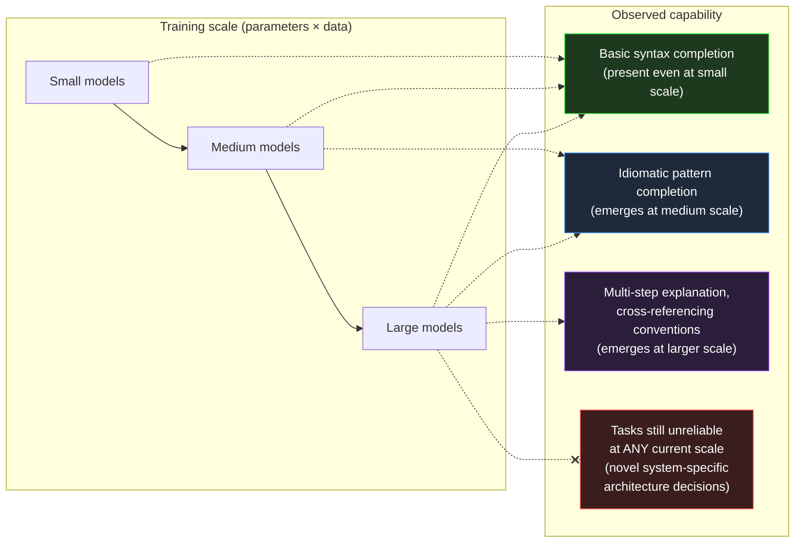

# Section 02 — Why LLMs Appear Intelligent

## A Mechanism With No "Understanding" Component, Producing Understanding-Shaped Output

Section 01 established the mechanism in full: tokens, embeddings, a fixed context window, and a sampling loop that produces one token at a time, each conditioned on everything before it. Nowhere in that description is there a component that represents "the architecture of this .NET system," "the intent behind this code review comment," or "the correct way to implement idempotent message handling." And yet a model built from exactly that mechanism can be asked to review a pull request, identify a missing `CancellationToken` propagation, explain why it matters for graceful shutdown, and suggest a fix using the correct linked-token-source pattern — and it can do this with a fluency and specificity that, read in isolation, is difficult to distinguish from a senior engineer's response.

This section addresses the gap between mechanism and output directly, because the gap is not a mystery to be waved away with the word "emergence" — though that is the term used for it — and it is not evidence that something beyond next-token prediction is happening. It is evidence about what next-token prediction becomes capable of when the training corpus is large enough and the patterns within it are dense and consistent enough. Understanding why this is true is what allows an engineer to predict *where* this apparent intelligence will be reliable and where it will not — a prediction this chapter sharpens further in Sections 03 and 04.

## The Training Corpus Is Not Text. It Is Compressed Behaviour.

The training corpus for a large language model includes enormous volumes of source code, technical documentation, API references, Stack Overflow threads, GitHub issue discussions, pull request reviews, architecture blog posts, and textbooks. Critically, this is not a static encyclopedia of facts — it is a record of *how people behave* when writing, reviewing, explaining, and arguing about software. A Stack Overflow thread does not just contain "the answer" to a question about `IAsyncEnumerable<T>`; it contains the question phrased the way engineers actually phrase confusion, an answer phrased the way engineers actually explain a concept, follow-up comments raising edge cases, and sometimes a correction to the original answer once someone points out it doesn't handle cancellation correctly.

When a model is trained to predict the next token across millions of documents like this, it is — as a side effect of that single objective — forced to internalize the *statistical structure of technical reasoning itself*. To predict the next token in "the issue here is that `await foreach` over this `IAsyncEnumerable` won't respect cancellation unless the..." with any accuracy, the model must have learned something about the distributional relationship between `IAsyncEnumerable`, cancellation, `await foreach`, and the kinds of clauses that complete sentences about their interaction. It did not learn this as a rule stated once and stored; it learned it as a statistical regularity reinforced across every similar explanation, correction, and code review comment that appeared in the training data, each one nudging the model's parameters slightly toward producing text with that same structure when a similar context arises again.



The diagram captures an empirical pattern observed across model generations: certain capabilities do not improve smoothly with scale — they are largely absent below some threshold of model size and training data, and appear fairly abruptly above it. This is what "emergent behaviour" refers to in this context. It is not mystical. It reflects the fact that some patterns — multi-step technical explanations that correctly reference several interacting concepts — require the model to have learned a sufficiently rich joint representation of those concepts together, and that joint representation only becomes statistically learnable once the model has enough capacity and has seen enough examples of those concepts co-occurring. Below that threshold, the model can complete short, locally-predictable patterns — finishing a common method signature, closing a brace — but cannot sustain the longer-range consistency that a multi-paragraph technical explanation requires.

## Why This Produces Genuinely Useful Output for .NET Engineering

None of this is a criticism of the resulting capability — it is an explanation of *why the capability is real* for the categories of task it covers. The .NET ecosystem is, by the standards of software corpora, extraordinarily well-represented in training data: decades of Microsoft documentation, an enormous Stack Overflow presence, a large open-source corpus on GitHub spanning everything from minimal API samples to large enterprise codebases, and a long history of blog posts explaining architectural patterns, performance characteristics, and migration guidance across .NET Framework, .NET Core, and modern .NET releases.

The density is not uniform across the ecosystem — areas like Blazor rendering lifecycle, gRPC streaming configuration, or `System.Threading.Channels` completion semantics have less representation than mainstream dependency injection or Entity Framework queries — but for the central categories of daily .NET engineering work, the corpus is among the densest of any technology ecosystem in existence. This is a material advantage that .NET engineers should understand and factor into their adoption strategy.

This density means that for a wide range of tasks — explaining what a language feature does, generating an implementation of a well-known pattern, identifying a common anti-pattern in a code review, translating between roughly equivalent APIs across .NET versions — the statistical structure the model needs has been reinforced an enormous number of times, from many angles, often including the corrections and caveats that accompany the "obvious" version of an answer. When a model generates a response to "how do I implement the repository pattern with EF Core," it is not retrieving one canonical answer — it is producing output shaped by the *aggregate* of an enormous number of explanations, including common mistakes and how experienced engineers correct them, because those corrections are *also* part of the training data and *also* shape the statistical structure being reproduced.

This is the mechanism behind a genuinely useful property: AI assistance often surfaces not just "an" implementation, but one that implicitly reflects accumulated community correction — because the community's corrections are baked into the statistics the model learned from. An engineer asking for a `CancellationToken`-aware implementation of a streaming operation is likely to receive one that handles cancellation correctly, not because the model "knows cancellation is important" in any explicit sense, but because text describing streaming operations *without* correct cancellation handling is, in the training corpus, disproportionately likely to be followed by a correction — and that statistical relationship is exactly what the model learned to reproduce.

## Why the Output Resembles Understanding Without Containing It

The phrase "understanding-shaped output" from this section's heading describes something precise. The model does not contain an internal representation of what `IAsyncEnumerable<T>` is, how it differs from `IEnumerable<T>` in its allocation and scheduling characteristics, or why cancellation propagation matters for streaming scenarios. What it contains is a high-dimensional statistical model of the token sequences that human engineers have produced when discussing these topics — the definitions, the causal explanations, the code examples, the edge-case callouts, and the corrections that form the shape of a technical explanation. When the model generates output that reads like a senior engineer's explanation, it is not retrieving an understanding and translating it into words; it is producing token sequences that are statistically consistent with the aggregate shape of every explanation of that concept it encountered during training. The model has internalized the *structure of technical reasoning as a textual form* — definitions followed by mechanisms followed by examples followed by caveats — without possessing any causal model of the domain those text forms describe. This is precisely why the output is reliable in dense training regions (where the aggregate shape is consistent and well-reinforced) and unreliable in sparse ones (where the aggregate shape is inconsistent or under-sampled), because the fidelity of the output is a property of the statistical density of the source material, not of any internal understanding that might generalise beyond it.

## The Same Mechanism, Applied to a Sparser Region

The honest framing of "why LLMs appear intelligent" requires looking directly at what happens when the same mechanism is applied to a region of the problem space where the training corpus is sparse, inconsistent, or simply smaller — because the mechanism does not change. Only the statistics change.

```csharp id="code-02-02"
// Target Framework: .NET 8.0
// Chapter: 02 | Section: 02
// book/chapters/chapter-02/sections/section-02.en.md
//
// Two prompts, identical structure, sent to the same model.
// One targets a densely-represented .NET pattern; the other targets
// a narrow, less-documented corner of the ecosystem.
//
// Purpose: demonstrate that capability is not a property of the MODEL
// in isolation — it is a property of the model APPLIED TO a region
// of the training distribution. The mechanism producing both responses
// is identical (Section 01's loop). Only the statistical density of
// relevant patterns in training data differs.

using System.ClientModel;
using OpenAI.Chat;

var client = new ChatClient(
    model: "gpt-4o-mini",
    credential: new ApiKeyCredential(
        Environment.GetEnvironmentVariable("OPENAI_API_KEY")
            ?? throw new InvalidOperationException("OPENAI_API_KEY not set")));

var systemPrompt = new SystemChatMessage(
    "You are a senior .NET engineer. Provide a concrete code example " +
    "with a brief explanation. If you are not confident an API exists " +
    "exactly as described, say so explicitly.");

// ── Prompt A: densely represented pattern ──────────────────────────────
// Minimal API endpoint with dependency injection — one of the most
// common patterns in modern .NET documentation, tutorials, and samples
// since .NET 6. Training data density: very high.
var promptA = new UserChatMessage(
    "Show a minimal API endpoint in ASP.NET Core that injects a scoped " +
    "service and returns a 404 if a resource is not found.");

// ── Prompt B: sparsely represented pattern ─────────────────────────────
// A specific, less-common interaction: configuring a custom
// IAsyncEnumerable-based JSON streaming response with a non-default
// JsonSerializerOptions PER-ENDPOINT (not globally), combined with
// response compression — a combination far less frequently documented
// together than each piece is individually. Training data density: low.
var promptB = new UserChatMessage(
    "Show a minimal API endpoint that streams an IAsyncEnumerable<T> " +
    "as JSON using endpoint-specific JsonSerializerOptions, while also " +
    "ensuring response compression middleware does not buffer the " +
    "entire stream before sending.");

foreach (var (label, prompt) in new[] { ("A (dense)", (ChatMessage)promptA),
                                          ("B (sparse)", promptB) })
{
    Console.WriteLine($"\n=== Prompt {label} ===");
    var response = await client.CompleteChatAsync([systemPrompt, prompt]);
    Console.WriteLine(response.Value.Content[0].Text);
}

// Expected observation when running this:
//
// Prompt A typically produces a correct, idiomatic, immediately usable
// implementation — because this exact shape of code has been written,
// documented, and corrected thousands of times in training data.
//
// Prompt B typically produces output that LOOKS structurally similar —
// same confident tone, same code-block formatting, same explanatory
// style — but is measurably more likely to contain an inaccuracy:
// a JsonSerializerOptions overload that doesn't apply per-endpoint the
// way described, or a compression/streaming interaction that doesn't
// hold in practice. The CONFIDENCE of the response's tone does not
// track this difference — which is the subject of Section 06.
```

Running both prompts against the same model produces two responses with the same surface qualities: confident phrasing, working code formatting, a brief explanation following the code. An engineer reading only the tone and structure of the two responses — without independently verifying either — has no signal from the response itself indicating that one of these is built on a statistically much thinner foundation than the other. This is not a flaw that appears only in edge cases; it is the direct, predictable consequence of the mechanism in Section 01 applied to two different regions of a training distribution whose density varies enormously and is not visible from outside.

## The Practical Reframe: Capability Is a Map of the Training Distribution

The most useful reframe this section offers is this: when evaluating whether to trust AI output for a given .NET engineering task, the relevant question is not "is this model intelligent enough for this?" — a framing that suggests a single scalar capability that either clears a bar or doesn't. The relevant question is "how densely and consistently is this *specific kind of task*, in *this specific technology combination*, represented in the kind of text this model was trained on?"

Tasks involving widely-used, long-established .NET patterns — dependency injection, common middleware configuration, well-known design patterns, explaining standard library behaviour — sit in dense, well-trodden regions of the training distribution, reinforced by years of documentation, tutorials, and corrected community discussion. Tasks involving the interaction of several less-common features, very recent APIs with limited documentation at training time, project-specific conventions, or architectural decisions that depend on facts about a particular system that no training corpus could contain — these sit in sparse regions, where the same generative mechanism produces output with the same surface confidence but a meaningfully higher chance of being wrong in ways that are not obvious from reading it.

## Token Frequency, Embedding Geometry, and the Shape of Reliability

The density map described above is not an abstraction — it has a concrete mechanical correlate in the model's embedding space and in the frequency distribution of training tokens. When a concept like `IHttpClientFactory` appears tens of thousands of times across documentation, tutorials, blog posts, and source code in the training corpus, the model develops a high-dimensional region in its parameter space where the tokens associated with that concept are tightly clustered: the concept's name, its common usage contexts, its constructor parameters, its extension methods, its error modes, and the explanatory prose that typically accompanies each. When a concept like `System.Threading.Channels.Channel<T>` with a specific bounded configuration appears far less frequently — perhaps a few hundred times across the corpus, and often in simplified examples rather than the production-complete form — the corresponding region is less tightly defined: the model knows the tokens that co-occur with it, but the joint distribution over its interaction with other concepts (graceful shutdown, back-pressure, producer-consumer lifetime management) is inferred from a smaller number of examples and therefore has wider variance.

This variance directly determines the model's reliability. A prompt that lands in a tightly-clustered region of the embedding space triggers a sequence of next-token predictions where each step has a sharp, peaked probability distribution — one or two tokens dominate, and those tokens form part of a correct, well-established pattern. A prompt that lands in a loosely-clustered region triggers next-token predictions where the probability distribution is flatter — several tokens are similarly likely, and the chosen token may come from a different, non-identical pattern that happened to share surface vocabulary. The model cannot distinguish between these two cases from inside its own inference process; it always selects from the distribution as though the distribution were sharp, even when it is not. This is the mechanical basis for the claim in Section 03 that statistical reasoning fails silently.

For .NET engineers, this has a practical implication that is not obvious from the outside: the reliability of AI output for a given task is not uniform across all parts of the same task. A prompt that asks for a complete ASP.NET Core minimal API endpoint with dependency injection will produce reliable output for the endpoint structure, the DI registration, and the basic request handling — all densely represented. But if the same prompt also asks for a specific caching configuration using `IMemoryCache` with a custom expiration policy and cache invalidation through `IChangeToken`, the model is operating in a less-dense region for that specific combination, even though each individual component is well-represented. The composite is sparser than its parts, and the reliability of the composite output is governed by the sparsest region it traverses, not by the densest. Engineers should therefore evaluate AI output not by the familiarity of the individual concepts it mentions but by the density of the specific *combination* requested — a distinction that becomes critical as tasks grow in compositional complexity.

## The Asymmetry Between Generation and Verification

A property of the training-distribution map that is directly relevant to engineering workflow is the asymmetry between the cost of generating output from a sparse region and the cost of verifying that output. Generating plausible-sounding output from a sparse region is nearly free — the model performs exactly the same computation regardless of whether the underlying pattern is dense or sparse, and the surface qualities of the output (confident tone, correct vocabulary, appropriate structure) are identical. Verification, however, is dramatically more expensive in sparse regions: in dense regions, a quick compilation check and a read-through often suffice, because the output is reproducing a well-established pattern whose correctness has been validated thousands of times in the training data. In sparse regions, verification requires the engineer to independently evaluate the specific interaction of concepts, trace the execution path under specific conditions, and potentially construct targeted tests — work that can take orders of magnitude longer than the generation itself.

This asymmetry is the core economic argument for understanding the training-distribution map: without it, an engineer cannot allocate verification effort proportionally to risk, and ends up either over-verifying dense-region output (wasting time on output that is almost certainly correct) or under-verifying sparse-region output (accepting output that has a materially higher chance of being subtly wrong). The map provides the basis for a structured allocation: dense-region pattern tasks receive compilation-level verification; sparse-region or compositional tasks receive the deeper structural review that their risk profile demands. Section 03 formalises this allocation by distinguishing pattern tasks from reasoning tasks and establishing the verification implications of each.

## .NET Ecosystem Density: Two Sparse Sources

The .NET ecosystem's density advantage has two specific exceptions worth naming, because each is a recurring source of sparse-distribution output treated here in general terms elsewhere.

The first is intersections between recently introduced features and established patterns. Features from C# 14 and patterns introduced in .NET 8 and later are better represented in newer models than in models trained before those releases — but the *specific intersection* between a new feature and a large, complex API surface like Entity Framework Core or Polly may be far less documented than the older, heavily-used parts of those same libraries. This does not mean avoiding AI assistance at these intersections; it means treating verification there as mandatory rather than optional.

The second is migration scenarios from .NET Framework to modern .NET. Training corpora contain enormous volumes of both .NET Framework and modern .NET code, and there is no guarantee the model has always resolved the tension between old and new patterns in favour of the modern approach. An engineer asking for help migrating a service from `SqlConnection` and `SqlCommand` to Dapper or EF Core may receive technically valid suggestions that carry residue from .NET Framework habits — synchronous connection handling instead of the full async/await pattern, for example — not because the model "does not know" the newer pattern, but because both patterns exist in the training distribution and the contextual signals in the prompt may not be sufficient to disambiguate them.

## Procedural and Declarative Knowledge in Model Output

A further distinction helps explain why models appear intelligent in some contexts and not others: the difference between two kinds of knowledge. Declarative knowledge is "knowing that X is true"; procedural knowledge is "knowing how to do X."

Large language models perform well on tasks requiring procedural knowledge that is densely represented in the training corpus: how to write a LINQ query, how to register services in a dependency injection container, how to implement the Repository pattern with Entity Framework Core. That procedural knowledge is encoded as thousands of code examples and walkthroughs showing how those tasks are actually performed.

Context-specific declarative knowledge, by contrast — "what is the correct architectural choice for *this particular system*, given its specific constraints and history" — cannot be encoded by any training corpus, because it depends on system knowledge that appears in no external text. This is the fundamental boundary between what the model can reliably provide and what it cannot — and it is the boundary that determines where responsibility is placed between AI assistance and human engineering judgment.

Section 03 deepens this boundary by examining the case where statistical reasoning collapses silently — and what traces that collapse leaves in the model's output.

## Training Density and Verification Expectations: A Working Framework

The theoretical framing of this section translates into a working habit of thought a .NET team can apply consistently. Before accepting AI output for any engineering task, the task's position is assessed almost automatically along two axes: how well represented it is in the training data, and how much the correct answer depends on general patterns versus the specific system's context.

**Axis 1 — representation density:** does this task involve widely-used, long-documented patterns in the .NET ecosystem, or a rare intersection of features, a recently-introduced API, or a thinly-written scenario? Tasks involving dependency injection, EF Core, minimal APIs, Polly, and Semantic Kernel in their common uses sit in the dense region. Tasks combining less-used libraries, or depending on incompletely documented edge behaviour, sit in the lighter region.

**Axis 2 — context independence of the answer:** is the correct answer independent of this system's unique properties — meaning any other .NET system with the same requirements would receive the same answer — or does it depend on this system's own decision history, inherited constraints, and team conventions? The first admits reliable statistical inference. The second requires human engineering judgment regardless of training-data density.

This two-axis framework — training density × context independence — is what Section 06 will put to intensive use when constructing the calibrated trust matrix that determines the appropriate verification level for each task type. Section 03 paves the way by examining what happens when the model operates in the marginal region between these two modes — where statistical reasoning fails silently, issuing no distinctive warning signal.

## How This Framework Differs From Productivity Tooling

The distinction may seem burdensome compared with how other development tools are treated — IntelliSense, Roslyn analysers. The difference comes from the nature of error in each. IntelliSense suggests from an exact representation of a real, specific API: either the input is correct — it compiles — or it is wrong — a compile error. The decision is binary and resolved quickly.

A large language model suggests from a wide space of statistically learned plausible patterns. There is no equivalent of "a compile error" as a guarantee of semantic correctness. More importantly, a correct suggestion and an incorrect one can look identical in confidence and fluency. This is not a deficiency of the tool to be avoided but a structural property of how it works, and that property determines how it is safely integrated into a professional engineering workflow.

Professional practice does not mean abandoning the tool wherever error is possible — that standard would disqualify every tool. It means building a precise awareness of where error probability is highest and directing verification effort toward those regions instead of spreading it uniformly over everything the model generates. That precise awareness is the goal of these six sections together, and Section 03 adds its most important dimension. Mastering this dynamic assessment — not absorbing it once as a fixed rule — is what distinguishes mature professional use of AI tooling from naive use that treats the model as either an infallible oracle or a useless instrument.

This is not a static map. It shifts with each new model generation as training corpora grow and incorporate more recent material — code and documentation for .NET 8 and C# 14 is far better represented in newer models than it was in models trained before those releases existed. But the *shape* of the map — dense near common, well-documented, long-established patterns; sparse near novel, project-specific, or recently-introduced ones — is structural, not a temporary limitation. Section 03 examines what happens at the boundary between these regions in more detail, focusing specifically on the difference between statistical pattern-matching and the kind of logical reasoning that architectural decisions actually require — and why that difference matters even *inside* the dense, well-represented regions this section has described as generally reliable.
