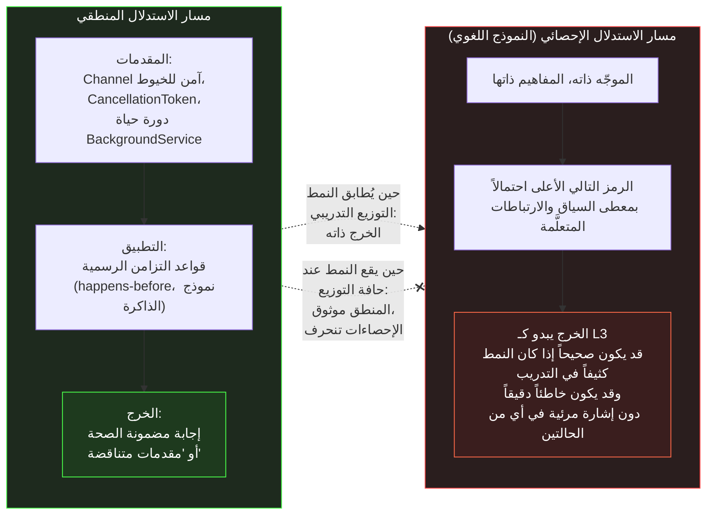

<div dir="rtl">

# القسم الثالث — حدود الاستدلال الإحصائي

## نوعان من "الوصول إلى الإجابة الصحيحة"

أرسى القسم الثاني أن النماذج اللغوية الكبيرة تُنتج مخرجات مفيدة فعلاً لأن التنبؤ بالرمز التالي - Next-Token Prediction عبر مجموعة كبيرة وكثيفة من النصوص التقنية يتعلم البنية الإحصائية للتفكير التقني ذاته. يعمل هذا للأنماط الممثَّلة تمثيلاً جيداً بموثوقية كافية لأن يكون ذا قيمة حقيقية. لكن هذا القسم يتناول بالتحديد أين ينهار هذا النهج — والأهم، كيف ينهار، لأن طريقة فشل الاستدلال الإحصائي - Statistical Reasoning تختلف نوعياً عن طريقة فشل الاستدلال المنطقي - Logical Reasoning، وهذا الفرق له تداعيات هندسية مباشرة: فالأدوات المبنية على المنطق الصوري تفشل عند حدود معلومة يمكن اختبارها وحراستها، بينما تفشل أدوات الاستدلال الإحصائي عند حدود مجهولة متفاوتة التوزيع يجب فهمها بنيوياً قبل استخدام الأداة بأمان في الإنتاج.

يفشل الاستدلال المنطقي من مقدمات مُحدَّدة جيداً بطريقة مميزة. إذا طُلب من نظام يُطبّق قواعد الاستدلال الرسمية اشتقاق نتيجة من مقدمات متناقضة، فإنه إما يُنتج تناقضاً منطقياً يمكن التحقق منه، أو يُبلّغ بأنه لا يوجد مسار استدلال صالح. نمط الفشل صريح: النظام يُعلمك بأنه لا يستطيع الإجابة، أو يُنتج شيئاً يمكن التحقق منه مقابل المقدمات. يفشل الاستدلال الإحصائي بصمت. نموذج ليس لديه نمط إحصائي موثوق للحالة المحددة التي سُئل عنها لا يقول "لا أملك نمطاً لهذا" — بل يقول الرمز الأعلى احتمالاً التالي بمعطى كل شيء في السياق، وقد يكون ذلك بداية إجابة واثقة النبرة مُشتقة من نمط مشابه لكنه غير متطابق، وقد تكون تلك الإجابة خاطئة بطرق غير مرئية من سطح النص.

## ما الذي يتكسر عند حافة التوزيع

يُوفّر إطار "خريطة كثافة التوزيع التدريبي" من القسم الثاني المفردات اللازمة: في المركز الكثيف للتوزيع — أنماط .NET الشائعة، والواجهات البرمجية الموثقة توثيقاً واسعاً، ومتتاليات الشرح المُتمرَّس عليها — يُنتج الاستدلال الإحصائي مخرجات موثوقة لأنه يُعيد إنتاج إجابة راسخة بدلاً من بناء إجابة جديدة.

لكن تأمّل ما الذي يعنيه "الرمز التالي الأعلى احتمالاً" بالنسبة لموجّه - Prompt يجمع عدة مفاهيم معتدلة الشيوع في تركيبة غير شائعة — مثل السؤال عن دلالات القفل - Locking Semantics الصحيحة لتحديث Channel<T> مشترك من مسارات مرتبطة بالمعالج - CPU-bound وأخرى مرتبطة بالإدخال/الإخراج - I/O-bound داخل BackgroundService مع احترام CancellationToken الملاحظ من معالج الإيقاف الرشيق - Graceful Shutdown. كل مفهوم من هذه المفاهيم بمعزله ممثَّل تمثيلاً جيداً. التركيبة المحددة، بتفاعلها الدقيق عبر نموذج جدولة .NET غير المتزامن وبروتوكول منتِج/مستهلك Channel<T>، قد لا تكون كذلك — أو قد تكون ممثَّلة بشكل متضارب، مع مصادر مختلفة تُقدم افتراضات متباينة دقيقة لم يُبرزها النموذج بالضرورة في رؤية متسقة.

في هذه الحالة، لا يمتلك النموذج وصولاً إلى "إجابة صحيحة" بالمعنى الذي وصفه القسم الثاني للمناطق الكثيفة. يمتلك وصولاً إلى الرمز الأعلى احتمالاً بمعطى ما يسبقه، مستخلَصاً من تمثيلات متعلَّمة من نقاشات كثيرة ذات صلة لكنها غير متطابقة. وتلك التمثيلات، حين تُجمَّع، تُنتج شيئاً يبدو كالإجابة على السؤال المحدد لأنه يستخدم المفردات الصحيحة وبنية الكود الصحيحة والنبرة التوضيحية الصحيحة — لكنه مُشيَّد من أنماط متجاورة لا من ترميز موثوق للحالة المحددة.



يجسّد المخطط الفارق البنيوي بين المسارين. بالنسبة لمهندس يُقرّر خياراً معمارياً في نظام .NET تحت قيود حقيقية — إعداد Thread Pool محدد، وسلوك إلغاء فعلي للبدائل غير المتزامنة المحددة، وحالات حدية موثَّقة لتتبع التغييرات - Change Tracking في EF Core تحت التزامن — يهم هذا التمييز جداً. ينتج الاستدلال المنطقي من مقدمات إجابةً إما صحيحة أو خاطئة بصورة واضحة قابلة للإثبات. ينتج الاستدلال الإحصائي إجابةً تبدو صحيحة وقد تكون كذلك، لكن لا يوجد أي آلية داخلية لمعرفة ما إذا كانت أم لا، لأن صحة المخرج خاصية توزيع التدريب، لا خاصية أي اشتقاق صوري يحدث وقت الاستدلال.

## الاستدلال متعدد الخطوات ولماذا لا يُغيّر الصورة

رد شائع على هذا الإطار هو الإشارة إلى توجيه سلسلة الأفكار - Chain-of-Thought Prompting: إذا طُلب من النموذج ليس مجرد إجابة بل "التفكير خطوة بخطوة"، تتحسن جودة مخرجاته على المسائل متعددة الخطوات بشكل ملحوظ. هذا صحيح، ويستحق شرحاً مباشراً، لأنه أحياناً يُفسَّر كدليل على أن النموذج يكتسب قدرة استدلال منطقي حين يُطلَب منه ذلك — وهو ما سيُغيّر الصورة تغييراً جوهرياً.

لكنه لا يفعل ذلك. يعمل توجيه سلسلة الأفكار - Chain-of-Thought لسبب مختلف: بإنتاج رموز وسيطة تتوافق مع بنية تسلسل التفكير قبل إنتاج الإجابة النهائية، يشترط النموذج كل رمز لاحق على سياق أغنى بكثير يتضمن تلك الخطوات الوسيطة. ولأن النموذج رأى عدداً هائلاً من أمثلة تسلسلات تفكير صحيحة في بيانات التدريب — مسائل محلولة في التوثيق، وإرشادات كود مُعلَّقة، وشروح تقنية مُهيكَلة — فإن التوزيع الاحتمالي على الرموز اللاحقة بمعطى تسلسل تفكير جزئي أكثر دقةً بكثير من التوزيع الاحتمالي على الإجابة النهائية بمعطى السؤال الخام وحده. فالرموز الوسيطة ليست خطةً يُنفّذها النموذج — بل رموز تُؤثر في توزيعات الاحتمال اللاحقة بطريقة ترتبط بالصحة.

هذا يعني أن توجيه سلسلة الأفكار يُساعد تحديداً في المناطق التي يمتلك فيها الاستدلال الإحصائي بعض المرتكزات أصلاً — حيث توجد تسلسلات تفكير صحيحة كافية في بيانات التدريب كي يكون النموذج قد تعلّم بنية الاشتقاق الجيد. عند الحواف الفعلية للتوزيع — القيود الجديدة الخاصة بالنظام، والواجهات البرمجية الصادرة حديثاً، والتركيبات التي لا يوجد ما يعادلها في بيانات التدريب — يُنتج توجيه سلسلة الأفكار تسلسل تفكير طليق ومُهيكَل قد يكون مع ذلك خاطئاً، لأن الرموز الوسيطة هي نفسها الاستمرارات الأعلى احتمالاً بمعطى السياق، لا اشتقاقات منطقية من مقدمات موثَّقة.

```csharp id="code-02-03"
// Target Framework: .NET 8.0
// Chapter: 02 | Section: 03
// book/chapters/chapter-02/sections/section-03.ar.md
//
// نمط تزامن معقول إحصائياً — يتسق مع مفردات وبنية كثير من
// تطبيقات .NET المتزامنة الصحيحة — لكنه يحتوي على خلل دقيق
// خاص بكيفية تفاعل Thread Pool في .NET مع هذا النمط تحت الحمل.
// قد يُولّد النموذج اللغوي هذا بثقة. مهندس .NET يُطبّق
// معرفة رسمية بوقت التشغيل يكتشفه.

using System.Threading.Channels;

public sealed class WorkCoordinator : IDisposable
{
    private readonly Channel<WorkItem> _channel =
        Channel.CreateBounded<WorkItem>(new BoundedChannelOptions(128)
        {
            SingleWriter = false,
            SingleReader = true,
            FullMode     = BoundedChannelFullMode.Wait,
        });

    private readonly CancellationTokenSource _shutdown = new();
    private readonly Task _worker;

    public WorkCoordinator()
    {
        _worker = ConsumeAsync(_shutdown.Token);
    }

    public async ValueTask EnqueueAsync(WorkItem item, CancellationToken ct)
    {
        // نمط إحصائي — يظهر في أمثلة صحيحة كثيرة:
        // انتظر الكتابة مع رمز الإلغاء الخارجي.
        await _channel.Writer.WriteAsync(item, ct);
    }

    private async Task ConsumeAsync(CancellationToken ct)
    {
        await foreach (var item in _channel.Reader.ReadAllAsync(ct))
        {
            await ProcessAsync(item, ct);
        }
    }

    // الخلل (يكشفه الاستدلال المنطقي؛ قد يُفوّته الإحصائي):
    // حين يُستدعى Dispose()، يُلغى _shutdown.
    // ستخرج ConsumeAsync عبر OperationCanceledException من ReadAllAsync —
    // لكن _channel.Writer لا يُكتمَل. أي مستدعٍ محجوز داخل WriteAsync
    // برمز مرتبط سيتجمّد حتى انتهاء صلاحية رمزه الخارجي،
    // بدلاً من استقبال ChannelClosedException أو إشارة إتمام نظيفة.
    //
    // النمط الصحيح:
    //   public void Dispose()
    //   {
    //       _channel.Writer.TryComplete();   // <- هذا السطر قبل الإلغاء
    //       _shutdown.Cancel();
    //       _worker.GetAwaiter().GetResult();
    //   }
    //
    // هذا التمييز يتطلب معرفة دلالات إتمام Channel<T> تحديداً،
    // لا الأنماط العامة للـ async. نموذج تعلّم "ألغِ الرمز لإيقاف
    // خدمة الخلفية" من أمثلة BackgroundService كثيرة قد يُولّد
    // النسخة غير المكتملة بثقة لأن شكل الإيقاف القائم على الرمز
    // هو الأكثر هيمنةً إحصائياً.

    private static Task ProcessAsync(WorkItem item, CancellationToken ct)
        => Task.CompletedTask;

    public void Dispose()
    {
        _channel.Writer.TryComplete();
        _shutdown.Cancel();
        _worker.Wait();
        _shutdown.Dispose();
    }
}

public sealed record WorkItem(string Id, string Payload);
```

يُجسّد الكود أعلاه موقفاً يظهر بانتظام حين يُستخدَم الذكاء الاصطناعي في هندسة .NET: الكود المُولَّد اصطلاحي بنيوياً، يُطابق مفردات وشكل كود .NET المتزامن الصحيح، ويجتاز مراجعة كود مباشرة. الخلل قابل للاكتشاف فقط إذا طبّق المُراجِع معرفةً محددة بدلالات إتمام Channel<T> وتفاعلها مع انتشار CancellationToken — معرفة تتطلب فهم كيفية تصرف هذه البدائل المحددة، لا مجرد النمط العام لمعالجة الخلفية في .NET.

## لماذا تقاوم المعرفة الخاصة بوقت التشغيل الالتقاط الإحصائي

يُجسّد مثال `Channel<T>` في هذا القسم قيداً بنيوياً أوسع. فسلوك وقت التشغيل في .NET يتضمن خصائص *خاصة بتنفيذ وقت التشغيل ذاته* ولا تُشتق من سطح الواجهة وحده: كيف يتعامل جامع القمامة مع الأجيال تحت ضغط التخصيص، وكيف يُعيد المُصرِّف الفوري ترجمة الدوال الساخنة، وكيف يدير تجمع الخيوط معدلات حقن المهام تحت الحمل المستمر، وكيف يتفاعل تجميع `ValueTask` مع أنماط الاستمرار المحددة، وكيف تختلف الدلالات الداخلية لـ `Channel<T>` بين الإعدادين المحدود وغير المحدود من حيث ضغط الذاكرة وانتشار الضغط الخلفي. هذه الخصائص موثقة — أحياناً بإسهاب وأحياناً باقتضاب — لكن التوثيق ذاته شحيح مقارنةً بحجم مادة async/await وحقن التبعيات العامة في مدونة التدريب. فنموذج يُعيد إنتاج أنماط إحصائية من توثيق async العام لن يُنتج افتراضياً، بموثوقية، التفصيل المحدد عن دلالات إتمام `Channel<T>` الذي يتوقف عليه عمل الإيقاف الرشيق، لأن ذلك التفصيل لم يكن الشكل الإحصائي المهيمن لسؤال "كيفية إيقاف خدمة خلفية" في بيانات التدريب. فالشكل المهيمن كان "ألغِ الرمز وانتظر المهمة" — وهو نمط صحيح لأغلبية تنفيذات `BackgroundService` لكنه ناقص بمهارة لهذه الحالة المحددة. وهذا هو السبب البنيوي لبقاء الاستدلال على سلوك نظام محدد تحت شروط وقت تشغيل محددة مهمةً هندسيةً تدعمها مطابقة الأنماط ولا تستبدلها: فالصحة تعتمد على التفاعل الدقيق لخصائص خاصة بالتنفيذ، لا على الشكل العام لفئة من الحلول.

## التداعية الهندسية: مهام الاستدلال مقابل مهام الأنماط

التمييز العملي الذي يُرسيه هذا القسم هو بين فئتين من المساعدة بالذكاء الاصطناعي تبدوان متشابهتين على السطح لكن لهما متطلبات تحقق مختلفة جوهرياً:

**مهام الأنماط - Pattern Tasks** هي تلك التي يكون خرجها في جوهره إعادة تعبير عن نمط راسخ من توزيع التدريب. تنفيذ نمط تصميم معروف في .NET، والترجمة بين واجهات برمجية مكافئة تقريباً، وتوليد تعابير LINQ اصطلاحية لتحويل قياسي، وشرح ما تفعله ميزة لغوية. لهذه المهام يكون الاستدلال الإحصائي فعالاً ويكفي مراجعة خفيفة للمخرجات مع التحقق من ملاءمتها للسياق. فمهمة الأنماط — كتوليد تنفيذ نمط المُزيِّن - Decorator لخدمة `IEmailSender` — يفيدها مراجعة بنيوية سريعة: هل يُصرَّف؟ وهل يطابق عقد الواجهة المتوقع؟ وهل توجد أنماط مضادة واضحة كالحجب المتزامن في خط أنابيب غير متزامن؟ أما مهمة الاستدلال — كتقييم حفاظ استراتيجية تخزين مؤقت موزعة على ضمانات الاتساق تحت نموذج التقسيم والفشل الخاص ببنية الإنتاج — فتستلزم من المُراجِع الإمساك بقيود متعددة خاصة بالنظام في الذهن معاً وتقييم استيفاء الحل المقترح لها جميعاً تحت الشروط التشغيلية المحددة.

**مهام الاستدلال - Reasoning Tasks** هي تلك التي يستلزم الوصول إلى الإجابة الصحيحة فيها تركيب حقائق محددة عن النظام المعني — حقائق قد لا يمتلكها النموذج بشكل موثوق أو متسق — بطريقة تعتمد على تفاعلها الدقيق. القرارات المعمارية المتعلقة بنظام محدد، وتحليل الأداء لاختناق محدد، وتحليل صحة تفاعل تزامن محدد، وتحليل أمان حد ثقة - Trust Boundary محدد — هذه مهام استدلال. قد يُنتج الاستدلال الإحصائي مخرجاً يبدو كنتيجة استدلال من هذا القبيل، لكن المخرج يُعامَل على أنه نقطة بداية تُظهر الاعتبارات ذات الصلة لا نتيجة مُشتقة، لأن الاشتقاق يحدث إحصائياً لا منطقياً.

## تحديد الحد عملياً: إطار تشخيصي

التمييز بين الأنماط والاستدلال الموصوف أعلاه واضح مفاهيمياً لكنه غامض عملياً عند الحد — والحد هو بالضبط حيث يحتاج المهندس التمييز أكثر. فإطار تشخيصي ملموس يساعد على حسم الغموض. فلكل مخرج مُولَّد بالذكاء الاصطناعي يجب على المهندس تقييمه، ثلاثة أسئلة تُحدد فئته:

**السؤال الأول: هل تعتمد الإجابة الصحيحة على حقائق خاصة بهذا النظام؟** إذا كان الجواب نعم — السلوك يعتمد على إعداد تجمع الخيوط الخاص بهذه الخدمة، ومُزوِّد EF Core المحدد ونموذج تزامنه، والتسلسل الدقيق للأحداث أثناء مسار إيقاف هذا التطبيق — فالمهمة مهمة استدلال بصرف النظر عن مدى ألفة المفاهيم المفردة. فقد يمتلك النموذج تأسيساً إحصائياً قوياً لكل مفهوم بمعزله، لكن *تفاعل* تلك المفاهيم تحت شروط هذا النظام المحددة غير ممثل في أي مدونة تدريب. فعلى سبيل المثال: توليد تنفيذ `IHostedService` يُدير حلقة استطلاع خلفية مهمة أنماط؛ أما تقييم ما إذا كانت حلقة الاستطلاع *المحددة هذه* ستُسبب تجويع تجمع الخيوط تحت ملف الحمل *المحدد هذا* مع مجموعة التبعيات اللاحقة *المحددة هذه* فمهمة استدلال.

**السؤال الثاني: هل تتغير الإجابة الصحيحة إذا تغيّر معامل واحد في النظام؟** إذا كان الجواب نعم، فالمهمة تستلزم استدلالاً حول حساسية المعاملات، وهي خاصية السلوك الفعلي للنظام لا خاصية الشكل العام لفئة من الحلول. فمهام الأنماط تُنتج الإجابة ذاتها عبر التباينات المعقولة للمعاملات؛ ومهام الاستدلال تُنتج إجابات مشروطة بقيم محددة. فعلى سبيل المثال: تنفيذ نمط منتِج/مستهلك قائم على `Channel<T>` مهمة أنماط — فالبنية واحدة بصرف النظر عن حجم المخزن. لكن الاختيار بين `BoundedChannelFullMode.Wait` و`BoundedChannelFullMode.DropWrite` لمتطلب إنتاجية محدد تحت ملف حمل محدد مهمة استدلال — فالاختيار الصحيح يعتمد على ميزانية الكمون الفعلية للنظام ومتطلبات تحمله للأخطاء.

**السؤال الثالث: هل يمكن التحقق من صحة المخرج بالتجميع والاختبارات القياسية وحدها؟** إذا كان التحقق الوحيد المطلوب هو "هل يُصرَّف ويجتاز حزمة الاختبار القائمة"، فالمخرج مهمة أنماط على الأرجح. أما إذا اعتمدت الصحة على سلوك تحت شروط تزامن محددة، أو متتاليات فشل محددة، أو حالات تشغيلية محددة لا تُمارسها حزمة الاختبار القياسية، فالمخرج مهمة استدلال تستلزم تحققاً موجَّهاً يتجاوز التجميع. وهذا السؤال الثالث مفيد بصورة خاصة لأنه يُسقط مباشرةً على البنية التحققية القائمة للفريق: فإذا غطّت حزمة الاختبار الحالية أنماط الفشل المعنية، أمكن التحقق حتى من مهمة استدلال آلياً؛ وإذا لم تُغطِّها، وجب على المهندس بناء التحقق صراحةً.

ولا تُنتج هذه الأسئلة الثلاثة تصنيفاً ثنائياً — بل تدرجاً. فبعض المهام مهام أنماط بوضوح (توليد إسقاط LINQ قياسي)، وبعضها مهام استدلال بوضوح (تقييم اتساق ذاكرة موزعة تحت تجزئة الشبكة)، وكثير منها بين بين (توليد `BackgroundService` يتعامل مع الإيقاف بصورة صحيحة — بنية بمستوى الأنماط، لكن صحة مسار الإيقاف تعتمد على توقيت خاص بالنظام). وبالنسبة لمهام التدرج، يجب أن يتناسب جهد التحقق مع عدد التبعيات الخاصة بالنظام التي يحملها المخرج: كلما زادت التبعيات تعمّق التحقق.

## السبب الجذري: لا وجود لـ "أعلم أنني لا أعلم"

يستحق الأمر وقفةً صريحة عند السبب العميق الذي يجعل الاستدلال الإحصائي يفشل بهذه الطريقة بالتحديد — بصمت وبثقة، لا بصخب واعتراف. النموذج اللغوي الكبير لا يمتلك حالةً داخلية تُمثّل "أنا غير متأكد". في كل خطوة من الحلقة التوليدية، ينتج توزيعاً احتمالياً على المفردات. قيمة هذا التوزيع هي دالة في الأوزان المتعلَّمة والسياق الوارد — وليست دالة في أي إشارة "ثقة معرفية" مُستقلة عن المحتوى المُولَّد. ما يُنتجه النموذج حين يكون في منطقة كثيفة وما يُنتجه حين يكون في منطقة متفرقة من التوزيع التدريبي يمران بالآلية التوليدية ذاتها تماماً — الفارق الوحيد هو في الأرجحيات النسبية للرموز المختلفة عند كل خطوة، لا في أي حالة موجودة تُخبر النموذج بأنه "يعرف" أو "يُخمّن".

هذا الغياب البنيوي للمعرفة الفوقية - Meta-Knowledge هو ما يجعل تعليمات من قبيل "إذا لم تكن متأكداً قل ذلك" ذات أثر محدود وغير موثوق. حين يمتثل النموذج لمثل هذه التعليمات ويُولّد نصاً يُعبّر عن عدم اليقين — "لست متأكداً تماماً من هذا، لكن..."، أو "هذا يعتمد على..." — فإن ذلك النص هو في حد ذاته رموز يتنبأ بها بناءً على كثافة تعابير عدم اليقين في نصوص مشابهة في مجموعة التدريب. تعبير عدم اليقين مُرتبط إحصائياً بموضوعات يميل الكتّاب إلى التحفظ بشأنها في النصوص التقنية — وقد يتطابق ذلك مع الحالات التي ينبغي فيها عدم الثقة فعلاً، أو قد لا يتطابق. العلاقة ليست منعدمة، لكنها بعيدة عن الموثوقية التي تُبرر الاعتماد عليها كإشارة رئيسية.

## الفرق بين التنبيه والتحقق كاستراتيجية هندسية

التداعية العملية من هذا التشخيص هي التالية: التنبيه الذاتي من النموذج — طلبه من التحفظ حين لا يكون واثقاً — هو آلية للتوعية لا آلية للضمان. يمكنها تحسين تجربة القراءة وتقليل بعض حالات القبول المتسرع من المهندسين. لكنها لا تُحل محل التحقق الهندسي الذي يعتمد على معرفة مستقلة للموضوع، لا على إشارة مُشتقة من النموذج ذاته.

الاستراتيجية الهندسية الصحيحة لا تُعادل "اطلب من النموذج أن يتحفظ" بـ "تحقق من مخرجات النموذج بشكل مستقل". الأولى تحسين لمخرجات النموذج؛ الثانية ضمان هندسي خارجي. لبعض المهام — مهام الأنماط في مناطق التوزيع الكثيفة — قد يكفي التنبيه لتوجيه الانتباه. لمهام الاستدلال ومهام المناطق المتفرقة، لا غنى عن التحقق المستقل من المخرجات.

## أثر هذا على تصميم مراجعة الكود المُولَّد بالذكاء الاصطناعي

يُفضي الفهم الدقيق للاستدلال الإحصائي وحدوده إلى تعديل في كيفية تصميم عملية مراجعة الكود - Code Review للكود المُولَّد بالذكاء الاصطناعي في فريق .NET. مراجعة الكود التقليدية مُصمَّمة للتحقق من صحة التنفيذ مقابل القصد المُعلَن، والملاءمة المعمارية، والأسلوب الاصطلاحي — وهي مهارة يتمتع بها المُراجِعون لأنهم يُحدّدون الأنماط المألوفة بسرعة.

أكثر أنماط فشل الذكاء الاصطناعي خطورةً — "الشكل الصحيح والدلالات الخاطئة" كما مثّله كود Channel<T> — هي بالتحديد تلك التي تُطابق الأنماط المألوفة. مُراجِع يقرأ بحثاً عن أنماط يعرفها سيتعامل مع الكود على أنه صحيح، لأنه يبدو صحيحاً. التحقق الفعّال من هذه الفئة يتطلب فحصاً استباقياً لحالات الفشل المحتملة المحددة — "ما الذي يحدث عند مسار الإيقاف؟" — لا مجرد القراءة بحثاً عن المألوف.

هذا يعني أن مراجعة الكود المُولَّد بالذكاء الاصطناعي تُعطي أفضل نتائجها حين يتبنى المُراجِعون منهجية "ابحث عن السيناريو الذي يفشل فيه هذا" بدلاً من "هل يبدو هذا صحيحاً؟" ليس لأن الكود المُولَّد أسوأ جودةً من الكود المكتوب يدوياً في المتوسط، بل لأن نمط فشله المميز — الشكل الصحيح مع خلل دلالي في حالة حافة - Edge Case مستهدفة — لا يُكشَف جيداً بمراجعة الكود التقليدية القائمة على التعرف على الأنماط. بناء هذه المنهجية الاستباقية في ممارسات الفريق هو ما يُحدث الفارق بين استخدام الذكاء الاصطناعي باحترافية وبين استخدامه بطريقة تنقل المخاطر إلى الإنتاج دون اكتشافها.

## ما يعنيه هذا للمهندس الفرد والفريق معاً

القيمة العملية الأبرز لهذا القسم ليست تقليص استخدام الذكاء الاصطناعي في مراجعة الكود أو توليده — بل إعادة معايرة التوقعات منه بصورة أدق. المهندس الذي يفهم أن الاستدلال الإحصائي يعمل بموثوقية عالية في المناطق الكثيفة من التوزيع التدريبي ويتراجع عند حوافها يمتلك نموذجاً ذهنياً يُمكّنه من توجيه الذكاء الاصطناعي نحو المهام التي يبلي فيها جيداً، وتوجيه جهوده التحقيقية نحو السيناريوهات التي يكون فيها خطر الفشل الصامت أعلى. هذا أكثر فاعلية من إما الثقة الكاملة أو الشك العام الذي يُلغي قيمة الأداة. الفريق الذي يُوصّل هذا الفهم ويُحوّله إلى ممارسات مُلزِمة — معايير للتحقق، ومراجعة موجَّهة نحو سيناريوهات الفشل، وتوثيق لحوادث الإنتاج ذات الصلة بالذكاء الاصطناعي — يبني قدرةً مؤسسيةً على الاستخدام الاحترافي الفعّال تتراكم وتتعمق مع الوقت. القسم الرابع يُكمل هذه الصورة بتناول النوع الأكثر تكلفةً من الفشل الصامت في الممارسة: الهلوسة - Hallucination بما تعنيه بدقة وكيف تُصنَّف وما الأثر الذي تتركه على قرارات التحقق اليومية في بيئات .NET الإنتاجية، بما يُغلق الحلقة المفاهيمية التي بدأها هذا القسم: من الاستدلال الإحصائي وحدوده البنيوية، إلى الهلوسة بوصفها نتيجةً مباشرة لتلك الحدود، إلى التصنيف العملي للأنواع المختلفة من الهلوسة وما تستلزمه من استجابات هندسية متباينة تتناسب مع تكلفة كل نوع ودرجة قابليته للاكتشاف في كل مرحلة من مراحل دورة تطوير البرمجيات في سياق الأنظمة الموزعة الحديثة المبنية على .NET. هذا الإطار التراتبي المتسلسل — من الآلية إلى حدودها إلى أنماط فشلها إلى استراتيجيات التعامل معها — هو ما يُميز المهندس الذي يستخدم الذكاء الاصطناعي بوصفه أداةً مفهومة الحدود عن المهندس الذي يتعامل معها كصندوق أسود يقبل ما يُخرجه أو يرفضه على التوالي دون فهم حقيقي للأسباب التي تجعل الأول مقبولاً والثاني محل شك هندسي موضوعي ومُبرَّر بناءً على فهم الآلية التي تقف وراء تلك المخرجات وليس بناءً على انطباعات سطحية أو تحيزات ثقافية سابقة تجاه الأدوات الرقمية بشكل عام.

الفائدة المعرفية لهذا الإطار تتجلى بوضوح في موقف يومي شائع: مهندس .NET يسأل النموذج عن دلالات سلوك `ValueTask<T>` تحت الازدحام في بيئة الإنتاج. النموذج يُولّد شرحاً مقنعاً يُشير إلى أن `ValueTask<T>` لا ينبغي إعادة تأكيدها أكثر من مرة واحدة وأن `IsCompletedSuccessfully` هو الفحص الصحيح — وهذه كلها أنماط راسخة في التدريب. لكن حين يسأل المهندس عن سلوك محدد: ماذا يحدث إذا أُعيد تأكيد `ValueTask<int>` اثني عشر مرة من خيوط متزامنة أثناء قيام `IAsyncValueTaskSource<int>` لإدارة الحالة بأسلوب `Pool` خاص بمكتبة أداء عالية؟ هنا ينتقل السؤال من منطقة كثيفة إلى منطقة متفرقة، والنموذج يُولّد إجابةً تُعيد صياغة القواعد العامة بصورة مُقنعة لكنها قد لا تُعالج دلالات أمان الخيوط (Thread-Safety) الدقيقة لهذا التركيب المحدد. الإطار الذي رسمه هذا القسم يُمكّن المهندس من التعرف على هذا الانتقال وتحجيم جهد التحقق تبعاً له بدلاً من قبول الإجابة أو رفضها بشكل مطلق.


</div>
