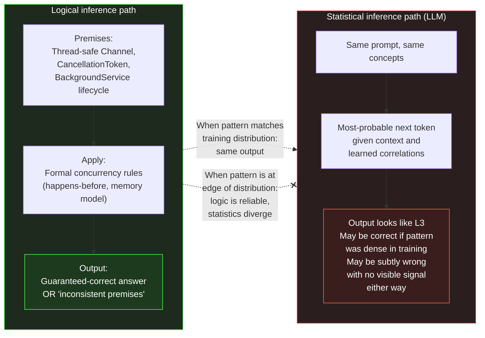

# Section 03 — The Limits of Statistical Reasoning

## Two Kinds of "Getting the Right Answer"

Logical inference from well-defined premises fails detectably. If you ask a system that implements formal rules of inference to derive a conclusion from inconsistent premises, it either produces a logical contradiction — an error you can verify — or it reports that no valid inference path exists. The failure mode is explicit: the system tells you it cannot answer, or it produces something you can check against the premises. Statistical reasoning fails silently. A model that has no statistically grounded pattern for the specific case asked of it does not say "I have no pattern for this" — it says the next-most-probable token given everything in the context, which might be the opening of a confident-sounding answer derived from a similar but not identical pattern, and that answer may be wrong in ways that are invisible from the surface of the text.

Section 02 established that LLMs produce genuinely useful output because next-token prediction over a large, dense corpus of technical text learns the statistical structure of technical reasoning itself. For well-represented patterns, this works reliably enough that it is genuinely valuable. But this section is about where the approach breaks — and more importantly, *how* it breaks, because the way statistical reasoning fails is qualitatively different from the way logical reasoning fails, and that difference has direct engineering consequences.

The engineering consequence of this asymmetry is significant: tools built
on formal logic fail at known boundaries, which can be tested and guarded.
Tools built on statistical reasoning fail at unknown and unevenly
distributed boundaries, which must be understood structurally before the
tool can be used safely in production.

## What Breaks at the Edge of the Distribution

Section 02's "map of training distribution density" framing provides the
vocabulary for this: at the dense centre of the distribution — common .NET
patterns, widely-documented APIs, well-rehearsed explanatory sequences —
statistical reasoning produces output that is reliable because it is
reproducing a well-established answer rather than constructing a novel one.
The model's output, in these cases, is essentially a sophisticated retrieval
and re-expression of patterns that have been reinforced so many times that
the most probable token at each step leads reliably to a valid answer.

But consider what "the most probable next token" means for a prompt that
combines several moderately-common concepts in a combination that is
uncommon — say, asking about the correct locking semantics for updating a
shared `Channel<T>` from both CPU-bound and I/O-bound paths inside a
`BackgroundService` while respecting a `CancellationToken` being observed
from a graceful shutdown handler. Each of these concepts individually is
well-represented. The *specific combination*, with its precise interaction
across the async scheduling model and the `Channel<T>` producer/consumer
protocol, may not be — or may be represented inconsistently, with different
sources making subtly different assumptions that the model has not
necessarily resolved into a consistent view.

In that case, the model does not have access to a "correct answer" in the
way Section 02 described for dense regions. It has access to the most
probable token given what precedes it, drawn from representations learned
from many related but non-identical discussions. And those representations,
combined, produce something that *looks like* the answer to the specific
question because it uses the right vocabulary, the right code structure, and
the right explanatory tone — but is constructed from adjacent patterns
rather than from a reliable encoding of the specific case.



The diagram above captures the structural difference between the two
paths. For an engineer making an architectural decision about a .NET system
under real constraints — specific thread pool configuration, actual
cancellation behaviour of specific async primitives, documented edge cases
of EF Core change tracking under concurrency — the distinction matters
enormously. Logical inference from premises produces an answer that is
either correct or demonstrably wrong. Statistical inference produces an
answer that *looks* correct and might be, but has no internal mechanism for
knowing whether it is or not, because the correctness of the output is a
property of the training distribution, not of any formal derivation
happening at inference time.

## Multi-Step Reasoning and Why It Does Not Change the Picture

A common response to this framing is to point to chain-of-thought
prompting: if a model is asked not just for an answer but to "think step by
step," its output quality on multi-step problems measurably improves. This
is true, and it deserves a direct explanation, because it is sometimes
interpreted as evidence that the model gains logical inference capacity when
prompted this way — which would change the picture significantly.

It does not. Chain-of-thought prompting works for a different reason: by
producing intermediate tokens that correspond to the structure of a
reasoning trace before producing the final answer, the model conditions
each subsequent token on a much richer context that includes those
intermediate steps. And because the model has seen an enormous number of
examples of correct reasoning traces in its training data — worked problems
in documentation, commented code walkthroughs, structured technical
explanations — the probability distribution over subsequent tokens given a
partial reasoning trace is much better calibrated than the probability
distribution over the final answer given the raw question alone. The
intermediate tokens are not a plan that the model executes; they are tokens
that influence the subsequent probability distributions in a way that
correlates with correctness.

This means chain-of-thought helps precisely in the regions where statistical
reasoning already has some traction — where enough correct reasoning traces
exist in training data for the model to have learned the structure of a good
derivation. At the actual edges of the distribution — novel system-specific
constraints, recently-released APIs, combinations of features with no
equivalent in training data — chain-of-thought produces a fluent, structured
reasoning trace that can still be wrong, because the intermediate tokens are
themselves the most-probable continuations given the context, not logical
derivations from verified premises.

```csharp id="code-02-03"
// Target Framework: .NET 8.0
// Chapter: 02 | Section: 03
// book/chapters/chapter-02/sections/section-03.en.md
//
// A concurrency pattern that is STATISTICALLY plausible — consistent
// with the vocabulary and structure of many correct .NET concurrent
// implementations — but has a subtle flaw specific to how .NET's
// thread pool interacts with this particular pattern under load.
//
// An LLM trained on common patterns may generate this confidently.
// A .NET engineer applying formal knowledge of the runtime detects it.
// This is the gap between statistical and logical reasoning.

using System.Threading.Channels;

/// <summary>
/// CAUTION: this implementation has a subtle issue that statistical
/// reasoning (LLM-generated code) may not catch.
/// See analysis in comments below.
/// </summary>
public sealed class WorkCoordinator : IDisposable
{
    // Single channel, written from multiple call sites.
    private readonly Channel<WorkItem> _channel =
        Channel.CreateBounded<WorkItem>(new BoundedChannelOptions(128)
        {
            SingleWriter = false,  // Multiple producers
            SingleReader = true,   // Single consumer worker
            FullMode     = BoundedChannelFullMode.Wait,
        });

    private readonly CancellationTokenSource _shutdown = new();
    private readonly Task _worker;

    public WorkCoordinator()
    {
        _worker = ConsumeAsync(_shutdown.Token);
    }

    public async ValueTask EnqueueAsync(WorkItem item, CancellationToken ct)
    {
        // STATISTICAL PATTERN — appears in many correct examples:
        // await the write with the external cancellation token.
        await _channel.Writer.WriteAsync(item, ct);
    }

    private async Task ConsumeAsync(CancellationToken ct)
    {
        await foreach (var item in _channel.Reader.ReadAllAsync(ct))
        {
            await ProcessAsync(item, ct);
        }
    }

    // FLAW (logical reasoning reveals; statistical may miss):
    // When Dispose() is called, _shutdown is cancelled.
    // ConsumeAsync will exit via OperationCanceledException from
    // _channel.Reader.ReadAllAsync — but _channel.Writer is NOT
    // completed. Any caller blocked inside WriteAsync with a linked
    // token will hang until its external token cancels, rather than
    // receiving a ChannelClosedException or clean completion signal.
    //
    // The correct pattern:
    //   public void Dispose()
    //   {
    //       _channel.Writer.TryComplete();   // ← this line, before cancel
    //       _shutdown.Cancel();
    //       _worker.GetAwaiter().GetResult();
    //   }
    //
    // This distinction — complete the writer so readers see a definite
    // end-of-stream before cancelling pending writers — requires
    // knowledge of Channel<T>'s specific completion semantics, not
    // general async patterns. A model that learned "cancel the token
    // to shut down" from many BackgroundService examples may produce
    // the incomplete version confidently, because the token-based
    // shutdown shape is statistically dominant.

    private static Task ProcessAsync(WorkItem item, CancellationToken ct)
        => Task.CompletedTask; // domain-specific processing

    public void Dispose()
    {
        _channel.Writer.TryComplete();    // correct — explain in architecture review
        _shutdown.Cancel();
        _worker.Wait();
        _shutdown.Dispose();
    }
}

public sealed record WorkItem(string Id, string Payload);
```

The code above represents a situation that arises regularly when using AI
assistance for .NET engineering: the generated code is structurally
idiomatic, matches the vocabulary and shape of correct concurrent .NET code,
and passes a straightforward code review. The flaw is detectable only if the
reviewer applies specific knowledge of `Channel<T>` completion semantics and
their interaction with `CancellationToken` propagation — knowledge that
requires understanding of how these specific primitives behave, not just the
general pattern of background processing in .NET. A model generating from
statistical patterns will produce the shape of the correct answer but may
not carry the specific completion-call detail that correct completion
semantics require, because the specific detail was not consistently the
dominant pattern in training examples of "how to shut down a background
worker."

## Why Specific Runtime Knowledge Resists Statistical Capture

The `Channel<T>` example in this section illustrates a broader structural
limitation. .NET's runtime behaviour includes properties that are *specific
to the runtime's implementation* and are not derivable from the API surface
alone: how the garbage collector handles generations under allocation
pressure, how the JIT recompiles hot methods, how the thread pool manages
task injection rates under sustained load, how `ValueTask` pooling interacts
with specific continuation patterns, and how `Channel<T>`'s internal
semantics differ between bounded and unbounded configurations in terms of
memory pressure and back-pressure propagation. These properties are
documented — sometimes thoroughly, sometimes sparsely — but the documentation
itself is sparse relative to the volume of general async/await and
dependency injection material in the training corpus. A model reproducing
statistical patterns from general async documentation will not, by default,
reliably produce the specific detail about `Channel<T>` completion semantics
that determines whether a graceful shutdown works correctly, because that
detail was not the dominant statistical shape of "how to shut down a
background service" in the training data. The dominant shape was "cancel the
token, await the task" — a pattern that is correct for the majority of
`BackgroundService` implementations but subtly incomplete for this specific
case. This is the structural reason why reasoning about a specific system's
behaviour under specific runtime conditions remains an engineering task that
statistical pattern-matching supports but cannot replace: the correctness
depends on the precise interaction of implementation-specific properties, not
on the general shape of a category of solutions.

## The Engineering Implication: Reasoning Tasks vs Pattern Tasks

The distinction between pattern tasks and reasoning tasks has a further
implication for .NET engineers: it determines what kind of review is
effective. A pattern task — say, generating an implementation of the
decorator pattern for an `IEmailSender` service — benefits from a quick
structural review: does it compile, does it conform to the expected
interface contract, are there any obvious anti-patterns like synchronous
blocking in an async pipeline? A reasoning task — say, evaluating whether a
proposed distributed caching strategy maintains consistency guarantees under
the specific partition and failure model of the production infrastructure —
requires the reviewer to hold multiple system-specific constraints in mind
simultaneously and evaluate whether the proposed solution satisfies all of
them under the specific operational conditions. The statistical mechanism
that produces the first kind of output does not have the tools to produce
the second kind with reliability, because the second kind depends on
constraints that are specific to one system and not represented in the
training corpus. Recognising which category a given piece of AI output falls
into is the first step in determining how much independent verification it
requires — and that recognition is itself an engineering judgment that cannot
be delegated to the model.

## Identifying the Boundary in Practice: A Diagnostic Framework

The pattern-versus-reasoning distinction described above is conceptually
clear but practically ambiguous at the boundary — and the boundary is
exactly where engineers need the distinction most. A concrete diagnostic
framework helps resolve the ambiguity. For any given AI-generated output
that an engineer must evaluate, three questions determine its category:

**Question 1: Does the correct answer depend on facts specific to this
system?** If the answer is yes — the behaviour depends on the particular
thread pool configuration of this service, the specific EF Core provider
and its concurrency model, the exact sequence of events during this
application's shutdown path — the task is a reasoning task regardless of
how familiar the individual concepts are. The model may have strong
statistical grounding for each concept individually, but the *interaction*
of those concepts under this system's specific conditions is not
represented in any training corpus. An example: generating an
`IHostedService` implementation that manages a background polling loop is a
pattern task; evaluating whether *this particular* polling loop will cause
thread-pool starvation under *this particular* load profile with *this
particular* set of downstream dependencies is a reasoning task.

**Question 2: Would the correct answer change if a single parameter in the
system changed?** If yes, the task requires reasoning about parameter
sensitivity, which is a property of the system's actual behaviour, not of
the general shape of a category of solutions. Pattern tasks produce the
same answer across reasonable parameter variations; reasoning tasks produce
answers that are contingent on specific values. For example, the
implementation of a `Channel<T>`-based producer-consumer pattern is a
pattern task — the structure is the same regardless of buffer size. But the
choice between `BoundedChannelFullMode.Wait` and
`BoundedChannelFullMode.DropWrite` for a specific throughput requirement
under a specific load profile is a reasoning task — the correct choice
depends on the system's actual latency budget and fault tolerance
requirements.

**Question 3: Is the output's correctness verifiable by compilation and
standard tests alone?** If the only verification required is "does it
compile and pass the existing test suite," the output is almost certainly a
pattern task. If correctness depends on behaviour under specific concurrency
conditions, specific failure sequences, or specific operational states that
are not exercised by the standard test suite, the output is a reasoning
task that requires targeted verification beyond compilation. This third
question is particularly useful because it maps directly to the team's
existing verification infrastructure: if the current test suite covers the
failure modes in question, even a reasoning task can be verified
mechanically; if it does not, the engineer must construct the verification
explicitly.

These three questions do not produce a binary classification — they
produce a gradient. Some tasks are clearly pattern tasks (generating a
standard LINQ projection), some are clearly reasoning tasks (evaluating
distributed cache consistency under network partition), and many fall
somewhere in between (generating a `BackgroundService` that handles
shutdown correctly — pattern-level structure, but the correctness of the
shutdown path depends on system-specific timing). For tasks on the gradient,
the verification effort should be proportional to the number of
system-specific dependencies the output carries: more dependencies, deeper
verification.

The practical distinction this section establishes is between two
categories of AI assistance that look similar on the surface but have
meaningfully different verification requirements:

**Pattern tasks** are those where the output is essentially a
re-expression of a well-established pattern from the training distribution:
implementing a well-known design pattern in .NET, translating between
roughly equivalent APIs, generating idiomatic LINQ expressions for a
standard transformation, explaining what a language feature does. For these,
statistical reasoning is effective and the output is reliable enough to
review lightly for fit to context.

**Reasoning tasks** are those where arriving at the correct answer requires
combining specific facts about the system in question — facts the model may
not have reliably or consistently — in a way that depends on their precise
interaction. Architectural decisions about a specific system, performance
analysis of a specific bottleneck, correctness analysis of a specific
concurrent interaction, security analysis of a specific trust boundary —
these are reasoning tasks. Statistical reasoning may produce output that
looks like the result of such reasoning, but the output should be treated as
a *starting point that surfaces relevant considerations* rather than as a
derived result, because the derivation is happening statistically rather
than logically.

Section 04 explores the most consequential case of this distinction in
practice: the failure mode that occurs when statistical reasoning is applied
to a case it does not have sufficient grounding for, and what the resulting
output looks like and how it should be handled.

## The Root Cause: There Is No "I Know That I Don't Know"

It is worth pausing explicitly on the deeper reason why statistical
reasoning fails in precisely this way — silently and confidently, not loudly
and with acknowledgement. A large language model has no internal state
representing "I am uncertain." At every step of the generative loop, it
produces a probability distribution over the vocabulary. The value of that
distribution is a function of the learned weights and the incoming context —
not a function of any "knowledge confidence" signal independent of the
generated content. What the model produces in a dense region and what it
produces in a sparse region of the training distribution pass through
exactly the same generative mechanism — the only difference is in the
relative likelihoods of different tokens at each step, not in any existing
state that tells the model it "knows" or is "guessing."

This structural absence of knowledge about "what I know and what I don't
know" is what makes instructions like "say so if you are unsure" limited
and unreliable in effect. When the model complies with such instructions and
generates text expressing uncertainty — "I am not entirely sure about this,
but…," or "this depends on…" — that text is itself tokens predicted on the
basis of the density of uncertainty expressions in similar texts in the
training corpus. Uncertainty expression is statistically correlated with
topics that writers tend to hedge about in technical writing — which may or
may not coincide with the cases where distrust is actually warranted. The
relationship is not non-existent, but it is far from reliable enough to
justify depending on it as a primary signal.

## Caution Versus Verification as an Engineering Strategy

The practical consequence of this diagnosis is the following: the model's
self-caution — asking it to hedge when it is not confident — is an awareness
mechanism, not a guarantee mechanism. It can improve the reading experience
and reduce some cases of hasty acceptance by engineers. But it does not
replace engineering verification that depends on independent knowledge of
the subject, not on a signal derived from the model itself.

The correct engineering strategy does not equate "ask the model to hedge"
with "independently verify the model's output." The first improves the
model's output; the second is an external engineering guarantee. For some
tasks — pattern tasks in dense distribution regions — a cautionary nudge may
suffice to direct attention. For reasoning tasks and sparse-region tasks,
there is no substitute for independent verification of the output.

## What This Means for Reviewing AI-Generated Code

A precise understanding of statistical inference and its limits leads to a
modification in how the code review process for AI-generated code is
designed in a .NET team. Traditional code review is designed to verify
implementation correctness against stated intent, architectural fit, and
idiomatic style — a skill reviewers possess because they identify familiar
patterns quickly.

The most dangerous AI failure modes — "correct shape, wrong semantics" as
exemplified by the `Channel<T>` code — are precisely those that match
familiar patterns. A reviewer reading in search of patterns they know will
treat the code as correct, because it looks correct. Effective verification
of this category requires proactive examination of specific potential
failure scenarios — "what happens on the shutdown path?" — not merely
reading in search of the familiar.

This means AI-generated code review works best when reviewers adopt a
"find the scenario in which this fails" methodology instead of "does this
look right?" Not because generated code is worse on average than
hand-written code, but because its distinctive failure mode — correct shape
with a semantic flaw in a targeted edge case — is not detected well by
traditional pattern-recognition-based code review. Building this proactive
methodology into team practices is what makes the difference between using
AI professionally and using it in a way that silently transfers risk to
production.

## What This Means for the Individual Engineer and the Team

The most prominent practical value of this section is not reducing AI use
in code review or generation — but recalibrating expectations of it more
precisely. An engineer who understands that statistical reasoning works
highly reliably in dense regions of the training distribution and recedes
at its edges owns a mental model that directs AI toward the tasks it
performs well and directs verification effort toward the scenarios with the
highest silent-failure risk. This is more effective than either full trust
or blanket scepticism that nullifies the tool's value. A team that
communicates this understanding and converts it into binding practices —
verification standards, failure-scenario-oriented review, documentation of
AI-related production incidents — builds an institutional capability for
effective professional use that accumulates and deepens over time.

That capability is best understood through a mundane daily situation: a
.NET engineer asks the model about the behavioural semantics of
`ValueTask<T>` under contention in production. The model generates a
convincing explanation noting that a `ValueTask<T>` should not be awaited
more than once and that `IsCompletedSuccessfully` is the correct check —
all well-established training patterns. But when the engineer asks a
specific question — what happens if a `ValueTask<int>` is re-awaited twelve
times from concurrent threads while a custom `IAsyncValueTaskSource<int>`
manages state in a high-performance library's private `Pool` style? — the
question moves from a dense to a sparse region, and the model generates an
answer that convincingly restates the general rules but may not address the
precise thread-safety semantics of that specific composition. The framework
drawn in this section lets the engineer recognise that transition and scale
verification effort accordingly instead of absolutely accepting or
rejecting the answer.

Section 04 completes this picture by addressing the costliest kind of
silent failure in practice — and a team that has internalised the
recalibration above will read that section not as a catalogue of horrors
but as the verification agenda its own incident documentation should
already be converging toward.
