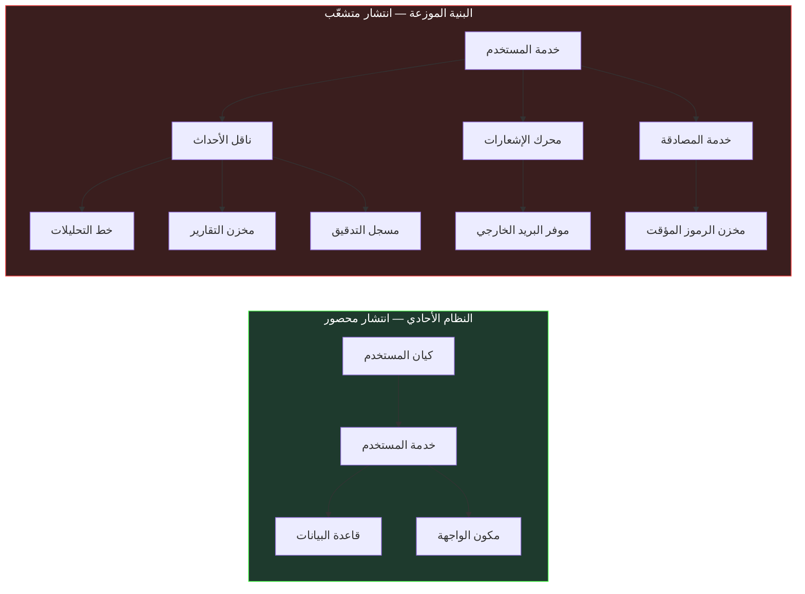
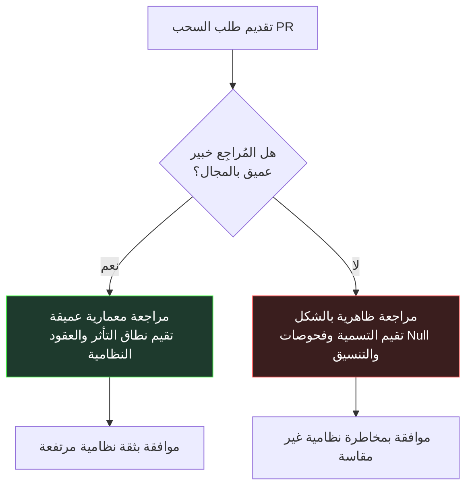
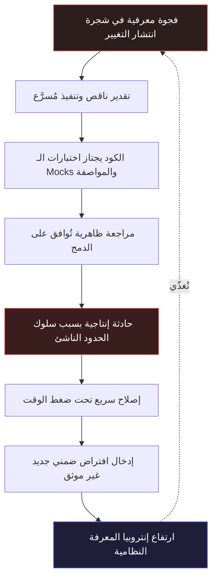

<div dir="rtl">

# إنتروبيا المعرفة: كيف تنهار سير العمل التقليدية عند حدود الأنظمة الموزعة

[Medium](https://tareknajem04.medium.com/ai-assisted-professional-engineering-with-net-12-arabic-beb2a52594d9)
[LinkedIn](https://www.linkedin.com/pulse/ai-assisted-professional-engineering-net-tarek-najem-o9tee/)

## الافتراض المستتر خلف منهجيات التطوير

على مدى أكثر من ثلاثة عقود، تراكمت لدى صناعة البرمجيات مجموعة من سير العمل المستقرة: احتفالات Agile للتخطيط، والتطوير المدفوع بالاختبار (TDD)، ومراجعة الكود بين الأقران (Code Review). تُبنى ثقافة الفرق حول هذه الممارسات، وتُقدَّم في الأدبيات الهندسية بوصفها الركيزة الأساسية لجودة البرمجيات.

ورغم ذلك، تلاحظ الفرق الهندسية التي تعمل على أنظمة موزعة واسعة ظاهرة تتكرر باستمرار: الفرق التي تلتزم بدقة متناهية بهذه الممارسات تقع مراراً في أعطال تكامل جسيمة، وتواجه تفاوتات حادة في تقدير المواعيد، وتتلقى حوادث إنتاج متكررة مفاجئة.

التشخيص التقليدي لهذا الخلل يُشير عادةً إلى قصور في التنفيذ: ضعف خبرة المطوّرين، أو التسرع في تحقيق أهداف الـ Sprint، أو غياب الانضباط أثناء المراجعة.

هذا التشخيص خاطئ بنيوياً.

انهيار سير العمل التقليدية عند النطاق الموزّع ليس فشلاً في الانضباط أو التنفيذ الفردي. إنه النتيجة الطبيعية لافتراضٍ لم يُختبر من قبل. كل منهجية تقليدية لتطوير البرمجيات تقوم على فرضية ضمنية مفادها أن النظام محدود ومتماسك بما يكفي ليتيح لمهندس واحد أو فريق صغير الحفاظ على نموذج ذهني شامل ودقيق لسلوكه ومخطط انتشار التغيير فيه.

في الأنظمة الموزعة الحديثة المبنية بـ .NET، سقطت هذه الفرضية. وحين تُطبَّق هذه الممارسات على أنظمة تتجاوز قدرة العقل البشري على الاستيعاب الفردي، فإنها لا تتوقف عن العمل فجأة؛ بل تتحول صامتةً إلى آليات شكلية بالوكالة تزيد من العجز المعرفي بمرور الوقت.

---

## 1. فخ انتشار التغيير في احتفالات التخطيط

تفترض احتفالات التخطيط في منهجية Agile أن الفريق قادر على تقدير تكلفة قصة المستخدم (User Story) ومخاطرها بدقة معقولة. دقة التقدير تتطلب معرفة مسبقة بجميع الأماكن التي سيتوسع إليها التغيير عبر النظام.

في النظام الأحادي (Monolith) ذي الحدود الداخلية الواضحة، يكون مسار الانتشار مرئياً ومحصوراً محلياً. المطوّر الذي يُعدّل خدمة نطاق يستطيع تتبع المستدعين وتأثير قاعدة البيانات داخل مستودع واحد.

أما في البيئة الموزعة، فإن متطلباً وظيفياً يبدو بسيطاً في ظاهره يتوزع عبر مسارات انتشار غير متناظرة. تأمّل متطلباً يبدو بديهاً مثل *"السماح للمستخدمين بتحديث عنوان بريدهم الإلكتروني الرئيسي"*:



في النظام الأحادي (على اليسار)، ينحصر التغيير داخل ثلاثة مكونات موضعية. في النظام الموزع (على اليمين)، ينشر المتطلب ذاته عبر تسع عقد وثماني خدمات مستقلة، لكل منها دورة نشر خاصة وعقود أحداث غير متزامنة.

عندما يقدر مطوّر هذه القصة بثلاث نقاط، فهو يُقدّر العمل المرئي داخل خدمته المحلية. وعندما يقدرها مهندس خبير بثلاث عشرة نقطة، فهو يستحضر حوادث سابقة وقعت في خط التحليلات أو عند إلغاء صلاحية الرموز المؤقتة.

كلا التقديرين لا يعكس التكلفة الحقيقية للعمل. التباين بين 3 و13 نقطة هو قياس موضوعي لـ **الفجوة المعرفية** بين الكود المرئي محلياً وشجرة انتشار التغيير في النظام الموزع.

ولأن احتفالات التخطيط صُمِّمت في الأصل لأنظمة محصورة، تحاول الفرق التعويض عن هذه الفجوة بوضع "وقت احتياطي للتكامل" أو تقسيم القصص إلى أجزاء صغيرة جداً. ورغم نفع هذه التكيفات، إلا أنها تمثل تدهوراً بنيوياً: التخطيط يتوقف عن كونه أداة للتنبؤ ويتحول إلى وسيلة للحذر من مخاطر نظامية غير مرئية.

---

## 2. جدار المواصفة في التطوير المدفوع بالاختبار (TDD)

التطوير المدفوع بالاختبار (TDD) يُحدد سلوك الوحدة عبر اختبارات فاشلة قبل الشروع في التنفيذ. للوحدات المكونة من منطق النطاق (Domain Logic) أو تحويلات البيانات النقية، يظل TDD انضباطاً لا غنى عنه لجودة الكود.

لكن TDD يرتكز على شرط جوهري: أن سلوك الاعتماديات الخارجية يمكن تمثيله بدقة عبر بدائل الاختبار (Mocks or Stubs).

في الأنظمة الموزعة، أشد حوادث الإنتاج خطورة لا تقع داخل منطق النطاق المعزول؛ بل عند حدود التكامل حيث يفترق السلوك الفعلي للنظام الخارجي عن مواصفته المكتوبة. البدائل (Mocks) تُثبت صحة الكود ضد *افتراضاتنا* عن الاعتمادية، لا ضد سلوكها الحقيقي تحت ضغط الإنتاج.

تأمل معالج الـ Webhook التالي المبني بـ .NET 8 لمعالجة إشعارات الدفع من بوابات خارجية:

```csharp
[TestClass]
public sealed class WebhookProcessorTests
{
    private readonly Mock<IWebhookRepository> _repository = new();
    private readonly Mock<IEventBus> _eventBus = new();
    private readonly WebhookProcessor _processor;

    public WebhookProcessorTests()
    {
        _processor = new WebhookProcessor(_repository.Object, _eventBus.Object);
    }

    [TestMethod]
    public async Task ProcessAsync_ValidPayload_PublishesPaymentEvent()
    {
        var payload = WebhookPayloadBuilder.ValidCharge();
        _repository.Setup(r => r.ExistsAsync(payload.EventId, It.IsAny<CancellationToken>()))
                   .ReturnsAsync(false);

        await _processor.ProcessAsync(payload, CancellationToken.None);

        _eventBus.Verify(b => b.PublishAsync(
            It.Is<PaymentReceivedEvent>(e => e.Amount == payload.Amount),
            It.IsAny<CancellationToken>()), Times.Once);
    }

    [TestMethod]
    public async Task ProcessAsync_DuplicateEventId_SkipsProcessing()
    {
        var payload = WebhookPayloadBuilder.ValidCharge();
        _repository.Setup(r => r.ExistsAsync(payload.EventId, It.IsAny<CancellationToken>()))
                   .ReturnsAsync(true);

        await _processor.ProcessAsync(payload, CancellationToken.None);

        _eventBus.Verify(b => b.PublishAsync(
            It.IsAny<PaymentReceivedEvent>(),
            It.IsAny<CancellationToken>()), Times.Never);
    }
}
```

مجموعة الاختبارات هذه تُحقق تغطية كاملة للفروع بنسبة 100%. كل تأكيد يجتاز بنجاح. التنفيذ صحيح ومُثبت ضد المواصفة الممثلة في الـ Mocks.

لكن في الإنتاج الفعلي، ينهار هذا المعالج تحت ثلاثة سيناريوهات تشغيلية:

1. **إعادة استخدام معرّف الحدث:** الموفر الخارجي يُعيد استخدام `EventId` ذاته لمعاملات الاسترداد الجزئي. فحص منع التكرار (`ExistsAsync`) يتجاهل أحداث الاسترداد المشروعة.
2. **وصول الأحداث بغير ترتيبها:** عند كثافة العمليات، يصل إشعار `charge.succeeded` قبل `payment_intent.created`. المعالج يفترض تسلسلاً زمنياً صتارماً فيطلق استثناءات غير معالجة.
3. **انزياح الطابع الزمني في إعادة المحاولة:** حمولات إعادة المحاولة تحمل `modified_at` مختلفاً بميلي ثوانٍ، مما يجعل فحص التطابق الهاشمي يتعامل مع المحاولات المكررة كأحداث جديدة.

لا يمثل أي من هذه الأعطال فشلاً في منهجية TDD؛ فالاختبارات كانت صحيحة وفق المواصفة المتاحة. إنها تمثل القصور الذاتي للتحقق المبني على المواصفة: **الاختبارات تُثبت طاعة الكود للمواصفة المكتوبة، لكنها لا تُثبت طاعته لواقع تشغيلي ناشئ لم تلتقطه أي مواصفة.**

---

## 3. مراجعة الكود بوكالة الذاكرة الظاهرية

تعمل مراجعة الكود (Code Review) على فرضية أن المُراجِع يستطيع تقييم طلب السحب (Pull Request) والجزم بأنه آمن للنشر في الإنتاج.

تقييم الأمان يتطلب الإجابة عن سؤالين:
1. *هل التغيير سليم محلياً؟* (هل يتبع الاتفاقيات، ويعالج الأخطاء، ويجتاز الاختبارات؟)
2. *هل التغيير آمن نظامياً؟* (هل سينتهك افتراضات ضمنية في الخدمات المستهلكة؟)

في الأنظمة الموزعة المعقدة، الإجابة عن السؤال الثاني تتطلب سياقاً ذهندياً عميقاً ومُحيّناً للمجال المعني. ومع نمو الأنظمة، لا يستطيع أي مهندس الحفاظ على عمق معرفي متساوٍ عبر جميع مجالات النظام.

ونتيجة لذلك، تتحول مراجعة الكود صامتةً إلى **وكالة ذاكرة ظاهرية**:

عند مراجعة كود في مجال يتقنه المُراجِع، فإنه يفحص التداعيات المعمارية. وعند مراجعة كود في مجال غريب عنه، ينزلق المُراجِع تلقائياً إلى تدقيق الخصائص السطحية: أسماء المتغيرات، التنسيق، وملاحظات Null البسيطة.



كلا المسارين ينتهيان بموافقة صريحة على الدمج. وكلاهما يبدو متماثلاً تماماً في سجلات Git. لكن الموافقة الثانية تحمل مخاطرة نظامية غير مرئية. مراجعة الكود لا تنهار بإنتاج مراجعات رديئة الشكّل؛ بل تنهار بإنتاج مراجعات ترتبط جودتها بمتغير غير مرئي — عمق ذاكرة المُراجِع — لا تقيسه العملية ولا تتحكم فيه.

---

## 4. حلقة إنتروبيا المعرفة

انهيارات التقدير، والمواصفة، والمراجعة لا تقع منفصلة؛ بل تتضافر لتُشكل دورة خبيثة ذاتية التغذية: **حلقة إنتروبيا المعرفة**.



حين يقود النموذج الذهني الناقص إلى تقدير منخفض، ينفذ الفريق العمل تحت ضغط زمني. يعتمد المطوّرون على افتراضات ضمنية. تنجح الاختبارات ضد Mocks المواصفة، وتوافق المراجعة الظاهرية على طلب السحب.

في الإنتاج، يظهر السلوك الناشئ في صورة حادثة. وتحت ضغط التعطيل، يطبق الفريق إصلاحاً سريعاً — يعالج العرض السطحي ويغرس في الوقت ذاته قيداً غير موثق جديداً في قاعدة الكود.

على مدى السنوات، ترسب هذه الدورة طبقات أثرية من الكود: flags شرطية أضيفت لأعطال نُسيت، واستعلامات تترك خوفاً من الكسر. كل دورة تزيد من **إنتروبيا المعرفة** (Knowledge Entropy)، مما يجعل قصة الـ Sprint التالية أشد صعوبة في التقدير والمراجعة.

---

## 5. من الذاكرة الفردية إلى البنية التحتية للمعرفة الموزعة

إدراك هذا الانهيار ليس دعوة للتخلي عن Agile أو TDD أو مراجعة الكود؛ فهي ممارسات ممتازة للجودة المحلية.

الخلاصة هي أن **الذاكرة الفردية للمهندس لم تعد وعاءً صالحاً لحفظ السياق النظامي للأنظمة الموزعة.**

معالجة حلقة إنتروبيا المعرفة تتطلب الانتقال من الاعتماد على الذاكرة الفردية إلى الاستثمار في **بنية تحتية للمعرفة الموزعة**:

1. **مواصفات معمارية قابلة للتنفيذ:** توثيق النية المعمارية، والعقود النظامية، وحدود الفشل بصيغ تقرؤها الأدوات بجانب الكود.
2. **التحقق من السلوك والتكامل:** تحويل ثقل الاختبارات من Mocks الوحدة إلى اختبارات العقود (Contract Testing) وحقن الأخطاء واختبارات القياس عن بعد.
3. **دعم القرار المعزز بالسياق:** استخدام أدوات الذكاء الاصطناعي ليس كمضاعفات لكتابة أسطر كود أكثر بسرعة، بل كأنظمة سياقية تُظهر الاعتماديات المستترة والسياق التاريخي في اللحظة التي يتخذ فيها المهندس قراراً.

---

## حدود الطرح ونطاقه

من الضروري تحديد حدود هذا التحليل بدقة:

- **ما يثبته هذا الطرح:** أن سير العمل التقليدية تمتلك نمط فشل هيكلي عند تطبيقها على أنظمة موزعة تتجاوز شجرة انتشارها حدود الاستيعاب البشري. هذا الفشل ناتج عن عجز معرفي بنيوي، وليس عن تقصير المهندسين.
- **ما لا يدعيه هذا الطرح:** هذا التحليل لا يدعو إلى إلغاء التخطيط أو TDD أو مراجعة الكود، كما لا يزعم أن أدوات الذكاء الاصطناعي تُحل التعقيد المؤسسي تلقائياً دون انضباط معماري.

تسويق أدوات الذكاء الاصطناعي بوصفها أدوات للسرعة المحضة — تسريع كتابة الكود — في بيئة تعاني من إنتروبيا معرفية مرتفعة لا يفعل شيئاً سوى تسريع دوران حلقة إنتروبيا المعرفة ذاتها.

الذكاء الاصطناعي يمثل بنية تحتية للإدراك الموزع، قادرة على تجسير الفجوة بين التغيير المحلي والسياق النظامي الشامل. وترتبط فاعليته بدقة السياق المُقدَّم له: حين يُدمج في نقاط القرار مع محرك سياق المستودع، يُكشف عن الاعتماديات المستترة؛ وحين يُستخدم كمُولّد لكثافة الكود دون سياق، فإنه يُضاعف إنتروبيا النظام.

---

## سلسلة المقالات الهندسية

السابق

[**← 011-عتبة التعقيد: لماذا لا يكفي المزيد من الجهد الفردي؟**](../../v0.1.0/011-The-Complexity-Threshold-An-Engineering-Analysis/article.ar.md)

التالي

[**012- الموثوقية تُصمَّم، لا تُورَّث →**](../../v0.1.2/013-Reliability-Is-Designed-Not-Inherited/article.ar.md)

---

## تابع الرحلة

هذه المقالة مقتبسة من **الفصل الأول، القسم الثاني** من كتاب *AI-Assisted Professional Engineering with .NET*. تحتوي المخطوطة الكاملة على تحليلات معمارية تفصيلية، وأمثلة C# كاملة، ومخططات توضيحية موسعة.

- **مستودع المشروع:** <https://github.com/TarekNajem04/AI-Assisted-Professional-Engineering-with-.NET>
- **حزمة الإصدار v0.1.1:** <https://github.com/TarekNajem04/AI-Assisted-Professional-Engineering-with-.NET/releases/tag/v0.1.1>
- **المخطوطة الكاملة للقسم الثاني:** <https://github.com/TarekNajem04/AI-Assisted-Professional-Engineering-with-.NET/blob/main/book/chapters/Chapter-01/sections/section-02.ar.md>

---

*في القسم الثاني، استعرضنا الآليات البنيوية التي تنهار بها سير العمل التقليدية تحت التعقيد الموزع. في القسم الثالث، ننتقل إلى التحول المعماري نفسه: كيف ينبغي أن يتطور دور المهندس وحكمه المعماري في سير عمل معززة بالذكاء الاصطناعي — أين يُجسر الذكاء الاصطناعي العجز المعرفي، وأين يخلق الاعتماد غير الناقد أنماط فشل جديدة؟*

</div>
