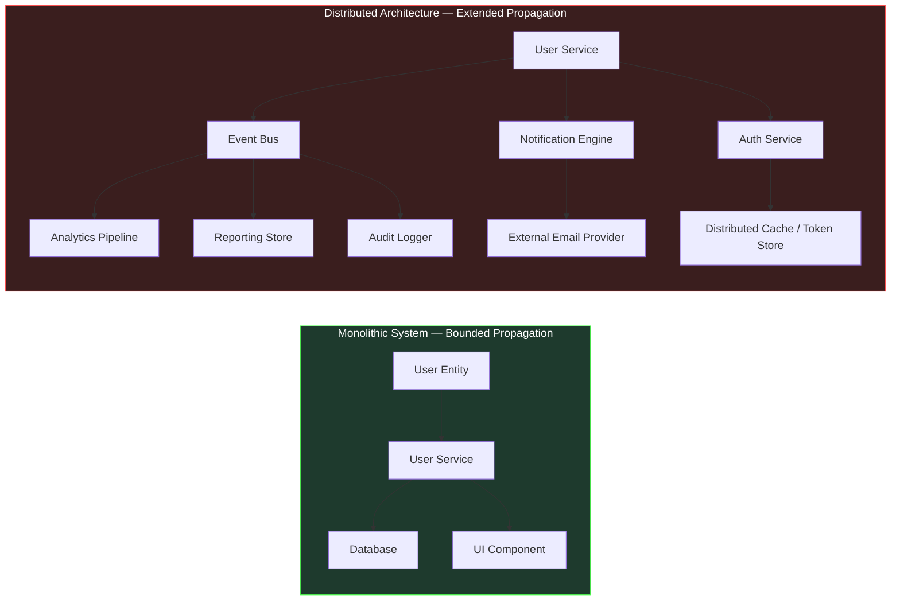
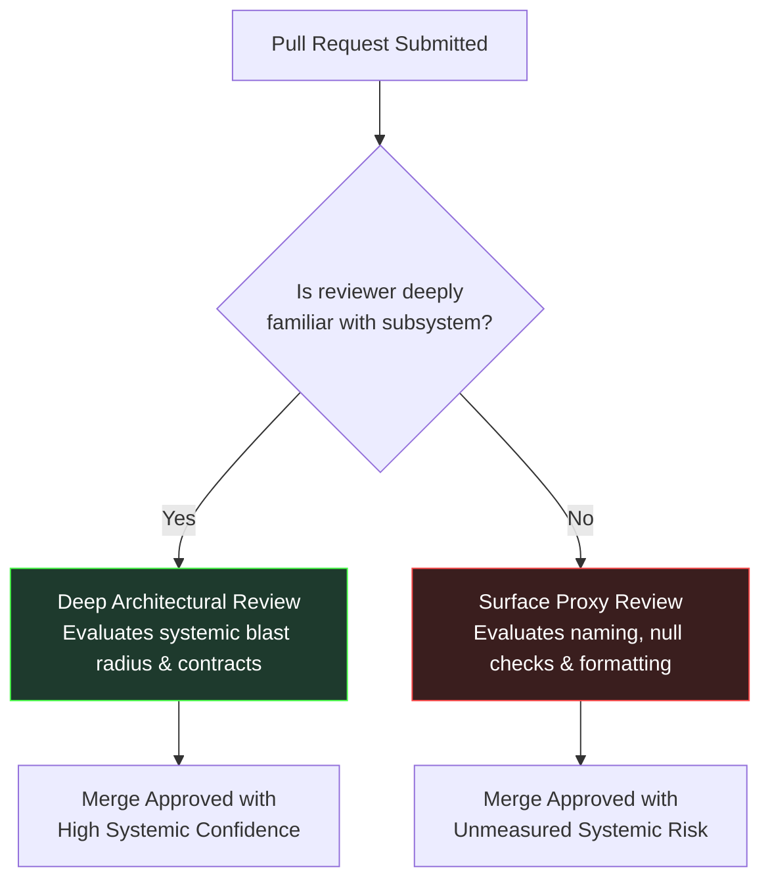
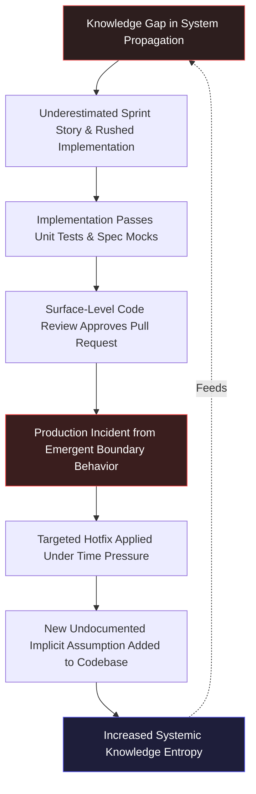

# The Breakdown of Traditional Workflows at Scale: Why Standard Practices Fail in Distributed Systems

[Medium](https://tareknajem04.medium.com/ai-assisted-professional-engineering-with-net-12-ba68df45e61e)
[LinkedIn](https://www.linkedin.com/pulse/ai-assisted-professional-engineering-net-tarek-najem-00vme)

## The Implicit Premise of Software Methodology

For over three decades, the software engineering industry has accumulated a canonical set of working methods: Agile sprint ceremonies, Test-Driven Development (TDD), and peer Code Reviews. Entire engineering cultures are structured around these practices, and they are routinely presented as the bedrock of professional software delivery.

Yet across large-scale distributed systems, engineering teams consistently encounter a perplexing phenomenon: teams that adhere meticulously to these practices still experience severe integration failures, wild estimation variances, and recurring production incidents.

The standard diagnosis usually points toward execution failure—insufficient developer experience, rushed sprint goals, or lack of discipline in review.

That diagnosis is structurally incorrect.

The breakdown of traditional workflows at scale is not a failure of developer discipline or execution. It is the natural consequence of an unexamined premise. Every traditional software development methodology rests on the implicit assumption that a system is sufficiently bounded that an individual engineer or small team can maintain a coherent, comprehensive mental model of its behavior and change propagation graph.

In modern distributed .NET architectures, that foundational assumption no longer holds. When applied to systems whose scale exceeds human cognitive bandwidth, traditional workflows do not stop working abruptly; instead, they degenerate into quiet, proxy-based mechanisms that compound knowledge deficits over time.

---

## 1. The Change Propagation Trap in Agile Ceremonies

Agile sprint planning ceremonies assume that a team can estimate the effort and risk of a story with reasonable precision. Accurate estimation requires knowing where a proposed change will propagate across the codebase.

In a monolithic architecture with clear internal boundaries, this propagation path is locally visible. A developer modifying a domain service can trace its callers and database impact within a single repository.

In a distributed environment, however, even trivial domain requirements possess asymmetric propagation paths. Consider a requirement as seemingly benign as *"allowing users to update their primary email address."*



In the monolith (left), change propagation is bounded across three local components. In the distributed system (right), the exact same functional requirement propagates across nine nodes, eight independent service boundaries, distinct deployment pipelines, and asynchronous event streams.

When a developer estimates this story as 3 story points during sprint planning, they are estimating the work visible within their local service. When a senior developer estimates it as 13 points, they are factoring in historical scars from downstream failures in the analytics pipeline or token cache invalidation.

Neither estimate represents the true cost of the work. The variance between 3 and 13 points is a direct measurement of the **knowledge gap** between locally visible code and systemic propagation.

Because estimation ceremonies were designed for bounded systems, teams attempt to compensate for this gap by adding "integration buffers" or breaking stories into micro-increments. While practical, these adaptations represent a structural degradation: sprint planning ceases to be a predictive exercise and becomes an exercise in hedging against unseen systemic risk.

---

## 2. The Specification Boundary in Test-Driven Development

Test-Driven Development (TDD) specifies unit behavior through failing tests prior to implementation. When applied to domain logic, state machines, and pure transformations, TDD remains an unmatched discipline for code quality.

However, TDD relies on a crucial premise: that the behavioral contract of dependencies can be accurately captured by test doubles (mocks or stubs).

In distributed systems, the most catastrophic failure modes do not occur within isolated domain logic; they occur at integration boundaries where real-world behavior diverges from written specifications. Mocks verify code against our *assumptions* of how a dependency behaves, not against how it actually behaves under production conditions.

Consider a production .NET 8 webhook handler written to process payment notifications from a third-party gateway:

```csharp
[TestClass]
public sealed class WebhookProcessorTests
{
    private readonly Mock<IWebhookRepository> _repository = new();
    private readonly Mock<IEventBus> _eventBus = new();
    private readonly WebhookProcessor _processor;

    public WebhookProcessorTests()
    {
        _processor = new WebhookProcessor(_repository.Object, _eventBus.Object);
    }

    [TestMethod]
    public async Task ProcessAsync_ValidPayload_PublishesPaymentEvent()
    {
        var payload = WebhookPayloadBuilder.ValidCharge();
        _repository.Setup(r => r.ExistsAsync(payload.EventId, It.IsAny<CancellationToken>()))
                   .ReturnsAsync(false);

        await _processor.ProcessAsync(payload, CancellationToken.None);

        _eventBus.Verify(b => b.PublishAsync(
            It.Is<PaymentReceivedEvent>(e => e.Amount == payload.Amount),
            It.IsAny<CancellationToken>()), Times.Once);
    }

    [TestMethod]
    public async Task ProcessAsync_DuplicateEventId_SkipsProcessing()
    {
        var payload = WebhookPayloadBuilder.ValidCharge();
        _repository.Setup(r => r.ExistsAsync(payload.EventId, It.IsAny<CancellationToken>()))
                   .ReturnsAsync(true);

        await _processor.ProcessAsync(payload, CancellationToken.None);

        _eventBus.Verify(b => b.PublishAsync(
            It.IsAny<PaymentReceivedEvent>(),
            It.IsAny<CancellationToken>()), Times.Never);
    }
}
```

This test suite achieves 100% branch coverage. Every assertion passes cleanly. The implementation is provably correct against the specification encoded in the mocks.

Yet in production, this exact processor fails under three distinct operational scenarios:

1. **Non-unique Event Identifiers:** The external payment provider reuses `EventId` across partial refund transactions. The idempotency check (`ExistsAsync`) incorrectly drops legitimate refund events.
2. **Out-of-Order Event Arrival:** Under high traffic, `charge.succeeded` webhooks arrive before `payment_intent.created`. The processor assumes strict temporal ordering and throws unhandled domain exceptions.
3. **Timestamp Drift in Retries:** Retry payloads include a `modified_at` timestamp that differs by milliseconds from the original attempt, causing hash-based payload verification to treat retries as distinct new events.

None of these failure modes represent a failure of TDD. The tests were correct against the specification. They represent the inherent boundary of specification-based verification: **tests verify compliance with a specification; they cannot verify compliance with an emergent operational reality that no specification captured.**

---

## 3. The Familiarity Proxy in Code Review

Code review operates on the assumption that an experienced reviewer can evaluate a pull request and determine whether it is safe to merge into production.

Evaluating safety requires answering two questions:
1. *Is the change locally sound?* (Does it follow conventions, handle errors, and pass unit tests?)
2. *Is the change systemically safe?* (Will it violate unstated assumptions in upstream callers or downstream consumers?)

In complex distributed codebases, answering the second question requires deep, up-to-date mental context of the affected subsystem. As codebases grow, no engineer can maintain uniform depth across all domains.

Consequently, code review quietly degenerates into a **familiarity proxy**.

When reviewing familiar code, senior engineers evaluate systemic consequences. When reviewing unfamiliar code, reviewers default to evaluating surface characteristics: naming conventions, formatting, file organization, and missing null checks.



Both reviews result in an approving comment. Both look identical in the git pull request audit trail. But the second approval carries unmeasured systemic risk. Code review does not fail by producing visibly worse reviews; it fails by producing reviews whose quality is governed by an invisible variable—reviewer memory depth—that the process neither measures nor controls.

---

## 4. The Knowledge Entropy Loop

The breakdown of estimation, specification, and review do not occur in isolation. They interact dynamically to form a self-reinforcing feedback cycle: **The Knowledge Entropy Loop**.



When an incomplete mental model leads to an underestimated story, developers implement under time pressure. They rely on implicit assumptions. Unit tests pass against spec mocks, and surface-level code reviews approve the PR.

Once in production, the emergent behavior triggers an incident. Under outage conditions, the team applies a targeted hotfix—patching the immediate symptom while embedding yet another undocumented constraint into the codebase.

Over years, this loop deposits archaeological layers of code: conditional flags added for forgotten outages, unreferenced database queries kept out of fear, and brittle coupling points. Each iteration increases the system's **Knowledge Entropy**, making the next sprint story even harder to estimate and review correctly.

---

## 5. From Individual Memory to Distributed Knowledge Infrastructure

Recognizing this breakdown is not an argument for abandoning Agile, TDD, or Code Review. They remain indispensable practices for local code quality.

Rather, the conclusion is that **individual human memory is no longer a viable storage mechanism for distributed system context.**

Remediating the Knowledge Entropy Loop requires shifting engineering culture from reliance on individual memory to investment in **Distributed Knowledge Infrastructure**:

1. **Executable Architectural Specifications:** Capturing system intent, invariant contracts, and failure boundaries in machine-readable formats alongside code.
2. **Integration & Behavioral Verification:** Shifting testing focus from unit-level mocks to contract testing, fault injection, and live telemetry assertions that capture emergent behavior.
3. **Context-Aware Decision Support:** Utilizing AI-assisted tools not merely as typing accelerators to generate more lines of code, but as context engines that surface implicit dependencies, historical incident context, and contract violations at the exact moment a developer or reviewer makes a decision.

---

## Scope and Boundaries of the Argument

It is vital to state the precise boundaries of this analysis:

- **What this argument claims:** Traditional software development workflows possess a characteristic failure mode when applied to distributed systems whose propagation graphs exceed human cognitive limits. This failure mode stems from a structural knowledge deficit, not developer negligence.
- **What this argument does NOT claim:** This analysis does not advocate discarding sprint planning, TDD, or code reviews. Nor does it suggest that AI tools automatically resolve organizational complexity without architectural discipline.

AI tools arriving in software engineering are frequently marketed as speed multipliers—promising to write code faster. Accelerating code generation within a codebase suffering from high knowledge entropy merely accelerates the rotation of the Knowledge Entropy Loop.

AI assistance represents infrastructure for distributed cognition capable of bridging the gap between local code changes and global system context. Its capability is bounded by the precision of the context supplied: when integrated into decision points with repository context, it surfaces implicit dependencies; when used as a generator of unverified code volume, it compounds system entropy.

---

## Engineering Series

Previous

[**← 011-The Complexity Threshold: An Engineering Analysis**](../../v0.1.0/011-The-Complexity-Threshold-An-Engineering-Analysis/article.en.md)

---

## Continue the Journey

This essay is drawn from **Chapter 1, Section 2** of *AI-Assisted Professional Engineering with .NET*. The complete manuscript section contains in-depth architectural analyses, complete C# code samples, and extended domain diagrams.

- **GitHub Repository:** <https://github.com/TarekNajem04/AI-Assisted-Professional-Engineering-with-.NET>
- **Release v0.1.1 Asset Bundle:** <https://github.com/TarekNajem04/AI-Assisted-Professional-Engineering-with-.NET/releases/tag/v0.1.1>
- **Full Manuscript Section 02:** <https://github.com/TarekNajem04/AI-Assisted-Professional-Engineering-with-.NET/blob/main/book/chapters/Chapter-01/sections/section-02.en.md>

---

*In Section 02, we have analyzed the structural mechanisms through which traditional development workflows break under distributed complexity. In Section 03, we turn to the architectural shift itself: How must an engineer's role and judgment evolve in an AI-augmented workflow—where does AI genuinely bridge the knowledge deficit, and where does uncritical reliance create new failure modes?*
