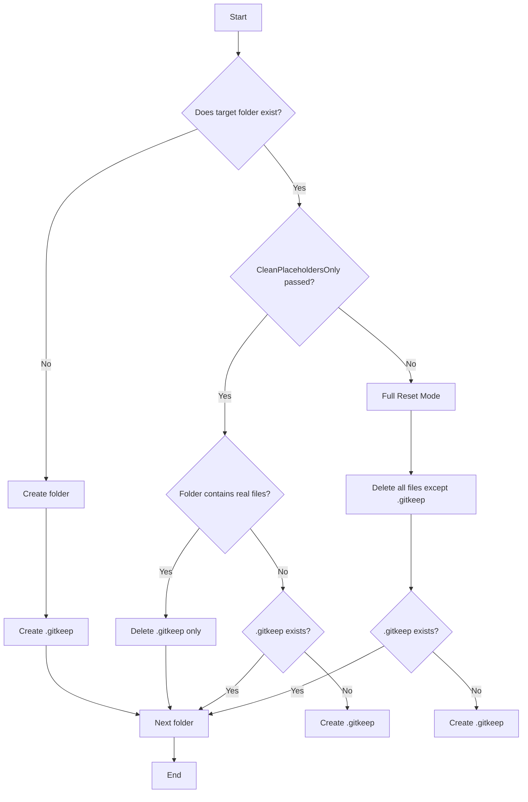

# Initialize-ExportEnvironment.ps1

Folder Structure Manager for the Professional Export Pipeline

---

## Overview

`Initialize-ExportEnvironment.ps1` manages the folder structure under the `exports` directory.

It ensures:

- Every folder always contains a `.gitkeep` file when empty.
- No folder is ever deleted.
- Only files are deleted (never directories).
- The script is safe to run repeatedly.
- The script supports two modes: **Full Reset** and **CleanPlaceholdersOnly**.

This script is automatically invoked by `Export-Manuscript.ps1` before each export.

---

## Modes

### 1. Full Reset Mode

Deletes all files inside each folder **except** `.gitkeep`.

Behavior:

- If a folder contains real files → delete them.
- If a folder contains only `.gitkeep` → keep it.
- If a folder does not contain `.gitkeep` → create it.
- If a folder does not exist → create it + create .gitkeep.

This mode is interactive unless `-Force` is passed.

---

### 2. CleanPlaceholdersOnly Mode

Deletes `.gitkeep` **only** when real files exist in the same folder.

Behavior:

- If a folder contains real files → delete .gitkeep only.
- If a folder contains only .gitkeep → do nothing.
- If a folder is empty and missing .gitkeep → create .gitkeep.
- If a folder does not exist → create folder + .gitkeep.

This mode never deletes real files and never prompts the user.

This mode is used by `Export-Manuscript.ps1`.

---

## Algorithm (Mermaid Flowchart)


```mermaid
flowchart TD

A[Start] --> B{Does target folder exist?}

B -->|No| C[Create folder]
C --> D[Create .gitkeep]
D --> Z[Next folder]

B -->|Yes| E{CleanPlaceholdersOnly passed?}

E -->|Yes| F{Folder contains real files?}
F -->|Yes| G[Delete .gitkeep only]
G --> Z[Next folder]

F -->|No| H{.gitkeep exists?}
H -->|No| I[Create .gitkeep]
H -->|Yes| Z[Next folder]

E -->|No| J[Full Reset Mode]
J --> K[Delete all files except .gitkeep]

K --> L{.gitkeep exists?}
L -->|No| M[Create .gitkeep]
L -->|Yes| Z[Next folder]

Z --> N[End]
```

---

## Usage Examples

### Full reset with confirmation

```powershell
powershell -File scripts/export/tools/Initialize-ExportEnvironment.ps1
```

### Full reset without confirmation

```powershell
powershell -File scripts/export/tools/Initialize-ExportEnvironment.ps1 -Force
```

### Clean placeholders only (used by Export-Manuscript.ps1)

```powershell
powershell -File scripts/export/tools/Initialize-ExportEnvironment.ps1 -CleanPlaceholdersOnly
```

---

## Notes

- The script **never deletes folders**, only files.
- `.gitkeep` is always present in empty folders.
- This script is safe to run repeatedly.
- It is automatically invoked by `Export-Manuscript.ps1` before each export.
- Managed folders are defined in `$structure` inside the script:
  `covers`, `diagrams/mermaid`, `docx/{ar,en}/{chapters,sections,manifesto,tests}`, `pdf/{ar,en}/{chapters,sections,manifesto,tests}`.
